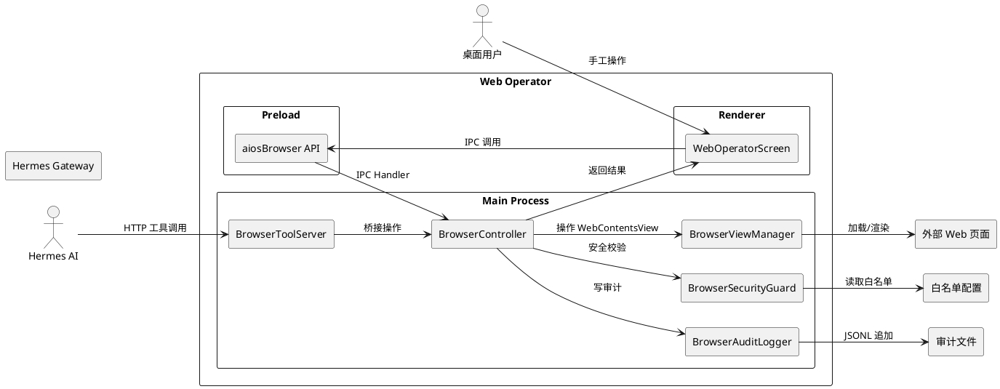
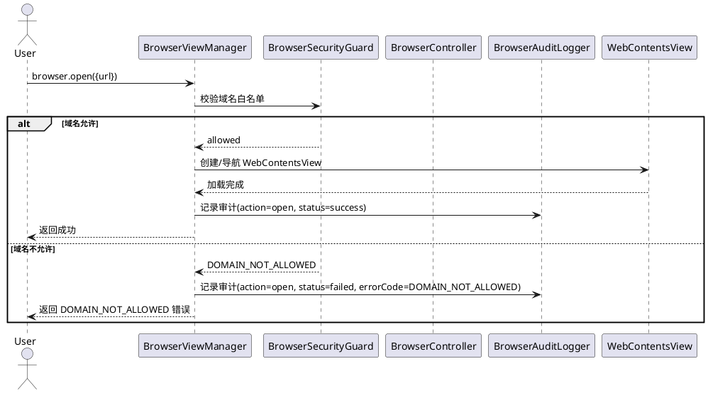
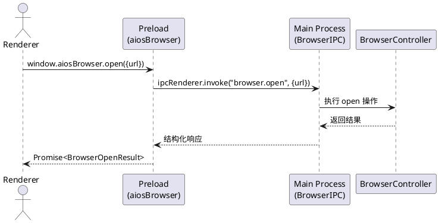
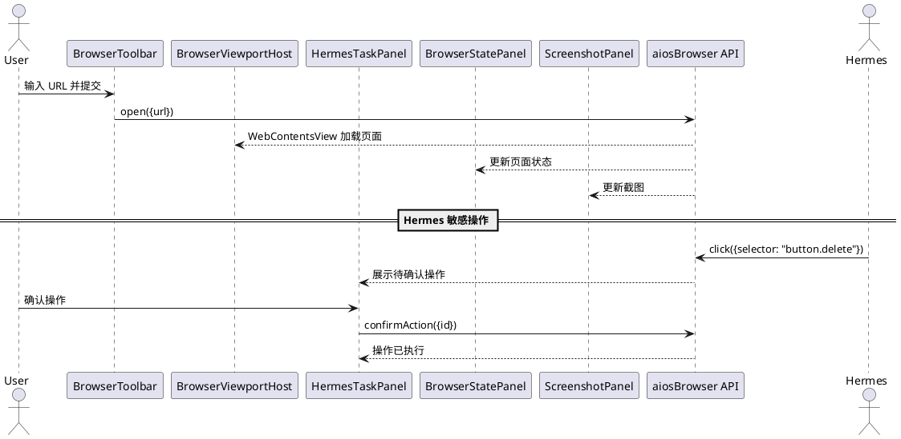
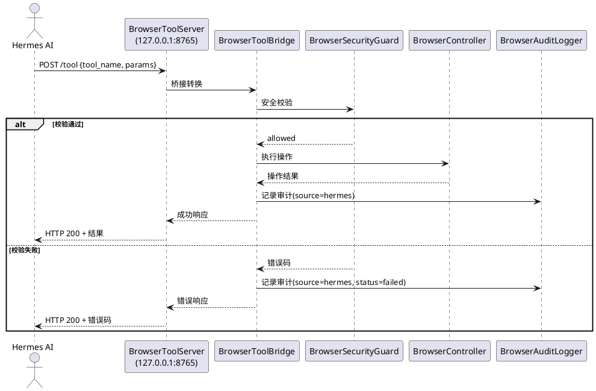
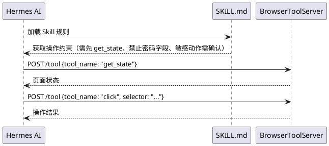

# Web Operator 模块需求规格

## 1. 组件定位

### 1.1 核心职责

本组件负责在 Electron 桌面端打开并操控外部 Web 页面，实现用户手工操作与 Hermes AI 受控自动操作的统一入口。

### 1.2 核心输入

1. **用户操作指令**：通过 Renderer UI 发起的浏览器导航与交互请求（open/back/forward/reload/输入 URL/点击元素/输入文本）
2. **Hermes AI 工具调用**：通过 Tool Bridge HTTP 端点发起的受控浏览器操作请求（click/type/extract_table/screenshot 等）
3. **域名白名单配置**：从 `~/.hermes/desktop/web-operator.config.json` 加载的允许访问域名列表
4. **敏感动作确认响应**：用户对 Hermes 发起的敏感动作的确认或拒绝指令
5. **IPC 调用**：Renderer 通过 Preload 暴露的 `window.aiosBrowser` API 发起的浏览器操作请求

### 1.3 核心输出

1. **WebContentsView 渲染**：在 Renderer 的 BrowserViewportHost 占位区域显示外部 Web 页面
2. **IPC 响应**：返回给 Renderer 的页面状态、截图、表格数据、审计日志等结构化结果
3. **Tool Bridge HTTP 响应**：返回给 Hermes AI 的操作结果（页面状态/截图/base64/错误码）
4. **审计记录**：写入 `~/.hermes/desktop/web-operator/audit/` 的 JSONL 审计日志
5. **敏感动作确认请求**：推送至 HermesTaskPanel 等待用户裁决的待确认操作
6. **错误响应**：结构化错误码与错误消息

### 1.4 职责边界

- **不负责**：Hermes Gateway 核心消息协议的修改
- **不负责**：Session 存储结构的修改
- **不负责**：MEMORY.md 规则的修改
- **不负责**：Hermes Python 后端的修改
- **不负责**：现有 Chat streaming 事件名的修改
- **不负责**：现有 profileHome() 语义的修改
- **不负责**：对 Renderer 暴露 Node.js 访问或 executeJavaScript API
- **不负责**：直接让 Hermes 访问 Electron API

---

## 2. 领域术语

**WebContentsView**
: Electron 提供的嵌入式浏览器视图组件，用于在主窗口中嵌入渲染外部 Web 内容，区别于 BrowserWindow 和 iframe。

**BrowserViewManager**
: Main Process 中负责创建、销毁和生命周期管理 WebContentsView 的管理器。

**BrowserController**
: Main Process 中执行浏览器操作指令（导航、DOM 交互、截图、状态提取）的控制器。

**BrowserSecurityGuard**
: Main Process 中执行域名白名单校验、敏感动作拦截、密码字段阻止的安全守卫。

**BrowserAuditLogger**
: Main Process 中将每次浏览器操作以 JSONL 格式写入审计日志的记录器。

**BrowserToolBridge**
: Main Process 中将 Hermes 工具调用转换为 BrowserController 操作的桥接层。

**BrowserToolServer**
: Main Process 中监听 `127.0.0.1:8765` 的本地 HTTP 工具服务器，接收 Hermes 的工具调用请求。

**Partition**
: Electron 的会话隔离标识，格式为 `persist:aios-external-web`，用于隔离外部 Web 页面的 cookies/storage 与主应用。

**敏感动作**
: 涉及数据提交、审批、删除、支付、发送等不可逆或高风险的页面操作，需用户显式确认后方可执行。

**Domain Whitelist**
: 域名白名单，定义允许 Web Operator 打开的外部域名集合，存储在 `web-operator.config.json` 中。

**BrowserAuditRecord**
: 浏览器操作审计记录，包含操作 ID、时间、来源、动作、URL、状态等结构化字段。

---

## 3. 角色与边界

### 3.1 核心角色

- **桌面用户**：通过 BrowserToolbar 手工操作浏览器页面，审核并确认/拒绝 Hermes 发起的敏感动作
- **Hermes AI**：通过 Tool Bridge 发起受控浏览器操作，执行自动化 Web 任务

### 3.2 外部系统

- **Electron Main Process**：承载所有浏览器操作的实际执行环境，提供 WebContentsView API
- **Electron Preload**：作为 Renderer 与 Main Process 之间的安全桥接层，暴露 `window.aiosBrowser` API
- **Hermes Gateway**：独立的 Python 后端进程，通过 Tool Bridge HTTP 端点间接操控浏览器
- **外部 Web 页面**：被 WebContentsView 加载和渲染的目标网站

### 3.3 交互上下文



---

## 4. DFX 约束

### 4.1 性能

1. When 用户发起 browser.open 操作，the Web Operator shall 在 3 秒内完成 WebContentsView 创建并开始加载目标 URL
2. When 用户发起 browser.screenshot 操作，the Web Operator shall 在 2 秒内返回截图结果
3. When Hermes 通过 Tool Bridge 发起操作，the BrowserToolServer shall 在 5 秒内返回操作结果（页面加载时间除外）
4. The BrowserToolServer shall 支持至少 10 个并发工具调用请求

### 4.2 可靠性

1. When WebContentsView 加载失败，the BrowserViewManager shall 返回结构化错误码 EXTERNAL_WEB_VIEW_NOT_READY
2. When BrowserToolServer 启动时端口 8765 已被占用，the BrowserToolServer shall 自动递增端口号重试（最多 10 次）
3. While WebContentsView 存在，the BrowserViewManager shall 保持与 Renderer 占位区域的同步绑定

### 4.3 安全性

1. The Web Operator shall 禁止 Renderer 进程获得 Node.js 访问权限
2. The Web Operator shall 禁止 Renderer 进程获得 executeJavaScript API
3. The Web Operator shall 禁止 Hermes 直接访问 Electron API
4. The Web Operator shall 所有浏览器操作仅在 Main Process 执行
5. The Web Operator shall 外部 Web 页面使用独立 partition `persist:aios-external-web` 进行会话隔离
6. The Web Operator shall 禁止返回 cookies、localStorage、sessionStorage、密码值、auth headers、csrf tokens 给任何调用方

### 4.4 可维护性

1. The Web Operator shall 每次浏览器操作写入 JSONL 格式审计记录
2. The BrowserAuditLogger shall 按日期轮转审计文件
3. The Web Operator shall 所有 IPC 契约类型定义在 `src/shared/browser/browser-contract.ts`，禁止使用 any 类型

### 4.5 兼容性

1. Where 已有 IPC channel 名称与 Web Operator 新增 channel 冲突，the Web Operator shall 使用 `browser.` 前缀命名空间隔离
2. The Web Operator shall 不修改现有 hermes.ts、sessions.ts、memory.ts 的核心结构和语义

---

## 5. 核心能力

### 5.1 Phase 1: Browser Main 模块

#### 5.1.1 业务规则

1. **WebContentsView 创建规则**：When 用户或 Hermes 发起打开 URL 请求，the BrowserViewManager shall 校验域名白名单后创建 WebContentsView 实例并设置 partition 为 `persist:aios-external-web`
   - 验收条件：[发起 browser.open({url: "https://allowed.com"})] → [创建 WebContentsView 并设置独立 partition]

2. **WebContentsView 单例规则**：While 已有 WebContentsView 实例存在，the BrowserViewManager shall 复用现有实例执行导航而非创建新实例
   - 验收条件：[连续两次 browser.open 不同 URL] → [第二次在现有 WebContentsView 上导航，不创建新视图]

3. **WebContentsView 销毁规则**：When WebOperatorScreen 卸载或用户关闭浏览器视图，the BrowserViewManager shall 销毁 WebContentsView 实例并释放资源
   - 验收条件：[离开 WebOperatorScreen] → [WebContentsView 被销毁，内存释放]

4. **域名白名单校验规则**：When 请求打开的 URL 域名不在白名单中，the BrowserSecurityGuard shall 拒绝请求并返回错误码 DOMAIN_NOT_ALLOWED
   - 验收条件：[发起 browser.open({url: "https://blocked.com"})] → [返回 DOMAIN_NOT_ALLOWED 错误]

5. **白名单配置加载规则**：When Web Operator 启动，the BrowserSecurityGuard shall 从 `~/.hermes/desktop/web-operator.config.json` 加载域名白名单
   - 验收条件：[配置文件包含 ["example.com", "api.example.com"]] → [仅允许这两个域名及其子路径访问]

6. **白名单通配符规则**：Where 白名单配置包含 `*.example.com`，the BrowserSecurityGuard shall 允许 example.com 的所有子域名
   - 验收条件：[白名单含 "*.example.com"，请求 "https://sub.example.com"] → [请求被允许]

7. **密码字段阻止规则**：When Hermes 请求对密码字段执行 type 操作，the BrowserSecurityGuard shall 拒绝操作并返回错误码 PASSWORD_FIELD_BLOCKED
   - 验收条件：[Hermes 请求 browser.type({selector: "input[type=password]", text: "..."})] → [返回 PASSWORD_FIELD_BLOCKED 错误]

8. **敏感动作拦截规则**：When Hermes 请求的操作目标元素包含敏感语义（submit/approve/reject/delete/remove/payment/transfer/archive/publish/send），the BrowserSecurityGuard shall 将操作标记为需要用户确认并返回错误码 UNSAFE_ACTION_REQUIRES_CONFIRMATION
   - 验收条件：[Hermes 请求 browser.click({selector: "button[data-action=delete]"})] → [返回 UNSAFE_ACTION_REQUIRES_CONFIRMATION，操作挂起等待确认]

9. **审计记录规则**：The BrowserAuditLogger shall 对每次浏览器操作记录 BrowserAuditRecord，包含 id、time、profile、source、action、url、argsSummary、status、errorCode、message 字段
   - 验收条件：[执行 browser.open] → [生成一条包含 action="open"、source="user"/"hermes"、status="success"/"failed" 的审计记录]

10. **审计文本脱敏规则**：When 记录 browser.type 操作，the BrowserAuditLogger shall 只记录 textLength 而非实际输入文本
    - 验收条件：[执行 browser.type({text: "secret123"})] → [审计记录 argsSummary 中仅包含 textLength=9，不包含 "secret123"]

11. **页面状态提取规则**：When 调用 getPageState，the BrowserController shall 返回页面 title、url、所有 input/button/link 元素的结构化信息
    - 验收条件：[页面包含 3 个 input、2 个 button、5 个 link] → [getPageState 返回 inputs.length=3, buttons.length=2, links.length=5]

12. **选择器查找规则**：When 调用 click/type 操作的 selector 在页面中未找到匹配元素，the BrowserController shall 返回错误码 SELECTOR_NOT_FOUND
    - 验收条件：[执行 browser.click({selector: "#nonexistent"})] → [返回 SELECTOR_NOT_FOUND 错误]

#### 5.1.2 交互流程



#### 5.1.3 异常场景

1. **WebContentsView 创建失败**
   - 触发条件：Electron 资源不足或 API 异常导致 WebContentsView 无法创建
   - 系统行为：BrowserViewManager 捕获异常，记录审计日志
   - 用户感知：错误码 EXTERNAL_WEB_VIEW_NOT_READY

2. **域名白名单配置文件缺失**
   - 触发条件：`web-operator.config.json` 文件不存在或格式错误
   - 系统行为：BrowserSecurityGuard 使用空白名单，所有域名请求均被拒绝
   - 用户感知：所有 browser.open 请求返回 DOMAIN_NOT_ALLOWED，UI 提示配置文件缺失

3. **页面加载超时**
   - 触发条件：目标 URL 在 30 秒内未完成加载
   - 系统行为：BrowserController 返回加载超时状态
   - 用户感知：BrowserStatePanel 显示加载超时提示

---

### 5.2 Phase 2: IPC 契约与 Preload API

#### 5.2.1 业务规则

1. **IPC Channel 命名规则**：The Web Operator shall 所有 IPC channel 使用 `browser.` 前缀命名空间，具体包括：browser.open、browser.back、browser.forward、browser.reload、browser.get_state、browser.screenshot、browser.click、browser.type、browser.extract_table、browser.get_audit_log
   - 验收条件：[注册 IPC handler] → [channel 名称匹配 `browser.` 前缀模式]

2. **IPC 类型契约规则**：The Web Operator shall 所有 IPC 请求和响应的类型定义在 `src/shared/browser/browser-contract.ts`，禁止使用 any 类型
   - 验收条件：[审查 browser-contract.ts] → [无 any 类型出现，所有参数和返回值有明确类型定义]

3. **Preload API 暴露规则**：The Preload shall 仅通过 `window.aiosBrowser` 对象暴露浏览器 API，不暴露原始 ipcRenderer
   - 验收条件：[检查 Preload 脚本] → [window.aiosBrowser 存在，ipcRenderer 未直接暴露给 Renderer]

4. **Preload API 契约规则**：The `window.aiosBrowser` 对象 shall 提供 open、back、forward、reload、getState、screenshot、click、type、extractTable、getAuditLog 方法，方法签名与 IPC channel 参数类型一致
   - 验收条件：[调用 window.aiosBrowser.open({url: "..."})] → [触发 browser.open IPC channel 并返回结构化结果]

5. **结构化错误码规则**：The Web Operator shall 使用以下结构化错误码：EXTERNAL_WEB_VIEW_NOT_READY、DOMAIN_NOT_ALLOWED、SELECTOR_NOT_FOUND、PASSWORD_FIELD_BLOCKED、UNSAFE_ACTION_REQUIRES_CONFIRMATION、JAVASCRIPT_EXECUTION_FAILED、SCREENSHOT_FAILED
   - 验收条件：[任何操作失败] → [返回的错误对象包含上述错误码之一]

6. **IPC 调用来源标记规则**：When IPC handler 收到请求，the BrowserIPC shall 根据调用来源标记 source 为 "user"（Renderer 发起）或 "hermes"（Tool Bridge 发起）
   - 验收条件：[用户通过 UI 点击] → [审计记录 source="user"]；[Hermes 通过 Tool Bridge 调用] → [审计记录 source="hermes"]

#### 5.2.2 交互流程



#### 5.2.3 异常场景

1. **IPC Channel 未注册**
   - 触发条件：Renderer 调用未注册的 browser.* IPC channel
   - 系统行为：Electron 抛出 IPC 调用失败异常
   - 用户感知：Promise reject，错误消息提示 channel 不可用

2. **Preload API 调用类型不匹配**
   - 触发条件：Renderer 传入参数类型与契约定义不符
   - 系统行为：Main Process 校验参数失败
   - 用户感知：返回结构化错误，提示参数类型不匹配

---

### 5.3 Phase 3: Renderer UI

#### 5.3.1 业务规则

1. **三栏布局规则**：The WebOperatorScreen shall 采用三栏布局：左侧 HermesTaskPanel、中间 BrowserViewportHost + BrowserToolbar、右侧 BrowserStatePanel + ScreenshotPanel + BrowserActionLog
   - 验收条件：[打开 WebOperatorScreen] → [页面呈现三栏布局，各组件位于对应区域]

2. **BrowserToolbar 功能规则**：The BrowserToolbar shall 提供 URL 输入框、前进按钮、后退按钮、刷新按钮、域名白名单状态指示
   - 验收条件：[页面加载完成] → [Toolbar 显示当前 URL、前进/后退/刷新按钮可用、白名单状态显示当前域名是否在白名单中]

3. **URL 导航规则**：When 用户在 URL 输入框输入新 URL 并提交，the BrowserToolbar shall 调用 window.aiosBrowser.open 发起导航
   - 验收条件：[输入 "https://example.com" 并回车] → [触发 browser.open IPC 调用]

4. **BrowserViewportHost 占位规则**：The BrowserViewportHost shall 作为 WebContentsView 的占位容器，与 Main Process 中的 BrowserViewManager 保持位置和尺寸同步
   - 验收条件：[WebOperatorScreen 渲染完成] → [BrowserViewportHost 区域与 WebContentsView 视口精确对齐]

5. **视口响应式规则**：When WebOperatorScreen 窗口尺寸变化，the BrowserViewportHost shall 通知 Main Process 更新 WebContentsView 的 bounds
   - 验收条件：[拖拽窗口边缘改变大小] → [WebContentsView 视口同步调整]

6. **HermesTaskPanel 功能规则**：The HermesTaskPanel shall 提供任务输入区域、操作计划展示区域、敏感动作确认/拒绝交互区域
   - 验收条件：[Hermes 发起需要确认的操作] → [HermesTaskPanel 展示待确认操作详情，提供确认和拒绝按钮]

7. **敏感动作确认规则**：When 敏感动作等待用户确认，the HermesTaskPanel shall 显示操作详情（目标元素、动作类型、URL）并提供确认和拒绝按钮
   - 验收条件：[收到 UNSAFE_ACTION_REQUIRES_CONFIRMATION] → [显示操作详情和确认/拒绝按钮]

8. **敏感动作裁决规则**：When 用户确认敏感动作，the HermesTaskPanel shall 发送确认指令使操作执行；When 用户拒绝敏感动作，the HermesTaskPanel shall 发送拒绝指令使操作取消
   - 验收条件：[点击确认] → [操作执行并记录审计 status=confirmed]；[点击拒绝] → [操作取消并记录审计 status=rejected]

9. **BrowserStatePanel 功能规则**：The BrowserStatePanel shall 展示当前页面 title、URL、可交互 input 列表、button 列表、link 列表
   - 验收条件：[页面加载完成] → [BrowserStatePanel 显示页面标题、URL、表单元素列表]

10. **ScreenshotPanel 功能规则**：The ScreenshotPanel shall 展示最新截图预览，仅在用户启用持久化时保存截图文件
    - 验收条件：[调用 browser.screenshot] → [ScreenshotPanel 显示截图预览]；[未启用持久化] → [截图仅内存展示，不写入磁盘]

11. **BrowserActionLog 功能规则**：The BrowserActionLog shall 展示审计日志列表，支持按 source（user/hermes）和 status（success/failed/confirmed/rejected）过滤
    - 验收条件：[选择 source="hermes" 过滤] → [仅显示 Hermes 发起的操作记录]

12. **BrowserActionLog 实时更新规则**：When 新的审计记录产生，the BrowserActionLog shall 实时追加显示
    - 验收条件：[执行浏览器操作] → [BrowserActionLog 列表底部新增一条记录]

#### 5.3.2 交互流程



#### 5.3.3 异常场景

1. **WebContentsView 与占位区域失同步**
   - 触发条件：窗口快速缩放或最小化恢复时
   - 系统行为：BrowserViewManager 在下一帧重新计算 bounds 并同步
   - 用户感知：短暂视口错位后自动恢复

2. **截图捕获失败**
   - 触发条件：页面尚未完成加载或 WebContentsView 异常
   - 系统行为：返回 SCREENSHOT_FAILED 错误码
   - 用户感知：ScreenshotPanel 显示截图失败提示

3. **页面状态提取失败**
   - 触发条件：页面 DOM 未就绪或跨域限制
   - 系统行为：BrowserController 返回 JAVASCRIPT_EXECUTION_FAILED
   - 用户感知：BrowserStatePanel 显示状态获取失败

---

### 5.4 Phase 4: Tool Bridge Server

#### 5.4.1 业务规则

1. **HTTP 服务监听规则**：The BrowserToolServer shall 在 `127.0.0.1:8765` 启动本地 HTTP 服务器
   - 验收条件：[Web Operator 启动] → [127.0.0.1:8765 可接受 HTTP 请求]

2. **端口冲突处理规则**：If 端口 8765 已被占用，the BrowserToolServer shall 依次尝试 8766-8775 端口
   - 验收条件：[8765 被占用] → [自动绑定 8766 并通知 Hermes 新端口]

3. **Tool Bridge 桥接规则**：The BrowserToolBridge shall 将 HTTP 请求的 tool_name 和参数转换为 BrowserController 对应方法调用
   - 验收条件：[HTTP POST /tool {tool_name: "click", selector: "#btn"}] → [调用 BrowserController.click("#btn")]

4. **Tool Schema 定义规则**：The Web Operator shall 在 `src/shared/browser/browser-tool-schema.ts` 中定义所有工具的 JSON Schema，包括 open、back、forward、reload、get_state、screenshot、click、type、extract_table
   - 验收条件：[Hermes 请求工具列表] → [返回符合 JSON Schema 的工具描述]

5. **Tool Bridge 来源标记规则**：When 操作通过 Tool Bridge 执行，the BrowserToolBridge shall 标记 source 为 "hermes"
   - 验收条件：[通过 HTTP 端点调用 click] → [审计记录 source="hermes"]

6. **Tool Bridge 安全校验规则**：When Hermes 发起操作请求，the BrowserToolBridge shall 先经过 BrowserSecurityGuard 校验再执行
   - 验收条件：[Hermes 请求打开白名单外域名] → [返回 DOMAIN_NOT_ALLOWED]

7. **操作前 get_state 规则**：Where Hermes Skill 配置要求操作前获取状态，the Hermes shall 在执行 click/type/extract_table 前先调用 get_state 获取页面当前状态
   - 验收条件：[Hermes 执行 click 前] → [先调用 get_state 获取页面元素列表用于选择器确认]

#### 5.4.2 交互流程



#### 5.4.3 异常场景

1. **Tool Bridge 服务启动失败**
   - 触发条件：所有候选端口 8765-8775 均被占用
   - 系统行为：BrowserToolServer 记录错误日志，标记 Tool Bridge 不可用
   - 用户感知：HermesTaskPanel 提示 Tool Bridge 服务不可用

2. **Hermes 请求非法工具名**
   - 触发条件：HTTP 请求中 tool_name 不在已注册工具列表中
   - 系统行为：BrowserToolServer 返回 400 错误
   - 用户感知：Hermes 收到未知工具错误响应

3. **Tool Bridge 请求超时**
   - 触发条件：BrowserController 执行操作超过 30 秒未返回
   - 系统行为：BrowserToolServer 返回超时错误
   - 用户感知：Hermes 收到操作超时响应

---

### 5.5 Phase 5: Hermes Skill

#### 5.5.1 业务规则

1. **Skill 文件位置规则**：The Web Operator shall 提供 Hermes Skill 定义文件位于 `~/.hermes/skills/web/web-operator/SKILL.md`
   - 验收条件：[Skill 安装完成] → [SKILL.md 文件存在于指定路径]

2. **Skill 操作前状态获取规则**：When Hermes 执行任何 DOM 交互操作（click/type/extract_table），the Skill shall 要求先调用 get_state 获取页面当前状态
   - 验收条件：[Hermes 拟执行 click] → [Skill 规则强制先调用 get_state]

3. **Skill 密码字段禁止规则**：The Skill shall 明确禁止 Hermes 对密码字段执行 type 操作
   - 验收条件：[SKILL.md 包含禁止密码字段输入的规则] → [Hermes 不会请求对 input[type=password] 执行 type]

4. **Skill 敏感动作确认规则**：The Skill shall 要求 Hermes 在执行敏感动作前等待用户确认，不自动跳过确认步骤
   - 验收条件：[Skill 规则包含敏感动作需确认] → [Hermes 执行 delete 类操作时等待确认]

5. **Skill 工具列表声明规则**：The SKILL.md shall 声明可用的工具列表（open、back、forward、reload、get_state、screenshot、click、type、extract_table）及其参数和用法说明
   - 验收条件：[阅读 SKILL.md] → [包含所有 9 个工具的完整说明]

#### 5.5.2 交互流程



#### 5.5.3 异常场景

1. **Skill 文件缺失**
   - 触发条件：SKILL.md 文件不存在或路径错误
   - 系统行为：Hermes 无法加载 Web Operator Skill，回退到无 Skill 模式
   - 用户感知：Hermes 不具备 Web 操作能力提示

---

### 5.6 Phase 6: 敏感动作确认流

#### 6.1 业务规则

1. **敏感动作识别规则**：When Hermes 请求的操作目标元素语义属于 submit/approve/reject/delete/remove/payment/transfer/archive/publish/send，the BrowserSecurityGuard shall 识别为敏感动作
   - 验收条件：[目标元素含 data-action="delete" 或文本为 "Submit"] → [识别为敏感动作]

2. **敏感动作挂起规则**：When 操作被识别为敏感动作，the BrowserController shall 挂起操作执行，生成唯一 pendingActionId，返回 UNSAFE_ACTION_REQUIRES_CONFIRMATION 错误码及操作详情
   - 验收条件：[Hermes 请求 click 敏感元素] → [返回 UNSAFE_ACTION_REQUIRES_CONFIRMATION + pendingActionId + 操作详情]

3. **用户确认执行规则**：When 用户在 HermesTaskPanel 确认敏感动作，the BrowserController shall 执行挂起的操作并记录审计 status=confirmed
   - 验收条件：[用户点击确认按钮] → [挂起操作执行，审计记录 status=confirmed]

4. **用户拒绝取消规则**：When 用户在 HermesTaskPanel 拒绝敏感动作，the BrowserController shall 取消挂起的操作并记录审计 status=rejected
   - 验收条件：[用户点击拒绝按钮] → [操作不执行，审计记录 status=rejected]

5. **挂起操作超时规则**：While 敏感动作挂起超过 5 分钟未获用户裁决，the BrowserController shall 自动取消操作并记录审计 status=timeout
   - 验收条件：[挂起 5 分钟无用户交互] → [操作自动取消，审计记录 status=timeout]

6. **确认结果通知 Hermes 规则**：When 用户对敏感动作做出裁决，the BrowserToolBridge shall 通过 Tool Bridge 将裁决结果通知 Hermes
   - 验收条件：[用户确认操作] → [Hermes 收到操作已执行的结果]；[用户拒绝操作] → [Hermes 收到操作被拒绝的结果]

#### 6.2 交互流程

```plantuml
@startuml
actor "Hermes AI" as Hermes
participant "BrowserToolServer" as BTS
participant "BrowserSecurityGuard" as BSG
participant "BrowserController" as BC
actor "桌面用户" as User
participant "HermesTaskPanel" as HTP

Hermes -> BTS : click({selector: "button.delete"})
BTS -> BSG : 校验操作安全性
BSG --> BTS : UNSAFE_ACTION_REQUIRES_CONFIRMATION
BTS --> Hermes : 返回错误码 + pendingActionId
BTS -> HTP : 推送待确认操作详情

alt 用户确认
  User -> HTP : 点击确认
  HTP -> BC : confirmAction(pendingActionId)
  BC -> BC : 执行 click 操作
  BC --> Hermes : 操作成功结果
else 用户拒绝
  User -> HTP : 点击拒绝
  HTP -> BC : rejectAction(pendingActionId)
  BC --> Hermes : 操作被拒绝
else 超时
  [5 分钟无响应]
  BC -> BC : 自动取消操作
  BC --> Hermes : 操作超时取消
end
@enduml
```

#### 6.3 异常场景

1. **pendingActionId 不存在**
   - 触发条件：用户确认/拒绝的操作 ID 已过期或不存在
   - 系统行为：BrowserController 返回操作已失效提示
   - 用户感知：HermesTaskPanel 提示该操作已过期

2. **并发敏感动作确认**
   - 触发条件：多个敏感动作同时等待确认
   - 系统行为：每个敏感动作独立维护 pendingActionId 和超时计时器
   - 用户感知：HermesTaskPanel 按时间顺序列出所有待确认操作

---

## 6. 数据约束

### 6.1 BrowserAuditRecord

1. **id**：唯一标识符，UUID v4 格式，必填
2. **time**：操作时间戳，ISO 8601 格式，必填
3. **profile**：操作所属的浏览器配置文件标识，必填
4. **source**：操作来源，枚举值 "user" | "hermes"，必填
5. **action**：操作动作类型，枚举值 "open" | "back" | "forward" | "reload" | "get_state" | "screenshot" | "click" | "type" | "extract_table"，必填
6. **url**：操作目标 URL，有效 URL 格式，open 操作必填，其他操作可选
7. **argsSummary**：操作参数摘要，禁止包含密码明文，browser.type 仅记录 textLength，必填
8. **status**：操作结果状态，枚举值 "success" | "failed" | "confirmed" | "rejected" | "timeout"，必填
9. **errorCode**：错误码，枚举值 EXTERNAL_WEB_VIEW_NOT_READY | DOMAIN_NOT_ALLOWED | SELECTOR_NOT_FOUND | PASSWORD_FIELD_BLOCKED | UNSAFE_ACTION_REQUIRES_CONFIRMATION | JAVASCRIPT_EXECUTION_FAILED | SCREENSHOT_FAILED，status=failed 时必填
10. **message**：错误或状态描述信息，自由文本，可选

### 6.2 DomainWhitelistConfig

1. **allowedDomains**：允许访问的域名列表，每项为有效域名或通配符域名（如 *.example.com），必填
2. **defaultAction**：域名不在白名单时的默认行为，枚举值 "block" | "ask"，默认 "block"，可选

### 6.3 BrowserPageState

1. **title**：页面标题，字符串，必填
2. **url**：当前页面 URL，有效 URL 格式，必填
3. **inputs**：页面可交互 input 元素列表，每项包含 selector、type、name、placeholder，必填
4. **buttons**：页面 button 元素列表，每项包含 selector、text、type，必填
5. **links**：页面 link 元素列表，每项包含 selector、text、href，必填

### 6.4 ScreenshotResult

1. **data**：截图数据，base64 编码字符串，必填
2. **mimeType**：MIME 类型，固定值 "image/png"，必填
3. **width**：截图宽度像素数，正整数，必填
4. **height**：截图高度像素数，正整数，必填

### 6.5 PendingSensitiveAction

1. **pendingActionId**：挂起操作唯一标识，UUID v4 格式，必填
2. **action**：原始操作类型，枚举值 "click" | "type"，必填
3. **selector**：目标元素选择器，字符串，必填
4. **elementDescription**：目标元素的人类可读描述，字符串，必填
5. **url**：操作目标页面 URL，有效 URL 格式，必填
6. **createdAt**：挂起时间戳，ISO 8601 格式，必填
7. **expiresAt**：过期时间戳，ISO 8601 格式，createdAt + 5 分钟，必填
