# Profile Runtime V1.1 — Multi Profile Runtime 需求规格

**文档版本**: v2.0  
**创建日期**: 2026-05-15  
**编写人**: 华为云码道（CodeArts）代码智能体  
**基线版本**: V1.0 → V1.1 扩展  

---

# 1. 组件定位

## 1.1 核心职责

Profile Runtime 负责管理多个独立 AI 助手 Profile 的声明式部署、运行时生命周期控制、可插拔 Runtime Adapter 调度、跨 Profile 委托调用、技能同步、会话上下文共享与 Web Operator 溯源，实现本地多 Agent 并行运行的控制平面。

## 1.2 核心输入

1. **声明式配置文件**: profile-runtime.yaml（Profile 定义、端口分配、能力绑定、Runtime Adapter 类型）
2. **用户操作指令**: Profile 启动/停止/重启/全部启停、技能同步、会话上下文共享、委托调用、Profile Entry 导航
3. **Runtime Adapter 健康检查响应**: 来自 Hermes Gateway 的 /health 端点响应
4. **Capability Plugin 事件**: 技能同步完成、上下文共享完成、委托调用完成
5. **应用生命周期事件**: Electron App before-quit 信号
6. **Web Operator 操作请求**: 带 profileId 的浏览器操作指令
7. **Desktop Tool Bridge 请求**: 带 sourceProfile 字段的工具桥接请求

## 1.3 核心输出

1. **Profile 运行状态**: not_deployed | stopped | starting | running | stopping | failed
2. **Profile Gateway 访问地址**: http://127.0.0.1:{port}
3. **委托调用响应**: 目标 Profile 的推理结果摘要（支持 stream）
4. **技能同步结果**: 技能文件复制状态、校验和、备份路径
5. **会话上下文引用**: 共享上下文文件路径、摘要、消息计数
6. **审计事件**: 所有 Profile 管理操作、委托、同步、上下文共享、Web Operator 操作的审计日志
7. **Profile Entry 页面布局**: 各 Profile 独立页面的路由与组件配置
8. **Web Operator 操作溯源**: 操作来源 profileId、审计记录

## 1.4 职责边界

Profile Runtime **不负责**：

1. 直接管理 Hermes 会话消息数据（由各 Profile 的 state.db 管理）
2. 执行 AI 推理计算（由 Hermes Gateway 进程负责）
3. 渲染 Profile 配置 UI（由 Renderer 负责）
4. 直接修改其他 Profile 的 state.db 文件（default 禁止写 specialist state.db，反之亦然）
5. 在 Renderer 中暴露 Node.js / SQLite / 文件系统直接访问能力
6. 管理 Docker / MCP Server 等非 Hermes 类型 Runtime（预留扩展点，V1.1 不实现）
7. 修改 Hermes Python backend 推理协议

---

# 2. 领域术语

**Profile**
: 一个独立的 AI 助手执行环境，包含独立的配置目录（config.yaml、.env、SOUL.md、state.db、skills/、memories/、desktop/）、Gateway 进程、会话数据库、技能集。每个 Profile 有唯一的名称和端口。

**Runtime Adapter**
: 负责校验、部署、启动、停止、重启、健康检查、消息转发的运行时适配器接口。V1.1 实现 hermes-local，预留 hermes-remote、tool-only、docker-hermes。

**Capability Plugin**
: 提供 Profile 间能力扩展的插件，包括 DelegationCapability（委托调用）、SkillSyncCapability（技能同步）、SessionShareCapability（上下文共享）、GatewaySupervisor（进程监管）。

**Profile Runtime Control Plane**
: 基于 SQLite 的全局控制平面数据库（profile-runtime.db），管理所有 Profile 的元数据、运行状态、能力绑定、技能同步事件、共享上下文、委托事件、审计日志。

**Delegation**
: default Profile 将用户请求路由到 specialist Profile 执行，支持 stream 模式和 context refs，返回结果摘要的能力。

**Skill Sync**
: 将一个 Profile 的技能文件复制到另一个 Profile，支持覆盖/跳过冲突策略，复制事件写入 skill_sync_events。

**Session Context Share**
: 将一个 Profile 的会话上下文以 snapshot / summary / full 三种模式导出为 context.md 文件，放置到目标 Profile 的 shared-context 目录。

**Profile Home**
: Profile 的文件系统根目录，位于 ~/.hermes/profiles/{profile-name}/，所有文件操作必须经过 profileHome(profile?) 函数。

**Profile Entry**
: 每个 Profile 对应的独立页面入口，default 对应 AIOSWorkspaceScreen，其它 Profile 对应 ProfileWorkspaceScreen。

**profile_runtime_status**
: Profile 运行时状态枚举：not_deployed | stopped | starting | running | stopping | failed。

**Web Operator Profile-Aware**
: Web Operator 操作携带 profileId 溯源，Tool Bridge 请求携带 sourceProfile 字段，browser action 写入审计。

---

# 3. 角色与边界

## 3.1 核心角色

**桌面用户**: 通过 Profile Runtime UI 导入配置、启停 Profile、发起委托调用、同步技能、共享上下文、导航 Profile Entry。

**系统管理员**: 编写 profile-runtime.yaml 声明式配置文件，定义组织所需的 Profile 拓扑结构。

## 3.2 外部系统

**Hermes Gateway**: 每个 Profile 对应的 AI 推理服务进程，提供 /health、/v1/chat/completions 等 HTTP 端点。

**profile-runtime.db (SQLite)**: 位于 ~/.hermes/desktop/profile-runtime.db，存储 Profile Runtime 全局控制平面数据。

**文件系统**: 管理 Profile 目录结构、技能文件、会话上下文文件、SOUL 提示词文件。

**Electron Main Process**: 承载 Profile Runtime Manager、Plugin Registry、Config Importer、IPC Handler、Gateway Supervisor。

**Electron Preload**: 暴露 window.profileRuntime 和 window.profileEntry API 给 Renderer，严格隔离 Node.js。

**Electron Renderer Process**: 承载 Profile Runtime UI 面板、Profile Entry 页面，通过 Preload API 调用 Main Process。

## 3.3 交互上下文

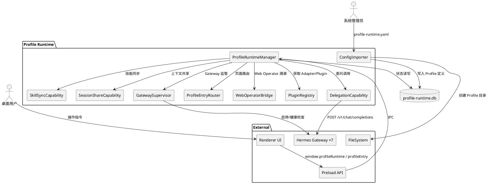

---

# 4. DFX约束

## 4.1 性能

1. When 用户发起 Profile 启动请求，the Profile Runtime shall 在 5 秒内完成从发起启动到 Gateway /health 返回 200 的全过程。
2. The Profile Runtime shall 确保 SQLite 单表查询响应时间小于 100ms（1000 条记录内）。
3. When 用户发起技能同步操作，the Profile Runtime shall 确保单个技能文件（10MB 内）复制时间小于 1 秒。
4. When 用户发起委托调用，the Profile Runtime shall 确保网络转发开销小于 500ms（不含 Gateway 推理时间）。
5. The Profile Runtime shall 支持 7 个 Profile Gateway 实例同时运行。

## 4.2 可靠性

1. When Electron App 收到 before-quit 信号，the Profile Runtime shall 停止所有运行中的 Profile Gateway 实例后再退出。
2. The profile-runtime.db shall 启用 WAL 模式，支持并发读取。
3. When Gateway 健康检查连续 3 次失败（间隔 2 秒），the Runtime Adapter shall 标记 Profile 状态为 failed。
4. When 配置导入过程中任一步骤失败，the Config Importer shall 回滚事务，清理已创建的目录和数据库记录。

## 4.3 安全性

1. The Profile Runtime shall 确保所有 Gateway 实例仅监听 127.0.0.1，禁止绑定 0.0.0.0。
2. The profile-runtime.db shall 不保存 API Key 明文，敏感配置保留在 Profile 目录的 .env 文件中。
3. The Preload API shall 不暴露 Node.js、SQLite、文件系统直接访问能力给 Renderer。
4. The Profile Runtime shall 禁止 default Profile 直接写 specialist Profile 的 state.db，反之亦然。
5. When Web Operator 执行敏感操作（文件删除、表单提交等），the Web Operator Bridge shall 要求 Desktop UI 用户确认。
6. The Tool Bridge shall 禁止绑定 0.0.0.0。
7. When 以下任一操作发生——委托调用、技能复制、上下文共享、Web Operator 操作——the Profile Runtime shall 写入 audit_events 表记录操作详情。

## 4.4 可维护性

1. The Profile Runtime shall 通过统一接口规范管理所有 Runtime Adapter 和 Capability Plugin，支持插拔注册。
2. The profile-runtime.db Schema shall 支持版本迁移，迁移脚本幂等可重复执行。
3. The Profile Runtime shall 区分 INFO/WARN/ERROR 日志级别，关键操作记录耗时和结果。
4. The IPC API shall 提供类型定义文件（.d.ts），Renderer 通过类型检查防止调用错误。

## 4.5 兼容性

1. The Profile Runtime shall 兼容现有单一 Profile 模式，default Profile 无缝升级。
2. The Profile Runtime shall 保留现有 Hermes Gateway 进程管理逻辑，通过 Adapter 调用。
3. The profile-runtime.yaml 格式 shall 向后兼容，支持增量字段扩展。
4. The Renderer UI shall 兼容原 Layout 结构，Profile Runtime Screen 作为新增视图挂载。
5. The Profile Entry Router shall 不修改现有侧边栏 14 视图结构，仅新增导航分组。

---

# 5. 核心能力

## 5.1 多 Profile Gateway 同时运行

### 5.1.1 业务规则

1. **预定义 Profile 规则**

   a. 验收条件：The Profile Runtime shall 支持 7 个预定义 Profile：default(8642)、writer(8643)、coding(8644)、research(8645)、recruiters(8646)、finance(8647)、agenter(8648)。

2. **Profile 独立性规则**

   a. 验收条件：While 每个 Profile 运行，the Profile Runtime shall 确保其拥有独立的 config.yaml、.env、SOUL.md、state.db、skills/、memories/、desktop/ 目录。

3. **统一状态管理规则**

   a. 验收条件：The Profile Runtime shall 通过 profile-runtime.db 统一管理所有 Profile 的运行状态。

4. **端口隔离规则**

   a. 验收条件：If 两个 Profile 被分配相同端口，the Profile Runtime shall 拒绝启动并返回 PROFILE_PORT_CONFLICT 错误。

5. **全部启停规则**

   a. 验收条件：When 用户发起 startAll 请求，the Profile Runtime shall 按序启动所有已部署且 stopped 状态的 Profile。
   
   b. 验收条件：When 用户发起 stopAll 请求，the Profile Runtime shall 按序停止所有 running 状态的 Profile。

### 5.1.2 交互流程

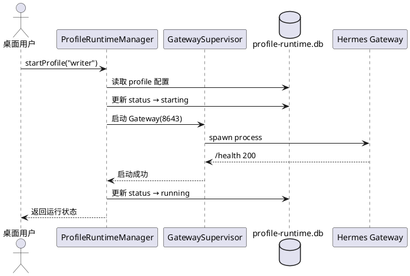

### 5.1.3 异常场景

1. **Profile 未部署**

   a. 触发条件：用户尝试启动 not_deployed 状态的 Profile。
   
   b. 系统行为：Manager 拒绝启动请求。
   
   c. 用户感知：返回错误码 PROFILE_RUNTIME_NOT_DEPLOYED。

2. **Gateway 启动失败**

   a. 触发条件：Gateway 进程启动后健康检查超时或进程异常退出。
   
   b. 系统行为：Manager 将状态标记为 failed，记录错误日志。
   
   c. 用户感知：返回错误码 PROFILE_RUNTIME_START_FAILED。

3. **端口冲突**

   a. 触发条件：Profile 分配的端口已被其他进程占用。
   
   b. 系统行为：Manager 拒绝启动，不修改状态。
   
   c. 用户感知：返回错误码 PROFILE_PORT_CONFLICT。

4. **Gateway 停止失败**

   a. 触发条件：停止 Gateway 进程时进程无响应或 kill 失败。
   
   b. 系统行为：Manager 尝试 force kill，标记状态为 failed。
   
   c. 用户感知：返回错误码 PROFILE_RUNTIME_STOP_FAILED。

---

## 5.2 Profile Runtime 可插拔架构

### 5.2.1 业务规则

1. **RuntimeAdapter 接口规范**

   a. 验收条件：The Profile Runtime shall 定义 RuntimeAdapter 接口，包含 validate、deploy、start、stop、restart、health、sendMessage 方法。

2. **HermesLocalRuntimeAdapter 实现**

   a. 验收条件：The Profile Runtime shall 提供 HermesLocalRuntimeAdapter 作为默认实现，管理本地 Hermes Gateway 进程。

3. **Adapter 扩展预留规则**

   a. 验收条件：Where Profile 的 runtime_type 为 hermes-remote、tool-only 或 docker-hermes，the Profile Runtime shall 返回 PROFILE_ADAPTER_NOT_FOUND（V1.1 不实现，预留接口）。

4. **Adapter 注册规则**

   a. 验收条件：When Profile Runtime 初始化，the Plugin Registry shall 注册所有已实现的 RuntimeAdapter 类型。

### 5.2.2 交互流程

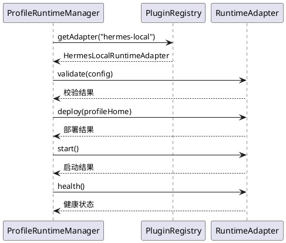

### 5.2.3 异常场景

1. **Adapter 不存在**

   a. 触发条件：请求的 runtime_type 在 Plugin Registry 中无对应实现。
   
   b. 系统行为：Manager 返回错误，不执行任何操作。
   
   c. 用户感知：返回错误码 PROFILE_ADAPTER_NOT_FOUND。

2. **Adapter 校验失败**

   a. 触发条件：RuntimeAdapter.validate() 返回配置不合法。
   
   b. 系统行为：Manager 拒绝部署，记录校验错误详情。
   
   c. 用户感知：返回错误码 PROFILE_CONFIG_INVALID。

---

## 5.3 SQLite Runtime Control Plane

### 5.3.1 业务规则

1. **数据库位置规则**

   a. 验收条件：The Profile Runtime shall 将 profile-runtime.db 存储在 ~/.hermes/desktop/profile-runtime.db。

2. **核心表定义规则**

   a. 验收条件：The profile-runtime.db shall 包含以下核心表：profiles、runtime_instances、profile_entries、profile_capabilities、profile_skills、skill_sync_events、shared_contexts、delegation_events、audit_events。

3. **运行状态枚举规则**

   a. 验收条件：The runtime_instances 表的 status 字段 shall 仅接受以下枚举值：not_deployed、stopped、starting、running、stopping、failed。

4. **状态流转规则**

   a. 验收条件：When Profile 状态从 stopped 变为 starting，the Profile Runtime shall 仅允许该流转路径，禁止从 not_deployed 直接跳转到 running。

5. **审计必写规则**

   a. 验收条件：When 任何 Profile 管理操作执行完成，the Profile Runtime shall 写入 audit_events 表，记录 profile_id、operation、actor、timestamp、result、details。

### 5.3.2 交互流程

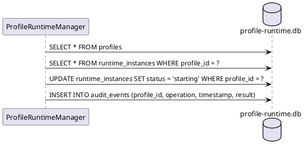

### 5.3.3 异常场景

1. **数据库文件损坏**

   a. 触发条件：profile-runtime.db 文件损坏或锁死。
   
   b. 系统行为：Manager 尝试重建数据库，保留已有 Profile 目录。
   
   c. 用户感知：提示"数据库已重建，部分状态需重新配置"。

2. **并发写入冲突**

   a. 触发条件：多个 IPC 请求同时写入同一 Profile 状态。
   
   b. 系统行为：SQLite WAL 模式处理并发，后写入请求等待。
   
   c. 用户感知：操作可能短暂延迟后成功。

---

## 5.4 声明式配置导入

### 5.4.1 业务规则

1. **配置文件校验规则**

   a. 验收条件：When 用户选择 profile-runtime.yaml 文件进行导入，the Config Importer shall 校验 YAML 格式、version 字段、profiles 字段结构合法性。

2. **Profile 名称唯一性规则**

   a. 验收条件：If 导入的 Profile 名称与 SQLite 中已存在的 Profile 名称冲突，the Config Importer shall 返回 PROFILE_ALREADY_EXISTS 错误。

3. **端口唯一性规则**

   a. 验收条件：If 导入的端口与 SQLite 中已分配的端口冲突，the Config Importer shall 返回 PROFILE_PORT_CONFLICT 错误。

4. **Profile 名称合法性规则**

   a. 验收条件：If 导入的 Profile 名称包含非法字符或不满足命名规范，the Config Importer shall 返回 PROFILE_INVALID_NAME 错误。

5. **Runtime Adapter 存在性规则**

   a. 验收条件：If 导入的 Profile runtime_type 在 Plugin Registry 中不存在对应 Adapter，the Config Importer shall 返回 PROFILE_ADAPTER_NOT_FOUND 错误。

6. **目录创建规则**

   a. 验收条件：When 配置校验通过，the Config Importer shall 为每个 Profile 通过 profileHome(profile?) 创建目录结构，包括 config.yaml、.env、SOUL.md、skills/、memories/、desktop/。

7. **数据库写入规则**

   a. 验收条件：When 目录创建成功，the Config Importer shall 将 Profile 定义写入 profiles 表、运行实例写入 runtime_instances 表、能力绑定写入 profile_capabilities 表、技能写入 profile_skills 表。

8. **事务回滚规则**

   a. 验收条件：If 导入过程中任一步骤失败，the Config Importer shall 回滚事务，清理已创建的目录和数据库记录。

### 5.4.2 交互流程

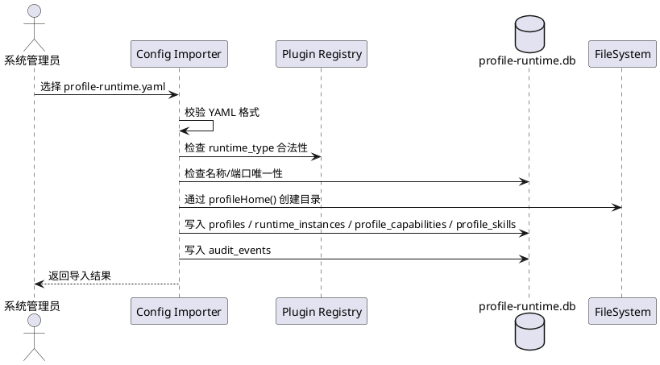

### 5.4.3 异常场景

1. **YAML 格式错误**

   a. 触发条件：导入的 YAML 文件语法错误或缺少必要字段。
   
   b. 系统行为：Config Importer 捕获解析异常，不执行任何写入操作。
   
   c. 用户感知：返回 PROFILE_CONFIG_INVALID 错误。

2. **端口冲突**

   a. 触发条件：导入的端口已被其他 Profile 占用。
   
   b. 系统行为：Config Importer 终止导入流程，回滚已写入数据。
   
   c. 用户感知：返回 PROFILE_PORT_CONFLICT 错误，列出冲突的 Profile 名称和端口号。

3. **目录创建失败**

   a. 触发条件：文件系统权限不足或磁盘空间不足。
   
   b. 系统行为：Config Importer 回滚事务，清理已创建的目录。
   
   c. 用户感知：返回错误提示"目录创建失败，请检查权限和磁盘空间"。

---

## 5.5 Profile Entry 独立页面入口

### 5.5.1 业务规则

1. **default Profile 页面规则**

   a. 验收条件：Where Profile 名称为 default，the Profile Entry Router shall 渲染 AIOSWorkspaceScreen（主控对话 + 多 Profile 状态 + 委派 + Web Operator + 结果汇总）。

2. **specialist Profile 页面规则**

   a. 验收条件：Where Profile 名称不为 default，the Profile Entry Router shall 渲染 ProfileWorkspaceScreen（独立 chat + skills + context + audit）。

3. **左侧导航规则**

   a. 验收条件：The Profile Entry UI shall 提供以下导航分组：AI-OS（default 主控）、Experts（specialist 列表）、Runtime（运行时管理）、Operator（Web Operator）。

4. **Profile Entry 唯一路由规则**

   a. 验收条件：If 两个 Profile Entry 注册了相同路由路径，the Profile Entry Router shall 返回 PROFILE_ENTRY_ROUTE_CONFLICT 错误。

5. **页面布局持久化规则**

   a. 验收条件：When 用户修改 Profile Entry 页面布局，the Profile Entry Router shall 保存布局配置到 profile_entries 表。

### 5.5.2 交互流程

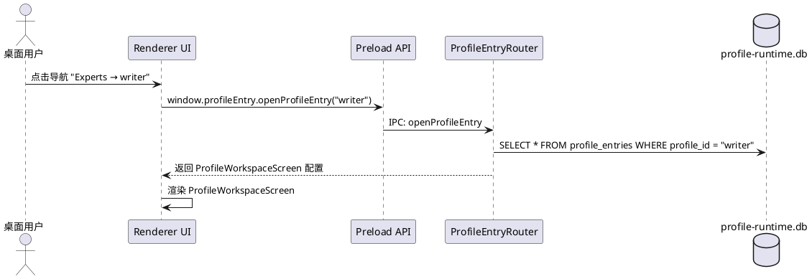

### 5.5.3 异常场景

1. **Profile Entry 不存在**

   a. 触发条件：请求的 profileId 在 profile_entries 表中不存在。
   
   b. 系统行为：Router 返回错误，不渲染页面。
   
   c. 用户感知：返回 PROFILE_ENTRY_NOT_FOUND 错误。

2. **路由冲突**

   a. 触发条件：两个 Profile Entry 注册了相同路由路径。
   
   b. 系统行为：Router 拒绝注册，保留先注册的 Entry。
   
   c. 用户感知：返回 PROFILE_ENTRY_ROUTE_CONFLICT 错误。

---

## 5.6 Delegation Capability（委托调用）

### 5.6.1 业务规则

1. **委托发起规则**

   a. 验收条件：When default Profile 用户发起委托调用，the DelegationCapability shall 将请求路由到指定的 specialist Profile。

2. **委托调用流程规则**

   a. 验收条件：When 委托调用执行，the DelegationCapability shall 按 UI → Preload → IPC → DelegationCapability → read runtime_instances → POST /v1/chat/completions → write delegation_events 流程处理。

3. **目标 Profile 运行状态规则**

   a. 验收条件：If 目标 specialist Profile 的运行状态不为 running，the DelegationCapability shall 返回 PROFILE_RUNTIME_NOT_DEPLOYED 错误。

4. **Stream 模式规则**

   a. 验收条件：Where 委托调用请求指定 stream=true，the DelegationCapability shall 以 SSE 流式模式转发 Gateway 响应。

5. **Context Refs 携带规则**

   a. 验收条件：Where 委托调用请求携带 context_refs，the DelegationCapability shall 将引用的共享上下文注入到目标 Profile 的请求消息中。

6. **委托事件记录规则**

   a. 验收条件：When 委托调用完成（无论成功或失败），the DelegationCapability shall 写入 delegation_events 表，记录 source_profile_id、target_profile_id、request_summary、response_summary、context_refs、timestamp、status。

7. **审计记录规则**

   a. 验收条件：When 委托调用执行，the Profile Runtime shall 写入 audit_events 表记录委托操作。

### 5.6.2 交互流程

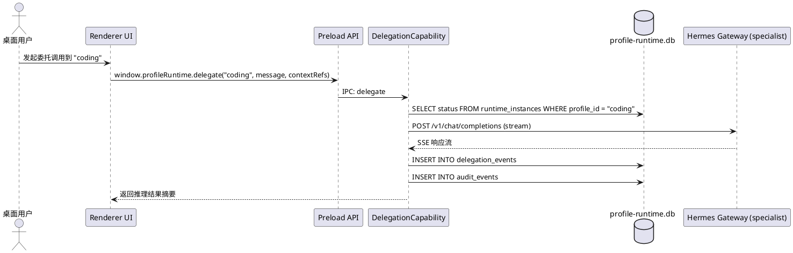

### 5.6.3 异常场景

1. **目标 Profile 未运行**

   a. 触发条件：委托调用的目标 specialist Profile 状态不为 running。
   
   b. 系统行为：DelegationCapability 拒绝请求，不发送 HTTP 请求。
   
   c. 用户感知：返回 PROFILE_RUNTIME_NOT_DEPLOYED 错误。

2. **Gateway 请求失败**

   a. 触发条件：POST /v1/chat/completions 请求超时或返回非 2xx 状态码。
   
   b. 系统行为：DelegationCapability 记录失败事件到 delegation_events，写入 audit_events。
   
   c. 用户感知：返回 PROFILE_DELEGATION_FAILED 错误。

3. **Context Refs 无效**

   a. 触发条件：委托调用携带的 context_refs 引用不存在的共享上下文。
   
   b. 系统行为：DelegationCapability 忽略无效引用，继续执行委托。
   
   c. 用户感知：日志警告"部分 context refs 无效已跳过"。

4. **Profile 不存在**

   a. 触发条件：委托调用的目标 profileId 在 profiles 表中不存在。
   
   b. 系统行为：DelegationCapability 拒绝请求。
   
   c. 用户感知：返回 PROFILE_NOT_FOUND 错误。

---

## 5.7 Skill Sync（技能同步）

### 5.7.1 业务规则

1. **技能复制规则**

   a. 验收条件：When 用户发起技能同步请求（sourceProfile → targetProfile），the SkillSyncCapability shall 将源 Profile 的指定技能文件复制到目标 Profile 的 skills/ 目录。

2. **冲突跳过规则**

   a. 验收条件：Where 目标 Profile 已存在同名技能文件且 overwrite=false，the SkillSyncCapability shall 跳过该文件，不覆盖。

3. **冲突覆盖规则**

   a. 验收条件：Where 目标 Profile 已存在同名技能文件且 overwrite=true，the SkillSyncCapability shall 备份原文件后覆盖，备份文件命名为 {原文件名}.backup.{timestamp}。

4. **同步事件记录规则**

   a. 验收条件：When 技能复制操作完成，the SkillSyncCapability shall 写入 skill_sync_events 表，记录 source_profile_id、target_profile_id、skill_name、action（copied/skipped/overwritten）、checksum、timestamp。

5. **校验和验证规则**

   a. 验收条件：When 技能文件复制完成，the SkillSyncCapability shall 计算目标文件校验和并与源文件校验和比对，不一致则标记为 failed。

6. **源技能不存在规则**

   a. 验收条件：If 源 Profile 中指定的技能文件不存在，the SkillSyncCapability shall 返回 PROFILE_SKILL_NOT_FOUND 错误。

7. **审计记录规则**

   a. 验收条件：When 技能同步操作执行，the Profile Runtime shall 写入 audit_events 表。

### 5.7.2 交互流程

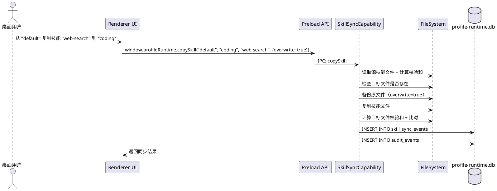

### 5.7.3 异常场景

1. **源技能不存在**

   a. 触发条件：源 Profile 中指定的技能文件不存在。
   
   b. 系统行为：SkillSyncCapability 拒绝复制。
   
   c. 用户感知：返回 PROFILE_SKILL_NOT_FOUND 错误。

2. **文件复制失败**

   a. 触发条件：文件系统权限不足或磁盘空间不足。
   
   b. 系统行为：SkillSyncCapability 回滚，删除已复制的不完整文件。
   
   c. 用户感知：返回 PROFILE_SKILL_COPY_FAILED 错误。

3. **校验和不匹配**

   a. 触发条件：复制后目标文件校验和与源文件不一致。
   
   b. 系统行为：SkillSyncCapability 标记同步事件为 failed，保留目标文件但添加警告。
   
   c. 用户感知：提示"技能文件校验和不匹配，请检查文件完整性"。

---

## 5.8 Session Context Share（会话上下文共享）

### 5.8.1 业务规则

1. **不直接复制 state.db 规则**

   a. 验收条件：The SessionShareCapability shall 禁止直接复制源 Profile 的 state.db 到目标 Profile。

2. **快照模式规则**

   a. 验收条件：Where 共享模式为 snapshot，the SessionShareCapability shall 生成源会话当前状态的完整快照文件 context.md。

3. **摘要模式规则**

   a. 验收条件：Where 共享模式为 summary，the SessionShareCapability shall 生成源会话的摘要文件 context.md，仅包含关键信息摘要。

4. **全文模式规则**

   a. 验收条件：Where 共享模式为 full，the SessionShareCapability shall 生成源会话的完整消息历史文件 context.md。

5. **共享目录规则**

   a. 验收条件：When 上下文共享完成，the SessionShareCapability shall 将 context.md 文件放置到目标 Profile 的 shared-context/ 目录。

6. **委托上下文引用规则**

   a. 验收条件：Where 委托调用携带 context refs，the DelegationCapability shall 引用目标 Profile 的 shared-context/ 目录中的 context.md 文件。

7. **源会话不存在规则**

   a. 验收条件：If 源 Profile 的指定会话不存在，the SessionShareCapability shall 返回 PROFILE_CONTEXT_SOURCE_SESSION_NOT_FOUND 错误。

8. **审计记录规则**

   a. 验收条件：When 上下文共享操作执行，the Profile Runtime shall 写入 audit_events 表。

### 5.8.2 交互流程

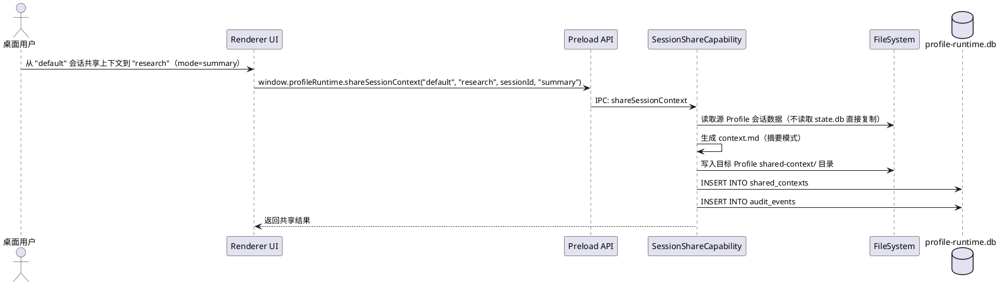

### 5.8.3 异常场景

1. **源会话不存在**

   a. 触发条件：源 Profile 的指定会话 ID 不存在。
   
   b. 系统行为：SessionShareCapability 拒绝共享。
   
   c. 用户感知：返回 PROFILE_CONTEXT_SOURCE_SESSION_NOT_FOUND 错误。

2. **目标目录不可写**

   a. 触发条件：目标 Profile 的 shared-context/ 目录无法写入。
   
   b. 系统行为：SessionShareCapability 终止共享，记录失败。
   
   c. 用户感知：返回 PROFILE_CONTEXT_SHARE_FAILED 错误。

3. **上下文生成失败**

   a. 触发条件：会话数据解析异常或生成 context.md 过程出错。
   
   b. 系统行为：SessionShareCapability 记录失败，不写入不完整文件。
   
   c. 用户感知：返回 PROFILE_CONTEXT_SHARE_FAILED 错误。

---

## 5.9 Web Operator Profile-Aware 集成

### 5.9.1 业务规则

1. **操作来源溯源规则**

   a. 验收条件：When Web Operator 执行浏览器操作，the Web Operator Bridge shall 记录操作的 profileId 来源。

2. **Tool Bridge 请求扩展规则**

   a. 验收条件：When Desktop Tool Bridge 发起请求，the request shall 包含 profileId 和 sourceProfile 字段。

3. **审计写入规则**

   a. 验收条件：When Web Operator 执行任何 browser action（navigate、click、screenshot 等），the Web Operator Bridge shall 写入 audit_events 表，记录 profileId、action_type、url、timestamp。

4. **敏感操作确认规则**

   a. 验收条件：If Web Operator 执行敏感操作（文件删除、表单提交、支付操作等），the Web Operator Bridge shall 要求 Desktop UI 用户确认后方可执行。

5. **Profile 权限校验规则**

   a. 验收条件：If Web Operator 请求的 profileId 对应的 Profile 不在允许列表中，the Web Operator Bridge shall 返回 WEB_OPERATOR_PROFILE_NOT_ALLOWED 错误。

### 5.9.2 交互流程

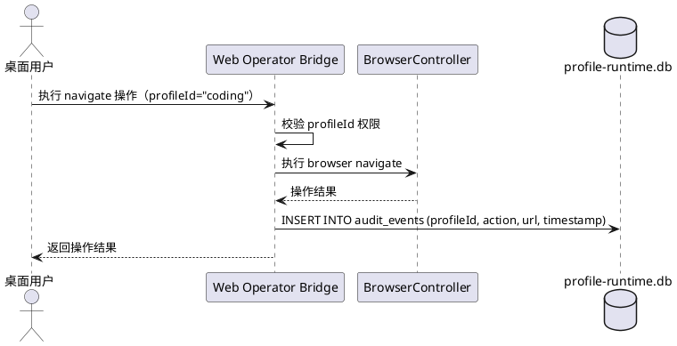

### 5.9.3 异常场景

1. **Profile 不允许操作**

   a. 触发条件：Web Operator 请求的 profileId 对应的 Profile 不在允许列表中。
   
   b. 系统行为：Web Operator Bridge 拒绝操作，记录审计。
   
   c. 用户感知：返回 WEB_OPERATOR_PROFILE_NOT_ALLOWED 错误。

2. **敏感操作用户拒绝**

   a. 触发条件：用户在确认弹窗中拒绝敏感操作。
   
   b. 系统行为：Web Operator Bridge 取消操作，记录审计。
   
   c. 用户感知：操作未执行，UI 显示"操作已取消"。

3. **BrowserController 异常**

   a. 触发条件：浏览器操作执行失败（页面崩溃、网络超时等）。
   
   b. 系统行为：Web Operator Bridge 记录失败审计，返回错误。
   
   c. 用户感知：提示"浏览器操作执行失败"。

---

## 5.10 IPC / Preload API

### 5.10.1 业务规则

1. **window.profileRuntime API 规则**

   a. 验收条件：The Preload API shall 暴露 window.profileRuntime 对象，包含以下方法：importConfig、listProfiles、getProfile、startProfile、stopProfile、restartProfile、startAll、stopAll、getRuntimeStatus、delegate、listProfileSkills、copySkill、listProfileSessions、shareSessionContext、listSharedContexts、deleteSharedContext、listAuditEvents。

2. **window.profileEntry API 规则**

   a. 验收条件：The Preload API shall 暴露 window.profileEntry 对象，包含以下方法：listProfileEntries、getProfileEntry、openProfileEntry、getProfilePageLayout、updateProfilePageLayout。

3. **进程隔离规则**

   a. 验收条件：The Preload API shall 不暴露 Node.js 模块、SQLite 直接访问、文件系统直接读写能力给 Renderer。

4. **IPC 通道命名规则**

   a. 验收条件：The IPC 通道 shall 使用 profile-runtime: 前缀命名，格式为 profile-runtime:{method}。

5. **类型定义规则**

   a. 验收条件：The Preload API shall 提供完整 TypeScript 类型定义（.d.ts），Renderer 通过类型检查防止调用错误。

### 5.10.2 交互流程

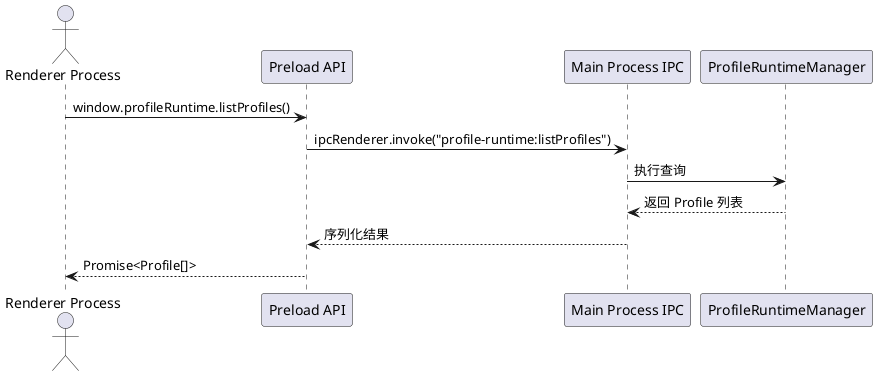

### 5.10.3 异常场景

1. **IPC 通道不存在**

   a. 触发条件：Renderer 调用未注册的 IPC 方法。
   
   b. 系统行为：Preload 返回 rejected Promise。
   
   c. 用户感知：控制台错误"IPC channel not found"。

2. **Main Process 异常**

   a. 触发条件：IPC Handler 执行过程中抛出未捕获异常。
   
   b. 系统行为：IPC 返回错误对象，包含错误码和消息。
   
   c. 用户感知：UI 显示对应错误提示。

---

# 6. 数据约束

## 6.1 Profile

1. **name**: 必填，唯一，仅允许小写字母、数字、连字符，长度 2-32 字符
2. **display_name**: 必填，用户可读名称，长度 1-64 字符
3. **port**: 必填，唯一，范围 1024-65535，V1.1 预分配 8642-8648
4. **runtime_type**: 必填，枚举值 hermes-local | hermes-remote | tool-only | docker-hermes
5. **role**: 必填，枚举值 default | specialist
6. **profile_home**: 必填，由 profileHome(name) 生成的目录路径
7. **status**: 必填，枚举值 not_deployed | stopped | starting | running | stopping | failed
8. **created_at**: 必填，ISO 8601 时间戳
9. **updated_at**: 必填，ISO 8601 时间戳

## 6.2 Runtime Instance

1. **profile_id**: 必填，外键关联 profiles.id
2. **pid**: 运行时进程 ID，仅在 running 状态时非空
3. **port**: 必填，与关联 Profile 的 port 一致
4. **status**: 必填，profile_runtime_status 枚举
5. **health_check_url**: 必填，格式 http://127.0.0.1:{port}/health
6. **last_health_check_at**: 上次健康检查时间，ISO 8601
7. **error_message**: 最近一次错误信息，仅在 failed 状态时非空
8. **started_at**: 启动时间，ISO 8601
9. **stopped_at**: 停止时间，ISO 8601

## 6.3 Profile Entry

1. **profile_id**: 必填，唯一，外键关联 profiles.id
2. **route_path**: 必填，唯一，页面路由路径
3. **screen_type**: 必填，枚举值 AIOSWorkspaceScreen | ProfileWorkspaceScreen
4. **layout_config**: 可选，JSON 格式的页面布局配置
5. **nav_group**: 必填，枚举值 ai-os | experts | runtime | operator

## 6.4 Profile Capability

1. **profile_id**: 必填，外键关联 profiles.id
2. **capability_type**: 必填，枚举值 delegation | skill-sync | session-share | gateway-supervisor
3. **enabled**: 必填，布尔值
4. **config**: 可选，JSON 格式的能力配置

## 6.5 Delegation Event

1. **source_profile_id**: 必填，发起委托的 Profile ID
2. **target_profile_id**: 必填，接收委托的 Profile ID
3. **request_summary**: 必填，委托请求摘要，最大 1024 字符
4. **response_summary**: 可选，委托响应摘要，最大 2048 字符
5. **context_refs**: 可选，JSON 数组，引用的共享上下文 ID 列表
6. **status**: 必填，枚举值 pending | completed | failed
7. **stream**: 必填，布尔值，是否流式响应
8. **timestamp**: 必填，ISO 8601

## 6.6 Skill Sync Event

1. **source_profile_id**: 必填，源 Profile ID
2. **target_profile_id**: 必填，目标 Profile ID
3. **skill_name**: 必填，技能文件名
4. **action**: 必填，枚举值 copied | skipped | overwritten | failed
5. **checksum**: 可选，SHA-256 校验和
6. **backup_path**: 可选，备份文件路径（仅 overwritten 时有值）
7. **timestamp**: 必填，ISO 8601

## 6.7 Shared Context

1. **source_profile_id**: 必填，源 Profile ID
2. **target_profile_id**: 必填，目标 Profile ID
3. **source_session_id**: 必填，源会话 ID
4. **share_mode**: 必填，枚举值 snapshot | summary | full
5. **file_path**: 必填，context.md 文件在目标 Profile 的路径
6. **message_count**: 可选，共享的消息数量
7. **timestamp**: 必填，ISO 8601

## 6.8 Audit Event

1. **profile_id**: 必填，操作关联的 Profile ID
2. **operation**: 必填，操作类型（如 profile.start、delegation.invoke、skill.copy、context.share、web-operator.action）
3. **actor**: 必填，操作来源（user | system | delegation | tool-bridge）
4. **result**: 必填，枚举值 success | failure
5. **details**: 可选，JSON 格式的操作详情
6. **timestamp**: 必填，ISO 8601

## 6.9 错误码

| 错误码 | 含义 | 触发场景 |
|--------|------|----------|
| PROFILE_NOT_FOUND | Profile 不存在 | 查询/操作不存在的 profileId |
| PROFILE_ALREADY_EXISTS | Profile 已存在 | 导入同名 Profile |
| PROFILE_INVALID_NAME | Profile 名称非法 | 名称含非法字符或超长 |
| PROFILE_CONFIG_INVALID | 配置文件不合法 | YAML 格式错误或缺字段 |
| PROFILE_PORT_CONFLICT | 端口冲突 | 端口已被其他 Profile 占用 |
| PROFILE_RUNTIME_NOT_DEPLOYED | Profile 未部署 | 启动未部署的 Profile |
| PROFILE_RUNTIME_START_FAILED | 启动失败 | Gateway 进程启动异常 |
| PROFILE_RUNTIME_STOP_FAILED | 停止失败 | Gateway 进程停止异常 |
| PROFILE_GATEWAY_HEALTH_TIMEOUT | 健康检查超时 | /health 端点响应超时 |
| PROFILE_ADAPTER_NOT_FOUND | Adapter 不存在 | 请求未实现的 runtime_type |
| PROFILE_CAPABILITY_NOT_ENABLED | 能力未启用 | 使用未启用的 Capability |
| PROFILE_DELEGATION_FAILED | 委托失败 | 委托调用执行失败 |
| PROFILE_SKILL_NOT_FOUND | 技能不存在 | 复制不存在的技能 |
| PROFILE_SKILL_COPY_FAILED | 技能复制失败 | 文件复制异常 |
| PROFILE_CONTEXT_SOURCE_SESSION_NOT_FOUND | 源会话不存在 | 共享不存在的会话上下文 |
| PROFILE_CONTEXT_SHARE_FAILED | 上下文共享失败 | context.md 生成/写入失败 |
| PROFILE_ENTRY_NOT_FOUND | Profile Entry 不存在 | 访问不存在的 Entry |
| PROFILE_ENTRY_ROUTE_CONFLICT | 路由冲突 | 两个 Entry 注册相同路由 |
| WEB_OPERATOR_PROFILE_NOT_ALLOWED | Web Operator 不允许 | Profile 不在操作允许列表 |

---

# 7. 分阶段实施

| 阶段 | 名称 | 核心交付物 |
|------|------|------------|
| Phase 1 | SQLite Runtime DB | profile-runtime.db 建表 + 迁移机制 |
| Phase 2 | Config Importer | YAML 解析 + 校验 + 目录创建 + DB 写入 |
| Phase 3 | Runtime Adapter + Gateway Supervisor | HermesLocalRuntimeAdapter + 健康检查 + 进程监管 |
| Phase 4 | IPC + Preload | window.profileRuntime + window.profileEntry + 类型定义 |
| Phase 5 | Profile Entry Router + UI Shell | AIOSWorkspaceScreen + ProfileWorkspaceScreen + 导航 |
| Phase 6 | Delegation Capability | 委托调用 + stream + context refs + 审计 |
| Phase 7 | Skill Sync | 技能复制 + 冲突策略 + 校验和 + 审计 |
| Phase 8 | Session Context Share | 上下文导出 + 三种模式 + shared-context 目录 |
| Phase 9 | Web Operator Profile-Aware | profileId 溯源 + Tool Bridge 扩展 + 审计 |
