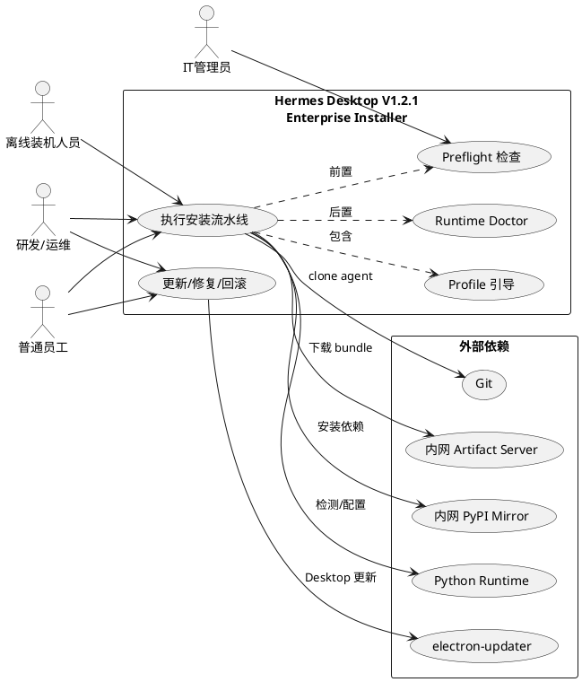
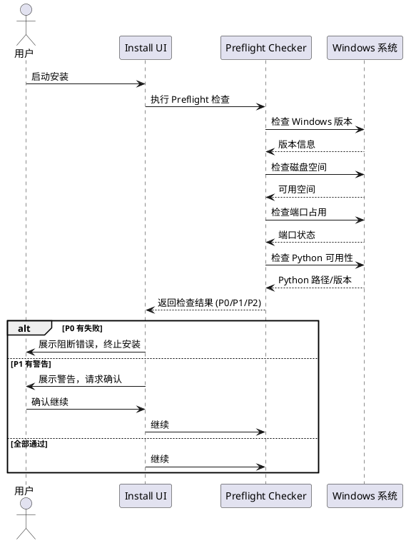
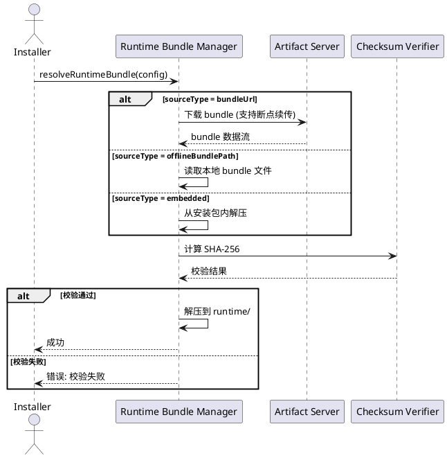
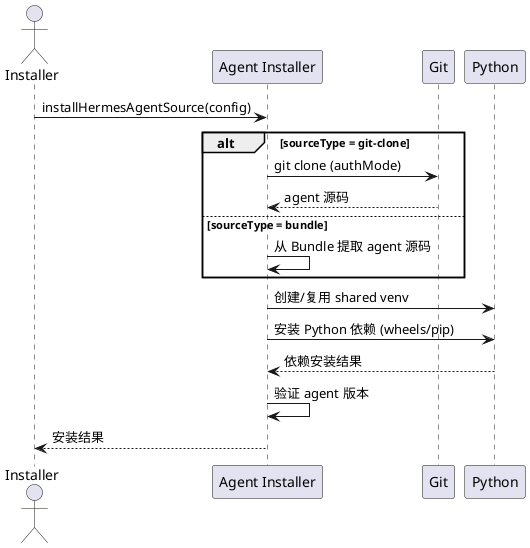
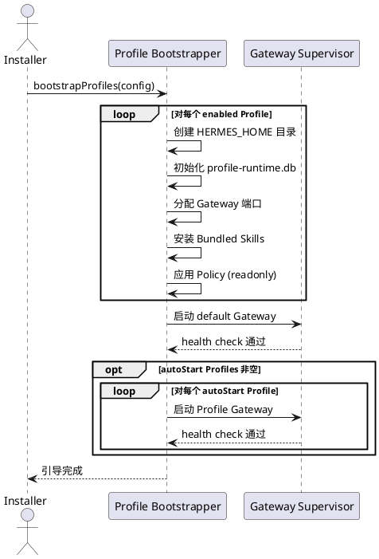
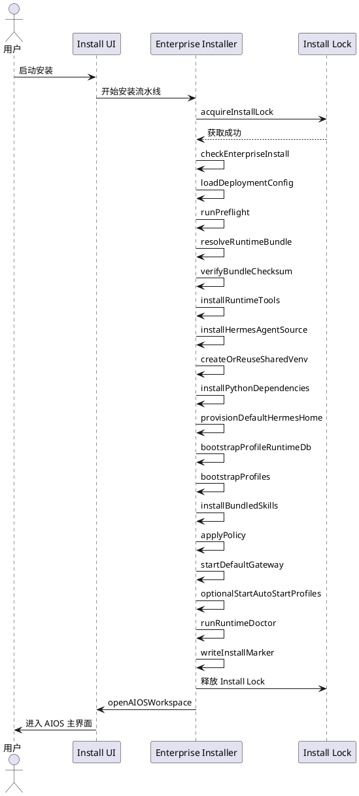
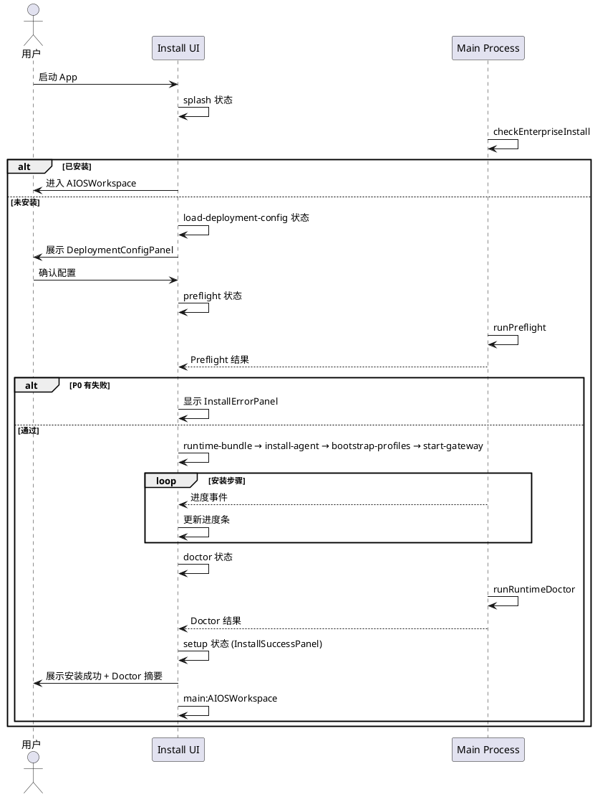
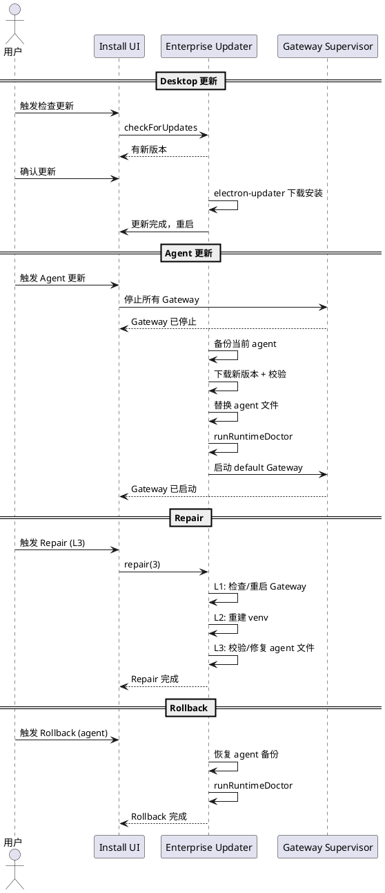
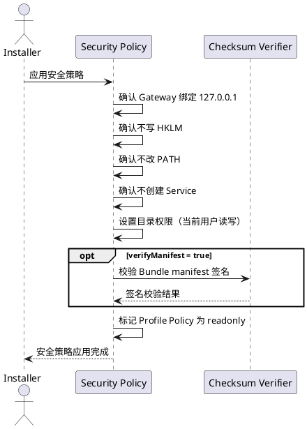
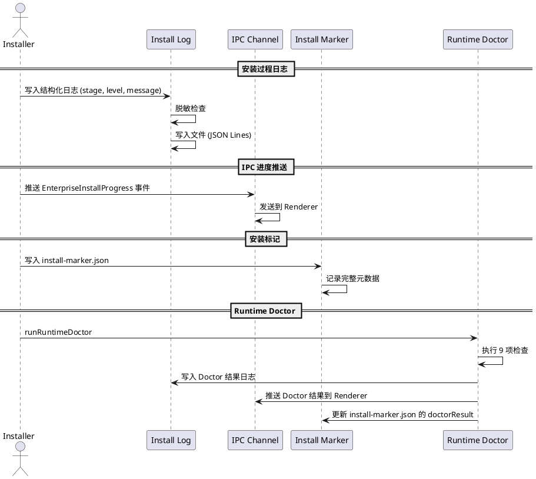

# Hermes Desktop V1.2.1 — 企业级一键部署安装方案 需求规格

**文档版本**: v1.0  
**创建日期**: 2026-05-16  
**编写人**: 华为云码道（CodeArts）代码智能体  
**基线版本**: V1.2 → V1.2.1  
**主题**: 将 V1.0 单 default gateway 安装方案升级为企业级一键部署安装方案，支持 Multi Profile Runtime 完整初始化、Windows Native 安装、运行时包管理、安装流水线编排、安装 UI、更新/修复/回滚及安全策略

---

# 1. 组件定位

## 1.1 核心职责

Hermes Desktop V1.2.1 Enterprise Installer 负责编排 Windows 环境下的一键部署安装流水线，实现从环境预检到 Multi Profile Runtime 完整就绪的全自动安装，并支持更新、修复与回滚。

## 1.2 核心输入

1. **安装包三件套**: AIOS-Hermes-Desktop-Setup-x64.exe、hermes-runtime-bundle.zip、deployment.json
2. **用户安装指令**: 安装模式选择（Windows Native / WSL2）、autoStart Profile 选择、安装目录自定义
3. **deployment.json 配置**: schemaVersion、company、installMode、installScope、desktop、runtimeBundle、hermesAgent、runtime、profiles、gateway、models、security、policy、doctor 等字段
4. **系统环境状态**: Windows 版本、磁盘空间、端口占用、Python 可用性、venv 可用性、Git 可用性、杀毒软件状态
5. **安装生命周期事件**: 流水线各步骤完成/失败、用户取消、Gateway 启动/退出
6. **更新/修复/回滚请求**: Desktop 更新、hermes-agent 更新、Repair 级别选择、Rollback 范围选择

## 1.3 核心输出

1. **安装结果**: 安装标记文件（install-marker.json）、profile-runtime.db 初始化结果、7 个 Profile 引导结果、default Gateway 启动状态
2. **安装目录结构**: %LOCALAPPDATA%\AIOS-Hermes\（app/runtime/agent/venv/logs/cache）及 %USERPROFILE%\.hermes\（config.yaml/.env/state.db/profiles/desktop/）
3. **Preflight 检查报告**: P0 阻断项、P1 警告项、P2 信息项的检查结果
4. **Runtime Doctor 诊断报告**: 9 项诊断检查结果与修复建议
5. **安装进度事件**: 通过 IPC 推送到 Renderer 的安装进度、阶段、百分比、错误信息
6. **安装日志**: 结构化安装日志（时间戳/阶段/级别/消息/错误码）
7. **更新/修复/回滚结果**: 操作成功/失败状态、受影响组件清单、前后版本信息

## 1.4 职责边界

Hermes Desktop V1.2.1 Enterprise Installer **不负责**：

1. WSL2 安装模式的完整实现（V1.2.1 仅做 Windows Native 主链路，WSL2 仅研发/运维可选）
2. Linux / macOS 平台安装（仅支持 Windows x64）
3. 企业 AD/LDAP 集成与 SSO 认证（V1.2.1 不涉及用户认证集成）
4. 远程 Profile Server 连接（安装仅初始化本地 Profile）
5. Electron 应用自身的代码签名（由 CI/CD 流水线负责）
6. 内网 PyPI Mirror 的搭建与维护（仅配置 pipIndexUrl 指向）
7. hermes-agent 的业务逻辑实现（安装器仅负责拉取/校验/部署 agent 源码）

---

# 2. 领域术语

**Enterprise Installer**
: 编排 Hermes Desktop 企业级一键部署安装全流程的 Main Process 模块，执行从环境预检到 Multi Profile Runtime 就绪的 12+ 步流水线。

**Runtime Bundle**
: 包含 hermes-agent 源码、Python wheels、预编译依赖的离线安装包（hermes-runtime-bundle.zip），用于无外网环境或标准化部署。

**Deployment Config**
: deployment.json 文件，定义企业安装的所有可配置参数，包括安装模式、运行时来源、Profile 配置、Gateway 配置、安全策略等。

**Preflight Check**
: 安装前的环境预检，分为 P0（阻断）、P1（警告）、P2（信息）三级，确保目标环境满足安装前提条件。

**Install Marker**
: 安装完成后写入的标记文件（install-marker.json），记录安装版本、时间、路径、Profile 状态等信息，用于判断是否已完成安装。

**Install Lock**
: 安装过程中获取的文件锁，防止多个安装实例并发执行导致目录损坏。

**Profile Bootstrap**
: 为每个 Profile 创建独立的 HERMES_HOME 目录、初始化 profile-runtime.db、安装专属 Skills、应用 Policy 的过程。

**Shared Venv**
: 所有 Profile 共享的 Python 虚拟环境，安装 hermes-agent 运行所需的全部 Python 依赖。

**Runtime Doctor**
: 安装完成后的诊断检查模块，验证 Gateway 可达性、Python 依赖完整性、Profile 数据库有效性等 9 项检查。

**Install Pipeline**
: 企业安装的有序步骤序列（checkEnterpriseInstall → loadDeploymentConfig → ... → openAIOSWorkspace），每步有明确的成功/失败/回滚语义。

**Repair Level**
: 修复操作的深度等级，从 L1（Gateway 进程）到 L5（重建 Profile），逐级加深修复范围。

**Install Rollback**
: 将安装/更新操作回退到上一已知良好状态，支持 Desktop、agent、runtime bundle、profile-runtime.db、profile config 五个维度。

**Gateway Health Check**
: 对 Profile Gateway 进程发起 /health HTTP 请求，验证其正常运行的能力，用于安装后验证和 Runtime Doctor。

---

# 3. 角色与边界

## 3.1 核心角色

- **普通员工**: 通过 Release Bundle 执行一键安装，无需 Git 凭据，无需管理员权限，使用 Windows Native 模式
- **研发/运维人员**: 可选 WSL2 模式，通过 Git clone 获取 hermes-agent 源码，自定义 deployment.json
- **IT 管理员**: 准备 deployment.json 和内网 Runtime Bundle，配置 pipIndexUrl 和 artifact server
- **离线装机人员**: 使用内网装机包（预下载的 Runtime Bundle + Desktop Setup），在无外网环境完成安装

## 3.2 外部系统

- **electron-updater**: Desktop 应用的自动更新机制，从 artifact server 拉取新版本
- **Python Runtime**: hermes-agent 的执行依赖，由安装器负责检测/下载/配置
- **Git**: hermes-agent 源码的获取方式（仅 Git clone 模式需要）
- **uv / pip**: Python 包管理器，用于安装 hermes-agent 依赖到 shared venv
- **内网 Artifact Server**: 存放 Desktop 更新包和 Runtime Bundle 的内部 HTTP 服务器
- **内网 PyPI Mirror**: 企业内部 Python 包镜像，加速依赖安装
- **Windows 系统**: 提供文件系统、进程管理、注册表（V1.2.1 不写 HKLM）、环境变量（V1.2.1 不改 PATH）

## 3.3 交互上下文

---

# 4. DFX约束

## 4.1 性能

1. **安装耗时上限**: Windows Native 模式下，从双击安装到 default Gateway 启动完成，总耗时不超过 5 分钟（SSD + 100Mbps 网络）
2. **Preflight 检查耗时**: 单项检查不超过 5 秒，全量 P0+P1 检查不超过 30 秒
3. **Runtime Doctor 耗时**: 9 项诊断检查总耗时不超过 60 秒
4. **安装锁获取**: Install Lock 获取超时不超过 10 秒
5. **Gateway 启动超时**: 单个 Profile Gateway 从进程启动到 health check 通过，默认不超过 30 秒（可由 deployment.json gateway.startupTimeoutMs 配置）

## 4.2 可靠性

1. **安装流水线原子性**: 流水线每步要么成功完成，要么失败回滚到安装前状态
2. **安装中断恢复**: 安装过程中 App 崩溃或用户强制退出，再次启动时能检测到未完成安装并提示修复
3. **Gateway 自动重启**: default Gateway 进程异常退出时，自动重启并恢复服务
4. **数据一致性**: profile-runtime.db 初始化过程使用事务，确保数据完整
5. **Checksum 校验**: Runtime Bundle 下载/解压后必须通过 SHA-256 校验，防止损坏或篡改

## 4.3 安全性

1. **无管理员权限**: 安装全程不需要管理员权限，不写 HKLM，不改 PATH，不创建 Windows Service
2. **仅本地监听**: 所有 Gateway 仅绑定 127.0.0.1，不暴露到局域网
3. **Token 不落盘**: 安装过程中涉及的认证 Token 不写入磁盘文件，不输出到日志
4. **Bundle 签名校验**: 可选对 Runtime Bundle manifest 进行数字签名校验
5. **Profile Policy 只读**: 安装完成后 Profile Policy 标记为只读，防止运行时被篡改

## 4.4 可维护性

1. **结构化安装日志**: 每条日志包含时间戳、阶段、级别、消息、错误码，写入 %LOCALAPPDATA%\AIOS-Hermes\logs\install\
2. **安装标记文件**: install-marker.json 记录完整安装状态，供后续更新/修复/回滚参考
3. **Doctor 报告导出**: 支持将 Runtime Doctor 诊断结果导出为 JSON 文件，便于远程排查
4. **IPC 安装进度**: 通过 EnterpriseInstallProgress IPC 通道实时推送安装进度到 Renderer UI

## 4.5 兼容性

1. **Windows 版本**: 支持 Windows 10 21H2+ 和 Windows 11（x64 only）
2. **向后兼容**: V1.2.1 安装器能检测并升级 V1.0/V1.1/V1.2 的已有安装
3. **deployment.json 版本**: 支持 schemaVersion 字段，安装器按版本号解析配置
4. **端口冲突处理**: 当默认端口被占用时，能自动递增分配或提示用户修改

---

# 5. 核心能力

## 5.1 安装前置检查（Preflight Checker）

### 5.1.1 业务规则

1. **P0 阻断项必须全部通过才能继续安装**: 当任一 P0 检查失败时，安装流水线必须终止并展示阻断原因
   - 验收条件: [P0 检查有失败项] → [安装流水线终止，UI 显示阻断错误，不进入下一步]

2. **P0 检查项清单（10 项）**: Windows 版本 >= 10 21H2、可用磁盘空间 >= 2GB、安装目录可写、%USERPROFILE%\.hermes 可写、默认端口 8642 未占用、Python 可用或 bundled、venv 可创建、Runtime Bundle SHA-256 校验通过、profile-runtime.db 可创建、deployment.json schema 合法
   - 验收条件: [执行 Preflight] → [返回 10 项 P0 检查结果，每项为 pass/fail + 详情]

3. **P1 警告项不阻断安装但必须展示**: 当 P1 检查有警告时，安装必须暂停并要求用户确认继续
   - 验收条件: [P1 检查有警告项] → [UI 展示警告列表，用户确认后方可继续]

4. **P1 检查项清单（5 项）**: Windows 10 版本接近 EOL、Ollama 未安装、内网 PyPI 不可达、Git 不可用（非 Git clone 模式可忽略）、杀毒软件可能拦截
   - 验收条件: [执行 Preflight] → [返回 5 项 P1 检查结果，每项为 pass/warn + 建议]

5. **P2 信息项仅展示不阻断**: P2 检查结果仅作为信息展示，不影响安装流程
   - 验收条件: [P2 检查完成] → [UI 展示版本信息，安装流程不暂停]

6. **P2 检查项清单（5 项）**: 当前 Windows 版本、已安装 Python 版本、已安装 Git 版本、已有 .hermes 目录状态、已有安装标记状态
   - 验收条件: [执行 Preflight] → [返回 5 项 P2 信息项结果]

7. **禁止项**: Preflight 检查禁止修改系统任何状态
   - 验收条件: [Preflight 执行完成] → [系统无任何文件/注册表/环境变量变更]

### 5.1.2 交互流程

### 5.1.3 异常场景

1. **Preflight 检查超时**
   - 触发条件: 单项检查执行超过 5 秒未返回
   - 系统行为: 将该项标记为 unknown，归入 P1 警告
   - 用户感知: 安装 UI 显示"检查超时，建议手动确认"

2. **Preflight 检查期间系统状态变化**
   - 触发条件: Preflight 执行期间端口被其他进程占用或释放
   - 系统行为: 以检查完成时刻的状态为准，不做实时重检
   - 用户感知: 安装 UI 以最终快照结果展示

3. **杀毒软件拦截 Preflight 探测**
   - 触发条件: 杀毒软件阻止文件系统或端口探测
   - 系统行为: 将受影响项标记为 P1 警告，提示可能需要临时关闭杀毒
   - 用户感知: 安装 UI 显示"杀毒软件可能影响安装，建议临时关闭"

## 5.2 运行时包管理（Runtime Bundle Manager）

### 5.2.1 业务规则

1. **Runtime Bundle 来源三选一**: deployment.json runtimeBundle.sourceType 指定 bundleUrl（在线下载）、offlineBundlePath（本地路径）、embedded（内嵌于安装包）
   - 验收条件: [sourceType=bundleUrl] → [从远程下载 zip]; [sourceType=offlineBundlePath] → [从本地路径读取]; [sourceType=embedded] → [从安装包内解压]

2. **Bundle 下载必须支持断点续传**: 当网络中断导致下载未完成时，恢复后能从断点继续
   - 验收条件: [下载中断后恢复] → [从已下载字节的断点继续，而非重新开始]

3. **Bundle 校验必须通过 SHA-256**: 下载或读取完成后，必须计算 SHA-256 并与 deployment.json runtimeBundle.bundleSha256 比对
   - 验收条件: [SHA-256 不匹配] → [丢弃 Bundle，报错"校验失败"，安装终止]

4. **Bundle 解压到 %LOCALAPPDATA%\AIOS-Hermes\runtime\**: 解压路径固定，包含 hermes-agent 源码和预编译 wheels
   - 验收条件: [解压完成] → [runtime/ 目录包含 agent/ 和 wheels/ 子目录]

5. **Bundle 重复安装必须复用**: 当已有相同版本 Bundle 且校验通过时，跳过下载和解压
   - 验收条件: [已有相同版本且 SHA-256 通过] → [跳过下载/解压，直接进入下一步]

6. **禁止项**: Bundle 解压禁止覆盖已有的正在运行的 Gateway 进程文件
   - 验收条件: [Gateway 进程运行中] → [先停止 Gateway，再解压覆盖]

### 5.2.2 交互流程

### 5.2.3 异常场景

1. **Bundle 下载失败**
   - 触发条件: 网络不可达或 Artifact Server 返回非 200
   - 系统行为: 重试 3 次（指数退避），仍失败则终止安装
   - 用户感知: 安装 UI 显示"运行时包下载失败，请检查网络或使用离线包"

2. **Bundle 解压空间不足**
   - 触发条件: 目标磁盘剩余空间小于 Bundle 解压后大小
   - 系统行为: 终止安装，提示释放磁盘空间
   - 用户感知: 安装 UI 显示"磁盘空间不足，需要 X MB"

3. **Bundle SHA-256 校验失败**
   - 触发条件: 计算的哈希值与 deployment.json 中的 bundleSha256 不匹配
   - 系统行为: 删除已下载/解压的文件，终止安装
   - 用户感知: 安装 UI 显示"运行时包校验失败，文件可能损坏"

## 5.3 Hermes Agent 安装（Agent Installer）

### 5.3.1 业务规则

1. **Agent 源码获取方式由 deployment.json 决定**: hermesAgent.sourceType 为 git-clone 或 bundle
   - 验收条件: [sourceType=git-clone] → [执行 git clone hermesAgent.gitUrl -b hermesAgent.branch]; [sourceType=bundle] → [从 Runtime Bundle 中提取 agent 源码]

2. **Git clone 模式必须支持认证**: hermesAgent.authMode 支持 none/ssh-key/personal-access-token
   - 验收条件: [authMode=ssh-key] → [使用 ~/.ssh/id_rsa 认证]; [authMode=personal-access-token] → [使用 token 认证]

3. **Git clone 模式仅研发/运维使用**: 普通员工安装必须使用 bundle 模式，Git clone 为高级选项
   - 验收条件: [installScope=employee 且 sourceType=git-clone] → [安装 UI 提示"该模式仅限研发使用，建议切换到 bundle 模式"]

4. **Shared Venv 创建或复用**: 安装器在 %LOCALAPPDATA%\AIOS-Hermes\venv\ 创建 Python 虚拟环境，已有则复用
   - 验收条件: [venv 目录不存在] → [创建新 venv]; [venv 目录已存在且有效] → [复用现有 venv]

5. **Python 依赖安装优先使用 wheels**: deployment.json runtime.wheelhousePath 指定本地 wheels 目录，其次使用 pipIndexUrl
   - 验收条件: [wheelhousePath 有值且有 wheels] → [pip install --find-links wheelhousePath]; [否则] → [pip install -i pipIndexUrl]

6. **Agent 版本必须与 deployment.json 声明一致**: 安装后验证 hermesAgent.version 与实际版本匹配
   - 验收条件: [版本不匹配] → [安装 UI 报错"Agent 版本不一致"]

7. **禁止项**: Agent 安装禁止修改系统级 Python 环境
   - 验收条件: [安装完成] → [系统 Python site-packages 无变更]

### 5.3.2 交互流程

### 5.3.3 异常场景

1. **Git clone 失败**
   - 触发条件: Git 不可用或仓库不可达或认证失败
   - 系统行为: 提示切换到 bundle 模式，或终止安装
   - 用户感知: 安装 UI 显示"Git clone 失败，建议使用 bundle 模式"

2. **Venv 创建失败**
   - 触发条件: Python 不可用或 venv 模块缺失
   - 系统行为: 尝试使用 bundled Python，仍失败则终止
   - 用户感知: 安装 UI 显示"无法创建 Python 虚拟环境"

3. **依赖安装失败**
   - 触发条件: pip 网络超时或包版本冲突
   - 系统行为: 重试一次，仍失败则提示检查 pipIndexUrl 或使用 wheels
   - 用户感知: 安装 UI 显示"依赖安装失败，请检查 PyPI 镜像或使用离线 wheels"

## 5.4 Profile Runtime 引导（Profile Runtime Bootstrapper）

### 5.4.1 业务规则

1. **必须引导 deployment.json 中 enabled 的所有 Profile**: 默认引导 7 个 Profile（default/writer/coding/research/recruiters/finance/agenter）
   - 验收条件: [profiles.enabled 包含 7 个 Profile] → [为每个 Profile 创建独立的 HERMES_HOME 和 profile-runtime.db]

2. **每个 Profile 的 HERMES_HOME 隔离**: Profile 的 HERMES_HOME 位于 %USERPROFILE%\.hermes\profiles\<profile-name>\
   - 验收条件: [引导 7 个 Profile] → [创建 7 个独立目录，互不共享配置/状态文件]

3. **每个 Profile 的 Gateway 端口独立分配**: 端口映射为 default:8642, writer:8643, coding:8644, research:8645, recruiters:8646, finance:8647, agenter:8648
   - 验收条件: [引导 Profile] → [profile-runtime.db 中 api_server.port 为分配的端口值]

4. **Profile 共享 hermes-agent codebase 和 Python venv**: 所有 Profile 指向同一份 agent 源码和 venv
   - 验收条件: [7 个 Profile 引导完成] → [所有 Profile 的 agent 路径和 venv 路径指向 shared 目录]

5. **default Profile 必须引导且必须启动 Gateway**: default 是系统基础 Profile，不可禁用
   - 验收条件: [引导完成] → [default Gateway 已启动且 health check 通过]

6. **autoStart Profile 在安装后自动启动**: deployment.json profiles.autoStart 列表中的 Profile 在安装完成后自动启动 Gateway
   - 验收条件: [autoStart 包含 writer] → [安装完成后 writer Gateway 自动启动]

7. **Bundled Skills 按策略安装到各 Profile**: 按 deployment.json policy 中的技能分配策略，将 Bundle 中的 Skills 安装到对应 Profile
   - 验收条件: [policy 指定 default 安装 skill-a] → [default Profile 的 skills 目录包含 skill-a]

8. **Policy 安装后标记为只读**: 防止运行时被非授权修改
   - 验收条件: [Policy 安装完成] → [profile-runtime.db 中 policy 记录的 readonly 标记为 true]

9. **禁止项**: Profile 引导禁止删除或覆盖已有的用户数据（conversations/history/custom skills）
   - 验收条件: [已有 .hermes/profiles/default/ 中有用户数据] → [保留用户数据不变，仅补充缺失的配置/数据库]

### 5.4.2 交互流程

### 5.4.3 异常场景

1. **Profile 目录已存在且有冲突配置**
   - 触发条件: HERMES_HOME 目录已存在且 config.yaml 与新配置冲突
   - 系统行为: 保留用户现有配置，将新配置写入 config.yaml.new 供用户参考
   - 用户感知: 安装 UI 显示"检测到已有配置，已保留，新配置写入 .new 文件"

2. **端口分配冲突**
   - 触发条件: 分配的端口已被其他进程占用
   - 系统行为: 自动递增分配下一个可用端口，并记录实际分配值
   - 用户感知: 安装 UI 显示"端口 8642 已被占用，已分配 8649"

3. **Gateway 启动超时**
   - 触发条件: Gateway 进程在 startupTimeoutMs 内未通过 health check
   - 系统行为: 终止该 Gateway 进程，标记该 Profile 为 failed，但不影响其他 Profile
   - 用户感知: 安装 UI 显示"Profile [name] Gateway 启动超时"

4. **profile-runtime.db 初始化失败**
   - 触发条件: SQLite 文件创建失败或 schema 写入失败
   - 系统行为: 重试一次，仍失败则标记该 Profile 为 failed
   - 用户感知: 安装 UI 显示"Profile [name] 数据库初始化失败"

## 5.5 企业安装编排（Enterprise Installer Orchestration）

### 5.5.1 业务规则

1. **安装流水线必须按固定顺序执行 12+ 步骤**: checkEnterpriseInstall → loadDeploymentConfig → acquireInstallLock → runPreflight → resolveRuntimeBundle → verifyBundleChecksum → installRuntimeTools → installHermesAgentSource → createOrReuseSharedVenv → installPythonDependencies → provisionDefaultHermesHome → bootstrapProfileRuntimeDb → bootstrapProfiles → installBundledSkills → applyPolicy → startDefaultGateway → optionalStartAutoStartProfiles → runRuntimeDoctor → writeInstallMarker → openAIOSWorkspace
   - 验收条件: [执行安装] → [按上述顺序依次执行，每步有成功/失败判定]

2. **每步失败必须终止流水线并记录失败步骤**: 失败时记录当前步骤、错误原因、已完成的步骤列表
   - 验收条件: [installHermesAgentSource 失败] → [流水线终止，记录失败步骤为 installHermesAgentSource，已完成步骤列表包含前序步骤]

3. **安装锁防止并发安装**: acquireInstallLock 使用文件锁机制，同一台机器同时只能有一个安装实例
   - 验收条件: [已有安装实例在运行] → [新安装实例获取锁失败，提示"安装正在进行中"]

4. **安装完成后必须写入 install-marker.json**: 记录安装版本、时间、路径、Profile 状态、deployment.json hash
   - 验收条件: [安装流水线完成] → [%LOCALAPPDATA%\AIOS-Hermes\install-marker.json 存在且内容完整]

5. **安装完成后必须执行 Runtime Doctor**: 验证安装结果的完整性
   - 验收条件: [安装流水线到达 runRuntimeDoctor 步骤] → [执行 9 项诊断检查]

6. **用户取消安装必须清理已创建的文件**: 取消时删除安装过程中创建的临时文件和目录，释放安装锁
   - 验收条件: [用户在 bootstrapProfiles 步骤取消] → [清理已创建的 Profile 目录和 venv，释放 Install Lock]

7. **已有安装检测**: checkEnterpriseInstall 步骤检测 install-marker.json 是否存在
   - 验收条件: [install-marker.json 存在] → [跳过安装，进入 openAIOSWorkspace]; [不存在] → [继续安装流水线]

8. **deployment.json 必须通过 schema 校验**: loadDeploymentConfig 步骤使用 Zod schema 校验 deployment.json
   - 验收条件: [deployment.json 不符合 schema] → [终止安装，提示"部署配置格式错误" + 具体字段]

9. **禁止项**: 安装流水线禁止跳过任何前序步骤
   - 验收条件: [尝试跳过 runPreflight 直接执行 resolveRuntimeBundle] → [流水线报错，拒绝执行]

### 5.5.2 交互流程

### 5.5.3 异常场景

1. **安装锁获取超时**
   - 触发条件: 另一个安装进程持有锁超过 10 秒
   - 系统行为: 提示用户另一个安装正在进行，可选择等待或强制取消
   - 用户感知: 安装 UI 显示"检测到其他安装进程，是否等待？"

2. **安装过程中 App 崩溃**
   - 触发条件: Electron 主进程在安装过程中异常退出
   - 系统行为: Install Lock 在下次启动时自动检测并释放；检查 install-marker.json 判断安装状态
   - 用户感知: 再次启动 App 时显示"检测到未完成的安装，是否修复？"

3. **deployment.json 缺失**
   - 触发条件: 安装包中未包含 deployment.json
   - 系统行为: 使用内置默认配置继续安装，并提示用户
   - 用户感知: 安装 UI 显示"未找到部署配置，使用默认配置"

4. **流水线步骤间状态不一致**
   - 触发条件: 前序步骤声称成功但后续步骤发现文件缺失
   - 系统行为: 将前序步骤标记为 failed，触发回滚
   - 用户感知: 安装 UI 显示"安装状态异常，正在回滚"

## 5.6 安装 UI（Enterprise Install UI）

### 5.6.1 业务规则

1. **安装 UI 必须实现状态机驱动**: splash → checkInstall → load-deployment-config → preflight → runtime-bundle → install-agent → bootstrap-profiles → start-gateway → doctor → setup → main:AIOSWorkspace
   - 验收条件: [安装过程] → [UI 按状态机顺序切换展示对应 Panel]

2. **每个状态对应独立 Panel**: splash（启动画面）、checkInstall（已有安装检测）、load-deployment-config（DeploymentConfigPanel）、preflight（PreflightPanel）、runtime-bundle（RuntimeBundlePanel）、install-agent（InstallProgressPanel）、bootstrap-profiles（ProfileBootstrapPanel）、start-gateway（InstallProgressPanel）、doctor（DoctorPanel）、setup（InstallSuccessPanel）、main:AIOSWorkspace（主界面）
   - 验收条件: [状态切换到 preflight] → [显示 PreflightPanel 组件]

3. **安装进度必须实时展示**: 通过 EnterpriseInstallProgress IPC 通道接收进度事件，更新进度条和阶段描述
   - 验收条件: [安装步骤完成 50%] → [进度条显示 50%，阶段描述更新为当前步骤名称]

4. **安装错误必须展示可操作的错误信息**: 错误信息包含错误码、描述、建议操作（重试/跳过/取消/查看日志）
   - 验收条件: [安装步骤失败] → [显示 InstallErrorPanel，包含错误码、描述、建议操作按钮]

5. **安装成功后展示 Doctor 结果摘要**: 在 InstallSuccessPanel 中展示 Doctor 检查结果摘要
   - 验收条件: [安装完成且 Doctor 通过] → [InstallSuccessPanel 显示"所有检查通过"]

6. **用户可取消安装**: 安装过程中提供取消按钮，取消后执行清理
   - 验收条件: [用户点击取消] → [触发安装取消，执行文件清理，释放锁]

7. **禁止项**: 安装 UI 禁止在安装过程中允许用户修改 deployment.json 核心字段（schemaVersion/installMode/installScope）
   - 验收条件: [安装进行中] → [DeploymentConfigPanel 的核心字段为只读]

### 5.6.2 交互流程

### 5.6.3 异常场景

1. **Renderer 进程崩溃**
   - 触发条件: 安装 UI 的 Renderer 进程异常退出
   - 系统行为: Main Process 安装流水线继续执行，重启 Renderer 后恢复 UI 状态
   - 用户感知: UI 闪退后自动恢复，安装进度不丢失

2. **IPC 通信中断**
   - 触发条件: Main Process 与 Renderer 之间的 IPC 通道断开
   - 系统行为: Main Process 将进度事件缓存，IPC 恢复后批量推送
   - 用户感知: UI 恢复后立即显示最新进度

3. **安装 UI 渲染缓慢**
   - 触发条件: 低性能机器上安装 UI 动画卡顿
   - 系统行为: 自动降级动画效果，保证功能可用
   - 用户感知: UI 动画减少，但功能完整

## 5.7 更新/修复/回滚（Update/Repair/Rollback）

### 5.7.1 业务规则

1. **Desktop 更新使用 electron-updater**: 从 deployment.json desktop.updateUrl 拉取更新，NSIS oneClick perMachine:false
   - 验收条件: [有新版本可用] → [electron-updater 下载并安装新版本]

2. **hermes-agent 更新必须先停止 Gateway**: 更新流程为停止 Gateway → 备份当前 agent → 下载新版本 → 校验 → 替换 → Doctor → 启动
   - 验收条件: [触发 agent 更新] → [先停止所有 Gateway，再执行更新流程]

3. **内网 Artifact Server 更新**: 更新包从 deployment.json desktop.updateProvider 指定的内网服务器获取
   - 验收条件: [updateProvider=internal] → [从内网 artifact server 下载更新包]

4. **Repair 支持 5 级递进修复**: L1 检查/重启 Gateway pid → L2 重建 venv → L3 校验/修复 agent 文件 → L4 校验/修复 profile-runtime.db → L5 重建 Profile
   - 验收条件: [用户选择 Repair L3] → [执行 L1+L2+L3 三级修复]

5. **Repair 必须先执行低级修复**: L(N) 修复包含 L(1) 到 L(N-1) 的所有修复步骤
   - 验收条件: [选择 L4 修复] → [依次执行 L1 → L2 → L3 → L4]

6. **Rollback 支持五个维度**: Desktop 版本回退、agent 版本回退、runtime bundle 回退、profile-runtime.db 回退、profile config 回退
   - 验收条件: [用户选择 rollback agent] → [agent 回退到上一个版本]

7. **Rollback 必须有备份**: 更新/安装前自动备份可回滚对象，无备份则不可回滚
   - 验收条件: [无 agent 备份] → [Rollback 选项灰显，提示"无可用备份"]

8. **Rollback 后必须执行 Doctor**: 回退完成后验证系统状态
   - 验收条件: [Rollback 完成] → [自动执行 Runtime Doctor]

9. **禁止项**: 更新/修复/回滚禁止在 Gateway 运行时替换 agent 源码文件
   - 验收条件: [Gateway 运行中] → [先停止 Gateway，再替换文件]

### 5.7.2 交互流程

### 5.7.3 异常场景

1. **更新下载中断**
   - 触发条件: 网络中断导致更新包下载未完成
   - 系统行为: 保留已下载部分，下次支持断点续传
   - 用户感知: 安装 UI 显示"下载中断，恢复后可继续"

2. **Agent 更新后版本不兼容**
   - 触发条件: 新版本 agent 与当前 Desktop 版本不兼容
   - 系统行为: 自动回滚到旧版本 agent，提示用户同时更新 Desktop
   - 用户感知: 安装 UI 显示"Agent 版本不兼容，已回滚，请同时更新 Desktop"

3. **Repair 修复失败**
   - 触发条件: L3 修复后 agent 文件校验仍不通过
   - 系统行为: 建议升级到 L4 修复或执行 Rollback
   - 用户感知: 安装 UI 显示"L3 修复未成功，建议 L4 修复或回滚"

4. **Rollback 备份损坏**
   - 触发条件: 备份文件 SHA-256 校验失败
   - 系统行为: 标记该备份为不可用，提示用户重新安装
   - 用户感知: 安装 UI 显示"备份已损坏，无法回滚，建议重新安装"

5. **Gateway 停止超时**
   - 触发条件: 停止 Gateway 进程时进程未在 10 秒内退出
   - 系统行为: 强制 kill 进程，记录警告日志
   - 用户感知: 安装 UI 显示"Gateway 未正常退出，已强制终止"

## 5.8 安全策略（Security Policy）

### 5.8.1 业务规则

1. **Gateway 仅绑定 127.0.0.1**: 所有 Profile Gateway 的 api_server.host 必须为 127.0.0.1
   - 验收条件: [Gateway 启动] → [监听地址为 127.0.0.1:<port>，不监听 0.0.0.0]

2. **不创建 Windows Service**: 安装过程不注册任何 Windows Service
   - 验收条件: [安装完成] → [系统无新增 Windows Service]

3. **不写 HKLM 注册表**: 安装过程不写入 HKEY_LOCAL_MACHINE 任何键值
   - 验收条件: [安装完成] → [HKLM 无 AIOS-Hermes 相关键值]

4. **不改 PATH 环境变量**: 安装过程不修改系统或用户级 PATH
   - 验收条件: [安装前后对比] → [PATH 无变更]

5. **Token 不落盘不进日志**: 安装过程中涉及的认证 Token（如 Git PAT）不写入任何文件，不输出到日志
   - 验收条件: [安装日志文件] → [无 Token 值出现]; [安装目录文件] → [无 Token 明文存储]

6. **Runtime Bundle Hash 校验强制执行**: Bundle 下载后必须校验 SHA-256，校验失败不可跳过
   - 验收条件: [Bundle 校验失败] → [不可跳过，必须重新下载或使用正确 Bundle]

7. **可选 manifest 签名校验**: deployment.json security.verifyManifest 为 true 时，校验 Bundle manifest 的数字签名
   - 验收条件: [verifyManifest=true] → [校验数字签名]; [verifyManifest=false] → [跳过签名校验]

8. **Profile Policy 安装后只读**: 安装完成后 Policy 配置标记为 readonly，运行时不可修改
   - 验收条件: [安装完成] → [profile-runtime.db 中 policy readonly=true，修改 Policy 返回错误]

9. **安装目录权限限制**: %LOCALAPPDATA%\AIOS-Hermes\ 目录仅当前用户可读写
   - 验收条件: [检查目录 ACL] → [仅当前用户有读写权限，其他用户无权限]

10. **禁止项**: 安装过程禁止执行任何需要 UAC 提权的操作
    - 验收条件: [安装全程] → [无 UAC 弹窗]

### 5.8.2 交互流程

### 5.8.3 异常场景

1. **Gateway 绑定 0.0.0.0 被拦截**
   - 触发条件: deployment.json 或用户配置中 gateway.host 为 0.0.0.0
   - 系统行为: 强制覆盖为 127.0.0.1，记录警告日志
   - 用户感知: 安装 UI 显示"安全策略：Gateway 仅允许本地访问"

2. **目录权限设置失败**
   - 触发条件: Windows ACL 设置 API 返回错误
   - 系统行为: 继续安装但记录 P1 警告，提示用户手动设置权限
   - 用户感知: 安装 UI 显示"目录权限设置失败，建议手动检查"

3. **签名校验失败**
   - 触发条件: Bundle manifest 数字签名校验不通过
   - 系统行为: 终止安装，提示 Bundle 可能被篡改
   - 用户感知: 安装 UI 显示"Bundle 签名校验失败，文件可能被篡改"

## 5.9 安装日志与审计（Logging & Audit）

### 5.9.1 业务规则

1. **安装日志必须结构化写入**: 每条日志包含 timestamp、stage、level、message、errorCode 字段
   - 验收条件: [安装过程产生日志] → [每条日志包含上述 5 个字段，JSON Lines 格式]

2. **日志写入路径**: %LOCALAPPDATA%\AIOS-Hermes\logs\install\install-<timestamp>.log
   - 验收条件: [安装完成] → [日志文件存在于指定路径]

3. **日志级别分为 info/warn/error**: info 记录正常步骤，warn 记录 P1 警告和可恢复异常，error 记录阻断性错误
   - 验收条件: [P0 检查失败] → [日志级别为 error]; [P1 检查警告] → [日志级别为 warn]; [步骤完成] → [日志级别为 info]

4. **敏感信息不得出现在日志中**: Token、密码、密钥等敏感值必须脱敏（替换为 ***）
   - 验收条件: [日志文件全文搜索] → [无明文 Token/密码/密钥]

5. **install-marker.json 必须记录完整安装元数据**: 包含 schemaVersion、installedAt、desktopVersion、agentVersion、installPath、hermesHomePath、profiles（每个 Profile 的 name/port/status）、deploymentConfigHash、doctorResult
   - 验收条件: [安装完成] → [install-marker.json 包含上述所有字段]

6. **IPC 安装进度事件必须实时推送**: 每个流水线步骤开始/完成/失败时推送 EnterpriseInstallProgress 事件
   - 验收条件: [步骤开始] → [推送 {stage, status:'running', progress}%]; [步骤完成] → [推送 {stage, status:'completed', progress}%]; [步骤失败] → [推送 {stage, status:'failed', error}]

7. **Runtime Doctor 报告支持导出**: Doctor 诊断结果可导出为 JSON 文件
   - 验收条件: [用户点击导出] → [生成 doctor-report-<timestamp>.json 文件]

8. **Doctor 9 项检查清单**: Gateway 可达性、Python 依赖完整性、hermes-agent 文件完整性、profile-runtime.db 有效性、Skills 安装完整性、Policy 一致性、端口绑定正确性、目录权限正确性、配置文件合法性
   - 验收条件: [执行 Doctor] → [返回 9 项检查结果，每项为 pass/fail/warn + 详情]

9. **禁止项**: 安装日志禁止包含用户个人数据（用户名、主机名、IP 地址的明文）
   - 验收条件: [日志文件全文搜索] → [无明文用户名/主机名/IP 地址]

### 5.9.2 交互流程

### 5.9.3 异常场景

1. **日志文件写入失败**
   - 触发条件: 磁盘满或权限不足
   - 系统行为: 将日志缓存到内存，安装完成后尝试写入；仍失败则丢弃日志但不影响安装
   - 用户感知: 安装 UI 显示"日志写入失败，安装继续但日志可能不完整"

2. **install-marker.json 写入失败**
   - 触发条件: 安装完成但标记文件写入失败
   - 系统行为: 重试 3 次，仍失败则警告用户但安装视为成功
   - 用户感知: 安装 UI 显示"安装标记写入失败，建议重新运行 Doctor"

3. **Doctor 检查异常**
   - 触发条件: Doctor 检查过程中自身出现未预期异常
   - 系统行为: 将异常检查项标记为 error，不影响其他检查项
   - 用户感知: Doctor 面板显示"部分检查异常，建议查看日志"

4. **IPC 进度推送失败**
   - 触发条件: Renderer 进程未就绪或 IPC 通道异常
   - 系统行为: 缓存进度事件，IPC 恢复后批量推送
   - 用户感知: UI 恢复后自动同步最新进度

---

# 6. 数据约束

## 6.1 Deployment Config (deployment.json)

1. **schemaVersion**: 必填，字符串，格式为 "1.2.1"，标识配置文件版本
2. **company**: 必填，字符串，企业名称，用于安装路径和日志标识
3. **installMode**: 必填，枚举值 "windows-native" | "wsl2"，安装模式
4. **installScope**: 必填，枚举值 "employee" | "developer" | "offline"，安装范围
5. **desktop.channel**: 必填，枚举值 "stable" | "beta" | "canary"，更新通道
6. **desktop.autoUpdate**: 必填，布尔值，是否启用自动更新
7. **desktop.updateProvider**: 必填，枚举值 "github" | "internal"，更新源
8. **desktop.updateUrl**: 当 updateProvider=internal 时必填，字符串，内网 artifact server URL
9. **runtimeBundle.sourceType**: 必填，枚举值 "bundleUrl" | "offlineBundlePath" | "embedded"，Bundle 来源
10. **runtimeBundle.bundleUrl**: 当 sourceType=bundleUrl 时必填，字符串，Bundle 下载 URL
11. **runtimeBundle.bundleSha256**: 必填，字符串，64 位十六进制 SHA-256 哈希值
12. **runtimeBundle.offlineBundlePath**: 当 sourceType=offlineBundlePath 时必填，字符串，本地 Bundle 绝对路径
13. **hermesAgent.sourceType**: 必填，枚举值 "git-clone" | "bundle"，Agent 源码来源
14. **hermesAgent.version**: 必填，字符串，语义化版本号（如 "1.2.1"）
15. **hermesAgent.gitUrl**: 当 sourceType=git-clone 时必填，字符串，Git 仓库 URL
16. **hermesAgent.branch**: 当 sourceType=git-clone 时必填，字符串，Git 分支名
17. **hermesAgent.authMode**: 当 sourceType=git-clone 时必填，枚举值 "none" | "ssh-key" | "personal-access-token"
18. **runtime.pythonVersion**: 必填，字符串，Python 版本（如 "3.11.9"）
19. **runtime.useBundledPython**: 必填，布尔值，是否使用内置 Python
20. **runtime.pipIndexUrl**: 可选，字符串，内网 PyPI 镜像 URL
21. **runtime.wheelhousePath**: 可选，字符串，本地 wheels 目录绝对路径
22. **profiles.enabled**: 必填，字符串数组，启用的 Profile 名称列表
23. **profiles.autoStart**: 必填，字符串数组，安装后自动启动的 Profile 名称列表
24. **profiles.ports**: 必填，对象，每个 Profile 到端口号的映射（如 {default: 8642, writer: 8643}）
25. **gateway.host**: 必填，字符串，仅允许 "127.0.0.1"
26. **gateway.healthPath**: 必填，字符串，健康检查路径（如 "/health"）
27. **gateway.startupTimeoutMs**: 必填，正整数，Gateway 启动超时毫秒数，默认 30000
28. **gateway.healthIntervalMs**: 必填，正整数，健康检查间隔毫秒数，默认 5000
29. **gateway.autoRestart**: 必填，布尔值，是否自动重启异常退出的 Gateway
30. **security.verifyManifest**: 可选，布尔值，是否校验 Bundle 数字签名，默认 false
31. **policy**: 可选，对象，Profile 级别的技能安装策略和操作策略

## 6.2 Install Marker (install-marker.json)

1. **schemaVersion**: 必填，字符串，与 deployment.json 的 schemaVersion 一致
2. **installedAt**: 必填，ISO 8601 时间戳，安装完成时间
3. **desktopVersion**: 必填，字符串，Desktop 应用版本号
4. **agentVersion**: 必填，字符串，hermes-agent 版本号
5. **installPath**: 必填，字符串，安装路径（%LOCALAPPDATA%\AIOS-Hermes\）
6. **hermesHomePath**: 必填，字符串，Hermes Home 路径（%USERPROFILE%\.hermes\）
7. **profiles**: 必填，对象数组，每个元素包含 name、port、status（bootstrapped/failed）、gatewayStatus（running/stopped）
8. **deploymentConfigHash**: 必填，字符串，deployment.json 的 SHA-256 哈希，用于检测配置变更
9. **doctorResult**: 必填，对象，Runtime Doctor 最后一次检查结果摘要
10. **rollbackSnapshots**: 可选，对象数组，可用的回滚快照列表（每个包含 type、version、createdAt、path）

## 6.3 Install Log Entry

1. **timestamp**: 必填，ISO 8601 时间戳，精确到毫秒
2. **stage**: 必填，字符串，流水线步骤名称（如 "runPreflight"、"installHermesAgentSource"）
3. **level**: 必填，枚举值 "info" | "warn" | "error"
4. **message**: 必填，字符串，日志消息（已脱敏）
5. **errorCode**: 可选，字符串，错误码（如 "E_PREFLIGHT_PORT_CONFLICT"）

## 6.4 Doctor Check Result

1. **checkName**: 必填，字符串，检查项名称
2. **status**: 必填，枚举值 "pass" | "fail" | "warn" | "error"
3. **detail**: 必填，字符串，检查结果详情
4. **suggestion**: 可选，字符串，修复建议（仅在 status 非 pass 时提供）
