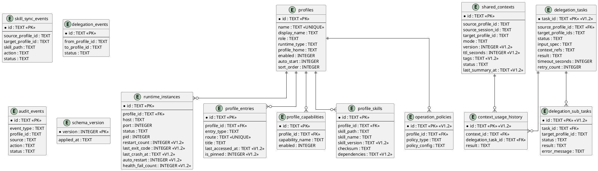

# Hermes Desktop V1.2 — 技术实现方案

**文档版本**: v1.0  
**创建日期**: 2026-05-16  
**基线**: V1.1 → V1.2  
**对应规格**: `.codeartsdoer/specs/hermes-v1.2/spec.md`

---

# 1. 实现模型

## 1.1 上下文视图

V1.2 在 V1.1 已有的三层进程隔离（Main / Preload / Renderer）基础上，新增 **6 个功能包** 的横切关注点。下图展示 V1.2 增量模块与现有模块的依赖关系：

```plantuml
@startuml
skinparam componentStyle rectangle

package "Main Process (V1.2 增量)" {
  component [PolicyEngine] as PE
  component [MigrationRunner] as MR
  component [DbGovernance] as DBG
  component [DelegationOrchestrator] as DO
  component [DeployManager] as DM
  component [RuntimeReconciler] as RR
}

package "Main Process (V1.1 已有)" {
  component [ProfileRuntimeManager] as PRM
  component [GatewaySupervisor] as GS
  component [ProfileRuntimeDB] as DB
  component [ConfigImporter] as CI
  component [DelegationCapability] as DC
  component [SkillSyncCapability] as SSC
  component [SessionShareCapability] as SSH
  component [WebOperatorProfileBridge] as WOPB
  component [BrowserViewManager] as BVM
}

package "Preload (V1.2 增量)" {
  component [PolicyAPI] as PA
  component [DbGovernanceAPI] as DGA
  component [DelegationTaskAPI] as DTA
  component [DeployAPI] as DA
  component [ObservabilityAPI] as OA
}

package "Renderer (V1.2 增量)" {
  component [SkillMatrixView] as SMV
  component [DelegationPanel] as DP
  component [AuditQueryPage] as AQP
  component [ObservabilityPage] as OBP
  component [ImportDiffDialog] as IDD
  component [LogViewer] as LV
  component [ActionPlanPreview] as APP
  component [WebTaskReplay] as WTR
  component [PolicyConfigPage] as PCP
  component [DeployWizard] as DW
}

PE --> DB : 读写策略
PE --> WOPB : 拦截校验
PE --> DC : 委托白名单
PE --> SSC : 技能安装策略
MR --> DB : 迁移执行
DBG --> DB : 备份/恢复/清理
DBG --> MR : 版本管理
DO --> DC : 委托编排
DO --> DB : 任务持久化
DO --> SSH : context_refs 解析
DM --> DB : 部署记录
RR --> PRM : 状态恢复
RR --> DB : 实例扫描

DP --> DTA : IPC
AQP --> PA : IPC
OBP --> OA : IPC
PCP --> PA : IPC
SMV --> PA : IPC
DW --> DA : IPC
@enduml
```



## 1.2 服务/组件总体架构

### 1.2.1 架构分层

| 层 | 职责 | V1.2 新增/变更模块 |
|---|---|---|
| **Renderer (React)** | UI 呈现、用户交互 | SkillMatrixView, DelegationPanel, AuditQueryPage, ObservabilityPage, ImportDiffDialog, LogViewer, ActionPlanPreview, WebTaskReplay, PolicyConfigPage, DeployWizard, StatusBadge(增强), ProfileEntryList(增强), AIOSHomeDashboard(增强) |
| **Preload (contextBridge)** | IPC 安全桥接 | policyApi, dbGovernanceApi, delegationTaskApi, deployApi, observabilityApi (扩展 profileRuntimeApi / profileEntryApi) |
| **Main Process** | 业务逻辑、进程管理、DB 访问 | PolicyEngine, MigrationRunner, DbGovernance, DelegationOrchestrator, RuntimeReconciler, DeployManager, GatewaySupervisor(增强), ProfileRuntimeManager(增强), ConfigImporter(增强) |
| **Shared** | 类型/常量/错误码契约 | profile-runtime-contract.ts(扩展), profile-runtime-errors.ts(扩展), browser-contract.ts(扩展) |
| **SQLite (profile-runtime.db)** | 持久化 | delegation_tasks(新), operation_policies(新), runtime_instances(扩展), shared_contexts(扩展), profile_skills(扩展) |

### 1.2.2 关键架构约束

1. **单 BrowserWindow 多 Screen 路由**：所有 V1.2 页面作为 Screen 组件挂入 `src/renderer/src/screens/` 下的路由
2. **Renderer 无 Node.js**：所有 DB / 文件系统 / 进程操作经 Preload → Main IPC
3. **SQLite 仅 Main Process 访问**：MigrationRunner / DbGovernance / PolicyEngine 均在 Main Process 内执行
4. **Gateway 进程由 Main Process spawn/kill**：RuntimeReconciler 在 App 启动时扫描并恢复状态
5. **Web Operator 使用 WebContentsView + 独立 Partition**：V1.2 从固定 partition 改为 `persist:profile-{profileId}` 动态 partition
6. **IPC 契约 additive-only**：所有新增 IPC channel 不修改现有 channel 签名，仅新增

### 1.2.3 数据流概览

```
用户操作 → Renderer Screen → Preload contextBridge → ipcMain.handle → Main Process Capability → profile-runtime.db
                                                                          ↓
                                                                    Gateway 进程 / 文件系统
                                                                          ↓
                                                          ipcMain.emit (推送) → Preload → Renderer 状态更新
```

- **请求-响应流**：大部分操作（启停、查询、配置）走 `ipcMain.handle` 双向 IPC
- **事件推送流**：Health 状态变更、日志实时 tail、委托状态流转走 `ipcMain.emit` → `ipcRenderer.on` 推送
- **DB 写入流**：所有 DB 写入在 Main Process 内同步执行（better-sqlite3 同步 API），写入后同步更新内存缓存并推送 UI

## 1.3 实现设计文档

### 1.3.1 Phase 1: Runtime 稳定性（FR-RT-001 ~ FR-RT-008）

#### 架构变更

增强 `GatewaySupervisor` 和 `ProfileRuntimeManager`，新增 `RuntimeReconciler` 模块。

#### 新增文件

| 文件路径 | 职责 |
|---------|------|
| `src/main/runtime-reconciler.ts` | App 重启后扫描 runtime_instances 并恢复/校正状态 |
| `src/main/gateway-log-collector.ts` | 收集 Gateway stdout/stderr 日志，支持实时 tail |

#### 修改文件

| 文件路径 | 变更内容 |
|---------|---------|
| `src/main/gateway-supervisor.ts` | (1) 增加 `auto_restart` 逻辑：连续失败 ≥3 且 auto_restart=true 时自动重启，超过 3 次停止；(2) 健康失败时递增 `health_fail_count`；(3) 记录 `last_exit_code`/`last_crash_at`/`restart_count` |
| `src/main/profile-runtime-manager.ts` | (1) 启动前端口冲突检测；(2) 启动超时检测（setTimeout + kill）；(3) 监听子进程 exit 事件处理崩溃；(4) App 启动时调用 `RuntimeReconciler.reconcile()` |
| `src/main/profile-runtime-db.ts` | `createTables` 中 runtime_instances 新增 5 个字段；新增 `migrateToV2()` |
| `src/shared/profile-runtime/profile-runtime-contract.ts` | `RuntimeInstanceRecord` 新增 5 个字段类型；`ProfileGatewayState` 新增字段；新增 `RuntimeReconcileResult` 类型 |
| `src/shared/profile-runtime/profile-runtime-errors.ts` | 新增 `PROFILE_PORT_CONFLICT` 已有，新增 `PROFILE_STARTUP_TIMEOUT` |
| `src/preload/profile-runtime-api.ts` | 新增 `getGatewayLogs`, `onRuntimeStatusChanged` channel |
| `src/main/profile-runtime-ipc.ts` | 新增对应 IPC handler |
| `src/renderer/src/screens/ProfileRuntime/ProfileRuntimeScreen.tsx` | 增强 StatusBadge（failed 红色 + 错误原因）；新增 LogViewer 子面板 |

#### 关键接口设计

```typescript
// runtime-reconciler.ts
export interface RuntimeReconcileResult {
  reconciled: number;
  restoredToRunning: number;
  markedAsStopped: number;
  markedAsFailed: number;
}

export class RuntimeReconciler {
  /** App 启动后调用，扫描所有 runtime_instance 并校正状态 */
  static async reconcile(): Promise<RuntimeReconcileResult>;
  /** 检查指定端口是否被占用 */
  static isPortOccupied(port: number): Promise<boolean>;
}

// gateway-supervisor.ts 增强
export function startSupervision(profileId: string, options?: {
  autoRestart?: boolean;
  maxRestartCount?: number; // 默认 3
  startupTimeoutMs?: number; // 默认 30000
}): void;

// gateway-log-collector.ts
export interface LogEntry {
  timestamp: string;
  level: "stdout" | "stderr";
  message: string;
}

export class GatewayLogCollector {
  static startCollecting(profileId: string, pid: number): void;
  static stopCollecting(profileId: string): void;
  static getHistory(profileId: string, options?: { limit?: number; level?: string }): LogEntry[];
  static onNewLog(profileId: string, callback: (entry: LogEntry) => void): () => void;
}
```

#### 数据模型变更

`runtime_instances` 表新增字段（Migration V2）：

```sql
ALTER TABLE runtime_instances ADD COLUMN restart_count INTEGER NOT NULL DEFAULT 0;
ALTER TABLE runtime_instances ADD COLUMN last_exit_code INTEGER;
ALTER TABLE runtime_instances ADD COLUMN last_crash_at TEXT;
ALTER TABLE runtime_instances ADD COLUMN auto_restart INTEGER NOT NULL DEFAULT 0;
ALTER TABLE runtime_instances ADD COLUMN health_fail_count INTEGER NOT NULL DEFAULT 0;
```

#### IPC Channel 新增

| Channel | 方向 | 参数 | 返回 |
|---------|------|------|------|
| `profile-runtime:getGatewayLogs` | R→M | `{ profileId, options?: { limit?, level? } }` | `LogEntry[]` |
| `profile-runtime:onRuntimeStatusChanged` | M→R (push) | `ProfileGatewayState` | — |
| `profile-runtime:setAutoRestart` | R→M | `{ profileId, enabled: boolean }` | `{ ok: boolean }` |

---

### 1.3.2 Phase 2: SQLite Governance（FR-DB-001 ~ FR-DB-008）

#### 架构变更

增强 `ProfileRuntimeDB` 引入 `MigrationRunner`，增强 `ConfigImporter` 引入 diff 计算与回滚，新增 `DbGovernance` 模块。

#### 新增文件

| 文件路径 | 职责 |
|---------|------|
| `src/main/migration-runner.ts` | 管理编号化 migration 脚本执行，支持回滚 |
| `src/main/db-governance.ts` | 备份/恢复/校验/孤立实例清理 |
| `src/main/migrations/v2.ts` | V1→V2 迁移脚本 |

#### 修改文件

| 文件路径 | 变更内容 |
|---------|---------|
| `src/main/profile-runtime-db.ts` | (1) `initProfileRuntimeDb` 调用 `MigrationRunner.run()`；(2) 新增 `deleteProfile()` 级联删除；(3) 新增 `disableProfile()`；(4) 新增 `cleanOrphanInstances()` |
| `src/main/config-importer.ts` | (1) 新增 `computeConfigDiff()` 计算 YAML diff；(2) 新增 `applyImportWithBackup()` 带预备份导入；(3) 新增 `rollbackImport()` 从备份恢复 |
| `src/shared/profile-runtime/profile-runtime-contract.ts` | 新增 `ConfigDiffResult`, `DbBackupResult`, `DbRestoreResult`, `OrphanCleanupResult` 类型；扩展 `ProfileRuntimeAPI` |
| `src/preload/profile-runtime-api.ts` | 新增 `backupDb`, `restoreDb`, `computeImportDiff`, `rollbackImport`, `deleteProfile`, `disableProfile`, `cleanOrphanInstances` |
| `src/main/profile-runtime-ipc.ts` | 新增对应 IPC handler |
| `src/renderer/src/screens/ProfileRuntime/ProfileRuntimeScreen.tsx` | 新增 ImportDiffDialog, DbBackupRestorePanel 子面板 |

#### 关键接口设计

```typescript
// migration-runner.ts
export interface MigrationRecord {
  version: number;
  appliedAt: string;
  description: string;
}

export class MigrationRunner {
  static run(db: Database.Database): void;
  static getAppliedVersions(): MigrationRecord[];
  static rollback(db: Database.Database, targetVersion: number): void;
}

// db-governance.ts
export interface DbBackupResult {
  ok: boolean;
  backupPath: string;
  checksum: string;
  fileSize: number;
  errorCode?: string;
}

export interface DbRestoreResult {
  ok: boolean;
  restoredFrom: string;
  reinitializedState: boolean;
  errorCode?: string;
}

export interface OrphanCleanupResult {
  ok: boolean;
  cleanedCount: number;
  orphanIds: string[];
}

export class DbGovernance {
  static backup(): DbBackupResult;
  static restore(backupPath: string): DbRestoreResult;
  static verifyChecksum(backupPath: string, expectedChecksum: string): boolean;
  static cleanOrphanInstances(): OrphanCleanupResult;
}

// config-importer.ts 增强
export interface ConfigDiffItem {
  profileName: string;
  changeType: "added" | "modified" | "deleted";
  fields?: Array<{ field: string; oldValue: unknown; newValue: unknown }>;
  isRunning?: boolean; // 标记正在运行的 Profile 被删除
}

export interface ConfigDiffResult {
  diffs: ConfigDiffItem[];
  hasDestructiveChanges: boolean; // 是否有删除运行中 Profile 等破坏性变更
}

export function computeConfigDiff(yamlContent: string): ConfigDiffResult;
export function applyImportWithBackup(yamlContent: string): ImportRuntimeConfigResult;
export function rollbackImport(): { ok: boolean; errorCode?: string };
```

#### 数据模型变更

`schema_version` 表已存在（V1.1 已创建），V2 migration 新增字段见 Phase 1。新增 `operation_policies` 表（见 Phase 6）。

#### IPC Channel 新增

| Channel | 方向 | 参数 | 返回 |
|---------|------|------|------|
| `profile-runtime:backupDb` | R→M | — | `DbBackupResult` |
| `profile-runtime:restoreDb` | R→M | `{ backupPath }` | `DbRestoreResult` |
| `profile-runtime:computeImportDiff` | R→M | `{ yamlContent }` | `ConfigDiffResult` |
| `profile-runtime:applyImportWithBackup` | R→M | `{ yamlContent }` | `ImportRuntimeConfigResult` |
| `profile-runtime:rollbackImport` | R→M | — | `{ ok, errorCode? }` |
| `profile-runtime:deleteProfile` | R→M | `{ profileId, deleteHome?: boolean }` | `{ ok }` |
| `profile-runtime:disableProfile` | R→M | `{ profileId, disabled: boolean }` | `{ ok }` |
| `profile-runtime:cleanOrphanInstances` | R→M | — | `OrphanCleanupResult` |
| `profile-runtime:getMigrationVersions` | R→M | — | `MigrationRecord[]` |

---

### 1.3.3 Phase 3: Profile Entry UX（FR-UX-001 ~ FR-UX-008）

#### 架构变更

增强 Renderer 端 ProfileEntry 页面和 AIOSWorkspace 首页，增加 Preload IPC 获取最近访问/置顶/搜索数据。

#### 新增文件

| 文件路径 | 职责 |
|---------|------|
| `src/renderer/src/screens/AIOSWorkspace/AIOSHomeDashboard.tsx` | AI-OS 首页聚合看板（Profile 状态卡片 + 最近任务 + 最近委托 + 待确认 + Web Operator 快捷入口） |
| `src/renderer/src/screens/ProfileWorkspace/ProfileEntryList.tsx` | Profile 列表（最近访问/置顶/搜索/状态徽章/快捷操作） |
| `src/renderer/src/screens/ProfileWorkspace/SessionResumeDialog.tsx` | 上次会话恢复提示对话框 |

#### 修改文件

| 文件路径 | 变更内容 |
|---------|---------|
| `src/renderer/src/screens/AIOSWorkspace/AIOSWorkspaceScreen.tsx` | 嵌入 AIOSHomeDashboard 替换原简单状态列表 |
| `src/renderer/src/screens/ProfileWorkspace/ProfileWorkspaceScreen.tsx` | 嵌入 ProfileEntryList + SessionResumeDialog |
| `src/renderer/src/screens/ProfileRuntime/ProfileRuntimeScreen.tsx` | 增强 StatusBadge 组件 |
| `src/shared/profile-runtime/profile-runtime-contract.ts` | 新增 `ProfileEntryWithStatus`, `RecentProfileResult`, `ProfileSearchResult` 类型；扩展 `ProfileEntryAPI` |
| `src/main/profile-runtime-db.ts` | 新增 `getRecentProfiles()`, `searchProfiles()`, `toggleProfilePin()`, `updateLastAccessedAt()` |
| `src/main/profile-runtime-ipc.ts` | 新增 IPC handler |
| `src/preload/profile-entry-api.ts` | 新增 `getRecentProfiles`, `searchProfiles`, `togglePin`, `getLastSession` |

#### 关键接口设计

```typescript
// ProfileEntryWithStatus
export interface ProfileEntryWithStatus extends ProfileEntrySummary {
  runtimeStatus: ProfileRuntimeStatus;
  lastAccessedAt: string | null;
  isPinned: boolean;
  lastSessionId: string | null;
  lastSessionTitle: string | null;
  healthFailCount: number;
  autoRestart: boolean;
}

export interface RecentProfileResult {
  profiles: ProfileEntryWithStatus[];
  totalCount: number;
}

// 新增 ProfileEntryAPI 方法
export interface ProfileEntryAPI {
  // ... 已有方法
  getRecentProfiles(limit?: number): Promise<RecentProfileResult>;
  searchProfiles(query: string): Promise<ProfileEntryWithStatus[]>;
  togglePin(profileId: string, pinned: boolean): Promise<{ ok: boolean }>;
  getLastSession(profileId: string): Promise<{ sessionId: string; title: string | null } | null>;
}
```

#### profile_entries 表新增字段

```sql
ALTER TABLE profile_entries ADD COLUMN last_accessed_at TEXT;
ALTER TABLE profile_entries ADD COLUMN is_pinned INTEGER NOT NULL DEFAULT 0;
```

#### IPC Channel 新增

| Channel | 方向 | 参数 | 返回 |
|---------|------|------|------|
| `profile-entry:getRecentProfiles` | R→M | `{ limit?: number }` | `RecentProfileResult` |
| `profile-entry:searchProfiles` | R→M | `{ query }` | `ProfileEntryWithStatus[]` |
| `profile-entry:togglePin` | R→M | `{ profileId, pinned }` | `{ ok }` |
| `profile-entry:getLastSession` | R→M | `{ profileId }` | `{ sessionId, title? } \| null` |
| `profile-entry:updateLastAccessed` | R→M | `{ profileId }` | `{ ok }` |

---

### 1.3.4 Phase 4: Delegation Orchestration（FR-DLG-001 ~ FR-DLG-009）

#### 架构变更

将 `DelegationCapability` 从单次调用增强为完整的任务编排器，支持 task_id 生命周期、多 Profile 并行分发、结果合并、超时/重试/取消。

#### 新增文件

| 文件路径 | 职责 |
|---------|------|
| `src/main/delegation-orchestrator.ts` | 委托任务编排：创建/分发/合并/超时/重试/取消 |
| `src/renderer/src/screens/ProfileWorkspace/DelegationPanel.tsx` | 委托面板：任务列表 + 结果合并 + 审计时间线 |
| `src/renderer/src/screens/ProfileWorkspace/DelegationTaskDetail.tsx` | 委托任务详情：sub-task 状态 + 结果 + 重试/取消操作 |

#### 修改文件

| 文件路径 | 变更内容 |
|---------|---------|
| `src/main/delegation-capability.ts` | 改为委托 `DelegationOrchestrator`，保留 `invoke` 兼容接口 |
| `src/main/profile-runtime-db.ts` | 新增 `delegation_tasks` 表 CRUD；新增 `insertDelegationTask()`, `updateDelegationTaskStatus()`, `getDelegationTask()`, `listDelegationTasks()` |
| `src/shared/profile-runtime/profile-runtime-contract.ts` | 新增 `DelegationTaskStatus` 枚举、`DelegationTaskRecord`、`DelegationTaskSummary`、`CreateDelegationTaskRequest`、`DelegationTaskResult` 类型；扩展 `ProfileRuntimeAPI` |
| `src/shared/profile-runtime/profile-runtime-errors.ts` | 新增 `DELEGATION_NOT_ALLOWED`, `DELEGATION_TASK_TIMEOUT`, `DELEGATION_TARGET_NOT_RUNNING` |
| `src/preload/profile-runtime-api.ts` | 新增 `createDelegationTask`, `cancelDelegationTask`, `retryDelegationTask`, `listDelegationTasks`, `getDelegationTask` |
| `src/main/profile-runtime-ipc.ts` | 新增 IPC handler |
| `src/renderer/src/screens/ProfileWorkspace/ProfileWorkspaceScreen.tsx` | 嵌入 DelegationPanel |

#### 关键接口设计

```typescript
// delegation-orchestrator.ts
export type DelegationTaskStatus =
  | "created" | "dispatching" | "running"
  | "succeeded" | "failed" | "timeout" | "cancelled";

export interface DelegationTaskRecord {
  taskId: string;
  sourceProfileId: string;
  targetProfileIds: string[];
  status: DelegationTaskStatus;
  inputSpec: Record<string, unknown>;
  contextRefs: string[];
  result: Record<string, unknown> | null;
  timeoutSeconds: number;
  retryCount: number;
  createdAt: string;
  dispatchedAt: string | null;
  completedAt: string | null;
  subTasks: DelegationSubTask[];
}

export interface DelegationSubTask {
  targetProfileId: string;
  status: DelegationTaskStatus;
  result: unknown | null;
  error: string | null;
  startedAt: string | null;
  completedAt: string | null;
}

export interface CreateDelegationTaskRequest {
  sourceProfileId: string;
  targetProfileIds: string[];
  inputSpec: Record<string, unknown>;
  contextRefs?: string[];
  timeoutSeconds?: number; // 默认 60
}

export class DelegationOrchestrator {
  static createTask(request: CreateDelegationTaskRequest): DelegationTaskRecord;
  static async dispatch(taskId: string): Promise<DelegationTaskRecord>;
  static cancelTask(taskId: string): DelegationTaskRecord;
  static retryTask(taskId: string): DelegationTaskRecord;
  static getTask(taskId: string): DelegationTaskRecord | null;
  static listTasks(profileId?: string, status?: DelegationTaskStatus): DelegationTaskRecord[];
}
```

#### 数据模型变更

新增 `delegation_tasks` 表：

```sql
CREATE TABLE IF NOT EXISTS delegation_tasks (
  task_id TEXT PRIMARY KEY,
  source_profile_id TEXT NOT NULL,
  target_profile_ids TEXT NOT NULL, -- JSON array
  status TEXT NOT NULL CHECK(status IN ('created','dispatching','running','succeeded','failed','timeout','cancelled')),
  input_spec TEXT NOT NULL,         -- JSON object
  context_refs TEXT NOT NULL DEFAULT '[]', -- JSON array
  result TEXT,                      -- JSON object
  timeout_seconds INTEGER NOT NULL DEFAULT 60,
  retry_count INTEGER NOT NULL DEFAULT 0,
  created_at TEXT NOT NULL,
  dispatched_at TEXT,
  completed_at TEXT,
  FOREIGN KEY(source_profile_id) REFERENCES profiles(id) ON DELETE CASCADE
);

CREATE TABLE IF NOT EXISTS delegation_sub_tasks (
  id TEXT PRIMARY KEY,
  task_id TEXT NOT NULL,
  target_profile_id TEXT NOT NULL,
  status TEXT NOT NULL,
  result TEXT,
  error_message TEXT,
  started_at TEXT,
  completed_at TEXT,
  FOREIGN KEY(task_id) REFERENCES delegation_tasks(task_id) ON DELETE CASCADE
);
```

#### IPC Channel 新增

| Channel | 方向 | 参数 | 返回 |
|---------|------|------|------|
| `profile-runtime:createDelegationTask` | R→M | `CreateDelegationTaskRequest` | `DelegationTaskRecord` |
| `profile-runtime:cancelDelegationTask` | R→M | `{ taskId }` | `DelegationTaskRecord` |
| `profile-runtime:retryDelegationTask` | R→M | `{ taskId }` | `DelegationTaskRecord` |
| `profile-runtime:listDelegationTasks` | R→M | `{ profileId?, status? }` | `DelegationTaskRecord[]` |
| `profile-runtime:getDelegationTask` | R→M | `{ taskId }` | `DelegationTaskRecord \| null` |
| `profile-runtime:onDelegationStatusChanged` | M→R (push) | `DelegationTaskRecord` | — |

---

### 1.3.5 Phase 5: Skill/Context Governance（FR-SK-001~005, FR-CTX-001~006）

#### 架构变更

增强 `SkillSyncCapability` 支持版本/校验和/依赖/矩阵/回滚，增强 `SessionShareCapability` 支持 version/TTL/tags/status/usage/revoke。

#### 新增文件

| 文件路径 | 职责 |
|---------|------|
| `src/renderer/src/screens/ProfileRuntime/SkillMatrixView.tsx` | Profile × Skills 二维矩阵视图 |
| `src/renderer/src/screens/ProfileWorkspace/ContextGovernancePanel.tsx` | 上下文治理面板：版本/TTL/标签/摘要/使用历史/撤销 |

#### 修改文件

| 文件路径 | 变更内容 |
|---------|---------|
| `src/main/skill-sync-capability.ts` | (1) 新增 `previewSkillCopy()` 返回版本/校验和/依赖预览；(2) 新增 `executeSkillCopyWithRollback()` 创建回滚点后复制；(3) 新增 `rollbackSkillCopy()`；(4) 新增 `installBundledSkill()` 依赖解析 |
| `src/main/session-share-capability.ts` | (1) 新增 version/TTL/tags 参数；(2) 新增 `revokeContext()`；(3) 新增 `regenerateSummary()`；(4) 新增 `trackContextUsage()`；(5) TTL 过期检测 |
| `src/main/profile-runtime-db.ts` | (1) `profile_skills` 新增 3 字段；(2) `shared_contexts` 新增 5 字段；(3) 新增 `getSkillMatrix()`, `getContextUsageHistory()`, `revokeContext()`, `updateContextStatus()` |
| `src/shared/profile-runtime/profile-runtime-contract.ts` | 新增 `SkillCopyPreview`, `SkillMatrixEntry`, `ContextGovernanceInfo`, `ContextUsageRecord` 类型 |
| `src/preload/profile-runtime-api.ts` | 新增 `previewSkillCopy`, `rollbackSkillCopy`, `installBundledSkill`, `getSkillMatrix`, `revokeContext`, `regenerateContextSummary`, `getContextUsageHistory` |
| `src/main/profile-runtime-ipc.ts` | 新增 IPC handler |

#### 关键接口设计

```typescript
// Skill Governance
export interface SkillCopyPreview {
  skillPath: string;
  skillVersion: string;
  sourceChecksum: string;
  targetChecksum: string | null;
  hasConflict: boolean;
  dependencies: Array<{ name: string; version: string; resolved: boolean }>;
}

export interface SkillMatrixEntry {
  profileId: string;
  profileName: string;
  skills: Array<{
    skillPath: string;
    skillName: string;
    skillVersion: string;
    checksum: string;
    status: "installed" | "outdated" | "corrupted";
  }>;
}

// Context Governance
export type ContextStatus = "active" | "expired" | "revoked";

export interface ContextGovernanceInfo {
  id: string;
  version: number;
  ttlSeconds: number | null;
  tags: string[];
  status: ContextStatus;
  lastSummaryAt: string | null;
  expiresAt: string | null;
}

export interface ContextUsageRecord {
  delegationTaskId: string;
  referencedAt: string;
  result: "used" | "expired" | "revoked";
}
```

#### 数据模型变更

```sql
-- profile_skills 新增字段
ALTER TABLE profile_skills ADD COLUMN skill_version TEXT NOT NULL DEFAULT '1.0.0';
ALTER TABLE profile_skills ADD COLUMN dependencies TEXT NOT NULL DEFAULT '[]';

-- shared_contexts 新增字段
ALTER TABLE shared_contexts ADD COLUMN version INTEGER NOT NULL DEFAULT 1;
ALTER TABLE shared_contexts ADD COLUMN ttl_seconds INTEGER;
ALTER TABLE shared_contexts ADD COLUMN tags TEXT NOT NULL DEFAULT '[]';
ALTER TABLE shared_contexts ADD COLUMN last_summary_at TEXT;

-- 新增 context_usage_history 表
CREATE TABLE IF NOT EXISTS context_usage_history (
  id TEXT PRIMARY KEY,
  context_id TEXT NOT NULL,
  delegation_task_id TEXT NOT NULL,
  referenced_at TEXT NOT NULL,
  result TEXT NOT NULL, -- 'used' | 'expired' | 'revoked'
  FOREIGN KEY(context_id) REFERENCES shared_contexts(id) ON DELETE CASCADE,
  FOREIGN KEY(delegation_task_id) REFERENCES delegation_tasks(task_id) ON DELETE CASCADE
);
```

#### IPC Channel 新增

| Channel | 方向 | 参数 | 返回 |
|---------|------|------|------|
| `profile-runtime:previewSkillCopy` | R→M | `CopySkillRequest` | `SkillCopyPreview` |
| `profile-runtime:rollbackSkillCopy` | R→M | `{ syncEventId }` | `{ ok }` |
| `profile-runtime:installBundledSkill` | R→M | `{ archivePath, targetProfileId }` | `CopySkillResult[]` |
| `profile-runtime:getSkillMatrix` | R→M | — | `SkillMatrixEntry[]` |
| `profile-runtime:revokeContext` | R→M | `{ contextId }` | `{ ok }` |
| `profile-runtime:regenerateContextSummary` | R→M | `{ contextId }` | `{ ok, summary? }` |
| `profile-runtime:getContextUsageHistory` | R→M | `{ contextId }` | `ContextUsageRecord[]` |

---

### 1.3.6 Phase 6: Web Operator 深度集成 + Security + Observability + Audit + Deployment

#### 6A. Web Operator Profile-Aware（FR-WO-001 ~ FR-WO-008）

##### 新增文件

| 文件路径 | 职责 |
|---------|------|
| `src/main/browser/browser-action-recorder.ts` | 记录 DOM 快照/截图/CSS selector，存储为可回放格式 |
| `src/renderer/src/screens/WebOperator/ActionPlanPreview.tsx` | 操作计划预览对话框 |
| `src/renderer/src/screens/WebOperator/SensitiveActionDialog.tsx` | 敏感操作确认对话框 |
| `src/renderer/src/screens/WebOperator/WebTaskReplay.tsx` | Web 任务回放组件 |
| `src/renderer/src/screens/WebOperator/DomHistoryPanel.tsx` | DOM/截图历史浏览面板 |

##### 修改文件

| 文件路径 | 变更内容 |
|---------|---------|
| `src/main/browser/browser-view-manager.ts` | `createView` 接受 `profileId` 参数，partition 改为 `persist:profile-{profileId}` |
| `src/main/browser/browser-types.ts` | 新增 `BROWSER_PARTITION_PROFILE` 常量 |
| `src/main/web-operator-profile-bridge.ts` | (1) 新增 `createActionPlan()` 返回操作序列；(2) 新增 `executePlanWithConfirm()` 逐步执行+敏感确认；(3) 新增 `recordAction()` 记录快照/selector；(4) 新增 `replayTask()` 回放 |
| `src/main/browser/browser-security.ts` | 域名白名单校验逻辑 |
| `src/main/browser/browser-audit.ts` | 增强审计记录含 sourceProfile |
| `src/shared/browser/browser-contract.ts` | 新增 `BrowserToolRequest` (含 profileId/source/toolName/args/requireConfirm), `ActionPlan`, `ActionStep`, `WebTaskRecording` 类型 |
| `src/shared/profile-runtime/profile-runtime-errors.ts` | 新增 `DOMAIN_NOT_ALLOWED`, `TOOL_NOT_ALLOWED`, `SKILL_INSTALL_NOT_ALLOWED`, `POLICY_DENIED` |

##### 关键接口设计

```typescript
// browser-action-recorder.ts
export interface ActionStep {
  index: number;
  toolName: string;
  args: Record<string, unknown>;
  requireConfirm: boolean;
  selector?: string;
  domSnapshot?: string;
  screenshotPath?: string;
  executedAt?: string;
  result?: unknown;
}

export interface ActionPlan {
  taskId: string;
  profileId: string;
  steps: ActionStep[];
  createdAt: string;
}

export interface WebTaskRecording {
  taskId: string;
  profileId: string;
  url: string;
  steps: ActionStep[];
  startedAt: string;
  completedAt: string;
}

export class BrowserActionRecorder {
  static recordStep(profileId: string, step: ActionStep): void;
  static getRecording(taskId: string): WebTaskRecording | null;
  static async replayTask(taskId: string, onStep?: (step: ActionStep, index: number) => Promise<boolean>): Promise<void>;
  static getDomHistory(profileId: string, limit?: number): ActionStep[];
}
```

##### Browser Partition 变更

```typescript
// browser-view-manager.ts 增强
async createView(url: string, profileId?: string): Promise<void> {
  const partition = profileId
    ? `persist:profile-${profileId}`
    : BROWSER_PARTITION; // fallback 默认 partition
  const ses = session.fromPartition(partition);
  // ...
}
```

#### 6B. Security & Policy（FR-SEC-007 ~ FR-SEC-013）

##### 新增文件

| 文件路径 | 职责 |
|---------|------|
| `src/main/policy-engine.ts` | 统一策略评估引擎：域名/工具/技能/委托白名单 + 敏感操作策略 |
| `src/renderer/src/screens/ProfileRuntime/PolicyConfigPage.tsx` | 策略配置 UI |

##### 关键接口设计

```typescript
// policy-engine.ts
export type PolicyType = "domain_allowlist" | "tool_allowlist" | "skill_install" | "delegation_allowlist" | "sensitive_action";

export interface OperationPolicy {
  profileId: string;
  policyType: PolicyType;
  policyConfig: {
    allowlist?: string[];
    denylist?: string[];
    allowBundledOnly?: boolean; // skill_install 策略
    sensitiveActions?: string[]; // sensitive_action 策略
  };
  createdAt: string;
  updatedAt: string;
}

export type PolicyDecision = "allow" | "deny" | "confirm_required";

export class PolicyEngine {
  static evaluate(profileId: string, policyType: PolicyType, action: string): PolicyDecision;
  static isDomainAllowed(profileId: string, domain: string): boolean;
  static isToolAllowed(profileId: string, toolName: string): boolean;
  static isSkillInstallAllowed(profileId: string, skillSource: string): boolean;
  static isDelegationAllowed(profileId: string, targetProfileId: string): boolean;
  static isSensitiveAction(profileId: string, action: string): boolean;
  static getConfig(profileId: string, policyType: PolicyType): OperationPolicy | null;
  static setConfig(profileId: string, policyType: PolicyType, config: OperationPolicy['policyConfig']): void;
}
```

##### 数据模型变更

新增 `operation_policies` 表：

```sql
CREATE TABLE IF NOT EXISTS operation_policies (
  id TEXT PRIMARY KEY,
  profile_id TEXT NOT NULL,
  policy_type TEXT NOT NULL CHECK(policy_type IN ('domain_allowlist','tool_allowlist','skill_install','delegation_allowlist','sensitive_action')),
  policy_config TEXT NOT NULL, -- JSON object
  created_at TEXT NOT NULL,
  updated_at TEXT NOT NULL,
  UNIQUE(profile_id, policy_type),
  FOREIGN KEY(profile_id) REFERENCES profiles(id) ON DELETE CASCADE
);
```

#### 6C. Audit Query UI（FR-AUD-001 ~ FR-AUD-003）

##### 新增文件

| 文件路径 | 职责 |
|---------|------|
| `src/renderer/src/screens/AIOSWorkspace/AuditQueryPage.tsx` | 审计查询页面：筛选+分页表格+导出 |

##### 修改文件

| 文件路径 | 变更内容 |
|---------|---------|
| `src/main/profile-runtime-db.ts` | 新增 `queryAuditEvents()` 支持 time range/profile/event_type/actor/result 筛选 + 分页 + 排序 |
| `src/shared/profile-runtime/profile-runtime-contract.ts` | 扩展 `AuditEventFilter` 增加 `timeRange/actor/result/sortBy/sortOrder` 字段；新增 `AuditQueryResult` |
| `src/preload/profile-runtime-api.ts` | 新增 `queryAuditEvents`, `exportAuditEvents` |

#### 6D. Observability（FR-OBS-005 ~ FR-OBS-009）

##### 新增文件

| 文件路径 | 职责 |
|---------|------|
| `src/renderer/src/screens/ProfileRuntime/ObservabilityPage.tsx` | 可观测性页面：7 个面板 |
| `src/renderer/src/screens/ProfileRuntime/panels/GatewayLogsPanel.tsx` | Gateway 日志面板 |
| `src/renderer/src/screens/ProfileRuntime/panels/RuntimeEventsPanel.tsx` | Runtime 事件时间线面板 |
| `src/renderer/src/screens/ProfileRuntime/panels/DelegationTimelinePanel.tsx` | 委托时间线面板 |
| `src/renderer/src/screens/ProfileRuntime/panels/WebOperatorAuditPanel.tsx` | Web Operator 审计面板 |
| `src/renderer/src/screens/ProfileRuntime/panels/SkillSyncHistoryPanel.tsx` | 技能同步历史面板 |
| `src/renderer/src/screens/ProfileRuntime/panels/ContextShareHistoryPanel.tsx` | 上下文共享历史面板 |
| `src/renderer/src/screens/ProfileRuntime/panels/DiagnosticsPanel.tsx` | 诊断面板（CPU/内存/磁盘/进程/DB 统计） |

##### 修改文件

| 文件路径 | 变更内容 |
|---------|---------|
| `src/main/profile-runtime-ipc.ts` | 新增 `getDiagnostics`, `getRuntimeEvents`, `getSkillSyncHistory`, `getContextShareHistory` IPC handler |
| `src/preload/profile-runtime-api.ts` | 新增对应方法 |

#### 6E. Windows Deployment（FR-DEP-001 ~ FR-DEP-007）

##### 新增文件

| 文件路径 | 职责 |
|---------|------|
| `src/main/deploy-manager.ts` | 一键部署编排：依赖检测→下载→安装→配置→启动 |
| `src/renderer/src/screens/AIOSWorkspace/DeployWizard.tsx` | 部署向导 UI |
| `src/renderer/src/screens/AIOSWorkspace/InstallLogViewer.tsx` | 安装日志查看器 |

##### 关键接口设计

```typescript
// deploy-manager.ts
export interface DeployStep {
  name: string;
  status: "pending" | "running" | "succeeded" | "failed";
  message?: string;
}

export interface DependencyCheckResult {
  dependencies: Array<{ name: string; installed: boolean; version?: string; required: boolean }>;
  allRequiredMet: boolean;
}

export class DeployManager {
  static checkDependencies(): DependencyCheckResult;
  static async downloadFromGit(repoUrl: string, auth?: { username: string; token: string }): Promise<{ ok: boolean; path: string }>;
  static async install(installDir: string): Promise<{ ok: boolean }>;
  static async oneClickDeploy(config: { repoUrl: string; auth?: { username: string; token: string }; installDir: string }): Promise<DeployStep[]>;
  static async checkForUpdates(repoUrl: string): Promise<{ hasUpdate: boolean; latestVersion?: string }>;
  static getInstallLog(): Array<{ timestamp: string; step: string; status: string; message?: string }>;
}
```

##### IPC Channel 新增

| Channel | 方向 | 参数 | 返回 |
|---------|------|------|------|
| `deploy:checkDependencies` | R→M | — | `DependencyCheckResult` |
| `deploy:downloadFromGit` | R→M | `{ repoUrl, auth? }` | `{ ok, path? }` |
| `deploy:install` | R→M | `{ installDir }` | `{ ok }` |
| `deploy:oneClickDeploy` | R→M | `{ repoUrl, auth?, installDir }` | `DeployStep[]` |
| `deploy:checkForUpdates` | R→M | `{ repoUrl }` | `{ hasUpdate, latestVersion? }` |
| `deploy:getInstallLog` | R→M | — | `InstallLogEntry[]` |
| `policy:evaluate` | R→M | `{ profileId, policyType, action }` | `PolicyDecision` |
| `policy:getConfig` | R→M | `{ profileId, policyType }` | `OperationPolicy \| null` |
| `policy:setConfig` | R→M | `{ profileId, policyType, config }` | `{ ok }` |
| `browser:createActionPlan` | R→M | `{ profileId, steps[] }` | `ActionPlan` |
| `browser:executePlan` | R→M | `{ taskId }` | `{ ok, results? }` |
| `browser:replayTask` | R→M | `{ taskId }` | `{ ok }` |
| `browser:getDomHistory` | R→M | `{ profileId, limit? }` | `ActionStep[]` |
| `observability:getDiagnostics` | R→M | `{ profileId }` | `DiagnosticsInfo` |
| `observability:getRuntimeEvents` | R→M | `{ profileId, limit? }` | `RuntimeEvent[]` |
| `audit:queryEvents` | R→M | `AuditEventFilter` | `AuditQueryResult` |
| `audit:exportEvents` | R→M | `{ filter, format: 'csv' \| 'json' }` | `{ filePath }` |

---

# 2. 接口设计

## 2.1 总体设计

### IPC 通信架构

```
┌─────────────────────────────────────────────────────────────────┐
│ Renderer (React)                                                │
│  Screens: AIOSWorkspace / ProfileWorkspace / ProfileRuntime /   │
│           WebOperator / ...                                     │
│  ↓ 调用 window.hermesAPI.profileRuntime / profileEntry / ...   │
├─────────────────────────────────────────────────────────────────┤
│ Preload (contextBridge)                                         │
│  profileRuntimeApi → ipcRenderer.invoke("profile-runtime:*")   │
│  profileEntryApi   → ipcRenderer.invoke("profile-entry:*")     │
│  browserApi        → ipcRenderer.invoke("browser:*")           │
│  policyApi         → ipcRenderer.invoke("policy:*")            │
│  deployApi         → ipcRenderer.invoke("deploy:*")            │
│  observabilityApi  → ipcRenderer.invoke("observability:*")     │
│  auditApi          → ipcRenderer.invoke("audit:*")             │
├─────────────────────────────────────────────────────────────────┤
│ Main Process                                                    │
│  ipcMain.handle("profile-runtime:*") → ProfileRuntimeManager   │
│  ipcMain.handle("profile-entry:*")   → ProfileRuntimeDB        │
│  ipcMain.handle("browser:*")         → BrowserViewManager      │
│  ipcMain.handle("policy:*")          → PolicyEngine            │
│  ipcMain.handle("deploy:*")          → DeployManager           │
│  ipcMain.handle("observability:*")   → GatewaySupervisor/DB    │
│  ipcMain.handle("audit:*")           → ProfileRuntimeDB        │
└─────────────────────────────────────────────────────────────────┘
```

### 错误处理策略

- 所有 IPC handler 返回 `{ ok: true, ...data }` 或 `{ ok: false, errorCode, message }` 统一格式
- 新增错误码：`PROFILE_STARTUP_TIMEOUT`, `DELEGATION_NOT_ALLOWED`, `DELEGATION_TASK_TIMEOUT`, `DELEGATION_TARGET_NOT_RUNNING`, `DOMAIN_NOT_ALLOWED`, `TOOL_NOT_ALLOWED`, `SKILL_INSTALL_NOT_ALLOWED`, `POLICY_DENIED`
- 推送事件通过 `BrowserWindow.webContents.send()` 发送，Renderer 端通过 `ipcRenderer.on()` 监听

## 2.2 接口清单

### 2.2.1 ProfileRuntimeAPI（V1.2 扩展）

| 方法 | IPC Channel | 参数 | 返回 | Phase |
|------|-------------|------|------|-------|
| `importConfig` | `profile-runtime:importConfig` | `filePath` | `ImportRuntimeConfigResult` | P2 |
| `listProfiles` | `profile-runtime:listProfiles` | — | `ProfileSummary[]` | 已有 |
| `getProfile` | `profile-runtime:getProfile` | `profileId` | `ProfileSummary \| null` | 已有 |
| `startProfile` | `profile-runtime:startProfile` | `profileId` | `ProfileGatewayState` | P1(增强) |
| `stopProfile` | `profile-runtime:stopProfile` | `profileId` | `ProfileGatewayState` | 已有 |
| `restartProfile` | `profile-runtime:restartProfile` | `profileId` | `ProfileGatewayState` | 已有 |
| `startAllProfiles` | `profile-runtime:startAll` | — | `ProfileGatewayState[]` | 已有 |
| `stopAllProfiles` | `profile-runtime:stopAll` | — | `ProfileGatewayState[]` | 已有 |
| `getRuntimeStatus` | `profile-runtime:status` | — | `ProfileGatewayState[]` | 已有 |
| `delegate` | `profile-runtime:delegate` | `DelegateToProfileRequest` | `DelegateToProfileResult` | P4(兼容) |
| `listProfileSkills` | `profile-runtime:listProfileSkills` | `profileId` | `ProfileSkillSummary[]` | P5(增强) |
| `copySkill` | `profile-runtime:copySkill` | `CopySkillRequest` | `CopySkillResult[]` | P5(增强) |
| `listProfileSessions` | `profile-runtime:listProfileSessions` | `profileId` | `ProfileSessionSummary[]` | 已有 |
| `shareSessionContext` | `profile-runtime:shareSessionContext` | `ShareSessionContextRequest` | `ShareSessionContextResult[]` | P5(增强) |
| `listSharedContexts` | `profile-runtime:listSharedContexts` | `profileId` | `SharedContextRef[]` | P5(增强) |
| `deleteSharedContext` | `profile-runtime:deleteSharedContext` | `contextId` | `{ ok }` | 已有 |
| `listAuditEvents` | `profile-runtime:listAuditEvents` | `AuditEventFilter` | `AuditEventRecord[]` | P6(增强) |
| **`getGatewayLogs`** | `profile-runtime:getGatewayLogs` | `{ profileId, options? }` | `LogEntry[]` | **P1** |
| **`setAutoRestart`** | `profile-runtime:setAutoRestart` | `{ profileId, enabled }` | `{ ok }` | **P1** |
| **`backupDb`** | `profile-runtime:backupDb` | — | `DbBackupResult` | **P2** |
| **`restoreDb`** | `profile-runtime:restoreDb` | `{ backupPath }` | `DbRestoreResult` | **P2** |
| **`computeImportDiff`** | `profile-runtime:computeImportDiff` | `{ yamlContent }` | `ConfigDiffResult` | **P2** |
| **`applyImportWithBackup`** | `profile-runtime:applyImportWithBackup` | `{ yamlContent }` | `ImportRuntimeConfigResult` | **P2** |
| **`rollbackImport`** | `profile-runtime:rollbackImport` | — | `{ ok, errorCode? }` | **P2** |
| **`deleteProfile`** | `profile-runtime:deleteProfile` | `{ profileId, deleteHome? }` | `{ ok }` | **P2** |
| **`disableProfile`** | `profile-runtime:disableProfile` | `{ profileId, disabled }` | `{ ok }` | **P2** |
| **`cleanOrphanInstances`** | `profile-runtime:cleanOrphanInstances` | — | `OrphanCleanupResult` | **P2** |
| **`createDelegationTask`** | `profile-runtime:createDelegationTask` | `CreateDelegationTaskRequest` | `DelegationTaskRecord` | **P4** |
| **`cancelDelegationTask`** | `profile-runtime:cancelDelegationTask` | `{ taskId }` | `DelegationTaskRecord` | **P4** |
| **`retryDelegationTask`** | `profile-runtime:retryDelegationTask` | `{ taskId }` | `DelegationTaskRecord` | **P4** |
| **`listDelegationTasks`** | `profile-runtime:listDelegationTasks` | `{ profileId?, status? }` | `DelegationTaskRecord[]` | **P4** |
| **`getDelegationTask`** | `profile-runtime:getDelegationTask` | `{ taskId }` | `DelegationTaskRecord \| null` | **P4** |
| **`previewSkillCopy`** | `profile-runtime:previewSkillCopy` | `CopySkillRequest` | `SkillCopyPreview` | **P5** |
| **`rollbackSkillCopy`** | `profile-runtime:rollbackSkillCopy` | `{ syncEventId }` | `{ ok }` | **P5** |
| **`installBundledSkill`** | `profile-runtime:installBundledSkill` | `{ archivePath, targetProfileId }` | `CopySkillResult[]` | **P5** |
| **`getSkillMatrix`** | `profile-runtime:getSkillMatrix` | — | `SkillMatrixEntry[]` | **P5** |
| **`revokeContext`** | `profile-runtime:revokeContext` | `{ contextId }` | `{ ok }` | **P5** |
| **`regenerateContextSummary`** | `profile-runtime:regenerateContextSummary` | `{ contextId }` | `{ ok, summary? }` | **P5** |
| **`getContextUsageHistory`** | `profile-runtime:getContextUsageHistory` | `{ contextId }` | `ContextUsageRecord[]` | **P5** |

### 2.2.2 PolicyAPI（V1.2 新增）

| 方法 | IPC Channel | 参数 | 返回 |
|------|-------------|------|------|
| `evaluate` | `policy:evaluate` | `{ profileId, policyType, action }` | `PolicyDecision` |
| `getConfig` | `policy:getConfig` | `{ profileId, policyType }` | `OperationPolicy \| null` |
| `setConfig` | `policy:setConfig` | `{ profileId, policyType, config }` | `{ ok }` |

### 2.2.3 BrowserAPI（V1.2 扩展）

| 方法 | IPC Channel | 参数 | 返回 |
|------|-------------|------|------|
| `createActionPlan` | `browser:createActionPlan` | `{ profileId, steps[] }` | `ActionPlan` |
| `executePlan` | `browser:executePlan` | `{ taskId }` | `{ ok, results? }` |
| `replayTask` | `browser:replayTask` | `{ taskId }` | `{ ok }` |
| `getDomHistory` | `browser:getDomHistory` | `{ profileId, limit? }` | `ActionStep[]` |

### 2.2.4 DeployAPI（V1.2 新增）

| 方法 | IPC Channel | 参数 | 返回 |
|------|-------------|------|------|
| `checkDependencies` | `deploy:checkDependencies` | — | `DependencyCheckResult` |
| `downloadFromGit` | `deploy:downloadFromGit` | `{ repoUrl, auth? }` | `{ ok, path? }` |
| `install` | `deploy:install` | `{ installDir }` | `{ ok }` |
| `oneClickDeploy` | `deploy:oneClickDeploy` | `{ repoUrl, auth?, installDir }` | `DeployStep[]` |
| `checkForUpdates` | `deploy:checkForUpdates` | `{ repoUrl }` | `{ hasUpdate, latestVersion? }` |
| `getInstallLog` | `deploy:getInstallLog` | — | `InstallLogEntry[]` |

### 2.2.5 ObservabilityAPI（V1.2 新增）

| 方法 | IPC Channel | 参数 | 返回 |
|------|-------------|------|------|
| `getDiagnostics` | `observability:getDiagnostics` | `{ profileId }` | `DiagnosticsInfo` |
| `getRuntimeEvents` | `observability:getRuntimeEvents` | `{ profileId, limit? }` | `RuntimeEvent[]` |

### 2.2.6 AuditAPI（V1.2 新增）

| 方法 | IPC Channel | 参数 | 返回 |
|------|-------------|------|------|
| `queryEvents` | `audit:queryEvents` | `AuditEventFilter` | `AuditQueryResult` |
| `exportEvents` | `audit:exportEvents` | `{ filter, format }` | `{ filePath }` |

---

# 4. 数据模型

## 4.1 设计目标

1. **版本化管理**：`schema_version` 表记录迁移历史，支持 V1→V2 乃至后续版本的渐进式升级
2. **级联一致性**：Profile 删除时级联清理所有关联记录（runtime_instance / profile_entry / profile_capabilities / profile_skills / delegation_events / shared_contexts / operation_policies）
3. **向后兼容**：V1.1 数据库可直接升级到 V1.2，新增字段均设置默认值，不删除/重命名已有字段
4. **索引优化**：为高频查询路径（按 profile_id 查询、按 status 查询、按时间范围查询）建立索引

## 4.2 模型实现

### 4.2.1 现有表扩展

#### runtime_instances（V1.2 新增字段）

| 字段名 | 类型 | 约束 | 默认值 | 说明 |
|--------|------|------|--------|------|
| `restart_count` | INTEGER | NOT NULL | 0 | 自动重启累计次数 |
| `last_exit_code` | INTEGER | NULLABLE | NULL | 最近一次 Gateway 退出码 |
| `last_crash_at` | TEXT | NULLABLE | NULL | 最近一次崩溃时间（ISO 8601） |
| `auto_restart` | INTEGER | NOT NULL | 0 | 是否崩溃后自动重启（布尔映射） |
| `health_fail_count` | INTEGER | NOT NULL | 0 | 连续健康检查失败计数 |

#### profile_entries（V1.2 新增字段）

| 字段名 | 类型 | 约束 | 默认值 | 说明 |
|--------|------|------|--------|------|
| `last_accessed_at` | TEXT | NULLABLE | NULL | 最近访问时间 |
| `is_pinned` | INTEGER | NOT NULL | 0 | 是否置顶（布尔映射） |

#### profile_skills（V1.2 新增字段）

| 字段名 | 类型 | 约束 | 默认值 | 说明 |
|--------|------|------|--------|------|
| `skill_version` | TEXT | NOT NULL | '1.0.0' | 技能版本号 |
| `dependencies` | TEXT | NOT NULL | '[]' | 依赖列表（JSON 数组） |

> 注：`checksum` 字段 V1.1 已有但默认 NULL，V1.2 要求安装时必须计算并填入 SHA-256。

#### shared_contexts（V1.2 新增字段）

| 字段名 | 类型 | 约束 | 默认值 | 说明 |
|--------|------|------|--------|------|
| `version` | INTEGER | NOT NULL | 1 | 上下文版本号 |
| `ttl_seconds` | INTEGER | NULLABLE | NULL | 存活时间（秒），NULL 表示永不过期 |
| `tags` | TEXT | NOT NULL | '[]' | 标签列表（JSON 数组） |
| `status` | TEXT | NOT NULL | 'active' | 状态（active/expired/revoked，V1.1 已有默认 'active'，V1.2 新增 expired/revoked） |
| `last_summary_at` | TEXT | NULLABLE | NULL | 最近摘要生成时间 |

### 4.2.2 新增表

#### delegation_tasks

| 字段名 | 类型 | 约束 | 说明 |
|--------|------|------|------|
| `task_id` | TEXT | PRIMARY KEY | UUID |
| `source_profile_id` | TEXT | NOT NULL, FK→profiles(id) | 发起委托的 Profile |
| `target_profile_ids` | TEXT | NOT NULL | 目标 Profile ID 列表（JSON 数组） |
| `status` | TEXT | NOT NULL, CHECK | created/dispatching/running/succeeded/failed/timeout/cancelled |
| `input_spec` | TEXT | NOT NULL | 委托输入规格（JSON 对象） |
| `context_refs` | TEXT | NOT NULL DEFAULT '[]' | 引用的共享上下文 ID（JSON 数组） |
| `result` | TEXT | NULLABLE | 委托结果（JSON 对象） |
| `timeout_seconds` | INTEGER | NOT NULL DEFAULT 60 | 超时时间 |
| `retry_count` | INTEGER | NOT NULL DEFAULT 0 | 重试次数 |
| `created_at` | TEXT | NOT NULL | 创建时间 |
| `dispatched_at` | TEXT | NULLABLE | 分发时间 |
| `completed_at` | TEXT | NULLABLE | 完成时间 |

#### delegation_sub_tasks

| 字段名 | 类型 | 约束 | 说明 |
|--------|------|------|------|
| `id` | TEXT | PRIMARY KEY | UUID |
| `task_id` | TEXT | NOT NULL, FK→delegation_tasks(task_id) ON DELETE CASCADE | 所属委托任务 |
| `target_profile_id` | TEXT | NOT NULL | 目标 Profile |
| `status` | TEXT | NOT NULL | 子任务状态 |
| `result` | TEXT | NULLABLE | 子任务结果（JSON） |
| `error_message` | TEXT | NULLABLE | 错误信息 |
| `started_at` | TEXT | NULLABLE | 开始时间 |
| `completed_at` | TEXT | NULLABLE | 完成时间 |

#### operation_policies

| 字段名 | 类型 | 约束 | 说明 |
|--------|------|------|------|
| `id` | TEXT | PRIMARY KEY | UUID |
| `profile_id` | TEXT | NOT NULL, FK→profiles(id) ON DELETE CASCADE | 关联 Profile |
| `policy_type` | TEXT | NOT NULL, CHECK | domain_allowlist/tool_allowlist/skill_install/delegation_allowlist/sensitive_action |
| `policy_config` | TEXT | NOT NULL | 策略配置（JSON 对象） |
| `created_at` | TEXT | NOT NULL | 创建时间 |
| `updated_at` | TEXT | NOT NULL | 更新时间 |
| | | UNIQUE(profile_id, policy_type) | |

#### context_usage_history

| 字段名 | 类型 | 约束 | 说明 |
|--------|------|------|------|
| `id` | TEXT | PRIMARY KEY | UUID |
| `context_id` | TEXT | NOT NULL, FK→shared_contexts(id) ON DELETE CASCADE | 共享上下文 |
| `delegation_task_id` | TEXT | NOT NULL, FK→delegation_tasks(task_id) ON DELETE CASCADE | 委托任务 |
| `referenced_at` | TEXT | NOT NULL | 引用时间 |
| `result` | TEXT | NOT NULL | used/expired/revoked |

### 4.2.3 Migration V2 脚本

```typescript
// src/main/migrations/v2.ts
export function migrateV2(db: Database.Database): void {
  db.exec(`
    -- runtime_instances 新增字段
    ALTER TABLE runtime_instances ADD COLUMN restart_count INTEGER NOT NULL DEFAULT 0;
    ALTER TABLE runtime_instances ADD COLUMN last_exit_code INTEGER;
    ALTER TABLE runtime_instances ADD COLUMN last_crash_at TEXT;
    ALTER TABLE runtime_instances ADD COLUMN auto_restart INTEGER NOT NULL DEFAULT 0;
    ALTER TABLE runtime_instances ADD COLUMN health_fail_count INTEGER NOT NULL DEFAULT 0;

    -- profile_entries 新增字段
    ALTER TABLE profile_entries ADD COLUMN last_accessed_at TEXT;
    ALTER TABLE profile_entries ADD COLUMN is_pinned INTEGER NOT NULL DEFAULT 0;

    -- profile_skills 新增字段
    ALTER TABLE profile_skills ADD COLUMN skill_version TEXT NOT NULL DEFAULT '1.0.0';
    ALTER TABLE profile_skills ADD COLUMN dependencies TEXT NOT NULL DEFAULT '[]';

    -- shared_contexts 新增字段
    ALTER TABLE shared_contexts ADD COLUMN version INTEGER NOT NULL DEFAULT 1;
    ALTER TABLE shared_contexts ADD COLUMN ttl_seconds INTEGER;
    ALTER TABLE shared_contexts ADD COLUMN tags TEXT NOT NULL DEFAULT '[]';
    ALTER TABLE shared_contexts ADD COLUMN last_summary_at TEXT;

    -- 新增表
    CREATE TABLE IF NOT EXISTS delegation_tasks ( ... );
    CREATE TABLE IF NOT EXISTS delegation_sub_tasks ( ... );
    CREATE TABLE IF NOT EXISTS operation_policies ( ... );
    CREATE TABLE IF NOT EXISTS context_usage_history ( ... );

    -- 新增索引
    CREATE INDEX IF NOT EXISTS idx_delegation_tasks_status ON delegation_tasks(status);
    CREATE INDEX IF NOT EXISTS idx_delegation_tasks_source ON delegation_tasks(source_profile_id);
    CREATE INDEX IF NOT EXISTS idx_delegation_sub_tasks_task ON delegation_sub_tasks(task_id);
    CREATE INDEX IF NOT EXISTS idx_operation_policies_profile ON operation_policies(profile_id, policy_type);
    CREATE INDEX IF NOT EXISTS idx_context_usage_context ON context_usage_history(context_id);
    CREATE INDEX IF NOT EXISTS idx_audit_events_time ON audit_events(created_at);
    CREATE INDEX IF NOT EXISTS idx_audit_events_profile ON audit_events(profile_id);
    CREATE INDEX IF NOT EXISTS idx_runtime_auto_restart ON runtime_instances(auto_restart);
    CREATE INDEX IF NOT EXISTS idx_profile_entries_pinned ON profile_entries(is_pinned);
  `);

  // 更新 schema_version
  db.prepare("INSERT OR REPLACE INTO schema_version (version, applied_at) VALUES (?, ?)")
    .run(2, new Date().toISOString());
}
```

### 4.2.4 ER 图（V1.2 完整）



---

# 5. 实施计划

## Phase 1: Runtime 稳定性（2 周）

| 周次 | 任务 | 产出 |
|------|------|------|
| W1 | 1. runtime_instances 5 字段 Migration V2 | `migrations/v2.ts` |
| | 2. GatewaySupervisor 增强：auto_restart/health_fail_count/restart_count | `gateway-supervisor.ts` 修改 |
| | 3. ProfileRuntimeManager 增强：端口冲突检测/启动超时/exit 事件监听 | `profile-runtime-manager.ts` 修改 |
| W2 | 4. RuntimeReconciler 实现 | `runtime-reconciler.ts` 新增 |
| | 5. GatewayLogCollector 实现 | `gateway-log-collector.ts` 新增 |
| | 6. IPC + Preload + Renderer StatusBadge/LogViewer | IPC channel + UI 组件 |
| | 7. 单元测试 | `__tests__/` 下覆盖核心逻辑 |

## Phase 2: SQLite Governance（1.5 周）

| 周次 | 任务 | 产出 |
|------|------|------|
| W1 | 1. MigrationRunner 实现 | `migration-runner.ts` 新增 |
| | 2. DbGovernance 备份/恢复/校验/清理 | `db-governance.ts` 新增 |
| | 3. ConfigImporter diff 计算/回滚 | `config-importer.ts` 修改 |
| W2 | 4. Profile 删除级联/禁用/孤立清理 | `profile-runtime-db.ts` 修改 |
| | 5. IPC + Preload + Renderer ImportDiffDialog/DbPanel | UI 组件 |
| | 6. 单元测试 | 备份恢复、迁移回滚测试 |

## Phase 3: Profile Entry UX（1.5 周）

| 周次 | 任务 | 产出 |
|------|------|------|
| W1 | 1. profile_entries 新增字段 Migration | ALTER TABLE |
| | 2. AIOSHomeDashboard 聚合看板 | `AIOSHomeDashboard.tsx` 新增 |
| | 3. ProfileEntryList 最近/置顶/搜索/状态徽章/快捷操作 | `ProfileEntryList.tsx` 新增 |
| W2 | 4. SessionResumeDialog | `SessionResumeDialog.tsx` 新增 |
| | 5. IPC + Preload 扩展 | channel + API 方法 |
| | 6. 单元测试 + UI 交互测试 | |

## Phase 4: Delegation Orchestration（2 周）

| 周次 | 任务 | 产出 |
|------|------|------|
| W1 | 1. delegation_tasks/sub_tasks 表 Migration | DDL |
| | 2. DelegationOrchestrator 创建/分发/超时/取消 | `delegation-orchestrator.ts` 新增 |
| | 3. 多 Profile 并行分发 + 结果合并 | 核心编排逻辑 |
| W2 | 4. 委托重试/审计时间线/context_refs 解析 | 功能完善 |
| | 5. DelegationPanel + DelegationTaskDetail UI | `DelegationPanel.tsx`, `DelegationTaskDetail.tsx` |
| | 6. IPC + Preload | channel + API |
| | 7. 单元测试 | 编排逻辑、超时、并行分发测试 |

## Phase 5: Skill/Context Governance（1.5 周）

| 周次 | 任务 | 产出 |
|------|------|------|
| W1 | 1. profile_skills/shared_contexts 新增字段 Migration | ALTER TABLE |
| | 2. SkillSyncCapability 增强：preview/rollback/bundled install | `skill-sync-capability.ts` 修改 |
| | 3. SessionShareCapability 增强：TTL/version/tags/revoke/usage | `session-share-capability.ts` 修改 |
| W2 | 4. SkillMatrixView UI | `SkillMatrixView.tsx` 新增 |
| | 5. ContextGovernancePanel UI | `ContextGovernancePanel.tsx` 新增 |
| | 6. IPC + Preload | channel + API |
| | 7. 单元测试 | |

## Phase 6: Web Operator + Security + Observability + Audit + Deployment（2.5 周）

| 周次 | 任务 | 产出 |
|------|------|------|
| W1 | 1. operation_policies 表 + PolicyEngine | `policy-engine.ts` 新增 |
| | 2. BrowserViewManager Profile partition | `browser-view-manager.ts` 修改 |
| | 3. WebOperatorProfileBridge 增强：action plan/sensitive confirm | `web-operator-profile-bridge.ts` 修改 |
| W2 | 4. BrowserActionRecorder + WebTaskReplay UI | `browser-action-recorder.ts`, `WebTaskReplay.tsx` |
| | 5. AuditQueryPage + ObservabilityPage (7 panels) | 审计查询 + 可观测性 UI |
| W3 | 6. DeployManager + DeployWizard | `deploy-manager.ts`, `DeployWizard.tsx` |
| | 7. 所有 Phase 6 IPC + Preload | channel + API |
| | 8. 集成测试 | Policy 拦截、Web Operator 完整流程、部署流程 |

**总工期：约 11 周**

---

# 6. 测试策略

## 6.1 测试分层

| 层级 | 工具 | 覆盖范围 | 目标 |
|------|------|---------|------|
| **单元测试** | Vitest | Main Process 业务逻辑（MigrationRunner/DbGovernance/PolicyEngine/DelegationOrchestrator/RuntimeReconciler 等） | 覆盖率 ≥ 80% |
| **IPC 契约测试** | Vitest + electron-mocha | 每个 IPC channel 的参数/返回类型校验 | 所有新增 channel 100% 覆盖 |
| **集成测试** | Vitest | 端到端流程：Migration V1→V2 / 委托编排全生命周期 / 备份→恢复 / Policy 拦截链 | 关键流程 100% 覆盖 |
| **UI 组件测试** | Vitest + @testing-library/react | Renderer 组件渲染/交互：StatusBadge/LogViewer/DelegationPanel/ImportDiffDialog 等 | 核心组件 ≥ 70% |
| **E2E 测试** | Playwright (可选) | 完整用户流程：Profile 启停/委托分发/Web 操作/配置导入 | 冒烟场景覆盖 |

## 6.2 关键测试用例

### Phase 1
- `GatewaySupervisor`: 连续 3 次健康检查失败 → status=failed, health_fail_count=3
- `GatewaySupervisor`: auto_restart=true + 崩溃 → 15 秒内重启, restart_count++
- `GatewaySupervisor`: 连续重启超过 3 次 → 停止自动重启
- `ProfileRuntimeManager`: 端口被占用 → 返回 PROFILE_PORT_CONFLICT
- `ProfileRuntimeManager`: 启动超时 30 秒 → kill + status=failed
- `RuntimeReconciler`: App 重启后 2 个 running 实例 → 10 秒内恢复状态

### Phase 2
- `MigrationRunner`: V1 DB 执行 V2 migration → schema_version=2, 新字段有默认值
- `MigrationRunner`: migration 执行失败 → 回滚到上一版本
- `DbGovernance`: backup → SHA-256 校验和匹配
- `DbGovernance`: restore + 校验和不匹配 → 拒绝恢复
- `ConfigImporter`: computeConfigDiff → 正确识别 added/modified/deleted
- `ConfigImporter`: 删除运行中 Profile → hasDestructiveChanges=true

### Phase 4
- `DelegationOrchestrator`: 创建任务 → status=created
- `DelegationOrchestrator`: 并行分发到 [A, B] → 2 个 sub_task
- `DelegationOrchestrator`: 全部完成 → status=succeeded, 结果合并
- `DelegationOrchestrator`: 超过 60 秒 → status=timeout
- `DelegationOrchestrator`: retry → 新 task_id, 相同 input
- `DelegationOrchestrator`: cancel → status=cancelled

### Phase 5
- `SkillSyncCapability`: previewSkillCopy → 版本/校验和/依赖预览
- `SkillSyncCapability`: overwrite + rollback → 恢复到之前版本
- `SessionShareCapability`: TTL 过期 → status=expired
- `SessionShareCapability`: revoke → status=revoked, 后续委托拒绝引用

### Phase 6
- `PolicyEngine`: domain_allowlist=["*.example.com"] + 访问 evil.com → DOMAIN_NOT_ALLOWED
- `PolicyEngine`: tool_allowlist=["web_search"] + 调用 file_delete → TOOL_NOT_ALLOWED
- `PolicyEngine`: allow + deny 冲突 → deny 优先
- `WebOperatorProfileBridge`: Profile A partition ≠ Profile B partition
- `WebOperatorProfileBridge`: requireConfirm=true → 弹出确认对话框
- `BrowserActionRecorder`: replay + selector 不匹配 → 标记 failed 暂停

## 6.3 Mock 策略

- **better-sqlite3**: 测试中使用 `:memory:` 数据库，每个测试用例独立实例
- **子进程 (spawn)**: Mock `child_process.spawn`，模拟 exit 事件和 stdout/stderr
- **fetch (/health)**: Mock `globalThis.fetch`，模拟健康检查成功/超时/失败
- **Electron IPC**: 使用 `electron-mock-ipc` 或手动 Mock `ipcMain`/`ipcRenderer`
- **文件系统**: 使用 `tmp-promise` 创建临时目录，测试后清理
