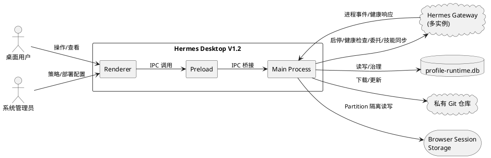
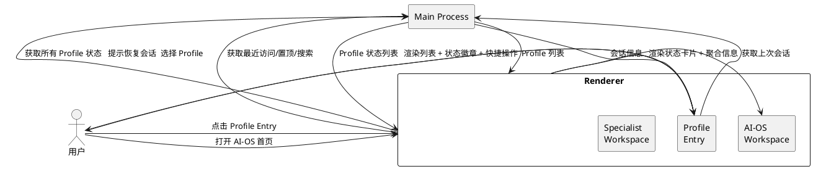
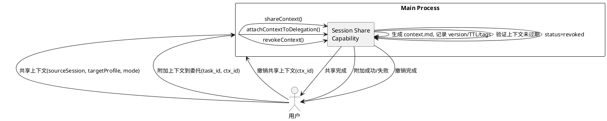
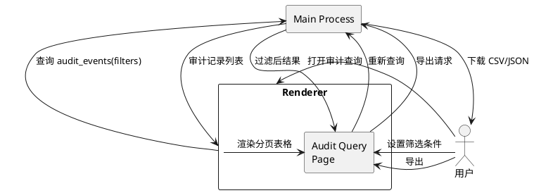
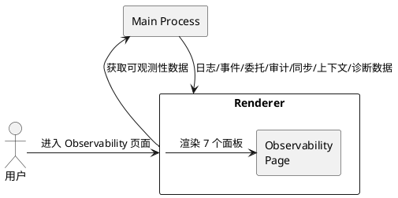
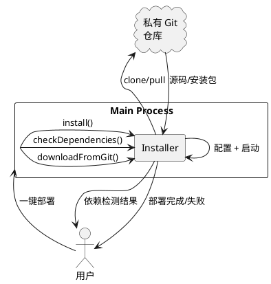

# Hermes Desktop V1.2 — Multi Profile Runtime 工程化增强与可运营化 需求规格

**文档版本**: v1.0  
**创建日期**: 2026-05-15  
**编写人**: 华为云码道（CodeArts）代码智能体  
**基线版本**: V1.1 → V1.2  
**主题**: 把 V1.1 从"可运行的多 Profile 架构"升级为"稳定、可观测、可治理、可交付的本地多智能体运行平台"

---

# 1. 组件定位

## 1.1 核心职责

Hermes Desktop V1.2 负责增强多 Profile Runtime 的稳定性治理、数据库管控、入口体验、委托编排、技能/上下文治理、Web Operator Profile 感知、可观测性、安全策略与 Windows 部署，实现可运营的本地多智能体运行平台。

## 1.2 核心输入

1. **V1.1 基线能力**: Profile Runtime Manager、Gateway Supervisor、Hermes Local Adapter、Config Importer、Delegation/SkillSync/SessionShare Capability、Web Operator Profile Bridge
2. **用户运维操作**: Profile 启停/重启、配置导入/回滚、数据库备份/恢复、Profile 删除/禁用、委托分发、技能安装/回滚、上下文共享/撤销
3. **Runtime 生命周期事件**: Gateway 进程退出、端口冲突、健康检查超时、启动超时
4. **Delegation 请求**: 多 Profile 并行委托、结果合并、超时/重试指令
5. **Web Operator 操作**: 带 sourceProfile 的浏览器操作、敏感操作确认、DOM/截图历史、任务回放
6. **安全策略配置**: 操作策略、敏感操作策略、域名/工具/技能/委托白名单
7. **部署配置**: 私有 Git 仓库地址、Windows 环境依赖、安装目录

## 1.3 核心输出

1. **Runtime 可靠性状态**: failed 状态及原因、自动重启记录、端口冲突错误码、启动超时错误码、App 重启后状态恢复
2. **DB 治理结果**: migration 版本、备份/恢复结果、导入 diff 预览、回滚结果、孤立 Runtime 清理结果
3. **Profile Entry UX**: 最近访问、收藏/置顶、搜索结果、状态徽章、快捷操作、上次会话恢复
4. **委托任务状态**: DelegationTaskStatus 生命周期（created/dispatching/running/succeeded/failed/timeout/cancelled）、结果合并面板、审计时间线
5. **技能/上下文治理**: 技能版本/校验和/依赖/矩阵、上下文版本/TTL/标签/摘要
6. **可观测性数据**: Gateway 日志、Runtime 事件、委托时间线、Web Operator 审计、技能同步/上下文共享历史、诊断信息
7. **安全策略执行结果**: 白名单过滤结果、敏感操作确认结果、策略拒绝错误码
8. **部署产物**: hermes-agent 安装包、环境检测结果、更新通知

## 1.4 职责边界

Hermes Desktop V1.2 **不负责**：

1. 多 BrowserWindow 管理（保持单窗口多 Screen 路由）
2. 远程企业 Profile Server 连接（V1.2 仅支持本地 Profile）
3. Docker Profile Runtime 执行（预留扩展点，不实现）
4. 各 Specialist 完全差异化 UI（共享 Workspace 模板）
5. 直接合并不同 Profile 的 state.db
6. Electron 插件宿主
7. Renderer 直接访问 SQLite（所有 DB 访问经 Main Process IPC）

---

# 2. 领域术语

**Health Polling**
: Gateway Supervisor 以固定间隔对 Profile Gateway 发起 /health 请求，持续监控运行状态的能力。

**Auto Restart**
: 当 Profile Gateway 进程异常退出或健康检查持续失败时，系统自动重新启动该 Profile 的能力。

**Crash Detection**
: 通过监听子进程 exit 事件（非零 exit code 或 signal）识别 Gateway 进程崩溃的能力。

**Port Conflict Detection**
: 在 Profile 启动前检测指定端口是否已被占用，防止 Gateway 进程因端口冲突启动失败的能力。

**Startup Timeout**
: Profile Gateway 在规定时间内未完成启动（未通过健康检查），系统判定启动超时并终止进程的能力。

**Schema Migration**
: 数据库模式版本化管理，通过迁移脚本逐版本升级 profile-runtime.db 的能力。

**Config Import Diff**
: 导入 YAML 配置前，展示当前配置与新配置的差异预览，支持逐项确认或回滚的能力。

**Orphan Runtime**
: 数据库中存在 runtime_instance 记录但对应 Profile 已不存在或已禁用的孤立运行时实例。

**Delegation Task**
: 一次完整的委托调用生命周期实体，包含 task id、状态流转、多 Profile 并行分发、结果合并、超时/重试/取消控制。

**DelegationTaskStatus**
: 委托任务状态枚举：created → dispatching → running → succeeded | failed | timeout | cancelled。

**Profile Session Partition**
: 按 Profile ID 隔离 Browser Session 的存储分区，防止不同 Profile 的 Web 操作数据交叉。

**Sensitive Action Confirmation**
: Web Operator 执行敏感操作（如删除、提交、支付）前需用户确认的拦截机制。

**Web Task Replay**
: 记录 Web Operator 的 DOM 快照与操作序列，支持按步骤回放历史操作的能力。

**Skill Matrix**
: 所有 Profile 与其已安装技能的二维映射视图，展示技能覆盖与版本差异。

**Context TTL**
: 共享上下文的存活时间，超时后自动标记为 expired，不再被委托引用。

**Operation Policy**
: 按 Profile 定义的运行时操作策略，包括域名白名单、工具白名单、技能安装策略、委托白名单。

---

# 3. 角色与边界

## 3.1 核心角色

- **桌面用户**: 操作 Profile 启停/重启/删除/禁用、配置导入、委托分发、技能安装、上下文共享、Web Operator 操作、查看日志/审计
- **系统管理员**: 配置安全策略、域名/工具/技能/委托白名单、部署 hermes-agent

## 3.2 外部系统

- **Hermes Gateway**: 各 Profile 的 AI 推理服务进程，响应 /health 与聊天请求
- **profile-runtime.db**: SQLite 控制面数据库，存储所有 Profile 元数据与运行状态
- **私有 Git 仓库**: hermes-agent 源码/安装包的下载源
- **Browser Session Storage**: Web Operator 的浏览器会话持久化存储（按 Profile partition 隔离）

## 3.3 交互上下文



---

# 4. DFX约束

## 4.1 性能

- **FR-PERF-001**: The Profile Runtime Manager shall complete a single health polling cycle for all running profiles within 5 seconds.
- **FR-PERF-002**: The Profile Entry search shall return results within 200ms for up to 50 profiles.
- **FR-PERF-003**: The Delegation Task dispatch to a single Profile shall complete within 2 seconds (excluding AI inference time).
- **FR-PERF-004**: The DB backup operation for profile-runtime.db shall complete within 10 seconds for a database up to 50MB.
- **FR-PERF-005**: The Config Import Diff preview shall render within 1 second for a YAML file up to 500 lines.

## 4.2 可靠性

- **FR-REL-001**: When a Profile Gateway crashes and auto_restart is true, the system shall restart the Gateway within 15 seconds.
- **FR-REL-002**: When the Electron app restarts, the system shall restore all runtime instance statuses within 10 seconds.
- **FR-REL-003**: The DB backup file shall be verifiable (checksum match) after creation.
- **FR-REL-004**: When a schema migration fails, the system shall roll back to the previous schema version without data loss.
- **FR-REL-005**: The Delegation Task shall support retry up to 3 times on transient failures.

## 4.3 安全性

- **FR-SEC-001**: The system shall require user confirmation before executing any sensitive Web Operator action.
- **FR-SEC-002**: The system shall block Web Operator requests to domains not in the domain allowlist.
- **FR-SEC-003**: The system shall block tool invocations not in the tool allowlist.
- **FR-SEC-004**: The system shall block skill installations not permitted by the skill install policy.
- **FR-SEC-005**: The system shall block delegation requests not in the delegation allowlist.
- **FR-SEC-006**: Browser Session partitions shall be isolated per Profile; no cross-Profile session data leakage.

## 4.4 可维护性

- **FR-OBS-001**: All Profile management operations shall emit audit events to audit_events table.
- **FR-OBS-002**: The system shall provide a unified audit query UI supporting time range, profile, and event type filtering.
- **FR-OBS-003**: Each Profile shall provide a Gateway log viewer with real-time tail and historical log access.
- **FR-OBS-004**: The system shall record all schema migration versions and timestamps.

## 4.5 兼容性

- **FR-COMP-001**: Schema migrations shall be backward compatible; V1.1 database shall upgrade to V1.2 without manual intervention.
- **FR-COMP-002**: Existing Profile configurations (YAML) shall remain valid after V1.2 upgrade without modification.
- **FR-COMP-003**: The IPC contract (Preload ↔ Main) shall use additive changes only; no breaking changes to existing channels.

---

# 5. 核心能力

## 5.1 Runtime Reliability Pack（3.1 — P0）

### 5.1.1 业务规则

**FR-RT-001**: While a Profile Gateway is in running status, when the Gateway Supervisor performs a health check and the check fails consecutively for the configured threshold, the Profile Runtime Manager shall mark the runtime status as failed and increment health_fail_count.

- 验收条件: [3 次连续健康检查失败] → [runtime status 变为 failed, health_fail_count 递增]

**FR-RT-002**: When a Profile Gateway process exits with a non-zero exit code or is terminated by a signal, the Profile Runtime Manager shall detect the crash, set status to failed, record last_exit_code and last_crash_at, and increment restart_count.

- 验收条件: [手动 kill Gateway 进程] → [UI 显示 failed 状态, last_exit_code 记录, last_crash_at 记录, restart_count +1]

**FR-RT-003**: When a Profile Gateway crashes or fails health checks, and the profile's auto_restart field is true, the Profile Runtime Manager shall automatically restart the Gateway within 15 seconds.

- 验收条件: [auto_restart=true 且 Gateway 崩溃] → [15 秒内自动重启, status 恢复为 running]

**FR-RT-004**: When a Profile is about to start, if the assigned port is already occupied by another process, the Profile Runtime Manager shall reject the start request and return PROFILE_PORT_CONFLICT error.

- 验收条件: [端口 8080 被占用, 尝试启动 port=8080 的 Profile] → [返回 PROFILE_PORT_CONFLICT, status 保持 stopped]

**FR-RT-005**: When a Profile Gateway fails to pass health check within the configured startup timeout duration, the Profile Runtime Manager shall terminate the Gateway process and set status to failed with reason startup_timeout.

- 验收条件: [30 秒内健康检查未通过] → [Gateway 进程被终止, status 变为 failed, 错误原因 startup_timeout]

**FR-RT-006**: When the Electron app restarts, the Profile Runtime Manager shall scan all runtime_instances records and reconcile each record's status with the actual process state (running/stopped/failed).

- 验收条件: [App 重启前有 2 个 running Profile] → [App 重启后 10 秒内恢复为 running, 若进程已不存在则标记为 stopped]

**FR-RT-007**: The Profile Runtime Manager shall provide a log viewer for each Profile Gateway that supports real-time tailing and historical log access.

- 验收条件: [用户点击 Profile 的"查看日志"操作] → [显示该 Profile Gateway 的 stdout/stderr 日志, 支持实时滚动]

**FR-RT-008**: The runtime_instances table shall include the following fields: restart_count (INTEGER, default 0), last_exit_code (INTEGER, nullable), last_crash_at (TEXT, nullable ISO timestamp), auto_restart (BOOLEAN, default false), health_fail_count (INTEGER, default 0).

- 验收条件: [runtime_instances 表结构] → [包含上述 5 个新增字段且类型正确]

### 5.1.2 交互流程

```plantuml
@startuml
actor 用户
rectangle "Main Process" as Main {
  rectangle "Profile Runtime\nManager" as PRM
  rectangle "Gateway\nSupervisor" as GS
}
cloud "Hermes Gateway" as GW

用户 -> Main : 启动 Profile
Main -> PRM : startProfile(id)
PRM -> PRM : 检测端口冲突
PRM -> GW : 启动 Gateway 进程
PRM -> GS : 启动健康轮询
GS -> GW : GET /health (interval)
GW --> GS : 200 OK / Timeout

alt 连续失败 >= 阈值
  GS -> PRM : healthCheckFailed
  PRM -> PRM : status=failed, health_fail_count++
  alt auto_restart=true
    PRM -> GW : 重启 Gateway
  end
end

alt 进程 exit (code!=0)
  GW -> PRM : exit 事件
  PRM -> PRM : status=failed, 记录 exit_code/crash_at/restart_count
  alt auto_restart=true
    PRM -> GW : 自动重启
  end
end
@enduml
```

### 5.1.3 异常场景

1. **端口冲突**

   a. 触发条件: Profile 配置端口被其他进程占用
   b. 系统行为: 拒绝启动，不创建子进程
   c. 用户感知: PROFILE_PORT_CONFLICT 错误码，提示更换端口或停止占用进程

2. **启动超时**

   a. 触发条件: Gateway 进程启动后未在 timeout 内通过健康检查
   b. 系统行为: 终止 Gateway 进程，标记 status=failed
   c. 用户感知: UI 显示 failed 状态，错误原因 startup_timeout

3. **崩溃后自动重启失败**

   a. 触发条件: auto_restart=true 但重启后再次崩溃
   b. 系统行为: 记录 restart_count 递增，若连续重启超过 3 次则停止自动重启并标记 status=failed
   c. 用户感知: UI 显示 failed 状态，提示"自动重启已达到上限"

4. **App 重启后状态恢复失败**

   a. 触发条件: App 重启后无法连接到原 Gateway 进程
   b. 系统行为: 标记 runtime status 为 stopped
   c. 用户感知: UI 显示 stopped 状态，需手动启动

---

## 5.2 Runtime DB Governance Pack（3.2 — P0）

### 5.2.1 业务规则

**FR-DB-001**: The profile-runtime.db shall maintain a schema_version table recording the current migration version, and all schema changes shall be applied through numbered migration scripts.

- 验收条件: [执行 DB 初始化或升级] → [schema_version 表记录当前版本号, 迁移脚本按版本号顺序执行]

**FR-DB-002**: When a user requests a database backup, the system shall create a timestamped copy of profile-runtime.db in the designated backup directory and record a checksum for verification.

- 验收条件: [用户点击"备份数据库"] → [生成 profile-runtime.db.20260515T120000.bak 文件, 记录 SHA-256 校验和]

**FR-DB-003**: When a user requests a database restore from a backup file, the system shall verify the backup checksum, replace the current database with the backup, and reinitialize all in-memory state from the restored database.

- 验收条件: [选择备份文件并点击"恢复"] → [校验和匹配后替换当前 DB, 所有运行时状态刷新]

**FR-DB-004**: When a user imports a YAML configuration, the system shall compute a diff between the current configuration and the new configuration and display the diff preview before applying changes.

- 验收条件: [导入 YAML 文件] → [显示差异预览: 新增/修改/删除的 Profile 列表及字段差异]

**FR-DB-005**: When a config import has been applied and the user requests a rollback, the system shall restore the previous configuration state from the pre-import backup.

- 验收条件: [导入后点击"回滚"] → [恢复到导入前的配置状态, 所有变更被撤销]

**FR-DB-006**: When a user deletes a Profile, the system shall remove the Profile record and all related records (runtime_instance, profile_entry, profile_capabilities, profile_skills, skill_sync_events, shared_contexts, delegation_events) from the database, and optionally delete the Profile Home directory.

- 验收条件: [用户删除 Profile "analyst"] → [DB 中移除 analyst 所有记录, 可选删除 ~/.hermes/profiles/analyst/]

**FR-DB-007**: When a user disables a Profile, the system shall set the Profile's enabled field to false, stop its running Gateway if any, and prevent any runtime operations on this Profile until re-enabled.

- 验收条件: [禁用 Profile] → [enabled=false, 运行中 Gateway 被停止, 无法启动/委托/同步]

**FR-DB-008**: The system shall detect and clean up orphan runtime instances whose corresponding Profile has been deleted or disabled.

- 验收条件: [运行"清理孤立实例"操作] → [移除无对应 Profile 的 runtime_instance 记录, 返回清理数量]

### 5.2.2 交互流程

```plantuml
@startuml
actor 用户
rectangle "Main Process" as Main {
  rectangle "Config\nImporter" as CI
  rectangle "Profile Runtime\nDB" as DB
}

用户 -> Main : 导入 YAML 配置
Main -> CI : importConfig(yamlContent)
CI -> DB : 读取当前配置
CI -> CI : 计算 diff
CI --> 用户 : 展示 diff 预览
用户 -> Main : 确认导入
Main -> CI : applyImport()
CI -> DB : 备份当前配置
CI -> DB : 写入新配置

alt 用户请求回滚
  用户 -> Main : 回滚导入
  Main -> CI : rollbackImport()
  CI -> DB : 从备份恢复
end
@enduml
```

### 5.2.3 异常场景

1. **Schema Migration 失败**

   a. 触发条件: 迁移脚本执行出错（SQL 语法错误、约束冲突等）
   b. 系统行为: 回滚当前迁移，保持上一版本 schema
   c. 用户感知: 提示"数据库升级失败，已回滚到版本 X"

2. **备份校验和不匹配**

   a. 触发条件: 恢复时备份文件 SHA-256 与记录不匹配
   b. 系统行为: 拒绝恢复操作
   c. 用户感知: 提示"备份文件已损坏，无法恢复"

3. **导入 Diff 包含破坏性变更**

   a. 触发条件: 导入配置将删除正在运行的 Profile
   b. 系统行为: 在 diff 预览中高亮警告，需用户二次确认
   c. 用户感知: 红色标记"将删除运行中的 Profile"，需勾选确认

4. **删除 Profile 时 Gateway 仍在运行**

   a. 触发条件: 用户删除一个 running 状态的 Profile
   b. 系统行为: 先停止 Gateway 进程，再执行删除
   c. 用户感知: 提示"将先停止该 Profile 的 Gateway"

---

## 5.3 Profile Entry UX Pack（3.3 — P0）

### 5.3.1 业务规则

**FR-UX-001**: The Profile Entry page shall display a list of recently accessed Profiles, sorted by last_accessed_at descending, limited to the most recent 10 entries.

- 验收条件: [用户打开 Profile Entry 页面] → [显示最近访问的 10 个 Profile, 按访问时间降序]

**FR-UX-002**: When a user marks a Profile as pinned/favorite, the system shall display it at the top of the Profile list regardless of access time.

- 验收条件: [置顶 Profile "analyst"] → [analyst 出现在列表顶部, 带置顶图标]

**FR-UX-003**: The Profile Entry page shall provide a search function that filters Profiles by name, display_name, or description with debounced input (300ms).

- 验收条件: [输入搜索词 "risk"] → [300ms 后显示名称/显示名/描述包含 "risk" 的 Profile]

**FR-UX-004**: Each Profile item in the list shall display a status badge indicating the current runtime status (running/stopped/failed/starting).

- 验收条件: [Profile 状态为 running] → [显示绿色圆点徽章; failed 显示红色; stopped 显示灰色; starting 显示黄色旋转]

**FR-UX-005**: Each Profile item shall provide quick actions: start/stop, view logs, open in browser, open terminal — actions availability depends on current status.

- 验收条件: [Profile running] → [可执行: stop/view logs/open browser; 不可执行: start]

**FR-UX-006**: When a user selects a Profile that has a last active session, the system shall offer to resume the last session.

- 验收条件: [用户点击有历史会话的 Profile] → [提示"恢复上次会话?", 确认后加载历史会话]

**FR-UX-007**: The AI-OS home page (default Profile) shall aggregate status cards for all Profiles, recent tasks, recent delegations, pending confirmations, and Web Operator shortcuts.

- 验收条件: [打开 AI-OS 首页] → [显示所有 Profile 状态卡片/最近任务/最近委托/待确认操作/Web Operator 快捷入口]

**FR-UX-008**: The Specialist Workspace page shall display the current Profile status, last active session, skills quick list, shared context list, and runtime logs.

- 验收条件: [进入 Specialist Workspace] → [显示 Profile 状态/上次会话/技能列表/共享上下文/运行日志]

### 5.3.2 交互流程



### 5.3.3 异常场景

1. **搜索无结果**

   a. 触发条件: 搜索词不匹配任何 Profile
   b. 系统行为: 显示空状态提示
   c. 用户感知: "未找到匹配的 Profile，请调整搜索词"

2. **恢复上次会话失败**

   a. 触发条件: 上次会话对应的 Gateway 不再运行
   b. 系统行为: 提示用户启动 Gateway
   c. 用户感知: "上次会话的 Gateway 未运行，是否先启动？"

---

## 5.4 Delegation Orchestration Pack（3.4 — P0）

### 5.4.1 业务规则

**FR-DLG-001**: Each delegation invocation shall create a DelegationTask record with a unique task_id, source_profile_id, target_profile_id(s), status (created), created_at timestamp, and input specification.

- 验收条件: [发起委托调用] → [生成 DelegationTask 记录, status=created, 包含 task_id/源/目标/输入]

**FR-DLG-002**: The DelegationTask status shall follow the lifecycle: created → dispatching → running → succeeded | failed | timeout | cancelled. Each transition shall be recorded with a timestamp.

- 验收条件: [委托任务执行] → [status 按生命周期流转, 每次变更记录时间戳]

**FR-DLG-003**: When a delegation targets multiple Profiles, the system shall dispatch to all target Profiles in parallel and track individual sub-task statuses.

- 验收条件: [委托目标为 [analyst, researcher]] → [并行分发到两个 Profile, 各自维护 sub-task status]

**FR-DLG-004**: When all parallel delegation sub-tasks complete, the system shall merge results into a unified result panel displaying each Profile's contribution.

- 验收条件: [并行委托全部完成] → [结果合并面板显示各 Profile 结果, 标注来源]

**FR-DLG-005**: When a delegation task fails or times out, the user shall be able to retry the task, which creates a new DelegationTask with the same input specification.

- 验收条件: [委托任务 failed, 用户点击"重试"] → [创建新 DelegationTask, 相同输入, 新 task_id]

**FR-DLG-006**: When a delegation task exceeds the configured timeout duration, the system shall set the task status to timeout and terminate the pending invocation.

- 验收条件: [委托任务超过 60 秒未完成] → [status=timeout, 终止等待]

**FR-DLG-007**: Each DelegationTask shall support context_refs — references to shared contexts that are attached to the delegation request as supplementary input.

- 验收条件: [委托时指定 context_refs=[ctx-001, ctx-002]] → [请求中包含引用的共享上下文内容]

**FR-DLG-008**: All DelegationTask status transitions shall be recorded in an audit timeline showing who/when/what for each transition.

- 验收条件: [查看委托审计时间线] → [显示每个状态变更的触发者/时间/变更内容]

**FR-DLG-009**: The user shall be able to cancel a running delegation task, setting its status to cancelled and terminating the target Profile invocation.

- 验收条件: [用户点击"取消委托"] → [status=cancelled, 目标 Profile 停止处理]

### 5.4.2 交互流程

```plantuml
@startuml
actor 用户
rectangle "Main Process" as Main {
  rectangle "Delegation\nCapability" as DC
}
cloud "Target\nProfile GW" as TGW

用户 -> Main : 发起委托(task_id, targets[], input, context_refs)
Main -> DC : createTask()
DC -> DC : status=created
DC -> DC : status=dispatching
DC -> TGW : 并行分发请求
DC -> DC : status=running

alt 全部完成
  TGW --> DC : 各目标返回结果
  DC -> DC : status=succeeded
  DC --> 用户 : 合并结果面板
else 部分失败
  TGW --> DC : 部分结果+错误
  DC -> DC : status=failed
  DC --> 用户 : 部分结果+重试选项
else 超时
  DC -> DC : status=timeout
  DC --> 用户 : 超时提示+重试选项
end
@enduml
```

### 5.4.3 异常场景

1. **目标 Profile 未运行**

   a. 触发条件: 委托目标 Profile 的 Gateway 未启动
   b. 系统行为: 标记该 sub-task 为 failed，不影响其他并行 sub-task
   c. 用户感知: "目标 Profile [analyst] 未运行，该子任务失败"

2. **委托超时**

   a. 触发条件: 目标 Profile 处理时间超过配置的 timeout
   b. 系统行为: 终止等待，标记 status=timeout
   c. 用户感知: "委托任务超时，可重试"

3. **并行委托部分失败**

   a. 触发条件: 多目标并行委托中部分目标失败
   b. 系统行为: 成功部分正常返回结果，失败部分标记 failed
   c. 用户感知: 合并面板中部分结果标记失败，可单独重试失败部分

---

## 5.5 Skill Governance Pack（3.5 — P1）

### 5.5.1 业务规则

**FR-SK-001**: Each skill record shall include version, checksum (SHA-256), and dependency list fields.

- 验收条件: [查看技能详情] → [显示 version/checksum/dependencies]

**FR-SK-002**: When a skill is about to be copied to a target Profile, the system shall display a preview showing the skill version, checksum comparison, and any dependency conflicts.

- 验收条件: [复制技能到目标 Profile] → [显示预览: 版本对比/校验和差异/依赖冲突]

**FR-SK-003**: When a skill copy results in overwriting an existing skill, the system shall create a rollback point before overwriting, allowing the user to restore the previous version.

- 验收条件: [覆盖技能后点击"回滚"] → [恢复到覆盖前的技能版本]

**FR-SK-004**: The system shall provide a Profile Skill Matrix view showing all Profiles and their installed skills in a cross-reference table, with version and status indicators.

- 验收条件: [打开技能矩阵视图] → [显示 Profiles × Skills 二维表格, 每格显示版本/状态]

**FR-SK-005**: The system shall support installing bundled skills (pre-packaged skill archives) to a Profile with dependency resolution.

- 验收条件: [安装 bundled skill archive] → [解压并解析依赖, 自动安装依赖技能, 安装到目标 Profile]

### 5.5.2 交互流程

```plantuml
@startuml
actor 用户
rectangle "Main Process" as Main {
  rectangle "Skill Sync\nCapability" as SSC
}

用户 -> Main : 复制技能到目标 Profile
Main -> SSC : previewSkillCopy()
SSC --> 用户 : 显示版本/校验和/依赖预览
用户 -> Main : 确认复制
Main -> SSC : executeSkillCopy()
SSC -> SSC : 创建回滚点
SSC -> SSC : 执行复制
SSC --> 用户 : 复制完成

alt 用户请求回滚
  用户 -> Main : 回滚技能复制
  Main -> SSC : rollbackSkillCopy()
  SSC --> 用户 : 恢复到之前版本
end
@enduml
```

### 5.5.3 异常场景

1. **技能依赖缺失**

   a. 触发条件: 安装技能时依赖的其他技能不存在
   b. 系统行为: 阻止安装，列出缺失依赖
   c. 用户感知: "缺少依赖: [skill-a v2.0, skill-b v1.5]，请先安装"

2. **校验和不匹配**

   a. 触发条件: 技能文件校验和与记录不一致（文件被篡改或损坏）
   b. 系统行为: 标记技能状态为 corrupted，拒绝加载
   c. 用户感知: "技能文件校验失败，可能已损坏"

---

## 5.6 Context Governance Pack（3.6 — P1）

### 5.6.1 业务规则

**FR-CTX-001**: Each shared context record shall include version number, TTL (time-to-live), tags, and last_summary_at fields.

- 验收条件: [查看共享上下文详情] → [显示 version/TTL/tags/last_summary_at]

**FR-CTX-002**: When a shared context's TTL expires, the system shall mark its status as expired and exclude it from delegation context_refs by default.

- 验收条件: [上下文 TTL 到期] → [status=expired, 委托默认不引用]

**FR-CTX-003**: When a user requests summary regeneration for a shared context, the system shall re-generate the context summary from the source session data.

- 验�条件: [点击"重新生成摘要"] → [基于源会话重新生成上下文摘要, 更新 last_summary_at]

**FR-CTX-004**: The system shall track usage history of each shared context, recording which delegation tasks referenced it and when.

- 验收条件: [查看上下文使用历史] → [显示引用该上下文的委托任务列表及时间]

**FR-CTX-005**: When a user attaches a shared context to a delegation task, the system shall validate the context is not expired and add it to the delegation's context_refs.

- 验收条件: [附加有效上下文到委托] → [context_refs 包含该上下文; 附加 expired 上下文] → [提示"上下文已过期，请先续期或重新生成"]

**FR-CTX-006**: When a user revokes a shared context, the system shall mark it as revoked and prevent any future delegation from referencing it.

- 验收条件: [撤销共享上下文] → [status=revoked, 后续委托无法引用]

### 5.6.2 交互流程



### 5.6.3 异常场景

1. **源会话不存在**

   a. 触发条件: 共享上下文时源会话已被删除
   b. 系统行为: 返回 PROFILE_CONTEXT_SOURCE_SESSION_NOT_FOUND
   c. 用户感知: "源会话不存在，无法共享上下文"

2. **TTL 过期后引用**

   a. 触发条件: 委托引用已过期的上下文
   b. 系统行为: 拒绝引用，提示续期
   c. 用户感知: "上下文已过期，请续期或重新生成后再引用"

---

## 5.7 Web Operator Profile-Aware Pack（3.7 — P0）

### 5.7.1 业务规则

**FR-WO-001**: Each Web Operator browser action shall be bound to a sourceProfile field, recording which Profile initiated the action.

- 验收条件: [Web Operator 执行操作] → [审计记录包含 sourceProfile]

**FR-WO-002**: Browser sessions shall use partition per Profile (persist:profile-{profileId}), ensuring no cross-Profile session data leakage.

- 验收条件: [Profile A 的 Web 操作] → [使用 persist:profile-A partition, 与 Profile B 的 persist:profile-B 完全隔离]

**FR-WO-003**: When a Web Operator receives a BrowserToolRequest, the system shall validate the request includes profileId, source, toolName, args, and requireConfirm fields.

- 验收条件: [收到 BrowserToolRequest] → [校验必要字段, 缺失字段返回错误]

**FR-WO-004**: When a Web Operator action plan is created, the system shall display the planned action sequence for user review before execution.

- 验收条件: [创建 Web 操作计划] → [显示操作序列预览, 等待用户确认后执行]

**FR-WO-005**: When a Web Operator action is marked as sensitive (requireConfirm=true), the system shall pause execution and display a confirmation dialog before proceeding.

- 验收条件: [执行敏感操作 (requireConfirm=true)] → [暂停并弹出确认对话框, 用户确认后继续]

**FR-WO-006**: The system shall record DOM snapshots and screenshots for each Web Operator action, forming a visual history that can be browsed.

- 验收条件: [Web 操作执行后] → [记录 DOM 快照和截图, 可按步骤浏览历史]

**FR-WO-007**: The system shall provide a selector recorder that captures CSS selectors during Web Operator actions for replay purposes.

- 验收条件: [Web 操作执行时] → [自动记录操作的 CSS selector, 存储为可回放格式]

**FR-WO-008**: The user shall be able to replay a recorded Web Operator task, executing the recorded action sequence step by step.

- 验收条件: [选择历史 Web 任务并点击"回放"] → [按记录的操作序列逐步执行, 每步显示对应截图]

### 5.7.2 交互流程

```plantuml
@startuml
actor 用户
rectangle "Main Process" as Main {
  rectangle "Web Operator\nProfile Bridge" as WOPB
}
cloud "Browser\nSession" as BS

用户 -> Main : 执行 Web 操作(plan)
Main -> WOPB : createActionPlan()
WOPB --> 用户 : 显示操作计划
用户 -> Main : 确认执行
Main -> WOPB : executePlan()

loop 每个操作步骤
  alt requireConfirm=true
    WOPB --> 用户 : 确认对话框
    用户 -> WOPB : 确认/拒绝
  end
  WOPB -> BS : 执行操作(profile partition)
  BS --> WOPB : 操作结果
  WOPB -> WOPB : 记录 DOM 快照/截图/selector
end

WOPB --> 用户 : 执行完成+结果摘要
@enduml
```

### 5.7.3 异常场景

1. **Profile 未授权 Web 操作**

   a. 触发条件: Web 操作请求的 Profile 未启用 web-operator capability
   b. 系统行为: 返回 WEB_OPERATOR_PROFILE_NOT_ALLOWED
   c. 用户感知: "该 Profile 未启用 Web Operator 能力"

2. **敏感操作被拒绝**

   a. 触发条件: 用户在确认对话框中拒绝敏感操作
   b. 系统行为: 跳过该操作，继续执行后续操作
   c. 用户感知: "操作已跳过，继续执行后续步骤"

3. **回放时页面结构变化**

   a. 触发条件: Web 任务回放时 CSS selector 不再匹配
   b. 系统行为: 标记该步骤为 failed，暂停回放
   c. 用户感知: "回放失败: 页面结构已变化，selector 无法匹配"

---

## 5.8 Audit Query UI（3.7 子项 — P0）

### 5.8.1 业务规则

**FR-AUD-001**: The system shall provide a unified audit query UI that queries the audit_events table with filters: time range, profile_id, event_type, actor, result.

- 验收条件: [打开审计查询页面] → [可按时间范围/Profile/事件类型/操作者/结果筛选]

**FR-AUD-002**: Audit query results shall be displayed in a paginated table with sortable columns and expandable detail rows.

- 验收条件: [查询返回 100 条记录] → [分页显示, 可排序, 展开行查看详情]

**FR-AUD-003**: The system shall support exporting audit query results as CSV or JSON.

- 验收条件: [点击"导出"] → [生成 CSV 或 JSON 文件下载]

### 5.8.2 交互流程



### 5.8.3 异常场景

1. **查询结果过大**

   a. 触发条件: 未设置时间范围导致查询量过大
   b. 系统行为: 限制单次查询最多 10000 条，提示缩小范围
   c. 用户感知: "结果超过 10000 条，请缩小时间范围"

---

## 5.9 Observability Pack（3.8 — P1）

### 5.9.1 业务规则

**FR-OBS-005**: The system shall provide a ProfileRuntime > Observability page displaying: Gateway Logs, Runtime Events, Delegation Timeline, Web Operator Audit, Skill Sync History, Context Share History, and Diagnostics.

- 验收条件: [进入 Profile > Observability 页面] → [显示上述 7 个可观测性面板]

**FR-OBS-006**: The Gateway Logs panel shall display real-time log output with filtering by log level (info/warn/error) and search.

- 验收条件: [打开 Gateway Logs 面板] → [实时显示日志, 可按级别过滤/搜索]

**FR-OBS-007**: The Runtime Events panel shall display a timeline of runtime lifecycle events (start/stop/crash/restart/health_change) for the selected Profile.

- 验收条件: [打开 Runtime Events 面板] → [按时间线显示生命周期事件]

**FR-OBS-008**: The Delegation Timeline panel shall visualize all delegation tasks for the Profile with status indicators and expandable details.

- 验收条件: [打开 Delegation Timeline 面板] → [可视化委托任务时间线, 状态标记, 展开详情]

**FR-OBS-009**: The Diagnostics panel shall display system resource usage (CPU, memory, disk), Gateway process info, and database statistics.

- 验收条件: [打开 Diagnostics 面板] → [显示 CPU/内存/磁盘使用率, 进程信息, DB 统计]

### 5.9.2 交互流程



### 5.9.3 异常场景

1. **Gateway 日志不可用**

   a. 触发条件: Profile Gateway 未运行，无法获取日志
   b. 系统行为: 显示空状态提示
   c. 用户感知: "Gateway 未运行，暂无日志"

---

## 5.10 Security & Policy Pack（3.9 — P1）

### 5.10.1 业务规则

**FR-SEC-007**: Each Profile shall support an operation policy configuration that defines allowed and denied operations for that Profile.

- 验收条件: [配置 Profile 操作策略] → [策略生效, 拒绝的操作返回 POLICY_DENIED]

**FR-SEC-008**: The system shall support a sensitive action policy that defines which Web Operator actions require user confirmation.

- 验收条件: [配置敏感操作策略: [delete, submit, payment]] → [执行这些操作时弹出确认对话框]

**FR-SEC-009**: The system shall enforce a domain allowlist for Web Operator browser navigation; requests to domains not in the allowlist shall be blocked.

- 验收条件: [allowlist=[*.example.com], 导航到 evil.com] → [请求被阻止, 返回 DOMAIN_NOT_ALLOWED]

**FR-SEC-010**: The system shall enforce a tool allowlist for tool invocations; attempts to invoke tools not in the allowlist shall be blocked.

- 验收条件: [allowlist=[web_search, code_read], 尝试调用 file_delete] → [请求被阻止, 返回 TOOL_NOT_ALLOWED]

**FR-SEC-011**: The system shall enforce a skill install policy controlling which skills can be installed to a Profile.

- 验收条件: [策略: allow_bundled_only=true], [尝试安装非 bundled 技能] → [请求被阻止, 返回 SKILL_INSTALL_NOT_ALLOWED]

**FR-SEC-012**: The system shall enforce a delegation allowlist controlling which Profiles can be delegation targets.

- 验收条件: [allowlist=[analyst, researcher]], [委托到 unknown-profile] → [请求被阻止, 返回 DELEGATION_NOT_ALLOWED]

**FR-SEC-013**: The system shall support exporting audit events for a specified time range as a downloadable file for compliance review.

- 验收条件: [选择时间范围并点击"导出审计"] → [生成审计导出文件下载]

### 5.10.2 交互流程

```plantuml
@startuml
actor 用户
rectangle "Main Process" as Main {
  rectangle "Policy\nEngine" as PE
}
cloud "Target" as T

用户 -> Main : 执行操作(profileId, action)
Main -> PE : evaluatePolicy(profileId, action)
alt 策略允许
  PE -> T : 执行操作
  T --> 用户 : 操作结果
else 策略拒绝
  PE --> 用户 : POLICY_DENIED / DOMAIN_NOT_ALLOWED / TOOL_NOT_ALLOWED
end
@enduml
```

### 5.10.3 异常场景

1. **策略配置冲突**

   a. 触发条件: 操作同时匹配 allow 和 deny 规则
   b. 系统行为: deny 优先
   c. 用户感知: 操作被拒绝，提示"策略冲突: deny 规则优先"

2. **白名单为空**

   a. 触发条件: 域名/工具白名单未配置
   b. 系统行为: 默认允许所有（安全模式可选：默认拒绝所有）
   c. 用户感知: 未配置时按默认策略执行

---

## 5.11 Windows Deployment Pack（3.10 — P2）

### 5.11.1 业务规则

**FR-DEP-001**: The system shall support downloading hermes-agent from a configured private Git repository with authentication.

- 验收条件: [配置 Git 仓库地址和凭据] → [可下载 hermes-agent 源码/安装包]

**FR-DEP-002**: Before installing hermes-agent, the system shall detect Windows environment dependencies (Python, Node.js, Git, etc.) and report missing dependencies.

- 验收条件: [执行环境检测] → [列出已安装/缺失的依赖项]

**FR-DEP-003**: The system shall manage the installation directory for hermes-agent, supporting custom paths and validating directory permissions.

- 验收条件: [配置自定义安装路径] → [验证路径可写, 创建安装目录]

**FR-DEP-004**: The system shall support one-click deployment that automates: dependency check → download → install → configure → start.

- 验收条件: [点击"一键部署"] → [自动执行检测→下载→安装→配置→启动流程, 显示进度]

**FR-DEP-005**: The system shall support auto-update for hermes-agent, checking the configured Git repository for new versions and notifying the user.

- 验收条件: [有新版本可用] → [通知用户"有新版本可用", 用户确认后自动更新]

**FR-DEP-006**: The system shall support Profile backup and restore for migration or disaster recovery.

- 验收条件: [备份 Profile] → [生成 Profile 完整备份包; 恢复时重建 Profile 目录和数据库记录]

**FR-DEP-007**: The system shall provide an install log viewer showing the history of deployment operations with timestamps and statuses.

- 验收条件: [打开安装日志查看器] → [显示部署操作历史, 包含时间戳和状态]

### 5.11.2 交互流程



### 5.11.3 异常场景

1. **Git 仓库不可达**

   a. 触发条件: 配置的 Git 仓库地址无法连接
   b. 系统行为: 报错并终止部署
   c. 用户感知: "无法连接 Git 仓库，请检查地址和网络"

2. **关键依赖缺失**

   a. 触发条件: Python 或 Node.js 未安装
   b. 系统行为: 终止部署，列出缺失依赖
   c. 用户感知: "缺少关键依赖: Python 3.10+, 请安装后重试"

3. **安装目录权限不足**

   a. 触发条件: 安装路径无写入权限
   b. 系统行为: 终止部署
   c. 用户感知: "安装目录无写入权限，请更换路径或调整权限"

---

# 6. 数据约束

## 6.1 runtime_instances（V1.2 新增字段）

1. **restart_count**: 非负整数，默认 0，每次自动重启后递增
2. **last_exit_code**: 可空整数，记录最近一次 Gateway 退出码（null 表示正常运行中或未启动过）
3. **last_crash_at**: 可空 ISO 8601 时间戳，记录最近一次崩溃时间
4. **auto_restart**: 布尔值，默认 false，标记是否在崩溃后自动重启
5. **health_fail_count**: 非负整数，默认 0，连续健康检查失败计数

## 6.2 delegation_tasks（新增表）

1. **task_id**: UUID，主键，唯一标识委托任务
2. **source_profile_id**: 非空字符串，发起委托的 Profile ID
3. **target_profile_ids**: 非空 JSON 数组，目标 Profile ID 列表
4. **status**: 枚举值，取值范围 created | dispatching | running | succeeded | failed | timeout | cancelled
5. **input_spec**: 非空 JSON 对象，委托输入规格
6. **context_refs**: JSON 数组，引用的共享上下文 ID 列表
7. **result**: 可空 JSON 对象，委托结果
8. **timeout_seconds**: 正整数，委托超时时间（秒）
9. **retry_count**: 非负整数，默认 0，重试次数
10. **created_at**: ISO 8601 时间戳，创建时间
11. **dispatched_at**: 可空 ISO 8601 时间戳，分发时间
12. **completed_at**: 可空 ISO 8601 时间戳，完成时间

## 6.3 schema_version（新增表）

1. **version**: 正整数，当前 schema 版本号
2. **applied_at**: ISO 8601 时间戳，迁移应用时间
3. **description**: 字符串，迁移描述

## 6.4 shared_contexts（V1.2 新增字段）

1. **version**: 正整数，默认 1，上下文版本号
2. **ttl_seconds**: 可空正整数，存活时间（秒），null 表示永不过期
3. **tags**: JSON 数组，上下文标签
4. **status**: 枚举值，取值范围 active | expired | revoked，默认 active
5. **last_summary_at**: 可空 ISO 8601 时间戳，最近摘要生成时间

## 6.5 profile_skills（V1.2 新增字段）

1. **skill_version**: 字符串，技能版本号
2. **checksum**: 字符串，技能文件 SHA-256 校验和
3. **dependencies**: JSON 数组，技能依赖列表

## 6.6 operation_policies（新增表）

1. **profile_id**: 非空字符串，关联 Profile ID
2. **policy_type**: 枚举值，取值范围 domain_allowlist | tool_allowlist | skill_install | delegation_allowlist | sensitive_action
3. **policy_config**: 非空 JSON 对象，策略配置内容
4. **created_at**: ISO 8601 时间戳
5. **updated_at**: ISO 8601 时间戳

---

# 7. 实施阶段

| 阶段 | 功能包 | 优先级 | 核心需求 ID |
|------|--------|--------|-------------|
| Phase 1 | Runtime 稳定性 | P0 | FR-RT-001 ~ FR-RT-008 |
| Phase 2 | SQLite Governance | P0 | FR-DB-001 ~ FR-DB-008 |
| Phase 3 | Profile Entry UX | P0 | FR-UX-001 ~ FR-UX-008 |
| Phase 4 | Delegation Task | P0 | FR-DLG-001 ~ FR-DLG-009 |
| Phase 5 | Skill/Context Governance | P1 | FR-SK-001~005, FR-CTX-001~006 |
| Phase 6 | Web Operator 深度集成 | P0/P1 | FR-WO-001~008, FR-OBS-005~009, FR-SEC-007~013 |

---

# 8. 涉及模块索引

| 功能包 | Main Process | Preload | Renderer | Shared |
|--------|-------------|---------|----------|--------|
| Runtime Reliability | profile-runtime-manager.ts, gateway-supervisor.ts, profile-runtime-db.ts | profile-runtime-api.ts | ProfileRuntime/ (status badge, log viewer) | profile-runtime-contract.ts, profile-runtime-errors.ts |
| DB Governance | profile-runtime-db.ts, config-importer.ts | profile-runtime-api.ts | ProfileRuntime/ (backup/restore, import diff) | profile-runtime-contract.ts |
| Profile Entry UX | profile-runtime-ipc.ts | profile-entry-api.ts | AIOSWorkspace/, ProfileWorkspace/, ProfileRuntime/ | profile-runtime-contract.ts |
| Delegation | delegation-capability.ts, profile-runtime-db.ts | profile-runtime-api.ts | ProfileWorkspace/ (delegation panel, result merge) | profile-runtime-contract.ts |
| Skill Governance | skill-sync-capability.ts, profile-runtime-db.ts | profile-runtime-api.ts | ProfileRuntime/ (skill matrix) | profile-runtime-contract.ts |
| Context Governance | session-share-capability.ts, profile-runtime-db.ts | profile-runtime-api.ts | ProfileWorkspace/ (context list, usage history) | profile-runtime-contract.ts |
| Web Operator | web-operator-profile-bridge.ts | browser-api.ts | WebOperator/ (action plan, confirm, history, replay) | profile-runtime-contract.ts |
| Audit UI | profile-runtime-db.ts | profile-runtime-api.ts | AIOSWorkspace/ (audit query page) | profile-runtime-contract.ts |
| Observability | gateway-supervisor.ts, profile-runtime-db.ts | profile-runtime-api.ts | ProfileRuntime/ (observability page, 7 panels) | profile-runtime-contract.ts |
| Security & Policy | (新) policy-engine.ts, profile-runtime-db.ts | profile-runtime-api.ts | ProfileRuntime/ (policy config UI) | profile-runtime-contract.ts, profile-runtime-errors.ts |
| Deployment | installer.ts, (新) deploy-manager.ts | profile-runtime-api.ts | AIOSWorkspace/ (deploy wizard, install log) | profile-runtime-contract.ts |
