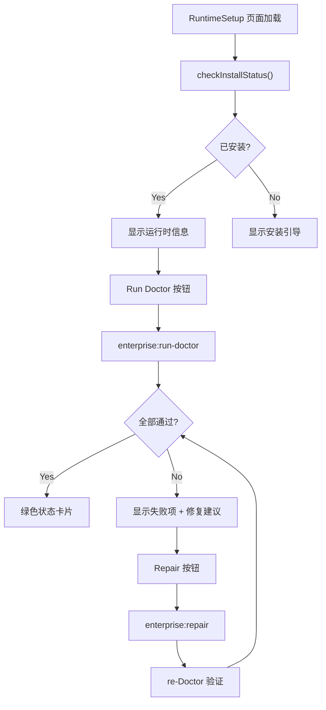
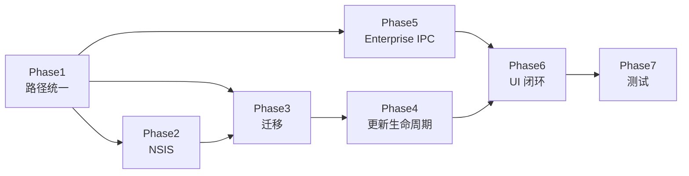

# Desktop Install V1.3 深入功能优化计划

> **计划校验（2026-05-17）**：已与 `prd/desktop_install_v1.3.md` 及当前分支代码对照。PRD §0 要求 `appId: com.smc.copilot`、`executableName: smc-copilot`；本计划采用 **混合身份**（保留 `com.smc.smc-ai-copilot` / `smc-ai-copilot.exe`），须在 PRD 评审中显式确认。部分 Phase 1 项已在工作区落地（`install-location-resolver`、`deployment-config.getHermesBasePath`、`runtime-doctor` agent 路径），下文「现状」列已标注 **部分完成**。

## 功能闭环概述

本计划围绕 PRD 定义的三条核心链路构建完整功能闭环：

```mermaid
flowchart LR
  subgraph installChain [安装链路]
    I1[NSIS 安装器] --> I2[目录/注册表/PATH] --> I3[首启向导]
    I3 --> I4[Agent 源安装] --> I5[venv+pip] --> I6[shim+marker]
  end
  subgraph updateChain [更新链路]
    U1["autoUpdater 检测"] --> U2["下载+进度推送"] --> U3["prepareForAppUpdate"]
    U3 --> U4["释放进程/文件锁"] --> U5["quitAndInstall"]
    U5 --> U6["启动迁移引擎"] --> U7["ensureShims"] --> U8["恢复 Gateway"]
  end
  subgraph repairChain [修复链路]
    R1["RuntimeSetup Doctor"] --> R2["诊断检查项"] --> R3["修复建议"]
    R3 --> R4["enterprise:repair"] --> R5["重跑失败子集"]
    R5 --> R6["re-Doctor 验证"]
  end
  I6 --> U1
  U8 --> R1
  R6 -->|"验证通过"| U1
```



---

## 现状与 PRD 差距（完整清单）

| 领域 | PRD 要求 | 当前实现 | 差距 | 影响链路 |
|------|----------|----------|------|----------|
| 显示身份 | SMC Copilot | CopilotSMC | 仅改 `productName`/快捷方式/文案 | 安装 |
| 技术身份 | `com.smc.copilot` | `com.smc.smc-ai-copilot` | **保留** appId/executableName（hybrid） | 安装+更新 |
| 注册表 | `HKCU\Software\SMC\Copilot` + PreviousVersion | `CopilotSMC`，无版本追踪 | 双读双写 + legacy 键 + 版本字段 | 安装+更新 |
| NSIS 升级 | 固定 GUID、复用 InstallLocation、保留 runtime | 无 GUID；注册表写 `CopilotSMC`；PATH 非幂等；shim 为 `hermes-desktop.cmd` | [build/installer.nsh](build/installer.nsh) 需重写 | 更新 |
| Agent 路径 | `$INSTDIR\runtime\hermes-agent` | `install-location-resolver` / `path-resolver` / `installer` / `python-venv` 已对齐；**`runtime-bundle-manager` 仍用** `{runtimeRoot}/agent/hermes-agent` 旧布局 | **关键断层** | 全部 |
| `deployment.json` primary | 应优先 `{runtimeRoot}/deployment.json` | `getDeploymentConfigPaths().primary` 仍指向 `%ProgramData%\AIOS-Hermes\` | 企业配置读错位置 | 修复 |
| `install-log.ts` / `install-marker.ts` | 应随 resolver | 已通过 `getHermesBasePath()`→`runtimeRoot` 对齐；**旧目录** `%LOCALAPPDATA%\AIOS-Hermes` 下历史文件需迁移 | 迁移 | 更新+修复 |
| `runtime-doctor.ts` agent 路径 | `loc.agentDir` | **部分完成**（已用 `resolveInstallLocation()`）；export 默认目录仍 `getHermesBasePath()/logs` | 小缺口 | 修复 |
| 迁移 | `src/main/migrations/*` | **不存在** | 全新模块 | 更新 |
| 更新前释放 | `prepareForAppUpdate` | `install-update` 直接 `quitAndInstall`（无进程释放） | [src/main/index.ts:1153](src/main/index.ts) | 更新 |
| 更新后恢复 | 启动后 ensureShims + Gateway 自动重启 | `ensureShims()` 定义但**未在启动时调用** | 更新 |
| Enterprise IPC | 13 通道 + 进度事件 | Main 有，Preload/Renderer **无** | [src/preload/index.ts](src/preload/index.ts) | 修复 |
| RuntimeSetup API | `checkInstallStatus`/`runDoctor`/`runRepair`/`reinstallRuntime` | Renderer 调用了，**Preload 不存在** | 修复链路完全断裂 | 修复 |
| `enterprise:run-doctor` | 调用 `runAllChecks` | 返回空 skip 报告 | 修复 |
| `enterprise:get-install-log` | 读取日志文件 | 恒返回空字符串 `""` | 修复 |
| `enterprise:install-cancel` | 流水线协作式取消 | 仅返回 `{ ok: true }`，无实际取消 | 安装 |
| `enterprise:update/repair/rollback` | 增量更新/修复/回滚 | 均返回 `"尚未实现"` | 更新+修复 |
| 安装进度 UI | 持续监听 | [Install.tsx:58](src/renderer/src/screens/Install/Install.tsx) 注册后**立即 cleanup()** | 安装 |
| `InstallWizard` detect | 应调 `firstRunWizardDetectAgent` | 误调 `startInstallWithSource({ sourceType: "local-zip" })`，触发安装而非检测 | 安装 |
| `InstallWizard` 路由 | `#/install-wizard` | Renderer 无 hash 路由，`openWizardWindow()` **未被调用** | 安装 |
| `shim-manager` 文案 | SMC Copilot | 仍显示 `CopilotSMC` | 安装 |
| `app.name` / AppUserModelId | SMC Copilot | `Hermes` / `com.nousresearch.hermes` | [index.ts:1163-1164](src/main/index.ts) | 全部 |
| `installer.ts` 用户安装 | shim 更新 + runtime config | 安装完成后**不调用** `ensureShims` / `writeRuntimeConfig` | 安装 |
| `before-quit` 进程清理 | 停止全部子进程 | 有 `onBeforeQuit` 但 `browserToolServer.stop()` 仅在 `window-all-closed` | 更新 |

---

## 混合产品身份策略（冻结项）

在 [electron-builder.yml](electron-builder.yml) 与 [package.json](package.json) 中：

| 字段 | 值 | 说明 |
|------|-----|------|
| `productName` | `SMC Copilot` | 安装器、快捷方式、卸载项显示名 |
| `appId` | `com.smc.smc-ai-copilot` | **不改为** `com.smc.copilot`，避免与已发布包断链 |
| `executableName` | `smc-ai-copilot` | exe 文件名保持不变 |
| `nsis.shortcutName` / `uninstallDisplayName` | `SMC Copilot` | 用户可见 |
| `nsis.artifactName` | `smc-copilot-${version}-setup.${ext}` | 与 PRD 发布包命名一致 |
| `nsis.guid` | `7D7C5222-4F0C-4BD0-B877-6D62ED5B941A` | **首次正式发布前写入并冻结** |
| `nsis.deleteAppDataOnUninstall` | `false` | 卸载不删用户数据 |
| `AppUserModelId` | `com.smc.smc-ai-copilot` | 对齐 appId，替换 [index.ts:1164](src/main/index.ts) 中 `com.nousresearch.hermes` |

**额外改动**（原计划遗漏）：
- [index.ts:1163](src/main/index.ts)：`app.name = "SMC Copilot"`（当前为 `"Hermes"`）
- `electron-builder.yml` 增加 `extraResources`（PRD §3 要求 defaults/bootstrap/scripts）
- `electron-builder.yml` 增加 `win.target` 明确 `nsis` + `x64` arch

`desktop-runtime.json` 同时写入 PRD 逻辑字段与真实技术字段：

```json
{
  "productName": "SMC Copilot",
  "appId": "com.smc.smc-ai-copilot",
  "executableName": "smc-ai-copilot",
  "installDir": "$INSTDIR",
  "runtimeRoot": "$INSTDIR\\runtime",
  "binDir": "$INSTDIR\\bin",
  "agentDir": "$INSTDIR\\runtime\\hermes-agent",
  "legacyAppIds": ["com.nousresearch.hermes"]
}
```

注册表：**写入** `HKCU\Software\SMC\Copilot`；**读取顺序**：`Copilot` -> `CopilotSMC`（兼容已装版本）-> legacy `HermesDesktop` -> legacy `com.nousresearch.hermes` 卸载项。

---

## Phase 1：路径单一真相源（阻塞项）

**目标**：Enterprise 流水线、Doctor、installer、首启向导、install-log、install-marker 全部指向 `$INSTDIR/runtime/hermes-agent`。

### 1.1 增强 [install-location-resolver.ts](src/main/enterprise/windows/install-location-resolver.ts)（大部分完成）

- **已有**：`HKCU\Software\SMC\Copilot` 优先链、`CopilotSMC`/`HermesDesktop`/卸载项 fallback、环境变量、`readLegacyInstallLocations()`、`getSmcInstallLocation` 别名
- **待做**：`readRegistryInstallInfo` 增加 **HKLM** `Software\SMC\Copilot`（与 NSIS preInit 一致）；`readLegacyInstallLocations` 补充 PRD §10.1 的 `%LOCALAPPDATA%\Programs\Hermes Agent`

### 1.2 改造 [deployment-config.ts](src/main/enterprise/deployment-config.ts)

- **部分完成**：`getHermesBasePath()` 已委托 `resolveInstallLocation().runtimeRoot`
- **待做**：`getDeploymentConfigPaths().primary` 改为 `{runtimeRoot}/deployment.json` 优先；`%ProgramData%\AIOS-Hermes\deployment.json` 仅作 legacy 只读 fallback
- 更新 [preflight-checker.ts](src/main/enterprise/preflight-checker.ts) 中 `%LOCALAPPDATA%\AIOS-Hermes` 文案/检查路径 → 使用 `resolveInstallLocation().runtimeRoot`

### 1.3 [runtime-doctor.ts](src/main/enterprise/doctor/runtime-doctor.ts)（部分完成）

- **已完成**：`runAllChecks` 使用 `resolveInstallLocation().agentDir` + `join(agentDir, "venv")`
- **待做**：`exportDoctorReport` 默认目录改为 `join(loc.runtimeRoot, "logs")`，与 install-log 一致

### 1.4 [install-log.ts](src/main/enterprise/install-log.ts) / [install-marker.ts](src/main/enterprise/install-marker.ts)

- **部分完成**：经 `getHermesBasePath()` 已写入 `{runtimeRoot}/logs` 与 `{runtimeRoot}/install-marker.json`
- **待做**：Phase 3 迁移 `%LOCALAPPDATA%\AIOS-Hermes` 下旧 marker/log；`enterprise:get-install-log` 读新路径最新文件

### 1.5 修复 [runtime-bundle-manager.ts](src/main/enterprise/runtime-bundle-manager.ts)（原计划遗漏）

`resolveRuntimeBundle` 中 `agentPath` 仍为 `join(getHermesBasePath(), "agent", "hermes-agent")`，须改为 `resolveInstallLocation().agentDir`（或 `getDesktopAgentDir()`），与 Bundle 解压目标一致。

### 1.6 统一 Enterprise 依赖 `getHermesBasePath()` 的模块（原计划遗漏）

以下模块仍间接依赖旧布局或 ProgramData，须随 1.2 一并审计：

- [runtime-bootstrapper.ts](src/main/enterprise/runtime-bootstrapper.ts)
- [install-lock.ts](src/main/enterprise/install-lock.ts)
- [preflight-checker.ts](src/main/enterprise/preflight-checker.ts)（`installBasePath`）

### 1.7 统一 [hermes-agent-source-installer.ts](src/main/enterprise/hermes-agent-source-installer.ts) 企业源

- `installFromZip` / `installFromGit` 已安装到 `getDesktopAgentDir()`
- `installHermesAgentSource`（Enterprise 流水线入口）在 agent 缺失时返回 `E_AGENT_SOURCE_NOT_FOUND`，**不自动解压**——与首启 `startInstallWithSource` 分工须在错误码/文档中固定
- [enterprise-installer.ts](src/main/enterprise/enterprise-installer.ts) agent 步骤继续复用 `getDesktopAgentDir()`

### 1.8 统一 [installer.ts](src/main/installer.ts) 用户安装后处理（原计划遗漏）

当前 `runInstallWithSource()` 完成后仅创建 `~/.hermes` 和 `.env`，不调用 `ensureShims()` 也不写 `desktop-runtime.json`。
在安装成功后增加：
- 调用 `ensureShims()` 确保 `hermes.cmd` 指向真实 venv
- 调用 `writeRuntimeConfig(createDefaultRuntimeConfig(sourceConfig))` 写入运行时配置

### 1.9 影响范围摘要

| 需改文件 | 改什么 | 状态 |
|----------|--------|------|
| `install-location-resolver.ts` | 注册表键、legacy 探测、环境变量、`getSmcInstallLocation` | 大部分已有 |
| `deployment-config.ts` | primary `deployment.json` 路径 | 待做 |
| `runtime-bundle-manager.ts` | `agentPath` → `agentDir` | 待做 |
| `runtime-bootstrapper.ts` / `install-lock.ts` | 随 resolver 审计 | 待做 |
| `preflight-checker.ts` | 路径文案与 writable 检查目录 | 待做 |
| `runtime-doctor.ts` | export 日志目录 | 待做 |
| `install-log.ts` / `install-marker.ts` | 旧目录迁移（Phase 3） | 部分完成 |
| `hermes-agent-source-installer.ts` | Enterprise 入口策略文档化 | 待确认 |
| `installer.ts` | 安装后 `ensureShims` + `writeRuntimeConfig` | 待做 |
| `shim-manager.ts` | 文案 `CopilotSMC` -> `SMC Copilot` | 待做 |
| `path-resolver.ts` | PRD 称 `install-location.ts`；保持 `getDesktopAgentDir()` 为唯一 agent 路径出口 | 已有 |

---

## Phase 2：NSIS 升级安全安装器

重写 [build/installer.nsh](build/installer.nsh)，对齐 PRD §4-§6：

1. **`preInit`**：按 PRD §4.2 顺序读取 InstallLocation（与 [install-location-resolver.ts](src/main/enterprise/windows/install-location-resolver.ts) 保持一致）：
   - `HKCU\Software\SMC\Copilot\InstallLocation`
   - **`HKLM\Software\SMC\Copilot\InstallLocation`**（PRD §4.2 第 2 步，原计划遗漏）
   - `HKCU\Software\SMC\CopilotSMC`（已发布过渡版）
   - `HKCU\Software\SMC\HermesDesktop`
   - `HKCU\...\Uninstall\com.nousresearch.hermes\InstallLocation`
   - 默认 `%LOCALAPPDATA%\Programs\SMC Copilot`
2. **`customInstall`**：ensure `bin/`、`runtime/{hermes-agent,logs,cache,downloads}`（不删除已有 agent）
3. **Shim**（桌面 exe 必须使用 **`${APP_EXECUTABLE_FILENAME}`** / `smc-ai-copilot.exe`，**禁止**写死 PRD 样例中的 `SMC Copilot.exe`）：
   - `bin/smc-copilot.cmd` -- 启动桌面应用（替换当前 `hermes-desktop.cmd`）
   - `bin/hermes.cmd` -- 占位或指向 venv（安装后由 [shim-manager.ts](src/main/enterprise/shim-manager.ts) 刷新）
4. 写入 `{runtime}/desktop-runtime.json`（含 hybrid 身份字段）
5. 注册表 `HKCU\Software\SMC\Copilot`：
   - `InstallLocation`、`RuntimeRoot`、`BinDir`、`AppVersion`、`InstallMode`
   - **新增**（原计划遗漏）：`PreviousVersion`（覆盖升级时写入旧版本号）、`LastUpdatedAt`（ISO timestamp）
6. **PATH**：`!include` [build/nsis/Include/AddToPathSafe.nsh](build/nsis/Include/AddToPathSafe.nsh)，仅幂等追加 `$INSTDIR\bin`（替换当前简单 append）
7. 删除旧快捷方式（PRD §10.2，桌面 + 开始菜单）：`Hermes Agent.lnk`、`Hermes Desktop.lnk`
8. **`customUnInstall`**（原计划不够细化）：
   - EnVar 精确移除 `$INSTDIR\bin` 从 User PATH
   - 删除 `Software\SMC\Copilot` 注册表键
   - 删除 `Software\SMC\CopilotSMC` 旧注册表键（如果存在）
   - **不删** `$INSTDIR\runtime/`、`~/.hermes`
   - `SendMessageTimeout` 广播环境变量变更

同步 [electron-builder.yml](electron-builder.yml) 与 [package.json](package.json)（PRD §3 / §11 / §15）：
- `productName: SMC Copilot`
- `nsis.guid`
- `nsis.artifactName: smc-copilot-${version}-setup.${ext}`
- `nsis.deleteAppDataOnUninstall: false`
- **新增**：`extraResources`（`resources/defaults`、`resources/bootstrap`、`resources/scripts/windows`）
- **新增**：`win.target` 明确 `nsis` + `x64`
- **新增**：`publish` 改为 `provider: generic` + 内网 URL 占位
- **package.json**（PRD §11）：`name`/`description`/`homepage`/`build:win` 脚本与版本语义（`1.0.0` 为首个 SMC Copilot 正式身份版本）

构建脚本 [scripts/ensure-nsis-plugins.ts](scripts/ensure-nsis-plugins.ts) 保持 EnVar.dll 校验。

---

## Phase 3：启动迁移引擎

新增目录 `src/main/migrations/`：

| 文件 | 职责 |
|------|------|
| `migration-runner.ts` | 读/写 `{runtimeRoot}/desktop-runtime-state.json`，schemaVersion 递增，包含迁移结果状态 |
| `001-install-location.ts` | 同步 registry <-> desktop-runtime.json；修复 desktop-runtime.json 中缺失的 hybrid 身份字段 |
| `002-runtime-layout.ts` | 调用 legacy 复制逻辑 |
| `003-web-operator-config.ts` | Web Operator 配置路径校正（若存在旧路径） |
| `legacy-hermes-migration.ts` | PRD §10.1：检测 `%LOCALAPPDATA%\HermesDesktop`、`Programs\HermesDesktop`、**`Programs\Hermes Agent`**、`AIOS-Hermes`、`Programs\CopilotSMC` 等；**仅当**新 `runtime/hermes-agent` 不存在时复制；写 `{runtime}/logs/migration.log`；失败不阻塞启动 |

在 [src/main/index.ts](src/main/index.ts) `app.whenReady()` **最早**调用 `runDesktopMigrations()`（在 `setupIPC` / `createWindow` 之前）。

**迁移后处理**（原计划遗漏）：
- 迁移完成后调用 `ensureShims()` 确保 shim 指向正确路径
- 通过 IPC 暴露迁移状态（建议通道名 `enterprise:get-migration-status` 或 `runtime:get-migration-status`，与现有 `enterprise:*` 命名一致）供 RuntimeSetup 展示 warning
- `DesktopRuntimeState` 增加 `migrationWarnings: string[]` 字段

**迁移与更新的衔接**（原计划遗漏）：
- 自动更新 `quitAndInstall` 后重启，迁移引擎检测 `state.appVersion !== app.getVersion()`，执行增量迁移
- 确保迁移引擎在 `ensureShims()` 之前运行（shim 可能因目录变更而需要更新）

---

## Phase 4：自动更新生命周期

新增 [src/main/update/update-lifecycle.ts](src/main/update/update-lifecycle.ts)：

```ts
export async function prepareForAppUpdate(): Promise<void> {
  // 按顺序停止，避免互相依赖导致超时
  stopHealthPolling();
  await stopAllProfileRuntimes();  // profile-runtime-manager
  stopGateway();
  stopSshTunnel();
  stopClaw3d();
  browserToolServer?.stop();
  closeSqliteConnections();        // state.db + profile-runtime.db
  closeLogFileHandles();           // install-log + gateway-log-collector
}
```

修改 `install-update` handler：先 `await prepareForAppUpdate()`，再 `autoUpdater.quitAndInstall(false, true)`。

**更新进度与错误处理**（校正原计划误判）：
- Main 已发送 `update-available` / `update-download-progress` / `update-downloaded` / `update-error`（[index.ts:1118-1137](src/main/index.ts)）
- Preload 已暴露 `onUpdateAvailable` / `onUpdateDownloadProgress` / `onUpdateDownloaded`（[preload/index.ts](src/preload/index.ts)）
- [Layout.tsx](src/renderer/src/screens/Layout/Layout.tsx) 已订阅并在侧栏展示下载百分比
- **待做**：补全 Preload `onUpdateError`；`onUpdateDownloadProgress` 回调内同步 `setUpdateState("downloading")`（避免仅点击按钮后才进入 downloading 态）；`install-update` 前 `prepareForAppUpdate`

**更新后恢复链路**（原计划遗漏）：
自动更新完成并重启后，需要恢复到可用状态：


具体实现：
- `desktop-runtime-state.json` 增加 `previousAppVersion` 字段（由迁移引擎写入）
- 启动时若检测到版本升级，在 Renderer 展示「更新完成」通知
- 确保 `before-quit` 中 `browserToolServer.stop()` 也会被调用（当前仅在 `window-all-closed`）

**`before-quit` 进程清理增强**（原计划遗漏）：
当前 [index.ts:1238-1250](src/main/index.ts) 的 `before-quit` 缺少 `browserToolServer.stop()`，需补全。

---

## Phase 5：Enterprise IPC 全量接线

Main 已注册 13 个 `enterprise:*` 通道（[enterprise-installer.ts](src/main/enterprise/enterprise-installer.ts)）：

`get-deployment-config`、`validate-deployment-config`、`preflight`、`install`、`install-cancel`、`update`、`repair`、`rollback`、`get-install-marker`、`get-install-log`、`open-log-dir`、`run-doctor`、`export-doctor-report`，以及事件 `enterprise-install:progress`。

### 5.1 Preload + 类型

按 [enterprise-contract.ts](src/shared/enterprise/enterprise-contract.ts) 的 `EnterpriseInstallAPI`：

- 在 [src/preload/index.ts](src/preload/index.ts) 增加扁平方法（与现有风格一致）：
  - `enterpriseGetDeploymentConfig`、`enterpriseValidateConfig`、`enterprisePreflight`
  - `enterpriseInstall`、`enterpriseInstallCancel`
  - `enterpriseUpdate`、`enterpriseRepair`、`enterpriseRollback`（原计划遗漏 rollback Preload）
  - `enterpriseGetInstallMarker`、`enterpriseGetInstallLog`
  - `enterpriseOpenLogDir`、`enterpriseRunDoctor`、`enterpriseExportDoctorReport`
  - `onEnterpriseInstallProgress` -> `enterprise-install:progress` 事件
- 更新 [src/preload/index.d.ts](src/preload/index.d.ts)

**RuntimeSetup 所需 API**（原计划遗漏独立列出）：
Renderer 中 `RuntimeSetupScreen` 调用了 4 个不存在的 API，需在 Preload 补充：

| Renderer 调用 | 映射到 IPC | 实现方式 |
|---------------|-----------|----------|
| `hermesAPI.checkInstallStatus()` | `check-install` | 已有 IPC，Preload 暴露为 `checkInstallStatus`（当前仅有 `checkInstall`） |
| `hermesAPI.runDoctor()` | `enterprise:run-doctor` | 需接入 `runAllChecks` |
| `hermesAPI.runRepair(errorCode?)` | `enterprise:repair` | 需实现 |
| `hermesAPI.reinstallRuntime()` | 新增 `enterprise:reinstall-runtime` 或复用 `enterprise:install` | 需决策 |

### 5.2 实现桩接口

| IPC | 当前状态 | 实现要点 |
|-----|----------|----------|
| `enterprise:run-doctor` | 返回空 skip 报告 | 调用 `runAllChecks({ config, marker })`，config 从 `loadDeploymentConfig()` 或 fallback 默认配置获取 |
| `enterprise:export-doctor-report` | 返回 `{ ok: false }` | 调用 `runAllChecks` -> 写 JSON 到 `{runtime}/logs/doctor-{timestamp}.json` -> 返回路径 |
| `enterprise:get-install-log` | 恒返回 `""` | 读 `{runtime}/logs/install-*.log` 最新文件内容（[install-log.ts](src/main/enterprise/install-log.ts) 已有日志格式） |
| `enterprise:install-cancel` | 仅 `{ ok: true }` | 在 `executeEnterpriseInstallPipeline` 中检查 `cancellationToken.cancelled`（已存在但未接线），每个阶段前检查 |
| `enterprise:update` | `"尚未实现"` | 实现流程：检查 install-marker -> 备份当前 shim/config -> 重跑 agent+venv+pip -> 更新 marker `version` 字段 |
| `enterprise:repair` | `"尚未实现"` | 实现流程：按 [enterprise-contract.ts](src/shared/enterprise/enterprise-contract.ts) 的 `EnterpriseRepairInput.level`（`RepairLevel`）重跑对应子步骤 -> re-doctor 验证；Renderer 传入的 `errorCode` 映射到 level |
| `enterprise:rollback` | `"尚未实现"` | 最小可行：读 marker `previousVersion` + 回退 shim 路径 + 提示用户手动操作 |
| `enterprise:open-log-dir` | 返回 `{ ok: true }` 未验证 | 调用 `shell.openPath(resolveInstallLocation().runtimeRoot + "/logs")` |

### 5.3 启动时 Shim

在 `app.whenReady()` 调用 [shim-manager.ts](src/main/enterprise/shim-manager.ts) `ensureShims()`，用真实 venv 路径覆盖 NSIS 占位 `hermes.cmd`。

**调用时机**（原计划不够明确）：位于 `runDesktopMigrations()` 之后、`setupIPC()` 之前。

### 5.4 Enterprise 流水线取消机制完善（原计划遗漏）

当前 [enterprise-installer.ts:54](src/main/enterprise/enterprise-installer.ts) 已定义 `cancellationToken = { cancelled: false }`，但流水线各步骤中**从未检查**。
需要在每个 `onProgress(makeProgress(...))` 之后增加 `if (cancellationToken.cancelled) { lock.release(); return cancelled_result; }`。

### 5.5 enterprise:install 幂等性（原计划遗漏）

当前 `executeEnterpriseInstallPipeline` 开头检测 `existsInstallMarker()` 后直接返回成功。
问题：如果之前安装不完整（marker 存在但 venv 损坏），会错误地跳过安装。
需要扩展 `EnterpriseInstallInput`（如 `force?: boolean`）支持强制重装，或在 repair 链路中先删除 marker 再重跑（当前契约仅有 `skipPreflight` / `skipDoctor`）。

---

## Phase 6：安装/更新/修复 UI 闭环

### 6.1 修复安装进度 Bug（P0 阻塞级）

[Install.tsx:40-58](src/renderer/src/screens/Install/Install.tsx)：当前代码：
```ts
function startInstallWithSource(config) {
  const cleanup = window.hermesAPI.onInstallProgress((p) => { ... });
  window.hermesAPI.startInstallWithSource(config).then(...);
  cleanup(); // BUG: 立即取消监听，安装过程中收不到任何进度事件
}
```

修复方案：将 `onInstallProgress` 移入 `useEffect`，在组件卸载或安装完成时 cleanup：
```ts
useEffect(() => {
  const cleanup = window.hermesAPI.onInstallProgress((p) => { setProgress(p); });
  return cleanup;
}, []);
```

### 6.2 RuntimeSetup 接线（修复链路核心）

[RuntimeSetupScreen.tsx](src/renderer/src/screens/RuntimeSetup/RuntimeSetupScreen.tsx) 修复链路：



需要：
- Preload 补充 `checkInstallStatus`/`runDoctor`/`runRepair`/`reinstallRuntime`
- 订阅 `enterprise-install:progress` 展示修复/重装进度
- 展示 Doctor 检查项的 `repairHint`，引导用户操作

### 6.3 统一首启向导（原计划保留但需明确决策）

当前存在 **三条安装路径**，必须收敛为一条：

| 路径 | 入口 | API | 状态 |
|------|------|-----|------|
| A: `Install.tsx` + `AgentSourceSelect` | `App.tsx` welcome -> installing | `startInstallWithSource` | **在线，但进度 bug** |
| B: `InstallWizard` 组件 | 未挂载 | 误用 `startInstallWithSource` | **孤立** |
| C: `first-run-wizard.ts` 独立窗口 | `openWizardWindow()` 未调用 | `firstRunWizard*` IPC | **孤立** |

**决策建议**：保留路径 A 作为主入口，修复进度 bug 后功能完整；将路径 C 的 `firstRunWizard*` API 能力（detect-agent + shim + runtime-config 写入）**融合到路径 A 的后处理**中：

1. `Install.tsx` 安装成功后，调用 `firstRunWizardDetectAgent` 验证
2. 安装后处理（shim + runtime config）移入 `installer.ts` 的 `runInstallWithSource`（Phase 1.8 已覆盖）
3. 废弃 `InstallWizard` 组件和 `openWizardWindow`，或标记为 `@deprecated` 留待后续清理

### 6.4 更新 UI 补强（校正）

自动更新主入口在 [Layout.tsx](src/renderer/src/screens/Layout/Layout.tsx) 侧栏，非 Settings。待做：
- Preload 增加 `onUpdateError`，Layout 展示失败 toast/文案
- 下载进度事件驱动 `updateState === "downloading"`（与 `downloadPercent` 联动）
- `install-update` 经 Phase 4 `prepareForAppUpdate` 后再 `quitAndInstall`
- 可选：Settings「引擎更新」与 `electron-updater` 区分文案，避免用户混淆 Hermes pip 更新与桌面 App 更新

### 6.5 产品文案统一

需修改的文案位置：
- [shim-manager.ts:22](src/main/enterprise/shim-manager.ts)：`CopilotSMC` -> `SMC Copilot`
- [install-wizard.tsx:161](src/renderer/src/components/install-wizard/install-wizard.tsx)：`CopilotSMC`
- [install-wizard.tsx:347](src/renderer/src/components/install-wizard/install-wizard.tsx)：`CopilotSMC`
- [index.ts:1163](src/main/index.ts)：`Hermes` -> `SMC Copilot`
- i18n locale 文件中 `Hermes Agent` / `CopilotSMC` 相关 key

### 6.6 安装后导航优化（原计划遗漏）

当前 `Install` 完成后仅跳转 `setup`（API Key 配置），但用户可能需要先确认运行时状态。
建议在 setup 完成进入 main 后，如果是首次安装，侧边栏高亮 RuntimeSetup 并自动运行一次 Doctor。

---

## Phase 7：测试与验收

### 自动化

- 单测：`install-location-resolver`（registry fallback、legacy 探测、环境变量优先级）
- 单测：`migration-runner`（schema 递增、不覆盖已有 agent、warning 收集）
- 单测：`update-lifecycle`（`prepareForAppUpdate` 调用各 stop 函数）
- **新增**（原计划遗漏）：单测 `install-marker.ts` 和 `install-log.ts` 路径一致性（确认与 resolver 对齐）
- **新增**（原计划遗漏）：单测 `enterprise:install-cancel` 的 cancellationToken 传播
- 更新 [tests/preload-api-surface.test.ts](tests/) 覆盖 enterprise + first-run + update 事件 API
- 更新 [docs/API_CONTRACTS.md](docs/API_CONTRACTS.md)

### 手动矩阵（PRD §14）

1. **首次安装** -> `D:\SMC\Copilot`，PATH 一条 `bin`，`runtime/hermes-agent` 可后装
2. **覆盖升级** 1.0.0->1.0.1：目录不变、runtime 保留、`~/.hermes` 保留、PATH 不重复、PreviousVersion 写入
3. **自动更新**：无文件占用错误，Gateway 可重启，shim 指向正确
4. **旧 Hermes 迁移**：不装第二套；profiles/config 保留；旧快捷方式清理
5. **修复链路**（原计划遗漏）：Doctor 检测失败项 -> Repair 修复 -> re-Doctor 全部通过
6. **卸载**（原计划遗漏）：PATH 被精确移除、注册表清理、runtime 和用户数据保留

### 闭环验证场景（原计划遗漏）

完整闭环测试：首次安装 -> 运行 Doctor -> 人为破坏 venv -> Doctor 检测到失败 -> Repair -> Doctor 通过 -> 发布新版本 -> 覆盖升级 -> Doctor 再次通过

---

## 实施顺序与依赖



建议 PR 拆分（便于评审）：

1. **PR1**：Phase 1（路径统一 + install-log/marker/doctor 修复 + installer.ts 后处理 + 进度 bug 修复）
2. **PR2**：Phase 2（NSIS 重写 + electron-builder 混合身份 + extraResources）
3. **PR3**：Phase 3 + Phase 4（迁移引擎 + 更新生命周期 + before-quit 补全）
4. **PR4**：Phase 5（Enterprise Preload 全量 + RuntimeSetup API + 桩实现补齐 + cancel 机制）
5. **PR5**：Phase 6（UI 闭环 + RuntimeSetup 接线 + 向导决策 + 文案统一 + 更新 UI）

---

## 风险与缓解

| 风险 | 缓解 |
|------|------|
| `appId` 与 PRD 不一致导致 NSIS 升级识别 | 固定 `nsis.guid` + `preInit` 读 legacy 卸载项 InstallLocation |
| NSIS shim 写死 `SMC Copilot.exe` 与 hybrid `smc-ai-copilot.exe` 不符 | 使用 `${APP_EXECUTABLE_FILENAME}`；与 electron-builder `executableName` 对齐 |
| 双注册表键（Copilot vs CopilotSMC） | NSIS 写 `Copilot`；Electron 读 `Copilot` 再 `CopilotSMC`；迁移引擎清理旧键 |
| Enterprise 与 legacy `startInstallWithSource` 行为不一致 | Phase 1.7 让两条路径共享后处理逻辑（shim + config） |
| 迁移复制大 runtime 耗时 | 异步 + warning 状态，不阻塞 `createWindow`；UI 展示迁移进度 |
| PATH EnVar 插件缺失 | `ensure-nsis-plugins.ts` 构建门禁 |
| `install-marker` 路径错误导致重复安装（原计划遗漏） | Phase 1.5 统一后，marker 和 doctor 共享同一 resolver |
| `before-quit` 遗漏 browserToolServer 导致更新文件占用（原计划遗漏） | Phase 4 补全 `before-quit` 清理 |
| repair 无法定位具体失败子步骤（原计划遗漏） | Doctor 返回 `errorCode` + `repairHint`，repair 按 errorCode 精确重跑 |

---

## 计划完整性自检（对照 PRD §13–§15）

| PRD 任务块 | 本计划 Phase | 备注 |
|------------|--------------|------|
| Task 1 固定应用身份 | Phase 2 + 混合身份节 | PRD `com.smc.copilot` → 计划保留 hybrid，需产品签字 |
| Task 2 NSIS 覆盖升级 | Phase 2 | 含 HKLM、EnVar、卸载 PATH |
| Task 3 运行时目录迁移 | Phase 1 + 3 | 含 `runtime-bundle-manager` |
| Task 4 更新前释放进程 | Phase 4 | 含 profile runtime + SQLite |
| Task 5 旧 Hermes 迁移 | Phase 3 | 含 `Programs\Hermes Agent` |
| §11 package.json | Phase 2 | 已补入 |
| §14 测试矩阵 | Phase 7 | 含闭环场景 |
| PRD `install-location.ts` | Phase 1 | 实现文件名为 `install-location-resolver.ts` |
| PRD `shim-writer.ts` | Phase 2 + 5 | 由 `shim-manager.ts` 承担 |

## 不在本次范围（需产品确认后另开）

- 内网 `publish.url` 真实地址配置（仅占位）
- `enterprise:rollback` 完整版本快照（可先最小实现 + 文档说明限制）
- macOS/Linux 安装器对齐（PRD 聚焦 Windows）
- `runtime-jobs.ts` SQLite 作业表接入 IPC/UI（已有 DB 层，但无消费端）
- PRD 要求的 `appId`/`executableName` 全量切换为 `com.smc.copilot` / `smc-copilot`（若放弃 hybrid 策略则单独立项）
