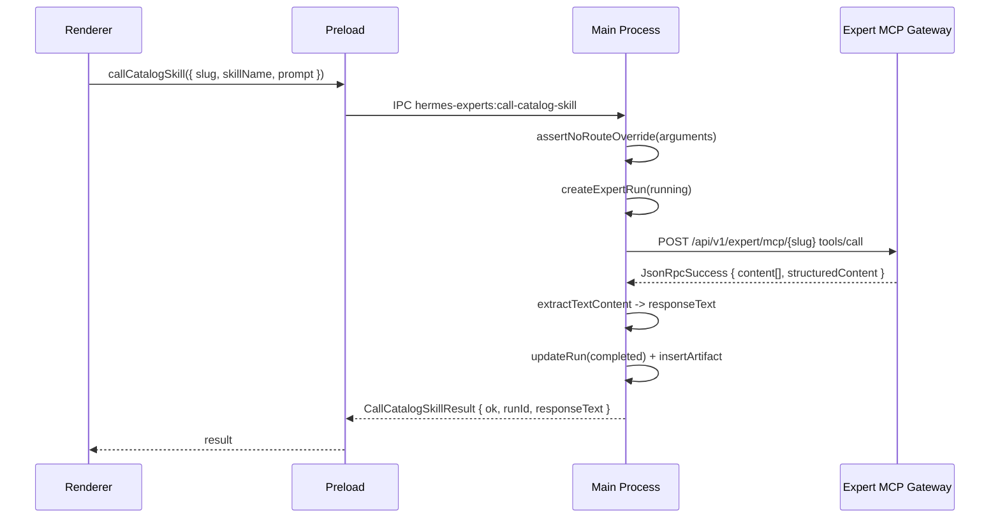

# Expert MCP v6.1 Desktop Hotfix 实施计划

## 当前状态与差异分析

当前 v7.2 已实现的基础：
- 函数式 `expert-mcp-client.ts`：`expertMcpRpc` / `callExpertSkill` / `listExpertSkills` / `getExpertGatewayHealth`
- `expert-remote-catalog.ts`：`mapExpertMcpToolToExpert` / `mapExpertMcpToolToTeam`
- `expert-catalog-client.ts`：已用 MCP Gateway 做主路径
- `expert-runtime.ts` / `expert-team-runtime.ts`：各自独立召唤逻辑，都调 `callExpertSkill`
- IPC 有 `get-expert-gateway-health`、`list-expert-skills`、`list-local-artifacts`

PRD v1.2 要求的**关键差异**：

1. **Route Guard**：当前 `sanitizeToolArguments` 仅静默剥离 3 个 key（`_routing`/`_execution`/`route_config`）。PRD 要求 12+ 个禁止字段且**抛异常**而非静默剥离，还须检查 `context` 子字段
2. **Catalog 过滤 Bug**：`listExpertsFromExpertMcpGateway` 的 filter 条件 `kind === "expert" || (kind !== "expert_team" && kind !== "team")` 会把无 kind 的 tool 当作 expert。PRD 要求严格 `kind === "expert"`
3. **统一 `callCatalogSkill`**：当前 `summonExpert`/`summonTeam` 各自独立创建 run + 调 `callExpertSkill`。PRD 要求一个 canonical `callCatalogSkill(CallCatalogSkillInput)` 函数
4. **Shared Contract 缺失类型**：`RemoteCatalogItem`、`RemoteExpertSkill`（PRD 版带 `callEnabled`/`orchestrationMode`/`outputFormats`）、`CallCatalogSkillInput`/`Result`、`ExpertCallArguments`、`ToolsCallResult`（含 `structuredContent`）、typed JSON-RPC、`ExpertHealthResponse`、`ExpertErrorCode` 枚举
5. **HermesExpert/Team 增补字段**：`catalogSlug`、`catalogKind`、`remoteToolName`、`publicSkillCount`、`callableSkillCount`、`catalogStatus`
6. **Class 化 Client**：PRD 推荐 `ExpertMcpClient` class，当前为散函数
7. **Mappers 提取**：PRD 要求独立 `expert-mcp-mappers.ts`
8. **IPC/Preload**：缺 `list-catalog-skills`、`call-catalog-skill`
9. **DB schema**：缺 `catalog_slug`/`catalog_kind`/`skill_name`/`structured_content_json`/`invocation_id`/`execution_mode` 列
10. **统一 ExpertCatalogCallDrawer**：当前 expert/team 各自有 CallDrawer
11. **ExpertCard 状态**：缺 `catalogStatus`/`callableSkillCount` 驱动的禁用逻辑
12. **错误码**：缺 `ExpertErrorCode` 类型和对应 i18n 文案

---

## 实施步骤

### Task 01：Shared Contract 扩展

文件：[`src/shared/hermes-experts/hermes-experts-contract.ts`](src/shared/hermes-experts/hermes-experts-contract.ts)、[`src/shared/hermes-experts/hermes-experts-errors.ts`](src/shared/hermes-experts/hermes-experts-errors.ts)

- 新增 PRD 7.1-7.5 全部类型：`JsonRpcRequest`/`JsonRpcSuccess`/`JsonRpcError`/`JsonRpcResponse`、`McpToolDescriptor`、`ExpertCatalogAnnotations`、`ExpertSkillAnnotations`、`ToolsListResult`、`RemoteCatalogItem`、`RemoteExpertSkill`、`ExpertCallArguments`、`ToolsCallResult`（含 `McpContent`/`ExpertCallStructuredContent`）、`CallCatalogSkillInput`、`CallCatalogSkillResult`、`ExpertHealthResponse`
- `HermesExpert` 增补：`catalogSlug?`、`catalogKind?`、`remoteToolName?`、`publicSkillCount?`、`callableSkillCount?`、`catalogStatus?`
- `HermesExpertTeam` 增补：同上 + `orchestrationMode` 扩展值
- `HermesExpertsAPI` 增加：`listCatalogSkills(slug): Promise<RemoteExpertSkill[]>`、`callCatalogSkill(input: CallCatalogSkillInput): Promise<CallCatalogSkillResult>`
- `hermes-experts-errors.ts` 增加 `ExpertErrorCode` union type（PRD FR-011 全部错误码）

### Task 02：Route Guard（新文件）

文件：新增 [`src/main/hermes-experts/expert-route-guard.ts`](src/main/hermes-experts/expert-route-guard.ts)

- 实现 `assertNoRouteOverride(args)`：12 个禁止字段集合、检查 `arguments` 一级 + `arguments.context` 一级
- 命中时 `throw new HermesExpertsError("EXPERT_ROUTE_OVERRIDE_FORBIDDEN", ...)`
- 从 `expert-mcp-client.ts` 删除旧的 `FORBIDDEN_ARG_KEYS` + `sanitizeToolArguments`（callSkill 改用 `assertNoRouteOverride`）

### Task 03：Mappers 提取（新文件）

文件：新增 [`src/main/hermes-experts/expert-mcp-mappers.ts`](src/main/hermes-experts/expert-mcp-mappers.ts)

从当前 `expert-remote-catalog.ts` 和 `expert-mcp-client.ts` 提取：
- `mapCatalogTool(tool) -> RemoteCatalogItem | null`（仅 `kind=expert|expert_team`）
- `mapSkillTool(tool) -> RemoteExpertSkill | null`（仅 `kind=expert_skill|expert_team_skill`）
- `mapCatalogItemToHermesExpert(item, index) -> HermesExpert`
- `mapCatalogItemToHermesExpertTeam(item) -> HermesExpertTeam`
- `extractTextContent(result: ToolsCallResult) -> string`
- `normalizeExpertJsonRpcError(error) -> HermesExpertsError`

`expert-remote-catalog.ts` 和 `expert-mcp-client.ts` 改为导入 mappers。

### Task 04：重写 ExpertMcpClient（class 化）

文件：[`src/main/hermes-experts/expert-mcp-client.ts`](src/main/hermes-experts/expert-mcp-client.ts)

- 改为 `ExpertMcpClient` class（PRD 13.1 骨架），构造函数接收 `baseUrl` + `getToken`
- `health() -> Promise<ExpertHealthResponse>`
- `initializeRoot() -> Promise<unknown>`
- `listCatalog() -> Promise<RemoteCatalogItem[]>`（内部调 mappers `mapCatalogTool`）
- `listSkills(slug) -> Promise<RemoteExpertSkill[]>`（内部调 mappers `mapSkillTool`）
- `callSkill({ slug, skillName, arguments: ExpertCallArguments }) -> Promise<ToolsCallResult>`（调用前执行 `assertNoRouteOverride`）
- `postJsonRpc<TResult>(path, body: JsonRpcRequest) -> Promise<TResult>`（内部泛型 JSON-RPC）
- 保留模块级 `getExpertMcpClient()` 单例工厂
- 保留旧函数名 `getExpertGatewayHealth`/`listExpertSkills`/`callExpertSkill` 作为 facade

### Task 05：修复 Catalog 过滤

文件：[`src/main/hermes-experts/expert-remote-catalog.ts`](src/main/hermes-experts/expert-remote-catalog.ts)

- `listExpertsFromExpertMcpGateway`：filter 改为严格 `kind === "expert"`（删除 `kind !== "expert_team" && kind !== "team"` 后备）
- `listTeamsFromExpertMcpGateway`：filter 改为严格 `kind === "expert_team"`
- 映射函数改用 mappers 的 `mapCatalogItemToHermesExpert` / `mapCatalogItemToHermesExpertTeam`
- `catalogSlug`/`remoteToolName`/`publicSkillCount`/`callableSkillCount`/`catalogStatus` 从 annotations 读取并填充到 `HermesExpert`/`Team`

### Task 06：DB Schema Migration

文件：[`src/main/hermes-experts/expert-runtime-db.ts`](src/main/hermes-experts/expert-runtime-db.ts)

在 `migrate()` 增加 schema v3：
```sql
ALTER TABLE expert_runs ADD COLUMN catalog_slug TEXT;
ALTER TABLE expert_runs ADD COLUMN catalog_kind TEXT;
ALTER TABLE expert_runs ADD COLUMN skill_name TEXT;
ALTER TABLE expert_runs ADD COLUMN structured_content_json TEXT;
ALTER TABLE expert_runs ADD COLUMN invocation_id TEXT;
ALTER TABLE expert_runs ADD COLUMN execution_mode TEXT DEFAULT 'remote_mcp';
```

- `createExpertRun` 接受新字段
- `mapRunRow` 映射新列到 `HermesExpertRun`（`result_summary` -> `responseText`，新增 `catalogSlug`/`catalogKind`/`skillName`/`invocationId`/`executionMode`）
- `updateExpertRunStatus` 支持写入 `responseText`/`structuredContentJson`/`invocationId`

### Task 07：实现 callCatalogSkill Runtime

文件：[`src/main/hermes-experts/expert-runtime.ts`](src/main/hermes-experts/expert-runtime.ts)

新增统一函数 `callCatalogSkill(input: CallCatalogSkillInput) -> Promise<CallCatalogSkillResult>`：
1. 创建 run（`running` 状态，写入 `catalogSlug`/`catalogKind`/`skillName`/`executionMode`）
2. 插入 `mcp.call.started` event
3. 调 `ExpertMcpClient.callSkill`
4. 成功：`extractTextContent` -> `responseText`、解析 `structuredContent` -> `structuredContentJson`/`invocationId`；更新 run `completed`；插入 artifact `source=expert_mcp_response`
5. 失败：更新 run `failed`
6. 返回 `CallCatalogSkillResult`

### Task 08：summonExpert/summonTeam 委托

文件：[`src/main/hermes-experts/expert-runtime.ts`](src/main/hermes-experts/expert-runtime.ts)、[`src/main/hermes-experts/expert-team-runtime.ts`](src/main/hermes-experts/expert-team-runtime.ts)

- `summonExpert`：保留外壳，slug 解析 -> `callCatalogSkill({ slug, catalogKind: "expert", skillName, prompt, context })`
- `summonTeam`：保留外壳 -> `callCatalogSkill({ slug, catalogKind: "expert_team", ... })`
- 移除 `remote_mcp` 路径下对 `getExpertInstance`/`startProfile`/`delegationInvoke` 的调用

### Task 09：IPC / Preload 扩展

IPC 文件：[`src/main/hermes-experts/hermes-experts-ipc.ts`](src/main/hermes-experts/hermes-experts-ipc.ts)
- 新增 `hermes-experts:list-catalog-skills` -> `listCatalogSkills(slug)`
- 新增 `hermes-experts:call-catalog-skill` -> `callCatalogSkill(input)`

Preload 文件：[`src/preload/hermes-experts-api.ts`](src/preload/hermes-experts-api.ts)、`src/preload/index.d.ts`
- 新增 `listCatalogSkills(slug)`、`callCatalogSkill(input)`
- `listExpertSkills` 内部委托 `listCatalogSkills`

### Task 10：统一 ExpertCatalogCallDrawer

文件：新增 [`src/renderer/src/screens/Hermes/pages/Experts/components/ExpertCatalogCallDrawer.tsx`](src/renderer/src/screens/Hermes/pages/Experts/components/ExpertCatalogCallDrawer.tsx)

- Props: `{ open, catalogItem: { slug, kind, displayName, callableSkillCount }, onClose }`
- 打开时调 `listCatalogSkills(slug)`
- 过滤 `callEnabled=true`
- 展示 skill 下拉 + `riskLevel`/`approvalMode`/`outputFormats`
- 用户输入 prompt -> 调 `callCatalogSkill`
- 成功跳转 run detail

`HermesExpertsPage` 和 `HermesExpertTeamsPage` 改为使用统一 `ExpertCatalogCallDrawer`。

### Task 11：修复 ExpertCard / ExpertTeamCard

文件：[`src/renderer/src/screens/Hermes/pages/Experts/components/ExpertCard.tsx`](src/renderer/src/screens/Hermes/pages/Experts/components/ExpertCard.tsx)、[`ExpertTeamCard.tsx`](src/renderer/src/screens/Hermes/pages/ExpertTeams/components/ExpertTeamCard.tsx)

- `remote_mcp` 模式下：不显示 install 按钮
- `catalogStatus !== "ready"` 或 `callableSkillCount === 0` 时禁用召唤按钮
- 展示 `catalogStatus` badge

修复 [`ExpertDetailDrawer.tsx`](src/renderer/src/screens/Hermes/pages/Experts/components/ExpertDetailDrawer.tsx)：
- 显示 `catalogSlug`/`publicSkillCount`/`callableSkillCount`

### Task 12：Runs / Artifacts / Workbench UI 修复

- [`ExpertRunDetail.tsx`](src/renderer/src/screens/Hermes/pages/ExpertRuns/components/ExpertRunDetail.tsx)：展示 `responseText`（Markdown）、`skillName`、`catalogKind`、`invocationId`；`remoteTaskId` 仅在有值时显示
- [`HermesWorkbenchPage.tsx`](src/renderer/src/screens/Hermes/pages/Workbench/HermesWorkbenchPage.tsx)：health 展示 `gateway.name`/`version`/`publishedExperts`/`publishedExpertTeams`/`publicSkills`/`callableSkills`（需要 `ExpertHealthResponse` 扩展字段）
- [`HermesArtifactsPage.tsx`](src/renderer/src/screens/Hermes/pages/Artifacts/HermesArtifactsPage.tsx)：确认 `source=expert_mcp_response` 正常预览

### Task 13：i18n + 错误文案

文件：[`src/shared/i18n/locales/en/workspaces.ts`](src/shared/i18n/locales/en/workspaces.ts)、[`zh-CN/workspaces.ts`](src/shared/i18n/locales/zh-CN/workspaces.ts)

新增 PRD FR-011 全部错误码对应的友好文案 key + `callCatalogSkill` / `catalogStatus` / `callableSkillCount` 相关 UI key。

### Task 14：单元测试

- 新增 `tests/expert-route-guard.test.ts`：12 个禁止字段 + context 子字段
- 新增 `tests/expert-mcp-mappers.test.ts`：kind 映射 + 未知 kind 忽略
- 更新 `tests/expert-mcp-client.test.ts`：class 化 client 的 health/listCatalog/listSkills/callSkill/JSON-RPC error
- 更新 `tests/hermes-experts-catalog.test.ts`：严格 kind 过滤
- 更新 `tests/hermes-experts-preload.test.ts`：新增 `listCatalogSkills`/`callCatalogSkill` IPC
- 执行 `npm run typecheck` 和 `npm test`

### Task 15：文档同步

- `docs/API_CONTRACTS.md`：新增 IPC channels
- `docs/renderer/screens/Hermes.md`：更新 Experts 页面行为
- `AGENTS.md`：版本行更新

---

## 数据流（改造后）



## 关键约束

- Renderer 不直接请求 nodeskclaw
- Token 仅在 Main Process 使用
- `annotations.kind` 严格过滤：`expert` -> Experts、`expert_team` -> Teams、其他忽略
- Route override 字段在 Main 层**抛错**拦截（非静默剥离）
- expert 和 expert_team 调用层完全一致，统一走 `callCatalogSkill`
- `remote_mcp` 路径不启动本地 Profile、不执行本地 delegation
