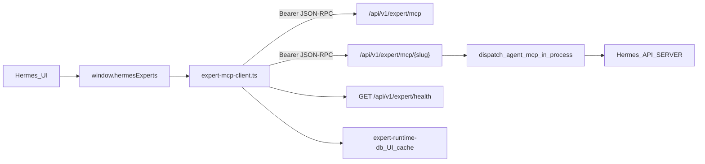

# Expert MCP Gateway v6 页面对接计划

## 背景：当前实现 vs 后端事实

已阅读 [wiki_nodeskclaw/expert_mcp_gateway.md](wiki_nodeskclaw/expert_mcp_gateway.md) 与 [wiki_nodeskclaw/expert-mcp-gateway-v6_107e9494.plan.md](wiki_nodeskclaw/expert-mcp-gateway-v6_107e9494.plan.md)。

| 维度 | 当前 V7.2 Desktop | 后端 Expert MCP v6（已实现） |
|------|-------------------|------------------------------|
| 入口 | 本地 MCP Proxy → Hermes Skill Gateway | **直连** `POST /api/v1/expert/mcp` + Bearer |
| 目录 | REST `/api/v1/hermes/client/experts` 或 `hermes-client tools/list` | Root `tools/list`（专家/团队清单 + annotations） |
| 召唤 | 单次 `tools/call`（expert `toolName`）+ 期望 `task_id` | `POST /expert/mcp/{expert_slug}` → `tools/call`（**skill_name**）+ **`arguments.prompt` 必填** |
| 执行 | 异步 HermesTask + `getTaskResult` 轮询 | **进程内同步**，MCP `content[]` 文本，**不引入 HermesTask** |
| 团队 | 同 expert 单 tool | 同路径 `team_slug`，`ExpertTeamOrchestrator` 顺序编排 + Markdown 合并 |
| 健康 | MCP Gateway diagnostics | `GET /api/v1/expert/health` |

你已确认 Runs/Artifacts 采用 **同步本地模式**（召唤完成即 `completed`，结果文本落本地缓存）。



**保留边界**（与 wiki 一致）：`arguments` 禁止 `_routing` / `_execution` / `route_config`；token 仅 Main；MCP Skill Gateway（`mcp-skill-gateway-runtime`）继续服务非专家 Skill，不与 Expert Gateway 混用。

---

## Phase 1 — Main：Expert MCP Client（新传输层）

新增 [`src/main/hermes-experts/expert-mcp-client.ts`](src/main/hermes-experts/expert-mcp-client.ts)：

- 复用 [`expert-catalog-client.ts`](src/main/hermes-experts/expert-catalog-client.ts) 已有模式：`resolveBackendBaseUrl()` + `getMcpAccessToken()` + `X-Desktop-Id` / `X-Client-Version`
- 核心方法：
  - `getExpertGatewayHealth()` → `GET /api/v1/expert/health`
  - `expertMcpRpc(path, method, params?)` → JSON-RPC 2.0 POST
  - `initializeExpertMcp()` → root `initialize`
  - `listPublishedExpertsAndTeams()` → root `tools/list`，解析 `result.tools[]` + `annotations`（`kind: expert | expert_team`）
  - `listExpertSkills(expertSlug)` → `POST /expert/mcp/{slug}` `tools/list`
  - `callExpertSkill(slug, skillName, { prompt, context })` → `tools/call`；复用 [`expert-remote-client.ts`](src/main/hermes-experts/expert-remote-client.ts) 的 `sanitizeToolArguments` / `buildDefaultRemoteContext`
- 响应解析：
  - 从 `result.content[]` 提取文本（`type: text`）
  - 映射 JSON-RPC error → `HermesExpertsError`（`EXPERT_*` 与 `errors.expert.*` i18n 键对齐）
  - **不再**调用 `extractTaskHintsFromToolResult` / `getHermesTaskResult`

共享类型扩展 [`src/shared/hermes-experts/hermes-experts-contract.ts`](src/shared/hermes-experts/hermes-experts-contract.ts)：

- `ExpertMcpSkill`：`skillName`, `displayName`, `description`, `inputSchema`, `riskLevel`, `approvalMode`, `callEnabled`
- `ExpertMcpCallResult`：`ok`, `contentText`, `durationMs?`, `errorCode?`, `invocationType?`（`expert_skill` | `expert_team`）
- `HermesExpert` 增 `expertSlug`（与后端 `expert_slug` 对齐）；`toolName` 语义改为默认 **skill_name** 或保留为 slug
- `SummonExpertInput` 增 `skillName?: string`；`HermesExpertRun` 增 `responseText?`；`remoteTaskId` 对 Expert Gateway 路径标 **deprecated**

---

## Phase 2 — Catalog：Root tools/list 为主

改写 [`expert-catalog-client.ts`](src/main/hermes-experts/expert-catalog-client.ts) + [`expert-remote-catalog.ts`](src/main/hermes-experts/expert-remote-catalog.ts)：

1. **主路径**：`listPublishedExpertsAndTeams()` → 映射为 `HermesExpert` / `HermesExpertTeam`
   - `expert_slug` → `slug` + `expertSlug`
   - annotations：`category`, `tags`, `risk_level`, `member_count`, `starter_prompts`
   - `installStatus: installed`, `executionMode: remote_mcp`, `profile.profileId: remote`
2. **移除/降级**错误 REST 路径：`/api/v1/hermes/client/experts`、`/api/v1/hermes/experts` 仅作可选 fallback（或删除以免误导）
3. **团队**：root tools/list 中 `kind=expert_team` → `HermesExpertTeam`（`team_slug`, `orchestrationMode: server_managed`）

新增 IPC（[`hermes-experts-ipc.ts`](src/main/hermes-experts/hermes-experts-ipc.ts) + preload）：

- `hermes-experts:get-expert-gateway-health`
- `hermes-experts:list-expert-skills`（`expertSlug`）

---

## Phase 3 — Summon：同步 tools/call（专家 + 团队）

改写 [`expert-runtime.ts`](src/main/hermes-experts/expert-runtime.ts) / [`expert-team-runtime.ts`](src/main/hermes-experts/expert-team-runtime.ts)：

```
summonExpert:
  resolve expertSlug + skillName（默认：该专家 tools/list 第一个 call_enabled skill）
  createExpertRun(status: running)
  callExpertSkill(expertSlug, skillName, { prompt, context })
  on success:
    updateExpertRunStatus(completed)
    insertRunEvent(mcp.call.completed)
    insertArtifact(markdown, source: expert_mcp_response, previewText: contentText)
  on error:
    map EXPERT_APPROVAL_REQUIRED / EXPERT_ROUTE_OVERRIDE_FORBIDDEN / EXPERT_UPSTREAM_*
```

- **删除**对 `syncRemoteRunFromTask` / `setExpertRunRemoteTaskId` 的 Expert 路径依赖
- [`expert-run-bridge.ts`](src/main/hermes-experts/expert-run-bridge.ts)：远端 expert run 不再触发 team dispatch 或 task 同步

[`expert-remote-client.ts`](src/main/hermes-experts/expert-remote-client.ts)：保留 artifact import 工具函数；`callRemoteExpertTool` 改为委托 `expert-mcp-client` 或标记 deprecated

---

## Phase 4 — Renderer 页面对齐

### 4.1 ExpertCallDrawer / ExpertTeamCallDrawer

[`ExpertCallDrawer.tsx`](src/renderer/src/screens/Hermes/pages/Experts/components/ExpertCallDrawer.tsx)：

- 打开时 IPC `listExpertSkills(expert.slug)` 加载 **能力下拉**（skill_name + 风险/审批 badge）
- 展示 `inputSchema` 摘要（只读）
- 提交：`{ prompt, skillName, context }`

[`ExpertTeamCallDrawer.tsx`](src/renderer/src/screens/Hermes/pages/ExpertTeams/components/ExpertTeamCallDrawer.tsx)：团队无多 skill 选择时仅 prompt；调用 `team_slug` 路径 `tools/call`（name 可为团队默认 skill 或后端约定名）

### 4.2 ExpertDetailDrawer / ExpertTeamDetailModal

- 展示 `expertSlug`、公开技能列表（来自 `listExpertSkills`）
- 移除任何「安装」残留文案

### 4.3 Runs 页（同步模型）

[`useExpertRuns.ts`](src/renderer/src/screens/Hermes/pages/ExpertRuns/hooks/useExpertRuns.ts)：

- **移除** `syncRemoteRun` 5s 轮询（Expert Gateway 路径）
- `getRunTimeline` 仅读本地 `expert_run_events`（`mcp.call.*` + 团队编排事件若后端未来写入 content metadata）

[`ExpertRunDetail.tsx`](src/renderer/src/screens/Hermes/pages/ExpertRuns/components/ExpertRunDetail.tsx)：

- 展示 `responseText` / markdown artifact 预览
- 隐藏 `taskId` 行（或仅 legacy run 显示）
- 团队 [`ExpertRunMemberPanel`](src/renderer/src/screens/Hermes/pages/ExpertRuns/components/ExpertRunMemberPanel.tsx)：短期仅展示本地事件；若响应含合并 Markdown，作为 team artifact

### 4.4 Workbench

[`HermesWorkbenchPage.tsx`](src/renderer/src/screens/Hermes/pages/Workbench/HermesWorkbenchPage.tsx)：

- 连接状态改调 `getExpertGatewayHealth`（替代仅看 catalog source）
- 「打开 MCP Gateway」保留 Skill Gateway 入口；新增「Expert Gateway 健康」指标

### 4.5 Artifacts

[`HermesArtifactsPage.tsx`](src/renderer/src/screens/Hermes/pages/Artifacts/HermesArtifactsPage.tsx)：

- 数据源改为本地 `expert-runtime-db` artifacts（`source: expert_mcp_response`）
- 移除对 `listRunArtifacts` → hermes-client 的强依赖；preview 直接读 `previewText`

### 4.6 Workbench 连接与 i18n

- [`workspaces.ts`](src/shared/i18n/locales/en/workspaces.ts) / zh-CN：增 `experts.skillName`、`experts.gatewayHealth`、`expertRuns.response` 等
- [`Hermes.css`](src/renderer/src/screens/Hermes/Hermes.css)：skill 选择器样式（小范围）

---

## Phase 5 — IPC / 契约 / 文档

- 更新 [`docs/API_CONTRACTS.md`](docs/API_CONTRACTS.md) § Hermes Experts：新增 Expert Gateway channel；标注 HermesTask 相关 channel 为 **Expert 路径不适用**
- 更新 [`docs/specs/v7.2-nodeskclaw-remote-experts/01-architecture-boundary.md`](docs/specs/v7.2-nodeskclaw-remote-experts/01-architecture-boundary.md)：传输层改为 `/api/v1/expert/*`，同步调用
- 增量更新 [`AGENTS.md`](AGENTS.md) / [`docs/renderer/screens/Hermes.md`](docs/renderer/screens/Hermes.md)

**废弃但保留**（不删代码）：`hermes-experts:sync-remote-run`、`get-run-result` 等 HermesTask IPC — 供 MCP Skill Gateway / hermes-client 其他场景；Expert 页不再调用。

---

## Phase 6 — 测试

| 文件 | 覆盖 |
|------|------|
| `tests/expert-mcp-client.test.ts`（新） | JSON-RPC 映射、content 提取、route guard、错误码 |
| `tests/hermes-experts-remote.test.ts` | 改为测 `mapExpertMcpToolToExpert`（annotations） |
| `tests/hermes-experts-preload.test.ts` | 新 IPC surface |
| `tests/hermes-experts-catalog.test.ts` | mock root tools/list |

验收（手动）：

1. 登录 nodeskclaw → Workbench 显示 Expert Gateway health OK  
2. Experts 列表来自 root `tools/list`（非 mock）  
3. 打开专家 → 看到 skills 列表 → 选 skill + prompt → 召唤  
4. Run 立即 `completed`，详情可见响应文本；**无**本地 expert Profile、**无** `task_id`  
5. 团队召唤返回合并 Markdown  

---

## 不在本次范围

- nodeskclaw-backend 代码修改  
- Desktop 读取 Portal 专用 `GET /expert/admin/invocation-logs`（无 Bearer Desktop 契约）  
- MCP Skill Gateway 页面行为变更（仅 Experts 域切 Expert Gateway）  
- 物理删除 V7.2 HermesTask 代码路径
