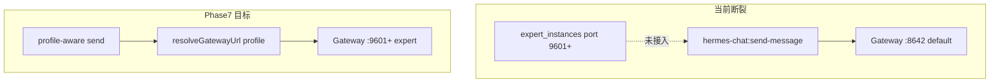

# Hermes Experts Workspace — Phase 7/8 闭环计划

## 现状与差距（相对 [prd_work/v1.0_clone-workbuddy-expert.md](prd_work/v1.0_clone-workbuddy-expert.md) §19）

V7.1 已交付：三页导航、[`window.hermesExperts`](src/preload/hermes-experts-api.ts)、[`expert-runtime.db`](src/main/hermes-experts/expert-runtime-db.ts)、InstallPlan Drawer、Active Expert Bar、团队 `leader_dispatch` MVP、Inspector 四 Tab 骨架。

**关键断裂点**（阻塞 E2E）：

| PRD 要求 | 当前实现 | 缺口 |
|---------|---------|------|
| 消息发到 expert profile (§19 #10) | [`hermes-default-chat-ipc.ts`](src/main/hermes-default-chat/hermes-default-chat-ipc.ts) 传 `profile`，但 [`getApiUrl()`](src/main/hermes.ts) 固定 `:8642` | 专家 Chat 仍走 default Gateway |
| summon → `startProfile` (§10.1) | [`expert-runtime.ts`](src/main/hermes-experts/expert-runtime.ts) 调 `startProfile` | `startProfile` 要求 profile 在 [`profile-runtime.db`](src/main/profile-runtime-db.ts) 已部署；安装仅写文件 + `expert_instances`，**未注册 runtime** |
| InstallPlan 写 Skill/MCP/policy (§9.4) | [`expert-installer.ts`](src/main/hermes-experts/expert-installer.ts) 仅 SOUL/USER/config/MEMORY/manifest | 缺 `policy.json`、`config.yaml` merge、Skill 安装、MCP 注册 |
| 工具/MCP 写入 timeline (§19 #13) | 团队 dispatch 有 `insertRunEvent` | Chat `onToolProgress` / MCP 未桥接到 `expert_run_events` |
| 团队 Leader 收用户任务 (§11.1) | [`executeLeaderDispatch`](src/main/hermes-experts/expert-team-runtime.ts) 仅在 `summonTeam` 带 `userPrompt` 时触发 | Chat 首条消息未触发 dispatch |
| Trust 阻断高风险 (§13) | [`expert-policy.ts`](src/main/hermes-experts/expert-policy.ts) 存在但 summon 忽略 `EXPERT_TRUST_REQUIRED` | Chat/MCP 路径无 enforcement |
| Inspector Tools/MCP (§12.2) | 仅 Timeline/Artifacts/Members/Audit | 缺 Tools·Skills·MCP Calls 面板 |



---

## Phase 7 — PRD v1.0 E2E 闭环（优先）

### 7.1 Expert Profile 运行时注册与 Gateway 路由

**目标**：安装/召唤的专家 Profile 可独立启停，Chat 请求打到正确端口（PRD §14.1 `9601-9699`）。

**Main 改动**：

1. 新增 [`src/main/hermes-experts/expert-profile-manager.ts`](src/main/hermes-experts/expert-profile-manager.ts)（PRD §7.2 已规划但未实现）：
   - `registerExpertProfileRuntime(input)`：安装成功后向 `profile-runtime.db` 写入动态 profile（`runtime_type: hermes-local`，port 来自 InstallPlan / `expert_instances.gateway_port`）
   - `resolveExpertGatewayUrl(profileId)`：从 `expert_instances` 或 runtime DB 解析 `http://127.0.0.1:{port}`
   - 卸载/更新时同步 runtime 状态

2. 扩展 [`hermes.ts`](src/main/hermes.ts)：
   - `getApiUrl(profile?)`：非 default 时优先 `expert-profile-manager` / `profileRuntime.getProfile` 端口
   - `isApiServerReady(profile?)`、`sendMessageViaApi` 使用 profile-scoped URL
   - `startGateway(profile?)`：专家 profile 走 `profileRuntime.startProfile` 或专用 spawn（`HERMES_HOME=profileHome(profile)`）

3. [`expert-installer.ts`](src/main/hermes-experts/expert-installer.ts) 安装末尾调用 `registerExpertProfileRuntime`；团队安装为 leader + 各 member 分别注册。

4. [`expert-runtime.ts`](src/main/hermes-experts/expert-runtime.ts) / [`expert-team-runtime.ts`](src/main/hermes-experts/expert-team-runtime.ts)：召唤前 preflight（端口冲突、profile_home 存在）。

**验收**：安装「客户研究员」→ 召唤 → Chat 发送 → 网络请求命中该专家端口（非 8642）；`profile-runtime` 可见 running 实例。

---

### 7.2 InstallPlan 物化补全（§9.4）

在 [`expert-installer.ts`](src/main/hermes-experts/expert-installer.ts) 补全：

| 文件/能力 | 实现方式 |
|----------|---------|
| `desktop/policy.json` | 从 `HermesExpert.policy` + InstallPlan.riskReport 写入 |
| `config.yaml` merge | 复用 [`hermes-config-yaml.ts`](src/main/hermes-config/hermes-config-yaml.ts) 合并 model/toolsets/`mcp_servers` |
| `skills/` | 复用 [`skills.ts`](src/main/skills.ts) / GeneHub 安装路径；InstallPlan.skills 逐项安装 |
| MCP 注册 | 复用 [`mcp-tool-sync-service`](src/main/mcp/mcp-tool-sync-service.ts) 或 MCP Gateway 注册逻辑；写 `expert_run_events` 类型 `mcp_registered` |
| `expert_team_instances` + members 表 | 团队安装后写入 leader/member 映射（当前仅 `expert_instances` 单 expertId） |

**验收**：安装后 `~/.hermes/profiles/expert.sales.*/desktop/policy.json` 存在；required skill 出现在 profile `skills/`；MCP 出现在 profile `config.yaml`。

---

### 7.3 Chat ↔ Expert Run 联通

**目标**：满足 PRD §19 #13/#14——Chat 行为产生 timeline 与 artifacts。

1. **Main 桥接**（新模块 `expert-run-bridge.ts` 或扩展现有）：
   - 在 [`hermes-default-chat-ipc.ts`](src/main/hermes-default-chat/hermes-default-chat-ipc.ts) `send-message` 前后：若 payload 含 `expert_run_id`，写 `profile_started` / `message_sent` / `message_completed` 事件
   - `onToolProgress` → `tool_call` event；可选 MCP 元数据
   - 流式完成 → [`expert-artifacts.ts`](src/main/hermes-experts/expert-artifacts.ts) 创建 `agent_response` markdown artifact

2. **团队模式**：[`useHermesDefaultChatStream.ts`](src/renderer/src/screens/Hermes/pages/Chat/hooks/useHermesDefaultChatStream.ts) 首条用户消息在 `mode=team` 时调 `hermesExperts.summonTeam` 或新 IPC `hermes-experts:dispatch-team`（带 `runId` + `userPrompt`），触发 [`executeLeaderDispatch`](src/main/hermes-experts/expert-team-runtime.ts)

3. **Renderer**：
   - [`ExpertStarterPrompts.tsx`](src/renderer/src/screens/Hermes/pages/Experts/components/ExpertStarterPrompts.tsx)：`onSelect` → 预填 Chat composer 并导航 chat
   - [`HermesExpertRunsPage.tsx`](src/renderer/src/screens/Hermes/pages/ExpertRuns/HermesExpertRunsPage.tsx)：增加 Cancel / Retry 按钮（已有 IPC）
   - 召唤/信任后刷新 catalog（`setExpertTrust` 后 `refreshExperts`）

**验收**：单专家 Chat 一轮对话后 Run 页可见 tool/message 事件；团队模式首条消息触发成员 dispatch + leader_merge artifact。

---

### 7.4 治理与 Inspector 补全（§12–13）

1. [`expert-policy.ts`](src/main/hermes-experts/expert-policy.ts)：
   - Chat send 前检查 `requireApproval` / MCP write → 返回 `waiting_approval` run status + Renderer 确认 UI
   - `untrusted` 专家：允许 summon/只读 Chat，阻断 MCP write（与 PRD §13.1 默认 `installed + untrusted` 对齐）

2. Inspector 新增 **Tools/MCP** Tab（[`HermesRightInspectorTabs.tsx`](src/renderer/src/screens/Hermes/components/HermesRightInspectorTabs.tsx) + [`HermesExpertInspectorPanel.tsx`](src/renderer/src/screens/Hermes/panels/HermesExpertInspectorPanel.tsx)）：
   - 展示当前专家 `capabilities` + MCP trust 状态 + 最近 run 中 tool/mcp 事件

3. InstallPlan Drawer 增强 RiskReport（networkAccess、localFileAccess、mcpServers 列表，对齐 PRD §13.2）

**验收**：未 trust 专家调用写 MCP 被阻断并提示；Inspector 可见 MCP 列表与 trust 状态。

---

### 7.5 Preflight 与错误 UX（§14.2）

- 新增 `expert-preflight.ts`：安装/召唤前检查 port、profile_home、hermes-agent、copilot-serve（8765）可选降级
- Renderer 将 `errorCode` 映射为可操作文案（如 PRD §14.2 copilot-serve 提示模板）
- i18n：`workspaces.hermes.experts.errors.*`

---

### 7.6 测试与文档

**测试**（Vitest，mock SQLite / profile-runtime）：
- `expert-installer` 物化 policy/config
- `expert-profile-manager` 端口解析
- `getApiUrl(profile)` 非 default 分支
- leader dispatch 事件序列
- preload surface（已有，保持）

**文档**（rule 007）：
- [`docs/API_CONTRACTS.md`](docs/API_CONTRACTS.md) 补充新增 IPC（若有 `dispatch-team` / preflight）
- [`docs/renderer/screens/Hermes.md`](docs/renderer/screens/Hermes.md)、[`docs/renderer/INDEX.md`](docs/renderer/INDEX.md)
- [`AGENTS.md`](AGENTS.md) V7.1.1 版本行

---

## Phase 8 — nodeskclaw Desktop 同步（PRD §15.8–15.10）

在 Phase 7 E2E 通过后实现远端同步（仍不实现 nodeskclaw 服务端，仅 Desktop Client）。

### 8.1 Desktop Register + Token

- 新模块 [`src/main/hermes-experts/expert-desktop-client.ts`](src/main/hermes-experts/expert-desktop-client.ts)：
  - `POST /api/v1/hermes/desktop/register`（`deviceFingerprint`、`appVersion`、capabilities）
  - Token 存 Main（复用 [`token-store`](src/main/auth/token-store.ts) 模式，**不暴露 Renderer**）
  - 失败降级：仅本地 mock/cache（与 catalog 一致）

### 8.2 Heartbeat Scheduler

- 定时 `POST /api/v1/hermes/desktop/{desktopId}/heartbeat`：上报已安装 expert profiles 状态、MCP Gateway proxy 状态
- 与 [`genehub-scheduler.ts`](src/main/genehub/genehub-scheduler.ts) 模式对齐；App `before-quit` 停止

### 8.3 Expert Run Report

- Run 完成/失败时 `POST .../expert-runs/report`（payload 对齐 PRD §15.10）
- 从 [`expert-runtime-db`](src/main/hermes-experts/expert-runtime-db.ts) 聚合 events/artifacts summary

### 8.4 IPC / Preload（可选薄层）

- `hermes-experts:get-desktop-sync-status` / `hermes-experts:register-desktop`（手动重试）
- Settings 或 Experts 页连接状态 pill（复用 GeneHub Connection Card 模式）

**验收**：登录且 backend 可达时 register + heartbeat 成功；完成一次 team run 后 report 请求发出（可 mock server 单测）。

---

## 建议实施顺序

```text
7.1 Gateway 路由 + runtime 注册  （阻塞一切 E2E）
  → 7.2 安装物化补全
  → 7.3 Chat↔Run 联通
  → 7.4 治理 + Inspector
  → 7.5 Preflight + 错误 UX
  → 7.6 测试 + 文档
  → 8.1–8.4 nodeskclaw 同步
```

## 不在本阶段范围（PRD §2.3 已声明）

- WebOperator / Hermes Panel 深度联动
- nodeskclaw 服务端实现
- 复杂 DAG 编排、企业 RBAC 后台
