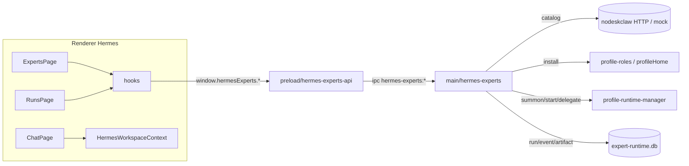

# Hermes Experts Workspace（克隆 WorkBuddy 专家体验）v1.0

## 设计取向（关键决策）

- **复用优先**：专家「安装为 Profile」复用 V4.0 `profileRoleApi`（`previewExpertPreset`/`installPreset`）与现有 Profile 物化；「召唤/启停/委派」复用 `profileRuntimeApi`（`startProfile`/`stopProfile`/`delegate`/`listAuditEvents`）。仅新增 **expert-catalog（目录）** 与 **expert-run（运行记录）** 两层薄封装 + 独立 `expert-runtime.db`，避免重造 profile 生命周期轮子。
- **分阶段交付**：先打通骨架（导航+三页+mock 目录），再逐步接安装、召唤、团队 Dispatch、Timeline。
- **nodeskclaw 仅契约**：`expert-catalog-client` 实现 HTTP 调用 + 失败回退 mock/缓存；后端报文严格对齐 PRD 第 15 章。
- **遵守三层边界**：Renderer 只用 `window.*`；新 IPC 走 Main handler → Preload `hermes-experts-api.ts` → `index.d.ts` → `docs/API_CONTRACTS.md`。所有 Profile 路径走 `profileHome()`。

## 数据流总览

---

## Phase 1 — 基础类型、导航入口、三页骨架、mock 目录

落点（Renderer，主要改/增文件）：
- `src/renderer/src/screens/Hermes/constants.ts`：`HermesNavItemKey` 增加 `experts | expertTeams | expertRuns`；`HERMES_NAV_ITEMS` 增加三项（icon: `Users` / `UsersRound` / `Activity`）；新增对应 `STORAGE_KEYS`。
- `src/renderer/src/screens/Hermes/components/HermesSidebar.tsx`：`ICONS` 注册新图标。
- `src/renderer/src/screens/Hermes/registry/hermes-pages.tsx`：lazy 注册 `HermesExpertsPage` / `HermesExpertTeamsPage` / `HermesExpertRunsPage`。
- 新增页面：`pages/Experts/HermesExpertsPage.tsx`、`pages/ExpertTeams/HermesExpertTeamsPage.tsx`、`pages/ExpertRuns/HermesExpertRunsPage.tsx`（含 loading/empty/error/retry 四态，组件 <250 行）。
- 新增类型：`types/hermes-experts.ts`、`types/hermes-expert-teams.ts`、`types/hermes-expert-runs.ts`（按 PRD 第 4 章接口）。
- 新增 Context：`context/HermesWorkspaceContext.tsx`（`mode/activeProfileId/activeExpertId/activeTeamId/activeRunId/activeSessionId`），由 `HermesDefaultProvider` 内层组合，不改名旧 Context。
- 新增 `context/HermesExpertsContext.tsx` + mock 数据 `pages/Experts/mock/`（销售域 5 专家 + 销售作战团队，对齐 PRD 第 15 章样例报文）。
- i18n：`src/shared/i18n/locales/{en,zh-CN}/workspaces.ts` 补 `nav.experts/expertTeams/expertRuns` 及专家页文案。

验收：左导航出现「专家/专家团队/专家运行」，三页可切换，mock 卡片可展示。

## Phase 2 — nodeskclaw Catalog Client + 目录展示 + 详情

- 共享契约：`src/shared/hermes-experts/hermes-experts-contract.ts`（Expert/Team/Run/InstallPlan/RiskReport/错误码，前后端共用）。
- Main：`src/main/hermes-experts/index.ts` + `expert-catalog-client.ts`（`GET /api/v1/hermes/experts`、`/experts/{id}`、`/expert-teams`、`/expert-teams/{id}`；Bearer + `X-Desktop-Id` 头复用现有 auth token-store / endpoint-config；失败回退 mock/缓存）+ `expert-store.ts`（catalog 缓存表）。
- IPC（`src/main/index.ts` 注册）：`hermes-experts:list-catalog/get-expert/list-teams/get-team`。
- Preload：新增 `src/preload/hermes-experts-api.ts` 暴露 `window.hermesExperts`；`src/preload/index.d.ts` 补类型；`src/main/index.ts` 之外在 preload 入口挂载。
- Renderer hooks：`useHermesExperts.ts` / `useHermesExpertTeams.ts`；组件 `ExpertCard`/`ExpertDetailDrawer`/`ExpertTeamCard`/`ExpertTeamDetailModal`/`ExpertCapabilityList`/`ExpertStarterPrompts`。

验收：可从配置的 nodeskclaw 拉目录；不可用时显示离线态走 mock；专家 Drawer / 团队 Modal 可打开。

## Phase 3 — InstallPlan 预览 + 本地 Profile 物化 + expert-runtime.db

- DB：`~/.hermes/desktop/expert-runtime.db`，新增 migration（按 PRD 第 8 章 9 张表）；模块 `expert-run-store.ts` 负责 schema + 读写。
- Main：`expert-installer.ts`（消费 InstallPlan：经 `profileHome()` 写 `SOUL.md`/`USER.md`/`config.yaml`，按 PRD 9.4 写入策略；Skill/MCP 注册复用现有 skills/mcp 注册路径）；`expert-profile-manager.ts`（profile home 解析，复用 `profileHome`）。
- IPC：`preview-install-expert/install-expert/preview-install-team/install-team`。
- Renderer：`ExpertInstallPlanDrawer`/`ExpertTeamInstallPlanDrawer`（展示文件 diff、Skill/MCP 依赖、RiskReport、需用户确认）；hooks `useExpertInstall.ts`。

验收：安装前可看计划；安装后生成 `~/.hermes/profiles/expert.*`；团队安装生成 leader+member；安装事件入 `expert_install_events`。

## Phase 4 — Chat profile-aware 改造 + 单专家召唤

- API：新增 `api/hermesProfileApi.ts` 工厂 `createHermesProfileApi(profileId)`（与 `hermesDefaultApi` 同形，`P` 改为入参，**保留** `hermesDefaultApi` 兼容）。
- 契约扩展：`src/shared/hermes-default-chat/hermes-default-chat-contract.ts` 的 `HermesChatSendPayload` 增 `expert_id/team_id/expert_run_id/work_mode/invocation_source`；Main chat 透传。
- Main：`expert-runtime.ts` 实现 `summonExpert`（校验已安装→`startProfile`→建 `expert_run`→返回 `activeProfileId/runId/sessionId`，错误码 `EXPERT_NOT_INSTALLED` 等）。
- Renderer：`ChatPage` 顶部 Active Expert Bar + Composer「召唤专家/Ask·Plan·Craft 模式」；发送时按 `HermesWorkspaceContext.activeProfileId` 路由；hooks `useSummonExpert.ts`。

验收：召唤后进 Chat、顶部显示当前专家、消息发到 expert profile、session 归属该 profile、可切回 Default。

## Phase 5 — 专家团队 Leader Dispatch（MVP）

- Main：`expert-team-runtime.ts` 实现 `summonTeam`（启动 leader + 按需 member）+ `leader_dispatch`：Leader 拆解→`profile-runtime:delegate` 调成员→成员结果入 `expert_run_events`→Leader 汇总。委派/返回报文按 PRD 11.2/11.3。
- IPC：`summon-team/list-runs/get-run/cancel-run/retry-run` + 事件流 `hermes-experts:event`（onExpertRuntimeEvent）。
- Renderer：`ExpertRunsPage` 的 `ExpertRunList`/`ExpertRunDetail`/`ExpertRunMemberPanel`；hooks `useExpertRuns.ts`/`useExpertRunEvents.ts`。

验收：可召唤销售作战团队；Run 页显示成员状态；成员失败可定位；Leader 汇总结果。

## Phase 6 — Run Timeline / Artifacts / Trust & Policy

- Main：`expert-artifacts.ts`（产出文件管理→`expert_artifacts`）；`expert-policy.ts`（Trust/Risk/Tool approval，未 trust 禁高风险、MCP 写操作二次确认）。
- Renderer：Chat 右栏 Inspector 增 Timeline/Artifacts/Members/Tools·Skills·MCP/Audit；`ExpertRunTimeline`/`ExpertRunArtifacts`；RiskReport UI；Trust 状态徽章。

验收：每次召唤有 run；工具/委派/MCP 调用有 timeline event；产出进 Artifact 区；未信任专家阻断高风险；MCP 首启需确认。

---

## 文档与测试（每阶段收尾）

- 同步 `docs/API_CONTRACTS.md`（新 IPC channel）、`AGENTS.md` 版本行与目录地图、`docs/renderer/screens/Hermes.md`、`docs/renderer/INDEX.md`（按 rule 007）。
- Vitest：catalog-client mock/回退、install-plan 物化、summon 错误码、leader-dispatch 委派、preload surface。
- `npm run typecheck` 双 tsconfig 通过；Renderer 不 import Node;事件监听返回 unsubscribe。

## 待确认（执行中按默认推进，如需调整请提出）

- 范围默认按 6 阶段渐进交付，先完成 Phase 1+2 可见骨架。
- 后端默认复用 profile-runtime + profile-roles，仅加 expert-catalog/expert-run 薄层。