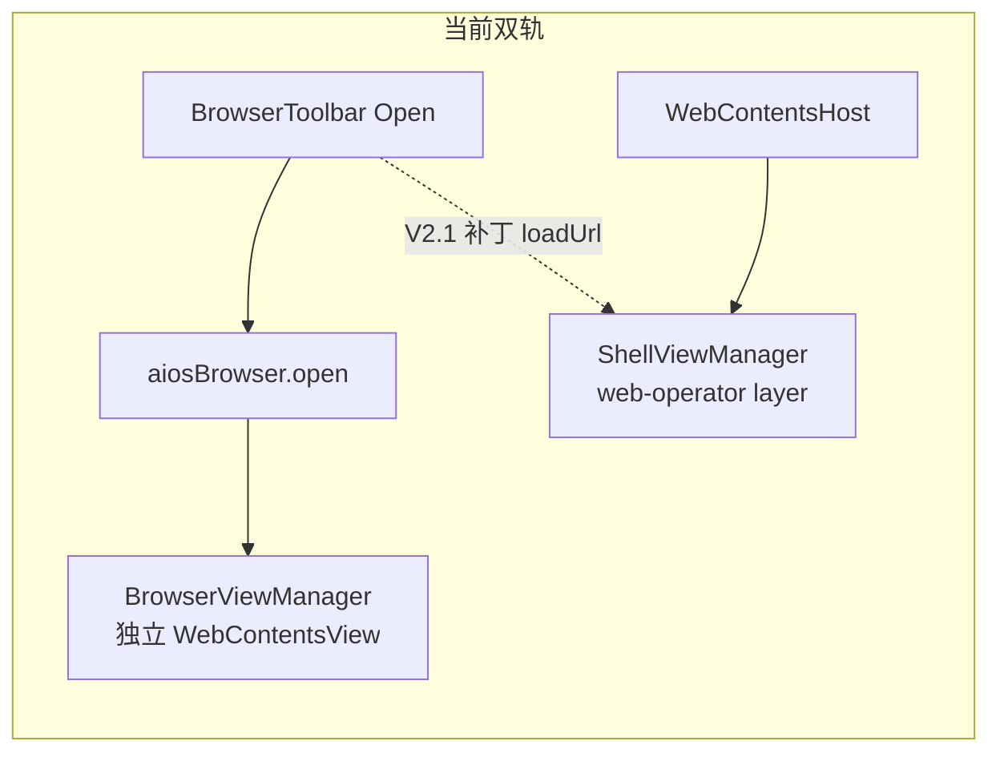
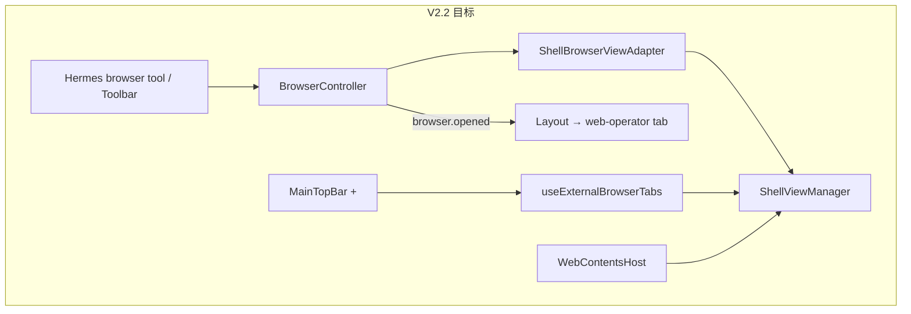

# MainPage 第三阶段（V2.2）实施计划

## 背景与现状

[V2.1 已完成](prd/v2.1_mainpage.md)：MainPage 三态 Sidebar、动态 Profile Tabs、ShellView 全 IPC、`WebOperatorScreen` + `WebContentsHost`。

**当前阻断点**（V2.2 要消除）：



- [`src/main/index.ts`](src/main/index.ts) L1409 仍 `new BrowserViewManager(mainWindow)`
- `shellViewManager` 在 L1328–1350 **块内局部声明**，Web Operator 初始化段（L1402+）**访问不到**同一实例
- [`use-browser-actions.ts`](src/renderer/src/screens/WebOperator/hooks/use-browser-actions.ts) 在 `open` 后手动 `shellView.loadUrl`（适配器完成后可移除）

**目标架构**（PRD §十）：



**用户确认**：external-browser 入口为 **MainTopBar「+」**（输入 URL 后 `openExternalTab` + 导航到新 tab）。

---

## Commit 拆分（与 PRD 一致 + 文档 Commit）

| # | 范围 | 关键文件 |
|---|------|----------|
| 1 | `BrowserViewPort` 抽象 | 新建 [`browser-viewport.ts`](src/main/browser/browser-viewport.ts)；改 [`browser-controller.ts`](src/main/browser/browser-controller.ts)、[`browser-ipc.ts`](src/main/browser/browser-ipc.ts) |
| 2 | `ShellBrowserViewAdapter` | 新建 [`shell-browser-view-adapter.ts`](src/main/browser/shell-browser-view-adapter.ts) |
| 3 | Main 初始化改用适配器 | [`index.ts`](src/main/index.ts) 提升 `shellViewManager` 作用域；Web Operator 段用 adapter |
| 4 | `browser.opened` 事件 | [`browser-contract.ts`](src/shared/browser/browser-contract.ts)、controller、[`browser-api.ts`](src/preload/browser-api.ts)、[`index.d.ts`](src/preload/index.d.ts)、[`Layout.tsx`](src/renderer/src/screens/Layout/Layout.tsx) |
| 5 | external-browser 多 tab | 类型、[`useExternalBrowserTabs.ts`](src/renderer/src/screens/MainPage/useExternalBrowserTabs.ts)、MainTopBar「+」、MainViewTabs、WorkspaceOutlet、[`desktop-shell.ts`](src/renderer/src/types/desktop-shell.ts) |
| 6 | close / reload | MainTopBar 按钮、Layout handlers；**restore** = 切换 tab 时 `WebContentsHost` 重新 setBounds（无已关闭 tab 恢复栈） |
| 7 | Tab DnD | `npm install @dnd-kit/core @dnd-kit/sortable @dnd-kit/utilities`；`tabOrder` + `MainViewTabs` 可拖拽区 |
| 8 | 文档 | `AGENTS.md`、`docs/INDEX.md`、`docs/ARCHITECTURE.md`、`docs/API_CONTRACTS.md`、`docs/MODULES.md` |

---

## Commit 1–2：Main 进程适配层

### 1. `BrowserViewPort` 接口

按 PRD §二 新建接口，方法集对齐 `BrowserController` 现有调用：`createView` / `navigate` / `destroyView` / `updateBounds` / `getExternalWebContents` / `isReady`；`onBoundsUpdate?` 可选（BVM 有，adapter 可不实现）。

`BrowserController`、`BrowserIPC` 构造函数参数改为 `BrowserViewPort`，**不重命名**任何 `browser.*` IPC channel。

### 2. `ShellBrowserViewAdapter`

- `WEB_OPERATOR_LAYER_ID = "web-operator"`（与 renderer [`web-operator-constants.ts`](src/renderer/src/screens/WebOperator/web-operator-constants.ts) 保持一致）
- `createView` / `navigate` → `shellViewManager.createView` 或 `existing.load(url)`
- `updateBounds` → `activateView(layerId, bounds)`；width/height &lt; 1 时 `deactivateView`
- `getExternalWebContents` → `getView(id)?.getWebContents()`
- **partition**：使用现有 [`BROWSER_PARTITION`](src/main/browser/browser-types.ts)（`persist:aios-external-web`），勿用 PRD 示例的 `persist:browser`
- **保留** [`browser-view-manager.ts`](src/main/browser/browser-view-manager.ts) 文件不删（PRD 禁止项）

可选：让 `BrowserViewManager implements BrowserViewPort` 便于单测/回滚，非必须。

---

## Commit 3：index.ts 初始化

1. 在 `app.whenReady` 内、`if (mainWindow)` 之前或块顶声明：

   `let shellViewManager: ShellViewManager | null = null;`

2. 将现有 ShellView 初始化移入该变量赋值（保持 `registerShellViewIpc`）。

3. Web Operator 段：

```ts
if (!shellViewManager) throw new Error("ShellViewManager is required by Web Operator");
const viewManager = new ShellBrowserViewAdapter(shellViewManager);
// securityGuard, auditLogger, controller, browserIPC 不变
```

4. **Renderer 清理**（同 Commit 或 Commit 4）：移除 [`use-browser-actions.ts`](src/renderer/src/screens/WebOperator/hooks/use-browser-actions.ts) 中 `shellLayerId` + 冗余 `loadUrl`（adapter 后 `aiosBrowser.open` 即操作同一 WebContents）。

---

## Commit 4：browser.open → 自动切 Web Operator tab

| 层 | 变更 |
|----|------|
| Shared | `BrowserEvents.OPENED`、`BrowserOpenedEvent`；`BrowserOpenRequest.activateTab?` 可选 |
| Main | `BrowserController.emitBrowserOpened` 在 `openExternalUrl` 成功后 `mainWindow.webContents.send` |
| Preload | `aiosBrowser.onOpened(callback)` + unsubscribe |
| Renderer | `Layout.tsx` `useEffect` 订阅 `onOpened` → `navigation.navigateToView("web-operator")` |

Hermes tool / 用户 Open 均触发切 tab（PRD §五 数据流）。

---

## Commit 5：external-browser 多 tab + MainTopBar「+」

### 类型与路由

- [`main-page-types.ts`](src/renderer/src/screens/MainPage/main-page-types.ts)：`ExternalBrowserTab`、`MainWorkspaceTab.source` 扩展 `"external"`
- [`desktop-shell.ts`](src/renderer/src/types/desktop-shell.ts)：`View` 增加 `` `external-browser:${string}` ``
- [`main-page-tabs.ts`](src/renderer/src/screens/MainPage/main-page-tabs.ts)：`isWorkspaceTabView` 包含 `external-browser:*`

### Hook：`useExternalBrowserTabs`

- `openExternalTab(url)` → `shellView.create(id, "external-browser", url, { layer: "content", sandbox: true, ... })` + state
- `closeExternalTab` → `shellView.destroy` + 从 state 移除
- `reloadExternalTab` → `shellView.loadUrl`
- URL 解析失败时 title 回退为 `"External"`（try/catch `new URL`）

### UI 接线

- **MainTopBar「+」**：点击展开小型 URL 输入（inline popover 或现有 Modal 模式，避免 `window.prompt`）；提交后 `openExternalTab` + `onNavigate(id)`
- **MainViewTabs**：合并 `buildMainWorkspaceTabs` + `externalTabs`；可关闭 tab 显示 `×`（`stopPropagation`）
- **WorkspaceOutlet**：`view.startsWith("external-browser:")` → `<WebContentsHost layerId={view} />`
- **MainPage / Layout**：将 `externalTabs`、`openExternalTab`、`closeExternalTab`、`reloadExternalTab` 从 Layout 下发到 MainTopBar / MainViewTabs

[`shell-view-ipc.ts`](src/main/shell/shell-view-ipc.ts) 对未知 `external-browser:*` layer：**不** lazy-create（仅 `CREATE` 显式创建），`set-bounds` 时 `ensureKnownView` 已支持「必须已存在」— 与 PRD 一致。

---

## Commit 6：Tab close / reload

**MainTopBar** 增加 Reload / Close（仅 `canCloseActiveTab` 时显示 Close）：

| 当前 view | Reload | Close |
|-----------|--------|-------|
| `web-operator` | `aiosBrowser.reload()` | 不可关闭 |
| `external-browser:*` | `reloadExternalTab` | `closeExternalTab` + `navigateToView("aios-home")` |
| 其他 | 本阶段跳过（PRD：不做 aios-home 空 URL reload） |

---

## Commit 7：Tab DnD（@dnd-kit）

1. 安装：`@dnd-kit/core`、`@dnd-kit/sortable`、`@dnd-kit/utilities`

2. **固定左侧**（不可拖）：`aios-home`、`aios-workspace`、`web-operator`

3. **可拖排序**：`profile-workspace:*` + `external-browser:*`；`tabOrder: string[]` 持久于 session（`useState`，本阶段不写盘）

4. `sortTabsByOrder(tabs, tabOrder)` 辅助函数（PRD §八）

5. **约束**（PRD）：
   - `.MainViewTabs` 保持 `no-drag`
   - close 按钮 `stopPropagation`
   - drag handle 区域 `no-drag`
   - DnD 只改 tab 顺序，**不改** ShellView `layerId`

6. CSS：[`main-page.css`](src/renderer/src/screens/MainPage/main-page.css) 增加 drag handle / dragging 状态

---

## 测试（建议，非阻塞 PRD）

| 文件 | 内容 |
|------|------|
| `tests/shell-browser-view-adapter.test.ts` | mock `ShellViewManager`，验证 create/navigate/bounds |
| `tests/main-page-tabs.test.ts` | 扩展 `isWorkspaceTabView("external-browser:uuid")` |
| `tests/tab-order.test.ts` | `sortTabsByOrder` |
| `tests/preload-api-surface.test.ts`（若有） | `onOpened` |

验收命令：`npm run typecheck`、`npm run lint`、`npm test`。

---

## Commit 8：文档同步

在 V2.1 小节之后追加 **V2.2**（或更新同一节），覆盖：

| 文档 | 更新要点 |
|------|----------|
| [`docs/INDEX.md`](docs/INDEX.md) | 消除双轨；7 Commit 能力摘要；external tab「+」入口 |
| [`docs/ARCHITECTURE.md`](docs/ARCHITECTURE.md) | 架构图 BrowserController → Adapter → SVM；`browser.opened` 流 |
| [`docs/API_CONTRACTS.md`](docs/API_CONTRACTS.md) | `BrowserEvents.OPENED`、`aiosBrowser.onOpened`；external-browser layer 约定 |
| [`docs/MODULES.md`](docs/MODULES.md) | 新模块表行；`BrowserViewManager` 标记 legacy；shellView 用法更新 |
| [`AGENTS.md`](AGENTS.md) | V2.2 版本索引；Web Operator 数据流改为单轨；阅读路径更新 |

删除/修正 V2.1 中「双轨」「手动 loadUrl 补丁」等已过时描述。

---

## 禁止项（PRD §十，实施时自检）

- 不重命名 `browser.*` IPC
- 不删 `browser-view-manager.ts`
- `BrowserController` 不直接依赖 `ShellViewManager`
- external-browser **不**作为 Hermes browser tool 默认目标
- 不改 `BrowserSecurityGuard` 策略
- 不关闭 sandbox / contextIsolation

---

## 验收清单（PRD §九 + 用户入口）

1. `typecheck` / `lint` 通过  
2. 运行时**不再** `new BrowserViewManager`（仅 adapter）  
3. `browser.open`（tool / 工具栏）→ ShellView `web-operator` 加载 + 自动切 tab  
4. Toolbar back/forward/reload/getState/screenshot/click/type 仍可用  
5. `browser.update_bounds` 仍可用（转发 SVM）  
6. MainTopBar「+」可创建 external tab 并切换  
7. external tab 可关闭且 `shellView.destroy`  
8. web-operator 与 external tab **layerId 隔离**，互不覆盖  
9. DnD 仅影响可拖 tab 顺序  
