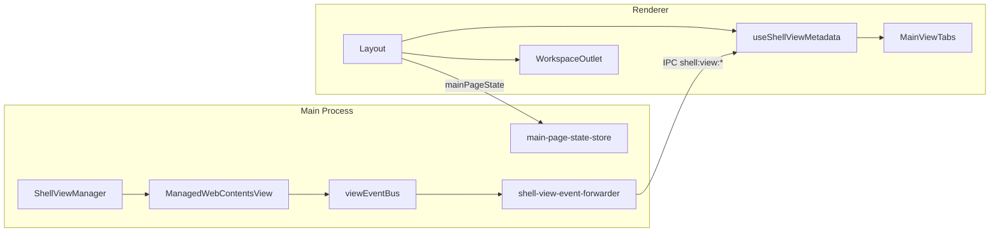

# MainPage V2.3 第四阶段实施计划

## 背景与基线

**已完成（V2.2）**：[`ShellBrowserViewAdapter`](src/main/browser/shell-browser-view-adapter.ts) 统一 Web Operator；[`useExternalBrowserTabs`](src/renderer/src/screens/MainPage/useExternalBrowserTabs.ts) + `external-browser:*` View；[`WebContentsHost`](src/renderer/src/components/shell/WebContentsHost.tsx) 切换时 `hide/setBounds` 不 destroy；[`Layout.tsx`](src/renderer/src/screens/Layout/Layout.tsx) 中 reload 仍部分走 `window.aiosBrowser.reload()`。

**本阶段目标**（[prd/v2.3_mainpage.md](prd/v2.3_mainpage.md) §1）：

| 维度 | 策略 |
|------|------|
| WebView | ShellViewManager 保活，切换仅 hide/setBounds |
| React 页 | `KeepAliveView` + `display:none`，禁止默认条件卸载 |
| 可观测 | metadata → renderer → MainViewTabs |
| 可恢复 | reload/stop/back/forward/recover 全走 `shellView` |
| 可持久 | Main IPC + 磁盘 JSON（非 localStorage） |



---

## Commit 1：ShellView metadata 契约

**文件**：[`src/shared/shell/shell-view-contract.ts`](src/shared/shell/shell-view-contract.ts)

- 将 `ShellViewSnapshot` 扩展为 PRD §3.1 的 `ShellViewMetadata` 字段：`title`、`favicon`、`loading`、`canGoBack`、`canGoForward`、`errorCode/errorDescription`、`crashed*`、`updatedAt`。
- 保留 `ShellViewSnapshot` 作为类型别名（`type ShellViewSnapshot = ShellViewMetadata`），避免大面积重命名。
- 新增 `ShellViewEvents`、`ShellViewMetadataChangedEvent`、`ShellViewLoadFailedEvent`、`ShellViewCrashedEvent`。
- 扩展 `ShellViewChannels`：`RELOAD`、`STOP_LOADING`、`GO_BACK`、`GO_FORWARD`、`RECOVER`（**不重命名**现有 channel，PRD §15）。

**注意**：`ShellViewState`（[`view-contract.ts`](src/shared/shell/view-contract.ts)）仍用 `creating/loading/ready/active/hidden/destroyed`；`loading` 布尔与 `crashed/error` 放在 metadata，不与 state 枚举混用。

---

## Commit 2：Main 侧 metadata + 事件桥

### 2a `ManagedWebContentsView`

**文件**：[`src/main/shell/views/managed-webcontents-view.ts`](src/main/shell/views/managed-webcontents-view.ts)

- 增加 PRD §4 私有字段与 `getSnapshot()` / `emitMetadataChanged()`。
- 在 `bindViewEvents()` 绑定：`page-title-updated`、`page-favicon-updated`、`did-start/stop-loading`、`did-navigate`、`did-navigate-in-page`、`did-fail-load`、`render-process-gone`。
- 实现 `stopLoading()`、`goBack()`、`goForward()`（PRD §8.2）。
- `show/hide/load/reload/setState` 路径末尾调用 `emitMetadataChanged()`。

### 2b `ViewEventBus`

**文件**：[`src/main/shell/views/view-events.ts`](src/main/shell/views/view-events.ts)

- 新增 `view:metadata-changed`、`view:load-failed`、`view:crashed` 及对应 `emitView*` 便捷方法。

### 2c 事件转发器（新建）

**文件**：`src/main/shell/shell-view-event-forwarder.ts`

- 实现 `bindShellViewEventForwarder(mainWindow)`，将 viewEventBus 事件 `send` 到 renderer（PRD §5.2）。
- 在 [`src/main/index.ts`](src/main/index.ts) `createWindow` 后注册，窗口销毁时 `unbind`。

### 2d `ShellViewManager` 快照聚合

**文件**：[`src/main/shell/views/shell-view-manager.ts`](src/main/shell/views/shell-view-manager.ts)

- `getViewSnapshot` / `getAllSnapshots` 改为调用 `ManagedWebContentsView.getSnapshot()`。
- 新增：`reloadView`、`stopLoadingView`、`goBackView`、`goForwardView`、`recoverView`（destroy → create → activate，PRD §8.3）。

### 2e IPC 注册

**文件**：[`src/main/shell/shell-view-ipc.ts`](src/main/shell/shell-view-ipc.ts)

- 为 5 个新 channel 注册 `ipcMain.handle`，薄包装调用 SVM 方法。

---

## Commit 3：Preload + Renderer metadata 消费

### Preload

**文件**：[`src/preload/shell-view-api.ts`](src/preload/shell-view-api.ts)、[`src/preload/index.ts`](src/preload/index.ts)、[`src/preload/index.d.ts`](src/preload/index.d.ts)

- 扩展 `shellViewApi`：`reload`、`stopLoading`、`goBack`、`goForward`、`recover`。
- 事件监听（返回 unsubscribe）：`onMetadataChanged`、`onLoadFailed`、`onCrashed`。

### Hook（新建）

**文件**：`src/renderer/src/screens/MainPage/useShellViewMetadata.ts`

- 启动时 `shellView.getAll()` 填充 `metadataById`。
- 订阅三类事件合并更新（PRD §7.1）。

### UI 接入

**文件**：[`Layout.tsx`](src/renderer/src/screens/Layout/Layout.tsx)、[`MainPage.tsx`](src/renderer/src/screens/MainPage/MainPage.tsx)、[`MainViewTabs.tsx`](src/renderer/src/screens/MainPage/MainViewTabs.tsx)

- `metadataById` 自 Layout 下传。
- Tab label 优先级：`metadata.title` → i18n `titleKey` → `tab.title` → id（PRD §7.4）。
- CSS class：`is-loading`、`has-error`；可选 favicon ``（14px）。
- **不**在切换 tab 时 destroy WebView。

---

## Commit 4：ShellView 导航统一 + MainTopBar 操作栏

**文件**：[`Layout.tsx`](src/renderer/src/screens/Layout/Layout.tsx)、[`MainTopBar.tsx`](src/renderer/src/screens/MainPage/MainTopBar.tsx)

新增工具函数（可放 `src/renderer/src/screens/MainPage/shell-layer-id.ts`）：

```ts
// web-operator → "web-operator"
// external-browser:* → tab id
// 其余 → null（无 shell 导航）
export function resolveActiveShellLayerId(view: View): string | null
```

| 操作 | 实现 |
|------|------|
| Reload | `shellView.reload(layerId)`；external 不再 `loadUrl` 代替 reload |
| Stop | `shellView.stopLoading(layerId)` |
| Back/Forward | `goBack` / `goForward`（仅 layerId 非空时启用按钮） |
| Recover | `shellView.recover(String(id))` |

- 移除 `handleReloadActiveTab` 中对 `window.aiosBrowser.reload()` 的依赖（验收 §14.12）。
- `browser.*` IPC **保留**，仅 Shell 顶栏路径改走 `shellView`（PRD §15.7）。

---

## Commit 5：Tab 持久化

### 契约 + Store

- **新建** [`src/shared/shell/main-page-state-contract.ts`](src/shared/shell/main-page-state-contract.ts)：`MainPagePersistedState`（version 1、`sidebarMode`、`tabOrder`、`externalTabs`、`lastActiveView`）。
- **新建** `src/main/shell/main-page-state-store.ts`：`readMainPageState` / `writeMainPageState`。
- **路径建议**（与项目域规则对齐）：`join(profileHome(), "desktop", "main-page-state.json")`，而非 PRD 示例的 `app.getPath("userData")/shell/`——与 [`shortcuts.json`](src/main/shell/shortcut-manager.ts) 等同目录族；在实现注释中说明与 PRD 的差异。

### IPC + Preload

- **新建** `src/main/shell/main-page-state-ipc.ts`：`main-page:read` / `main-page:write`（或在 `shell-view-ipc` 旁独立注册）。
- Preload：`window.mainPageState = { read, write }` + `index.d.ts`。

### Layout 恢复/保存

**文件**：[`Layout.tsx`](src/renderer/src/screens/Layout/Layout.tsx)、[`useExternalBrowserTabs.ts`](src/renderer/src/screens/MainPage/useExternalBrowserTabs.ts)

启动序列（PRD §9.4）：

1. `read()` → 恢复 `sidebarMode`、`tabOrder`、hydrate `externalTabs` state。
2. 对每个 persisted external tab：`shellView.create(id, "external-browser", url, options)`（**不**在 restore 时 activate，由导航到 view 时 WebContentsHost activate）。
3. 恢复 `lastActiveView`（校验 id 仍存在于 tabOrder/externalTabs）。
4. `useEffect` 在 `sidebarMode` / `tabOrder` / `externalTabs` / `navigation.view` 变化时 debounce `write()`（~300ms）；关闭 external tab 时同步删除持久化项。

---

## Commit 6：Phase 4.5 Workspace KeepAlive

**新建** [`src/renderer/src/components/layout/KeepAliveView.tsx`](src/renderer/src/components/layout/KeepAliveView.tsx)（PRD §10.2）。

**改造** [`WorkspaceOutlet.tsx`](src/renderer/src/components/layout/WorkspaceOutlet.tsx)：

- 将 Chat、Sessions、Agents、Models、Providers、Skills、Soul、Memory、Tools、Gateway、Settings 等改为 `<KeepAliveView active={view === "..."}>`（PRD §10.3，Sessions/Agents 选 **方案 A**）。
- `Providers` 等带 `visible` prop 的组件：保留 `visible={view === "providers"}` 与 `active` 一致。
- **不改** WebView 宿主：`aios-home`、`web-operator`、`profile-workspace:*`、`external-browser:*` 仍用 `WebContentsHost` + ShellView hide（PRD §10.5 白名单）。

**可选（PRD §10.6 第一版）**：`useKeepAliveRegistry.ts` 仅记录 `mountedAt/lastActiveAt`，供 Commit 10 Debug 使用；不做 LRU。

---

## Commit 7：Crash / fail-load 恢复 UI

**文件**：[`MainViewTabs.tsx`](src/renderer/src/screens/MainPage/MainViewTabs.tsx)、[`Layout.tsx`](src/renderer/src/screens/Layout/Layout.tsx)

- `metadata.crashed` 或 `metadata.errorCode` 时显示 Recover 按钮（PRD §11）。
- `onRecoverTab` → `shellView.recover`。
- i18n：在 `src/shared/i18n/locales/*/mainPage.json`（或现有 shell 模块）增加 `recover` 等键，四语言 en / zh-CN / es / pt-BR。

---

## Commit 8：Resize / bounds 稳定化

**文件**：[`shell-view-manager.ts`](src/main/shell/views/shell-view-manager.ts)

- 增加 `lastActivationLayoutById` / `lastActivationBoundsById`（PRD §12）。
- `activateView` 记录 layout 或 bounds；`handleWindowResize` 仅对 **layout 型** active view 用 `LayoutCalculator` 重算。
- **WebContentsHost 仍为主路径**：DOM `ResizeObserver` → `setBounds`；窗口 resize 作为 layout 型 view 的补充。

---

## Commit 9：Security — 移除 `new Function`

**抽取共享解析器**（建议 `src/main/shell/layout-calc-parser.ts`）：

- 实现 PRD §13 的有限 `calc()` 解析（仅 `+/-`、 `%`、`px`）。
- 替换 [`shell-view-manager.ts`](src/main/shell/views/shell-view-manager.ts) 与 [`overlay-base.ts`](src/main/shell/overlays/overlay-base.ts) 中的 `evaluateCalc`。
- **单元测试**：`tests/layout-calc-parser.test.ts`（`calc(100% - 40px)`、多段减法、非法输入回退 0）。

---

## Commit 10：Debug Panel + 验收

PRD 仅在提交列表提及 Debug Panel，无独立章节。建议 **轻量 DEV 面板**（避免扩大产品面）：

- **新建** `src/renderer/src/screens/MainPage/MainPageDebugPanel.tsx`：仅在 `import.meta.env.DEV` 或 Settings 隐藏开关下渲染。
- 展示：`shellView.getAll()`、`metadataById` 摘要、`useKeepAliveRegistry` entries。
- 手动验收对照 PRD §14 共 16 条；自动化：`npm run typecheck`、`npm run lint`、新增 parser/store 单测。

**文档**（与 V2.2 一致）：更新 [AGENTS.md](AGENTS.md)、[docs/API_CONTRACTS.md](docs/API_CONTRACTS.md)、[docs/ARCHITECTURE.md](docs/ARCHITECTURE.md)、[docs/MODULES.md](docs/MODULES.md)、[docs/INDEX.md](docs/INDEX.md) 的 V2.3 / Phase 4 小节。

---

## 禁止项自检（PRD §15）

- 切换 tab / React view：**不** destroy WebContentsView；**不**默认 `{view && <X/>}` 卸载管理页。
- 持久化：**不**用 localStorage；Renderer **不**直接 `fs`。
- shared **不** import renderer 类型。
- **不**重命名/删除现有 `shell:view:*`、`browser.*` channel。
- external-browser 保持独立 partition，**不**并入 Hermes browser tool 默认目标。

---

## 风险与依赖

| 项 | 说明 |
|----|------|
| 启动竞态 | 持久化 restore 与 lazy `aios-home` 创建顺序：先 restore external tabs，再 navigate lastActiveView，避免重复 create |
| metadata 洪水 | `did-navigate` 高频；可考虑 50ms throttle（仅当实测 CPU 偏高时加） |
| `recoverView` | destroy 会丢 in-page 状态，符合 PRD；需确保 WebContentsHost 在 recover 后重新 `activate` |
| 全量测试 | 历史失败用例（`runtime-v1.2-phase1` 等）与本次无关；本阶段以 typecheck + 新增单测为主 |

---

## 建议实施顺序

严格按 PRD 10 个 Commit 顺序提交，便于 review；每 Commit 末尾运行 `npm run typecheck`，Commit 9/10 加单测与文档。
