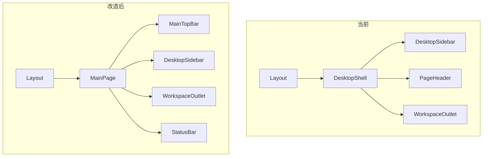

# MainPage 主界面壳层改造执行计划

## 背景与目标

PRD [`prd/v2.0_mainpage.md`](prd/v2.0_mainpage.md) 已锁定 **方案 B**：`MainPage` 替代 `DesktopShell` 成为一级桌面容器；`DesktopSidebar` 降为二级功能导航；顶部统一承载工作区 Tabs + 窗口控制。

**当前代码现状**（已核对）：

- [`src/renderer/src/screens/Layout/Layout.tsx`](src/renderer/src/screens/Layout/Layout.tsx) 使用 `DesktopShell` + 全局 `PageHeader` + `WorkspaceOutlet`
- `MainPage/` 目录与 [`src/shared/shell/main-page-constants.ts`](src/shared/shell/main-page-constants.ts) **尚不存在**
- 主窗口默认尺寸在 [`src/main/shell/main-window-controller.ts`](src/main/shell/main-window-controller.ts) 为 `1100×750`，最小 `800×600`
- [`.app { height: 97vh }`](src/renderer/src/assets/main.css) 导致全屏高度不完整
- `PageHeader` 已 import `WindowControls` 但未渲染；[`App.tsx`](src/renderer/src/App.tsx) 亦 import 未使用——主界面 Windows 窗口按钮目前**缺失**，需在 `MainTopBar` 落地
- [`WebContentsHost`](src/renderer/src/components/shell/WebContentsHost.tsx) 通过 `ResizeObserver` + `getBoundingClientRect` 同步 bounds，壳层变更后应能自适应（验收项 7）

**本轮明确不做**（PRD §10、§12）：`ShellViewManager` 生命周期扩展、WebOperator 迁移、Sidebar rail/hidden、Tabs DnD、`@dnd-kit` 新依赖。

---

## 目标架构



数据流不变：`useDesktopNavigation` / `useProfileEntries` / `useUpdateState` 仍在 `Layout` 聚合，仅更换 JSX 组合方式。

---

## 实施阶段

### 阶段 1：共享常量与主窗口尺寸

**新建** [`src/shared/shell/main-page-constants.ts`](src/shared/shell/main-page-constants.ts)（按 PRD §3）：

- `MAIN_TOPBAR_HEIGHT = 40`、`MAIN_STATUSBAR_HEIGHT = 24`、`MAIN_SIDEBAR_WIDTH = 232` 等
- `DEFAULT_WINDOW_WIDTH/HEIGHT = 1280/800`、`MINIMUM_WINDOW_WIDTH/HEIGHT = 900/600`

**修改** [`src/main/shell/main-window-controller.ts`](src/main/shell/main-window-controller.ts)：

- 引用上述常量替换硬编码 `1100/750` 与 `800/600`
- **注意**：已有 `readWindowState()` 持久化尺寸时仍优先用户历史值；仅影响**首次创建**与无保存状态场景

无需 Preload/IPC 变更。

---

### 阶段 2：MainPage 组件树与样式

**新建目录** `src/renderer/src/screens/MainPage/`：

| 文件 | 职责 |
|------|------|
| `MainPage.tsx` | 壳层布局：`MainTopBar` + body(sidebar/outlet) + status + modal/drawer |
| `MainTopBar.tsx` | 40px 顶栏：菜单占位、Profile、Tabs、Runtime、快捷入口、`WindowControls` |
| `MainViewTabs.tsx` | 工作区 Tab（aios-home / aios-workspace / web-operator），可点击切换 |
| `MainProfileSwitch.tsx` | 显示当前 `activeProfile`，点击打开 profile 选择（见下） |
| `MainRuntimeIndicator.tsx` | 当前 profile Gateway 运行态指示 |
| `main-page.css` | PRD §8 布局样式（flex 列、固定高度、drag region） |

**`MainPageProps` 扩展**（相对 PRD，补齐实际所需回调）：

```ts
export interface MainPageProps {
  sidebar: React.ReactNode;
  outlet: React.ReactNode;
  statusBar?: React.ReactNode;
  modalLayer?: React.ReactNode;
  drawerLayer?: React.ReactNode;
  activeProfile: string;
  activeView: View; // 使用现有 View 类型，避免 `as never`
  onNavigate: (view: View) => void;
  onSelectProfile: (name: string) => void; // 供 MainProfileSwitch
}
```

**`MainProfileSwitch` 初版实现建议**：

- 复用已有 [`ProfileSwitcherDropdown`](src/renderer/src/components/dropdowns/ProfileSwitcherDropdown.tsx)（通过 anchor button + `getBoundingClientRect`）
- 数据源：`window.profileRuntime.listProfiles()` 或 `profileEntry`（与 dropdown 现有逻辑对齐）
- `onSelectProfile` 调用 `Layout` 传入的 `navigation.handleSelectProfile`

**`MainRuntimeIndicator` 初版实现建议**：

- `useEffect` 轮询 `window.profileRuntime.getRuntimeStatus()`（参考 [`ProfileRuntimeScreen`](src/renderer/src/screens/ProfileRuntime/ProfileRuntimeScreen.tsx)）
- 按 `activeProfile` 过滤，展示 `running / starting / failed / stopped` 色点 + 简短 label
- loading / error：显示 muted 或 `unknown`，不阻塞导航

**`MainViewTabs` i18n**：

- Tab 文案使用现有 `navigation.*` key（`aiosHome`、`aiosWorkspace`、`webOperator`），避免 PRD 示例中的硬编码英文

**`main-page.css` 要点**：

- `MainPage` 占满父级 `flex:1; min-height:0; overflow:hidden`
- `MainTopBar` 高度 40px + `app-drag-region`；交互控件 `no-drag`
- `MainPage__sidebar` 固定 `232px`（与常量一致）
- `modalLayer` / `drawerLayer` 作为 `MainPage` 子节点但不参与 flex 占位（保持与现 `DesktopShell` 相同挂载点）

**WindowControls 样式对齐**：

- 现有 [`.window-controls { height: 36px }`](src/renderer/src/assets/main.css) 需改为 **40px** 或在 `main-page.css` 覆盖，避免顶栏垂直错位

---

### 阶段 3：Layout 迁移（核心接线）

**修改** [`src/renderer/src/screens/Layout/Layout.tsx`](src/renderer/src/screens/Layout/Layout.tsx)：

1. 移除 `DesktopShell`、`PageHeader` import 与 `header` prop
2. 改为渲染 `MainPage`，传入 PRD §7 所列 `sidebar` / `outlet` / `statusBar` / layers
3. `onNavigate={navigation.navigateToView}`（类型为 `View`，无需 cast）
4. `onSelectProfile={navigation.handleSelectProfile}`

`NAV_ITEMS`、hooks、`WorkspaceOutlet` props **保持不变**。

**保留不删**：[`DesktopShell.tsx`](src/renderer/src/components/layout/DesktopShell.tsx)（PRD：非主入口保留，便于回滚/测试）。

**`PageHeader` 处理**：

- 从 `Layout` 全局链路移除
- 文件保留；后续各 Screen 若需页内标题可局部引用（PRD：逐步废弃全局 Header）
- 清理 `PageHeader.tsx` 中未使用的 `WindowControls` import

---

### 阶段 4：全局 CSS 与 Sidebar 适配

**修改** [`src/renderer/src/assets/main.css`](src/renderer/src/assets/main.css)：

1. **§8.2** 修正根布局：

```css
html, body, #root { width: 100%; height: 100%; overflow: hidden; }
.app { width: 100vw; height: 100vh; height: 100dvh; ... } /* 替换 97vh */
```

2. **Sidebar 宽度**：`.sidebar { width: 232px; }`（当前 230px），与 `MAIN_SIDEBAR_WIDTH` 一致；评估是否去掉 `border-radius: 16px`（在 `MainPage__sidebar` 内可能产生视觉缝隙，按实机微调）

3. **macOS drag region**：[`App.tsx`](src/renderer/src/App.tsx) 顶部固定 `drag-region`（28px）可能与 40px `MainTopBar` 重叠——验收 macOS 时确认 traffic light 区域；必要时改为仅 `MainTopBar` 承担 drag（`screen === "main"` 时隐藏全局 `drag-region`）

4. 可选：为 `desktop-shell` 相关规则加注释“legacy”，避免与 `MainPage` 样式冲突（不强制删除旧规则）

**不改**：`ShellViewManager`、`WebContentsHost`、Browser IPC、Profile Runtime IPC。

---

### 阶段 5：验证与文档

**自动化**：

```bash
npm run typecheck
npm run lint
```

**手动验收**（对齐 PRD §11）：

| # | 检查项 |
|---|--------|
| 1 | `npm run dev` 进入 main 屏无报错 |
| 2 | `MainTopBar` 固定 40px，Windows `WindowControls` 可用 |
| 3 | Sidebar 可切换 Chat/Sessions/Models/Skills/Gateway 等 |
| 4 | 顶部 AI-OS / Workspace / Web Operator Tabs 跳转正确 |
| 5 | `AIOSHomeScreen` 内 `WebContentsHost`（layer `aios-home`）无偏移、resize 后 bounds 正确 |
| 6 | `StatusBar` 底部 24px |
| 7 | 主内容区无双滚动条错位 |
| 8 | `ModalLayer`/`DrawerLayer` 不被顶栏遮挡（当前为空占位，结构就位即可） |

**可选轻量测试**（非 PRD 强制）：为 `MainViewTabs` 增加 RTL 点击切换 smoke test。

**文档**：若窗口尺寸常量属于产品契约，在 `docs/` 或 `AGENTS.md` 补一句默认窗口规格变更（小范围即可）。

---

## 文件变更清单

| 操作 | 路径 |
|------|------|
| 新建 | `src/shared/shell/main-page-constants.ts` |
| 新建 | `src/renderer/src/screens/MainPage/*.tsx` + `main-page.css` |
| 修改 | `src/renderer/src/screens/Layout/Layout.tsx` |
| 修改 | `src/renderer/src/assets/main.css` |
| 修改 | `src/main/shell/main-window-controller.ts` |
| 保留 | `src/renderer/src/components/layout/DesktopShell.tsx` |
| 微调 | `src/renderer/src/components/layout/PageHeader.tsx`（移除无用 import） |
| 可选 | `src/renderer/src/App.tsx`（清理未使用 `WindowControls` import；mac drag 调整） |

**不涉及**：Preload、Main IPC、Renderer 业务 Screen 逻辑、`WebContentsHost` 实现。

---

## 风险与缓解

| 风险 | 缓解 |
|------|------|
| 去掉全局 `PageHeader` 后部分页面失去标题区 | 首版仅壳层迁移；Chat/Settings 等自有 header 不受影响；Profile Workspace 等若依赖 PageHeader 标题，后续页内补标题 |
| `WebContentsHost` bounds 因布局变化偏移 | 依赖现有 `ResizeObserver`；验收时重点测 `aios-home` resize |
| 顶栏与 Sidebar 重复导航（aios-home 等） | PRD 有意区分「工作区 Tab」与「功能导航」；首版接受重复，Phase 2.2 再动态 profile tabs |
| 窗口尺寸变更影响老用户 | 仅默认/无状态生效；不强制重置已保存 window state |

---

## 后续第二阶段（本轮不实施）

PRD §12 路线图，供排期参考：

- **2.1** Sidebar `expanded / rail / hidden`
- **2.2** `MainViewTabs` 接入 `profileEntries` 动态 Tab
- **2.3–2.4** `ShellViewManager` 完整生命周期 + WebOperator 迁移
- **2.5** Tabs DnD（`@dnd-kit/sortable` 或同类）

**原则**：先完成 MainPage 壳层与顶栏窗口控制，再统一多 WebView 生命周期。
