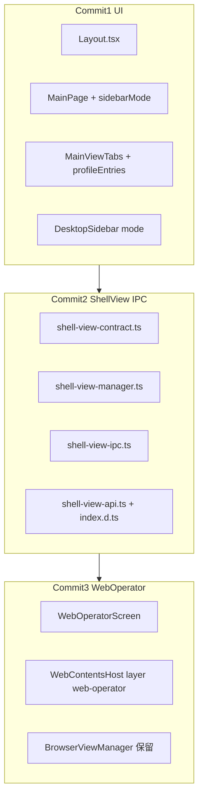

# MainPage 第二阶段（V2.1）执行计划

## 背景

[V2.0 已完成](src/renderer/src/screens/MainPage/MainPage.tsx)：`MainPage` + `MainTopBar` + 静态 `MainViewTabs`（3 个系统 Tab）+ 固定 232px `DesktopSidebar` + `shellView` 仅 `activate/setBounds/hide`。

[prd/v2.1_mainpage.md](prd/v2.1_mainpage.md) 将本阶段拆为 **3 个独立 Commit**，与 PRD 一致，**不按 Phase 编号混在一个 PR**。



---

## Commit 1：MainPage Tabs + Sidebar 三态（Phase 2.1 + 2.2）

**目标**：顶部工作区 Tab 接入 `profileEntries`；Sidebar `expanded | rail | hidden`；**不改** ShellViewManager / IPC。

### 1.1 新增类型与 Tab 构建

| 文件 | 动作 |
|------|------|
| [`src/renderer/src/screens/MainPage/main-page-types.ts`](src/renderer/src/screens/MainPage/main-page-types.ts) | 新建 `SidebarMode`、`MainWorkspaceTab`、`MainPageViewModel`（按 PRD §二.1） |
| [`src/renderer/src/screens/MainPage/main-page-tabs.ts`](src/renderer/src/screens/MainPage/main-page-tabs.ts) | 新建 `buildMainWorkspaceTabs()`、`isWorkspaceTabView()` |

**Tab 规则**（与 PRD 一致）：
- 静态 Tab：`aios-home`、`aios-workspace`、`web-operator`
- 动态 Tab：`profileEntries` 中 `enabled && entryType === "specialist-workspace"`，按 `sortOrder` 排序，`id` 为 ``profile-workspace:${profileId}``
- 静态 Tab 文案继续走 i18n（`navigation.aiosHome` 等），勿回退 PRD 示例里的硬编码英文；Profile Tab 用 `entry.title`

### 1.2 接线 MainPage / MainTopBar / MainViewTabs

修改现有文件：

- [`MainPage.tsx`](src/renderer/src/screens/MainPage/MainPage.tsx)：增加 `profileEntries`、`sidebarMode`、`onSidebarModeChange`；根节点 `className` 改为 ``MainPage MainPage--sidebar-${sidebarMode}``；`sidebarMode === "hidden"` 时不渲染 `MainPage__sidebar`
- [`MainTopBar.tsx`](src/renderer/src/screens/MainPage/MainTopBar.tsx)：
  - 左侧 `⋯` 按钮改为 **Sidebar 三态切换**（`PanelLeftClose` / `PanelLeftOpen`，`nextSidebarMode: expanded → rail → hidden → expanded`）
  - 向 `MainViewTabs` 传入 `profileEntries`
  - **保留** 现有 `MainProfileSwitch` 的 `onSelectProfile` / `onNavigate`（PRD 片段省略了，但 V2.0 已依赖）
- [`MainViewTabs.tsx`](src/renderer/src/screens/MainPage/MainViewTabs.tsx)：使用 `buildMainWorkspaceTabs(profileEntries)` 渲染；溢出省略样式见 CSS

### 1.3 Layout 与 DesktopSidebar

- [`Layout.tsx`](src/renderer/src/screens/Layout/Layout.tsx)：`useState<SidebarMode>("expanded")`；向 `MainPage` 传 `profileEntries` / `sidebarMode` / `onSidebarModeChange`；向 `DesktopSidebar` 传 `mode={sidebarMode}`
- [`DesktopSidebar.tsx`](src/renderer/src/components/layout/DesktopSidebar.tsx)：
  - 新增可选 prop `mode?: SidebarMode`（默认 `"expanded"`）
  - 根节点由 fragment 改为 ``<motion className={`desktop-sidebar desktop-sidebar--${mode}`}>``（用 `motion` → `motion` 即 `motion` 应为 `motion` → 用 `motion` 即 `div`）
  - `expanded` 显示 label / group label；`rail` 仅 icon；更新按钮文字在 rail 下隐藏

### 1.4 CSS

扩展 [`main-page.css`](src/renderer/src/screens/MainPage/main-page.css)（PRD §三）：
- `.MainPage--sidebar-expanded|rail|hidden` 宽度（232 / 56 / 0）
- `.desktop-sidebar--rail` 下 nav/footer 紧凑样式
- `.MainViewTabs__item span` 省略号

**不引入** `@dnd-kit` / `react-beautiful-dnd`（PRD 明确排除）。

### Commit 1 验收

- 顶栏 toggle 循环三态；rail 无文字；hidden 时主内容横向占满
- Tabs 含 specialist profile；点击跳转 `profile-workspace:{id}`
- `npm run typecheck` 通过

---

## Commit 2：ShellView IPC 扩展（Phase 2.3）

**目标**：Renderer 可调用 `create / loadUrl / focus / destroy / getState / getAll`；Main 侧补齐 SVM 方法与 IPC handler。

### 2.1 Shared 契约

替换/扩展 [`src/shared/shell/shell-view-contract.ts`](src/shared/shell/shell-view-contract.ts)（PRD §四.1）：
- 新增 channels：`CREATE`、`LOAD_URL`、`FOCUS`、`DESTROY`、`GET_STATE`、`GET_ALL`
- 保留现有 `ACTIVATE`、`SET_BOUNDS`、`HIDE`
- 新增请求类型与 `ShellViewSnapshot`

同步 [`docs/API_CONTRACTS.md`](docs/API_CONTRACTS.md) ShellView 表格（项目规则要求 IPC 变更更新契约）。

### 2.2 ShellViewManager

在 [`shell-view-manager.ts`](src/main/shell/views/shell-view-manager.ts) 增加（PRD §四.2，委托 [`ManagedWebContentsView`](src/main/shell/views/managed-webcontents-view.ts) 已有 `load/focus/getState/getBounds/isActive`）：
- `loadUrl(id, url)`
- `focusView(id)`
- `getViewSnapshot(id)` → `ShellViewSnapshot | null`
- `getAllViewSnapshots()`

### 2.3 IPC 与 Preload

- [`shell-view-ipc.ts`](src/main/shell/shell-view-ipc.ts)：注册 6 个新 handler；`CREATE` 调 `svm.createView`；`LOAD_URL`/`FOCUS` 先 `ensureKnownView` 再操作；`DESTROY` 调 `destroyView`；`GET_*` 返回 snapshot
- **建议增强**（PRD 未写，降低 Commit 3 竞态）：为 `web-operator` 增加类似 `ensureAiosHomeView` 的 lazy-create，或在 `ensureKnownView` 中对已注册 kind 允许 CREATE——避免 `WebContentsHost` 在 `useEffect create` 完成前 `setBounds` 抛 `Layer not found`
- [`shell-view-api.ts`](src/preload/shell-view-api.ts)：暴露完整 API（PRD §四.3）
- [`src/preload/index.d.ts`](src/preload/index.d.ts)：扩展 `ShellViewAPI` 类型

**注意**：保持现有 `SET_BOUNDS` 签名 `(layerId, bounds)` 不变，避免破坏 [`WebContentsHost`](src/renderer/src/components/shell/WebContentsHost.tsx) 与 `aios-home`。

### 2.4 测试（建议）

- 新增 `tests/main-page-tabs.test.ts`：覆盖 `buildMainWorkspaceTabs` 过滤/排序
- 若有 `preload-api-surface.test.ts`，补充 `shellView` 新方法名

### Commit 2 验收

- DevTools 或临时调用可验证 `window.shellView.create/loadUrl/focus/destroy/getState/getAll`
- `aios-home` 行为不退化
- `typecheck` + `lint`（仅改动文件）通过

---

## Commit 3：WebOperator 迁移 ShellViewManager（Phase 2.4）

**目标**：UI 视口走 `WebContentsHost` + `layerId="web-operator"`；**保留** `BrowserViewManager` / `BrowserController` / `aiosBrowser` 供 agent tool 使用。

### 3.1 WebOperatorScreen 改造

替换 [`WebOperatorScreen.tsx`](src/renderer/src/screens/WebOperator/WebOperatorScreen.tsx)（PRD §五.1）：
- 移除 `BrowserViewportHost` + `aiosBrowser.updateBounds`
- `useEffect` 内 `window.shellView.create("web-operator", "web-operator", "about:blank", { layer: "content", sandbox: true })`，已存在则 catch
- 主区域使用 `<WebContentsHost layerId="web-operator" className="web-operator-layout__viewport" />`
- **保留** [`BrowserToolbar`](src/renderer/src/screens/WebOperator/BrowserToolbar.tsx) 及 `useBrowserActions` → `window.aiosBrowser.open`（PRD 要求）

### 3.2 样式

- 将 PRD §五.2 的 `.web-operator-layout*` 加入 [`main-page.css`](src/renderer/src/screens/MainPage/main-page.css) 或新建 `screens/WebOperator/web-operator.css` 并在 Screen import
- 使用 CSS 变量（`var(--bg-primary)` 等）与现有主题一致，避免 PRD 示例里孤立的 `neutral-*` 与壳层脱节（可保留侧栏语义，主色对齐 design tokens）

### 3.3 明确不删不改（本阶段）

```text
src/main/browser/browser-view-manager.ts
src/main/browser/browser-controller.ts
src/main/browser/browser-ipc.ts
```

[`BrowserViewportHost.tsx`](src/renderer/src/screens/WebOperator/BrowserViewportHost.tsx) 可标记 `@deprecated` 或删除引用后保留文件（仅 WebOperator 使用）。

### 已知限制（写入验收说明）

本阶段存在 **双轨浏览器**：

| 路径 | 承载 |
|------|------|
| UI 视口 | ShellViewManager `web-operator` layer |
| Toolbar / Hermes tool | `aiosBrowser` → BrowserViewManager |

因此 **工具栏 `open()` 可能不会更新 ShellView 视口内的页面**（直到 Phase 3 `ShellBrowserViewAdapter`）。PRD 接受此风险；若需在 2.4 内改善，可在 `useBrowserActions.open` 成功后追加 `shellView.loadUrl("web-operator", url)`（小改动，不替代 BVM）。

### Commit 3 验收（对齐 PRD §七）

1. Sidebar 三态 + rail 仅 icon + hidden 满宽  
2. 动态 Profile Tabs + 导航 `profile-workspace:*`  
3. Web Operator Tab → `WebOperatorScreen`  
4. `WebContentsHost` `web-operator` bounds 正常（resize 不偏移）  
5. `shellView` 新 API 可从 Renderer 调用  
6. `aios-home` 不破坏；Browser tool 仍可用（BVM 未删）  

---

## 文件变更总览

| Commit | 主要新增 | 主要修改 |
|--------|----------|----------|
| 1 | `main-page-types.ts`, `main-page-tabs.ts` | `MainPage`, `MainTopBar`, `MainViewTabs`, `Layout`, `DesktopSidebar`, `main-page.css` |
| 2 | — | `shell-view-contract.ts`, `shell-view-manager.ts`, `shell-view-ipc.ts`, `shell-view-api.ts`, `index.d.ts`, `API_CONTRACTS.md` |
| 3 | 可选 `web-operator.css` | `WebOperatorScreen.tsx`, CSS；弃用 `BrowserViewportHost` 引用 |

**不涉及**：Preload `hermesAPI`、Browser IPC 契约、Profile Runtime Main、Tabs DnD、Phase 3 adapter。

---

## 文档（每 Commit 完成后）

与 INDEX 同级保持同步（V2.0 已更新，本阶段追加 **V2.1** 小节即可）：
- [`docs/INDEX.md`](docs/INDEX.md)
- [`docs/ARCHITECTURE.md`](docs/ARCHITECTURE.md)
- [`docs/MODULES.md`](docs/MODULES.md)
- [`AGENTS.md`](AGENTS.md)

---

## 验证命令

```bash
npm run typecheck
npm run lint
npm run dev
```

手动：按 PRD §七 10 条逐项勾选；重点回归 `aios-home` resize 与 Web Operator 视口 bounds。
