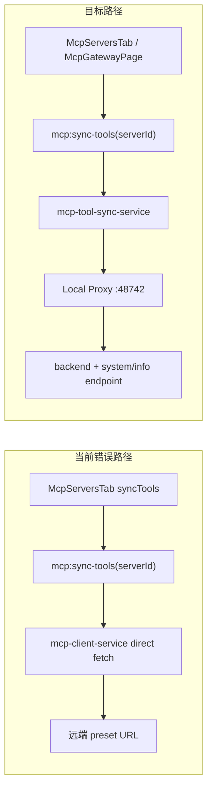

# v6.4.1 Hotfix — Desktop MCP Gateway 联调修复

## 问题根因

当前 [`McpServersTab`](src/renderer/src/screens/Hermes/pages/MCP/components/McpTabs.tsx) 点击「同步 tools」调用已有 `mcp:sync-tools(serverId)` → [`syncTools()`](src/main/mcp/mcp-tool-sync-service.ts) → [`listToolsFromServer()`](src/main/mcp/mcp-client-service.ts) **直连** preset URL（如 `https://agent.superic.com/api/v1/hermes/mcp`），既不使用 Desktop 登录 token，也不走 Local Proxy `127.0.0.1:48742`，网络失败时向 Renderer 抛出裸 `McpServiceError: fetch failed`。



V6.4 [`mcp-skill-gateway-runtime`](src/main/mcp-skill-gateway-runtime/) 已有 Proxy 与 token 注入，但存在缺口：

| PRD 要求 | 当前实现 |
|---|---|
| `GET /api/v1/system/info` 动态 `mcp.endpoint` | 硬编码 [`/api/v1/hermes/mcp`](src/main/mcp-skill-gateway-runtime/mcp-skill-gateway-config.ts) |
| Proxy 自动 `initialize` 再 `tools/list` | 直接转发 JSON-RPC |
| `POST /admin/config` 刷新 upstream | 无 |
| 增强 `/health`（backend + mcp 分项） | 仅 loggedIn + URL 展示 |
| 结构化 sync 结果 / 错误码 | sync 失败直接 throw |
| tools 本地缓存 | 无 |
| McpGateway 状态卡片 | [`HermesMcpGatewayPage`](src/renderer/src/screens/Hermes/pages/McpGateway/HermesMcpGatewayPage.tsx) 仅有 proxy/test，无 connected/degraded 等 |

---

## 实施策略（合并流程，不新增 IPC）

**保留** `mcp:sync-tools(serverId)` 与 `window.hermesAPI.mcp.syncTools(id)`，在 Main 层识别 **backend gateway 类型 server** 时改走 Local Proxy 链路；非 gateway server（stdio 等）保持现有直连逻辑。

### 1. 识别 gateway server + 修正 preset

**文件**: [`src/main/mcp/mcp-seed.ts`](src/main/mcp/mcp-seed.ts)、[`src/shared/mcp/mcp-contract.ts`](src/shared/mcp/mcp-contract.ts)

- 为 preset gateway（`coding-gateway` / `writer-gateway` / `finance-gateway`）增加标记，例如 `source: "backend_gateway"` 或复用 `id` 后缀 `-gateway` 判定。
- 将 preset `url` 改为 Local Proxy：`http://127.0.0.1:48742/mcp`；`authType` 改为 `desktop_token`（新增枚举值），**不再**依赖 `mcp-token-store` 里的独立 bearer。
- 已有 DB 中的旧 URL 可在 sync 前做一次 migrate/normalize（仅 gateway preset id）。

### 2. Backend descriptor 发现

**新增**: `src/main/mcp-skill-gateway-runtime/mcp-backend-descriptor.ts`（或 `src/main/mcp/mcp-backend-descriptor.ts`）

```ts
// GET {backendBaseUrl}/api/v1/system/info → mcp block
upstreamUrl = backendBaseUrl + mcp.endpoint  // 如 /api/v1/mcp
```

- `backendBaseUrl` 唯一来源：[`readAuthEndpointConfig()`](src/main/auth/auth-endpoint-config-store.ts)（与 PRD FR-DE-002 一致）。
- 错误码映射：`MCP_BACKEND_URL_MISSING` / `MCP_DESCRIPTOR_MISSING`。
- 结果缓存（内存 + 可选 TTL），登录/backend 变更时失效。

**改造**: [`resolveRemoteMcpUrl()`](src/main/mcp-skill-gateway-runtime/mcp-skill-gateway-config.ts) 优先用 descriptor，fallback 现有 `mcpEndpointPath` 配置。

### 3. Token provider（Main only）

**新增**: `src/main/mcp-skill-gateway-runtime/mcp-token-provider.ts`

- 封装 [`getCachedAccessToken()`](src/main/auth/token-store.ts) + session user 字段。
- 导出 `McpAuthState`（`tokenPresent` / `tokenPreview` / `userId` / `organizationId`），**禁止**向 Renderer 返回完整 token。
- Proxy、sync、health 统一调用此模块。

### 4. Local Proxy 增强（核心）

**改造**: [`mcp-skill-gateway-proxy.ts`](src/main/mcp-skill-gateway-runtime/mcp-skill-gateway-proxy.ts)

| 端点 | 行为 |
|---|---|
| `POST /admin/config` | 仅 127.0.0.1；接收 `upstreamUrl` / `transport` / `protocolVersion` / `clientInfo`；更新内存配置 |
| `POST /mcp` | 无 token → `MCP_UNAUTHORIZED`；有 token → 若 session 未 initialize 则先 `initialize` 再转发；保存 session 状态 |
| `GET /health` | 返回 PRD 结构：`self` / `backend`（health probe）/ `mcp`（status、toolCount、initialized、lastError） |
| `GET /debug/last-error` | 返回最近一次 upstream 错误（脱敏） |
| `POST /debug/probe` | 主动 probe backend MCP health + tools/list |

转发 header 补齐 PRD FR-DE-005：

```ts
Authorization: Bearer <access_token>
Content-Type: application/json
Accept: application/json, text/event-stream
```

登录成功后 [`onMcpSkillGatewayLoginSuccess()`](src/main/mcp-skill-gateway-runtime/mcp-skill-gateway-lifecycle.ts) 自动：`fetchDescriptor` → `POST /admin/config` → 可选 probe。

### 5. 合并 sync 流程（修复 fetch failed）

**改造**: [`mcp-tool-sync-service.ts`](src/main/mcp/mcp-tool-sync-service.ts)、[`mcp-client-service.ts`](src/main/mcp/mcp-client-service.ts)

gateway server 分支：

```
1. ensureProxyRunning + refreshProxyConfig(descriptor)
2. check McpAuthState.tokenPresent → 否则返回/throw MCP_UNAUTHORIZED
3. POST http://127.0.0.1:48742/mcp tools/list（Proxy 内部 initialize）
4. 解析 tools → 写入 desktop_mcp_tools（现有 DB 逻辑复用）
5. 写入 ~/.hermes/desktop/mcp-tools-cache.json
6. updateServerStatus + 结构化 lastError
```

**错误映射**（PRD §4，不再抛裸 `fetch failed`）：

- 401 → `unauthorized` / `MCP_UNAUTHORIZED`
- 403 → `forbidden` / `MCP_FORBIDDEN`
- 404 → `misconfigured` / `MCP_ENDPOINT_NOT_FOUND`
- 网络不可达 → `offline` / `MCP_BACKEND_UNREACHABLE` 或 `MCP_LOCAL_PROXY_UNREACHABLE`
- tools/list 业务失败 → `degraded` / `MCP_TOOLS_LIST_FAILED`

**改造 IPC handler**: [`mcp-ipc.ts`](src/main/mcp/mcp-ipc.ts) 的 `mcp:sync-tools` — catch 后返回结构化 payload（扩展 [`McpToolSyncResult`](src/shared/mcp/mcp-contract.ts)），而非仅 throw；Renderer 可展示 status + error.code。

### 6. Tools 本地缓存

**新增**: `src/main/mcp-skill-gateway-runtime/mcp-tools-cache.ts`

- 路径：`join(profileHome(), "desktop", "mcp-tools-cache.json")`（即 `%USERPROFILE%\.hermes\desktop\mcp-tools-cache.json`）
- sync 成功覆盖；失败保留旧缓存；不存 token
- 暴露 `lastSyncAt` / `isStale` 供 UI

### 7. Diagnostics（复用现有 IPC）

不新增 PRD IPC 名，扩展现有能力：

| PRD 能力 | 落地方式 |
|---|---|
| `mcp:get-diagnostics` | 扩展 `mcp-skill-gateway-runtime:get-status` 或 `mcp:test-connection` 返回 diagnostics 字段 |
| `mcp:probe-server` | 增强 `testRemoteMcp()` / Proxy `POST /debug/probe` |
| `mcp:get-last-error` | Proxy `/debug/last-error` + status.lastError |
| `mcp:refresh-proxy-config` | 登录 hook + sync 前自动调用；McpGateway 页增加手动按钮调 `restartProxy` + internal refresh |

**改造**: [`mcp-skill-gateway-health.ts`](src/main/mcp-skill-gateway-runtime/mcp-skill-gateway-health.ts) 消费新 `/health` 结构，映射 PRD status 枚举。

### 8. Renderer UI

**[`HermesMcpGatewayPage.tsx`](src/renderer/src/screens/Hermes/pages/McpGateway/HermesMcpGatewayPage.tsx)** — 新增 MCP Gateway 状态卡片（PRD FR-DE-010）：

- 显示：Gateway 名称、Transport、Status（connected/degraded/unauthorized/forbidden/offline/misconfigured）、Tools 数量、Last Sync、Error code
- 操作：重新探测（`testRemoteMcp`）、同步 tools（对 default gateway server 调 `hermesAPI.mcp.syncTools("coding-gateway")` 或统一 helper）、查看诊断（展开 diagnostics）

**[`McpTabs.tsx`](src/renderer/src/screens/Hermes/pages/MCP/components/McpTabs.tsx)** — sync 失败时展示 `error.code` + 友好 status，而非仅 `fetch failed`。

**i18n**: `src/shared/i18n/locales/en/` + `zh-CN/` 补充 status / error code 文案。

### 9. 共享类型

**扩展**: [`src/shared/mcp/mcp-contract.ts`](src/shared/mcp/mcp-contract.ts) + [`mcp-skill-gateway-runtime-contract.ts`](src/shared/mcp-skill-gateway-runtime/mcp-skill-gateway-runtime-contract.ts)

- `McpGatewayStatus`、`McpSyncDiagnostics`、`McpToolSyncResult` 增加 `status` / `error` / `diagnostics`
- 新 error codes 与 PRD §4 对齐

### 10. 测试

**新增/扩展 vitest**:

- [`tests/mcp-skill-gateway-proxy.test.ts`](tests/mcp-skill-gateway-proxy.test.ts)：auto-initialize、/admin/config、增强 health、401 映射
- 新 `tests/mcp-backend-descriptor.test.ts`：descriptor 缺失/成功 mock fetch
- 新 `tests/mcp-tool-sync-gateway.test.ts`：gateway server sync 走 proxy mock，验证 structured error

### 11. 文档

按 [007-sync-project-docs](.cursor/rules/007-sync-project-docs.mdc) 增量更新：

- [`docs/API_CONTRACTS.md`](docs/API_CONTRACTS.md) — sync-tools 返回结构、Proxy 新端点
- [`AGENTS.md`](AGENTS.md) / [`docs/INDEX.md`](docs/INDEX.md) — V6.4.1 hotfix 一行

Windows 验收命令写入 PRD §5 或 `docs/` 短节（curl health + tools/list）。

---

## 关键文件清单

| 操作 | 文件 |
|---|---|
| 新增 | `mcp-backend-descriptor.ts`, `mcp-token-provider.ts`, `mcp-tools-cache.ts` |
| 重点改造 | `mcp-skill-gateway-proxy.ts`, `mcp-tool-sync-service.ts`, `mcp-client-service.ts`, `mcp-skill-gateway-health.ts`, `mcp-skill-gateway-lifecycle.ts`, `mcp-seed.ts` |
| UI | `HermesMcpGatewayPage.tsx`, `McpTabs.tsx` |
| 契约 | `shared/mcp/mcp-contract.ts`, `shared/mcp-skill-gateway-runtime/*` |
| 测试 | `tests/mcp-skill-gateway-proxy.test.ts` + 新 sync/descriptor 测试 |

---

## 验收标准

1. Desktop 已登录 + backend 可达：`mcp:sync-tools("coding-gateway")` 返回 tools 数组，status=`connected`，不再出现裸 `fetch failed`。
2. 未登录：status=`unauthorized`，error=`MCP_UNAUTHORIZED`。
3. backend 不可达：status=`offline`。
4. `curl http://127.0.0.1:48742/health` 返回 `self.ok`、`backend.ok`、`mcp.status != unknown`。
5. `curl -X POST .../mcp -d tools/list`：已登录返回 tools；未登录返回 `MCP_UNAUTHORIZED`。
6. sync 成功后 `~/.hermes/desktop/mcp-tools-cache.json` 更新；失败保留旧缓存。
7. `pnpm run typecheck` + 相关 vitest 通过。

---

## 不做范围（PRD §7）

- 不实现 backend MCP Gateway 本体
- 不改 backend 授权模型 / org_memberships
- 不新增独立 IPC channel（按用户选择合并到现有 sync + runtime API）
