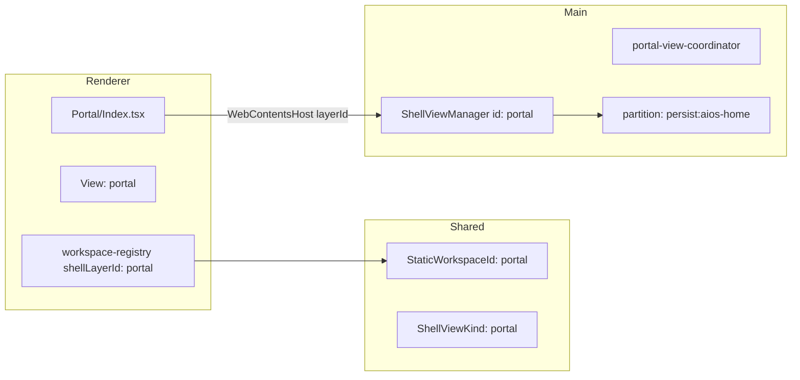

# Portal 模块全局重命名计划

## 目标与边界

| 变更项 | 目标 |
|--------|------|
| 目录 | [`src/renderer/src/screens/AIOSHome/`](src/renderer/src/screens/AIOSHome/) → `screens/Portal/` |
| 入口文件 | `AIOSHomeScreen.tsx` → [`Index.tsx`](src/renderer/src/screens/Portal/Index.tsx)（对齐 [`Workspaces/index.tsx`](src/renderer/src/screens/Workspaces/index.tsx) 模式） |
| 组件 | `AIOSHomeScreen` → `PortalScreen`（`PortalScreenProps`） |
| Workspace / View / Shell layer | `"aios-home"` → `"portal"`（全栈） |

**明确不改（避免破坏 Auth/API 契约）：**

- 配置字段 `aiosHomeUrl`、`EndpointConfigPanel` 的 `value.aiosHomeUrl`
- Main 函数/文件如 `resolveAiosHomeUrl`、`aios-home-url.ts`
- Preload `openAiOsHome` 等方法名
- Electron Session 分区字符串：**保留** `persist:aios-home`（仅重命名 TS 常量，如 `PORTAL_PARTITION = "persist:aios-home"`）



---

## 阶段 1：Renderer 文件与引用

### 1.1 移动并重命名屏幕

- `git mv`（或等价重命名）：
  - `screens/AIOSHome/` → `screens/Portal/`
  - `AIOSHomeScreen.tsx` → `Index.tsx`
- [`Index.tsx`](src/renderer/src/screens/Portal/Index.tsx) 内容调整：
  - `AIOS_HOME_LAYER` → `PORTAL_LAYER = "portal"`
  - `AIOSHomeScreen` → `PortalScreen`
  - `useTranslation("aiosHome")` → `useTranslation("portal")`
  - 日志前缀 `[AIOSHome]` → `[Portal]`

### 1.2 Renderer 内字符串与导入（已扫描 ~15 处）

| 文件 | 变更要点 |
|------|----------|
| [`WorkspaceRenderer.tsx`](src/renderer/src/components/workspace/WorkspaceRenderer.tsx) | import `PortalScreen` from `../../screens/Portal/Index`；`workspaceId === "portal"` |
| [`desktop-shell.ts`](src/renderer/src/types/desktop-shell.ts) | `View` union、`VIEW_TITLE_KEYS`：`portal` + `navigation.portal` |
| [`workspace-registry.ts`](src/renderer/src/workspace/workspace-registry.ts) | `id` / `shellLayerId` / `titleKey` |
| [`useDesktopNavigation.ts`](src/renderer/src/hooks/useDesktopNavigation.ts) | 默认 view `"portal"` |
| [`Layout.tsx`](src/renderer/src/screens/Layout/Layout.tsx) | `known` 列表、fallback/关闭 tab 导航 |
| [`RuntimeStatusBar.tsx`](src/renderer/src/components/runtime/RuntimeStatusBar.tsx) | i18n namespace `portal` |

**保留不动：** [`EndpointConfigPanel.tsx`](src/renderer/src/modules/auth/components/EndpointConfigPanel.tsx) 中 `aiosHomeUrl` 字段与 label 文案 key（`auth.aiosHomeUrl`）；可选仅将 DOM `id` 从 `endpoint-aios-home-url` 改为 `endpoint-portal-url`（纯 UI，非契约）。

---

## 阶段 2：Shared 类型与 i18n

### 2.1 Workspace / Shell 契约

- [`workspace-contract.ts`](src/shared/workspace/workspace-contract.ts)：`StaticWorkspaceId` 首项 `"portal"`
- [`workspace-secondary-nav.ts`](src/shared/workspace/workspace-secondary-nav.ts)：`"portal": []`
- [`view-contract.ts`](src/shared/shell/view-contract.ts)：`ShellViewKind` 中 `"aios-home"` → `"portal"`

### 2.2 Session 分区常量（值不变）

[`browser-partitions.ts`](src/shared/shell/browser-partitions.ts)：

```ts
// 逻辑名 portal，物理分区不变以保留 NextAuth cookies
PORTAL: "persist:aios-home",
export const PORTAL_PARTITION = SHELL_PARTITIONS.PORTAL;
```

同步更新 [`view-registry.ts`](src/main/shell/views/view-registry.ts) 使用 `PORTAL_PARTITION`。

### 2.3 i18n

- 重命名 locale 文件：`locales/en/aiosHome.ts` → `portal.ts`，`zh-CN/aiosHome.ts` → `portal.ts`
- [`i18n/index.ts`](src/shared/i18n/index.ts)：namespace `aiosHome` → `portal`
- [`navigation.ts`](src/shared/i18n/locales/en/navigation.ts)（en + zh-CN）：`aiosHome` key → `portal`（显示文案可保持「Copilot / Portal 首页」）

---

## 阶段 3：Main 进程 Shell 与协调器

### 3.1 协调器文件重命名

- `aios-home-view-coordinator.ts` → **`portal-view-coordinator.ts`**
- 导出重命名：`refreshAiosHomeView` → `refreshPortalView`，`resolveAiosHomeLoadUrl` → `resolvePortalLoadUrl`（内部仍可调用 `resolveAiosHomeUrl()`）
- 所有 `svm.getView/createView/activateView/deactivateView("aios-home")` → `"portal"`
- `createView` 的 kind 参数：`"portal"`

### 3.2 引用更新

| 文件 |
|------|
| [`shell-view-ipc.ts`](src/main/shell/shell-view-ipc.ts)：`layerId === "portal"`，`ensurePortalView` |
| [`view-registry.ts`](src/main/shell/views/view-registry.ts)：register `"portal"` |
| [`auth-ipc.ts`](src/main/auth/auth-ipc.ts)、[`user-config-bootstrap.ts`](src/main/user-config/user-config-bootstrap.ts) | import `refreshPortalView` |
| [`token-header-injector.ts`](src/main/auth/token-header-injector.ts) | 注释更新；`beforeLoadAiosHome` 可保留函数名或别名 `beforeLoadPortal`（实现不变） |

---

## 阶段 4：持久化状态迁移

[`main-page-state-migrate.ts`](src/main/shell/main-page-state-migrate.ts) 在 `normalizeV2` / `migrateV1ToV2` 中增加映射：

```ts
function migrateWorkspaceId(id: string | undefined): string | undefined {
  if (id === "aios-home") return "portal";
  return id;
}
```

应用于：

- `lastActiveWorkspace` / v1 的 `lastActiveView`
- `workspaceSecondaryState` 的 key
- `workspaceOrder` / v1 `tabOrder` 中的旧 id

用户已有 `~/.hermes/desktop/main-page-state.json` 在升级后自动落到 `portal` 默认 Tab。

---

## 阶段 5：测试与验证

更新断言含 `"aios-home"` 的测试（**分区值仍为 `persist:aios-home`**）：

- [`workspace-registry.test.ts`](tests/workspace-registry.test.ts)
- [`main-page-tabs.test.ts`](tests/main-page-tabs.test.ts)
- [`tab-order.test.ts`](tests/tab-order.test.ts)
- [`shell-view-manager.test.ts`](tests/shell-view-manager.test.ts)
- [`browser-partitions.test.ts`](tests/browser-partitions.test.ts)（常量名改 `PORTAL_PARTITION`，期望值不变）
- [`user-config-bootstrap.test.ts`](tests/user-config-bootstrap.test.ts)（mock 路径改为 `portal-view-coordinator`）

**验证命令（实现阶段执行）：**

```bash
npm run typecheck
npm test
```

手动冒烟：启动后主 Tab 为 Portal；`WebContentsHost` 能加载嵌入页；关闭 external tab 回退到 `portal`；重启后 `main-page-state.json` 中 `lastActiveWorkspace` 为 `portal`。

---

## 阶段 6：文档同步

按 [`.agents/skills/sync-project-docs/SKILL.md`](.agents/skills/sync-project-docs/SKILL.md) 增量更新：

- [`AGENTS.md`](AGENTS.md) 路由表：`AIOSHome` → `Portal/Index`
- [`docs/ARCHITECTURE.md`](docs/ARCHITECTURE.md)、[`docs/READING_GUIDE.md`](docs/READING_GUIDE.md)、[`docs/API_CONTRACTS.md`](docs/API_CONTRACTS.md) 中 ShellView kind / workspace id 描述

---

## 风险与回滚

| 风险 | 缓解 |
|------|------|
| 旧 `main-page-state.json` 无法恢复 Tab | migrate 函数映射 `aios-home` → `portal` |
| Session 分区改名导致重新登录 | **不**改 `persist:aios-home` 字符串 |
| 遗漏 Main `layerId ===` 判断 | 全仓库 `Select-String`/`typecheck` 兜底 |

回滚：恢复目录名与 `aios-home` 字符串即可；用户 state 中已写入的 `portal` 需在回滚迁移中反向映射（仅当需要回滚时）。
