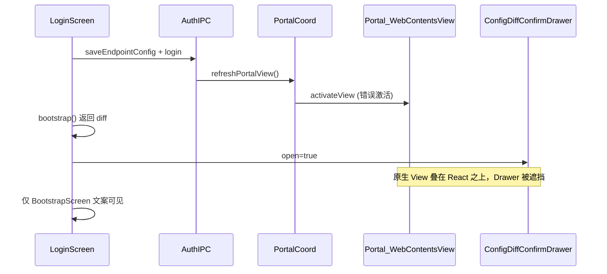

# Portal 层级与登录确认修复计划

## 问题诊断

### 问题 1：登录后配置确认窗无法正常显示

**现象**：`login-bootstrap-screen` 只显示文案「请确认配置变更并点击「应用」后继续」，看不到 `ConfigDiffConfirmDrawer` 的 diff 列表与「应用/取消」按钮。

**调用链**：



关键代码：

- [`src/main/auth/auth-ipc.ts`](src/main/auth/auth-ipc.ts) L42、L59：登录/保存 Endpoint 后调用 `refreshPortalView()`
- [`src/main/user-config/user-config-bootstrap.ts`](src/main/user-config/user-config-bootstrap.ts) L26、L70：bootstrap/apply 后也调用 `refreshPortalView()`
- [`src/main/shell/portal-view-coordinator.ts`](src/main/shell/portal-view-coordinator.ts) L53-57：`readVisibleBounds` 用 **上次的 `lastActivationBounds`** 推断 `active: true`，在登录阶段也会重新 `activateView`

`ConfigDiffConfirmDrawer` 本身是 React `fixed z-[70]`（[`ConfigDiffConfirmDrawer.tsx`](src/renderer/src/modules/auth/ConfigDiffConfirmDrawer.tsx)），**无法盖过** Electron `WebContentsView`（挂在 `BrowserWindow.contentView` 上，高于 Renderer）。

---

### 问题 2：Portal 始终在最顶端，菜单/设置无法操作；Reload 后恢复

**MainTopBar / MainPage 分析结论**（这两个文件**不是根因**，但解释了为何用户感觉「顶栏失效」）：

| 组件 | 职责 | 与 Shell View 关系 |
|------|------|-------------------|
| [`MainTopBar.tsx`](src/renderer/src/screens/MainPage/MainTopBar.tsx) | React 顶栏（Tabs、Settings、WindowControls） | **不**管理 WebContentsView；`WindowControls` 走 IPC |
| [`MainPage.tsx`](src/renderer/src/screens/MainPage/MainPage.tsx) | 布局壳：`MainTopBar` + `outlet` + `drawerLayer` | `drawerLayer`（SettingsDrawer、ConfigDiffConfirmDrawer）在 DOM 中位于内容区之后，但仍 **低于** 原生 Portal 层 |

真正管理 Portal 显隐的是：

- [`Layout.tsx`](src/renderer/src/screens/Layout/Layout.tsx) — Tab 切换、`drawerLayer`
- [`WorkspaceRenderer.tsx`](src/renderer/src/components/workspace/WorkspaceRenderer.tsx) + [`ReactWorkspace.tsx`](src/renderer/src/components/workspace/ReactWorkspace.tsx) — KeepAlive，`display: none` 隐藏 React 但不 hide 原生 View
- [`WebContentsHost.tsx`](src/renderer/src/components/shell/WebContentsHost.tsx) — 唯一应调用 `shellView.setBounds` / `hide` 的地方
- [`Portal/Index.tsx`](src/renderer/src/screens/Portal/Index.tsx) — L49-52 `getState("portal")` 会 lazy-create view

**KeepAlive 导致 hide 丢失**：

```tsx
// ReactWorkspace.tsx — Tab 切走后组件仍挂载，仅 display:none
<KeepAliveView active={active}>{children}</KeepAliveView>
```

[`WebContentsHost.tsx`](src/renderer/src/components/shell/WebContentsHost.tsx) 的 `IntersectionObserver` **仅在 `isIntersecting` 时 sync**，离开视口时 **不调用 `hide`**；`ResizeObserver` 在 `display:none` 时也不可靠。结果：Portal 原生层保持上次全屏 bounds，盖住顶栏点击区域与 Settings Drawer。

**Reload 为何能恢复**：[`Layout.tsx`](src/renderer/src/screens/Layout/Layout.tsx) L236-237 调用 `shellView.reload(layerId)` → [`shell-view-ipc.ts`](src/main/shell/shell-view-ipc.ts) 的 `ensureKnownView` + 可能触发 bounds 重算，或短暂 deactivate/activate，偶然恢复布局。

---

## 修复方案（分层）

### A. Main Process：Portal 仅 prepare，禁止 refresh 时激活

**文件**：[`portal-view-coordinator.ts`](src/main/shell/portal-view-coordinator.ts)

1. 修改 `readVisibleBounds`：**仅当** `existing.isActive() && bounds.width/height > 0` 才 `preserve.active = true`
2. **删除** L53-57 用 `lastActivationBounds` 推断 active 的逻辑（这是登录阶段 Portal 被错误激活的直接原因）
3. `finishPortalVisibility`：refresh/prepare 路径 **默认 always `deactivateView("portal")`**；只有当前确实 active 且正在 reload 才 preserve（可选：reload 完成后由 Renderer 再次 setBounds）

**文件**：[`auth-ipc.ts`](src/main/auth/auth-ipc.ts)

- `saveEndpointConfig` / `login` 中的 `refreshPortalView()` 保留（用于创建 view、注入 token、load URL），但配合 A.1 后 **不再 activate**

**文件**：[`user-config-bootstrap.ts`](src/main/user-config/user-config-bootstrap.ts)

- bootstrap/apply 后的 `refreshPortalView()` 同上，prepare-only

---

### B. Renderer：按 activeView 显式 hide 非当前 Shell Layer

**文件**：[`Layout.tsx`](src/renderer/src/screens/Layout/Layout.tsx)

新增 `useEffect` 监听 `navigation.view`：

```typescript
const activeLayer = resolveActiveShellLayerId(navigation.view);
// 对 portal / web-operator / 所有 external-browser:* 调用 hide（非 active）
void window.shellView.hide("portal"); // when activeLayer !== "portal"
// 同理 web-operator、external tabs
```

可抽小函数 `syncInactiveShellLayers(activeView)` 放在 [`shell-layer-id.ts`](src/renderer/src/screens/MainPage/shell-layer-id.ts) 或新 hook `useShellLayerVisibility.ts`。

**文件**：[`WebContentsHost.tsx`](src/renderer/src/components/shell/WebContentsHost.tsx)

1. 新增 prop `enabled?: boolean`（默认 `true`）
2. `IntersectionObserver`：当 `!entry.isIntersecting` 时 **立即 `shellView.hide(layerId)`**
3. `enabled === false` 时 skip setBounds 并 hide

**文件**：[`Portal/Index.tsx`](src/renderer/src/screens/Portal/Index.tsx)、[`WebViewWorkspace.tsx`](src/renderer/src/components/workspace/WebViewWorkspace.tsx)

- 从父级传入 `enabled={active}`（WorkspaceRenderer 已有 `active` 判断）

**文件**：[`ReactWorkspace.tsx`](src/renderer/src/components/workspace/ReactWorkspace.tsx) / [`WorkspaceRenderer.tsx`](src/renderer/src/components/workspace/WorkspaceRenderer.tsx)

- Portal tab：`WebContentsHost enabled={workspaceId === "portal"}`（通过 PortalScreen prop）

---

### C. 登录门控：pre-main 阶段强制 hide 全部 content Shell

**文件**：[`LoginScreen.tsx`](src/renderer/src/modules/auth/LoginScreen.tsx)

- `useEffect` on mount + 进入 `bootstrapping/awaitingConfigConfirm` 时：
  ```typescript
  void window.shellView.hide("portal");
  void window.shellView.hide("web-operator");
  ```

**文件**：[`App.tsx`](src/renderer/src/App.tsx) 或 [`useStartupGate.ts`](src/renderer/src/hooks/useStartupGate.ts)

- 当 `screen !== "main"` 时同样 hide portal/web-operator（覆盖 splash/welcome/setup）

---

### D. 问题 1 UX 补强（可选但建议）

**文件**：[`LoginScreen.tsx`](src/renderer/src/modules/auth/LoginScreen.tsx) + [`BootstrapScreen.tsx`](src/renderer/src/modules/auth/BootstrapScreen.tsx)

- 当 `awaitingConfigConfirm` 时：**不**再显示 BootstrapScreen 的 spinner 文案（避免用户以为「卡在这一步」）
- 改为：半透明 backdrop + 仅渲染 `ConfigDiffConfirmDrawer`（或把 drawer 改为居中 modal，复用 [`login.css`](src/renderer/src/modules/auth/styles/login.css) 设计 token，不依赖 tailwind zinc 色）

---

## MainTopBar / MainPage 无需改窗口 IPC

- `WindowControls` 已在 [`MainTopBar.tsx`](src/renderer/src/screens/MainPage/MainTopBar.tsx) L248，走 `window.smcShell.windowControls` / `hermesAPI.windowControls`，与 Portal 层级无关
- 修复 A+B 后，顶栏 Settings / Drawer 应可正常点击

---

## 验收清单

1. **登录 + diff 确认**：第二次登录触发 diff 时，能看到 diff 列表、「应用」「取消」；Portal 页面不可见、不可点击
2. **首次登录 bootstrap**：`login-bootstrap-screen` 期间 Portal 不闪现
3. **主界面 Tab 切换**：切到 Workspaces / Settings Drawer 打开时，Portal 不遮挡 React UI
4. **Portal Tab**：切回 Portal 后 WebContents 正常嵌入内容区（bounds 正确）
5. **Reload**：顶栏 Reload 仍可用，且不再作为「唯一恢复手段」
6. `npm run typecheck` 通过

---

## 涉及文件汇总

| 优先级 | 文件 | 改动 |
|--------|------|------|
| P0 | `src/main/shell/portal-view-coordinator.ts` | 去掉 stale bounds 激活 |
| P0 | `src/renderer/src/components/shell/WebContentsHost.tsx` | enabled + 离开视口 hide |
| P0 | `src/renderer/src/screens/Layout/Layout.tsx` | activeView 驱动 hide 非当前 layer |
| P0 | `src/renderer/src/modules/auth/LoginScreen.tsx` | pre-main hide shell + UX |
| P1 | `src/renderer/src/screens/Portal/Index.tsx` | enabled prop |
| P1 | `src/renderer/src/App.tsx` 或 startup gate | 非 main 屏 hide shell |
| P2 | `BootstrapScreen.tsx` / `ConfigDiffConfirmDrawer.tsx` | awaiting 态 UI 优化 |

**不改** [`MainTopBar.tsx`](src/renderer/src/screens/MainPage/MainTopBar.tsx)、[`MainPage.tsx`](src/renderer/src/screens/MainPage/MainPage.tsx) 的窗口 IPC（除非验收发现 drag-region 与 bounds 计算冲突，再单独处理）。
