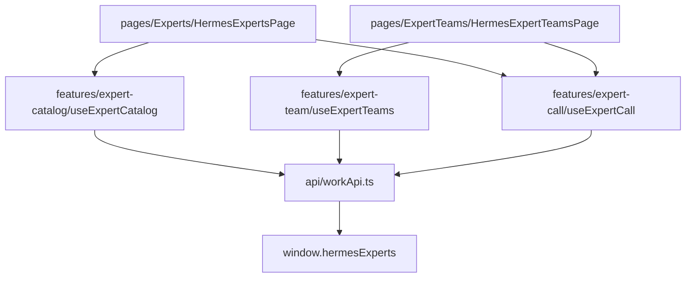

# PRD v1.3 下一阶段：Experts / Teams 页面（§17.3）

## 当前进度对照

| PRD 阶段 | 状态 | 说明 |
|---------|------|------|
| §17.1 Registry + Shell 分组 | 已完成 | `model/page.ts`、分组 Sidebar、registry 元数据；**未**做 `shell/` 目录搬迁（v1.3 可延后） |
| §17.2 Domain Model + workApi | 已完成 | [`api/workApi.ts`](src/renderer/src/screens/Hermes/api/workApi.ts)、`model/*` |
| §17.3 Experts / Teams | **本阶段** | UI 骨架已有，但分层违规、类型仍为 `HermesExpert*` |
| §17.4 Runs / Artifacts | 未开始 | 留 Phase 4 |
| §17.5 Workbench | 未开始 | 留 Phase 5 |
| §17.6 高级分组 | 基本完成 | Sidebar 三段折叠已在 Phase 1 交付 |

**核心差距**：[`HermesExpertsPage.tsx`](src/renderer/src/screens/Hermes/pages/Experts/HermesExpertsPage.tsx)、[`HermesExpertTeamsPage.tsx`](src/renderer/src/screens/Hermes/pages/ExpertTeams/HermesExpertTeamsPage.tsx) 及 [`HermesExpertsContext.tsx`](src/renderer/src/screens/Hermes/context/HermesExpertsContext.tsx) 仍直接调用 `window.hermesExperts`；[`pages/Experts/hooks/*`](src/renderer/src/screens/Hermes/pages/Experts/hooks/) 未走 `workApi`；组件 props 仍为 `HermesExpert` / `HermesExpertTeam`。

## 目标架构



遵循 [`.cursor/rules/work-product.mdc`](.cursor/rules/work-product.mdc)：**pages → features → workApi → Preload**，不改 Main/Preload。

## 实施步骤

### 1. 扩展域模型与 workApi（小步、向后兼容）

**[`model/expert.ts`](src/renderer/src/screens/Hermes/model/expert.ts)** / **[`model/expert-team.ts`](src/renderer/src/screens/Hermes/model/expert-team.ts)** 补充 UI 所需可选字段（不破坏现有映射）：

- `WorkExpert`：`avatar?`、`executionMode?`、`installStatus?`、`trustStatus?`、`publicSkillCount?`
- `WorkExpertTeam`：`avatar?`、`skillCount?`、`toolName?`、`leaderRoleName?`、`memberCount?`

**[`api/workApi.ts`](src/renderer/src/screens/Hermes/api/workApi.ts)** 补充 gateway 运维封装（Experts 页 Header 已用、现未封装）：

```typescript
gateway: {
  health(), diagnostics(),
  desktopSyncStatus(),      // getDesktopSyncStatus
  clearCatalogCache(),      // clearExpertCatalogCache
}
experts.list() // 返回带 catalogSource 的分页结果 { items: WorkExpert[], source }
teams.list()   // 同理
```

更新 `mapHermesExpert` / `mapHermesExpertTeam` 填充新字段；`experts.listCatalogSkills` 返回值已是 `WorkExpertSkill[]`，供 Detail / Summon Drawer 使用。

### 2. 新建 features 层（PRD §9.1）

| 文件 | 职责 |
|------|------|
| `features/expert-catalog/useExpertCatalog.ts` | 列表加载、category/keyword 过滤、loading/error/source、refresh、clearCache |
| `features/expert-catalog/expertCatalogFilter.ts` | 纯函数 filter（从 Context 内联逻辑抽出） |
| `features/expert-catalog/useExpertDetail.ts` | 打开详情时拉 skills（调 `workApi.experts.listCatalogSkills`） |
| `features/expert-call/useExpertCall.ts` | skills 加载 + `callCatalogSkill` + loading/error |
| `features/expert-call/buildExpertCallInput.ts` | 组装 `CallCatalogSkillInput`（含 context） |
| `features/expert-call/validateExpertCallInput.ts` | prompt/skillName 校验 |
| `features/expert-call/canSummon.ts` | `canSummonExpert` / `canSummonTeam`（从 Card 内联逻辑抽出） |
| `features/expert-team/useExpertTeams.ts` | 团队列表 + 过滤 + refresh |
| `features/context-bridge/buildPageContext.ts` | 从 [`utils/remote-expert-context.ts`](src/renderer/src/screens/Hermes/utils/remote-expert-context.ts) 迁出 `buildPageContextFromStorage`（re-export 保持旧 import 可用） |

**[`features/expert-call/useNavigateToRun.ts`](src/renderer/src/screens/Hermes/features/expert-call/useNavigateToRun.ts)**（新建）：召唤成功后 `setActiveNavItem("expertRuns")` + 写入 `pendingRunId`（见步骤 3）。

### 3. 跨页 Run 聚焦（PRD 验收：「提交后跳转 Runs **详情**」）

现状：[`ExpertCatalogCallDrawer`](src/renderer/src/screens/Hermes/pages/Experts/components/ExpertCatalogCallDrawer.tsx) 的 `onSuccess` 仅 `setActiveNavItem("expertRuns")`，[`HermesExpertRunsPage`](src/renderer/src/screens/Hermes/pages/ExpertRuns/HermesExpertRunsPage.tsx) 本地 `selectedRunId` 不会自动选中。

最小改动：在 [`HermesDefaultContext`](src/renderer/src/screens/Hermes/context/HermesDefaultContext.tsx) 增加：

```typescript
pendingExpertRunId: string | null;
setPendingExpertRunId: (id: string | null) => void;
navigateToExpertRun: (runId: string) => void; // set pending + switch nav
```

`HermesExpertRunsPage` mount 时读取 `pendingExpertRunId` → `setSelectedRunId` → 清空 pending。本阶段仅接线 navigation，Runs 页 **不** 全面 refactor（留 §17.4）。

### 4. 重构 HermesExpertsContext（内部适配，不删）

将 [`HermesExpertsContext.tsx`](src/renderer/src/screens/Hermes/context/HermesExpertsContext.tsx) 的 `loadFromApi` / `refresh*` 改为调用 `workApi`，对外仍暴露 `HermesExpert[]`（Workbench、Runs 暂依赖）——**或**在 context 内 map `WorkExpert → HermesExpert` 过渡。

本阶段 **Experts / Teams 页面改走 feature hooks**，Context 仅保留给 Workbench / Runs 过渡；避免一次改全模块。

### 5. 组件整理（PRD §17.3 交付物）

| PRD 组件 | 动作 |
|---------|------|
| `ExpertFilterBar` | **新建** — 从 Experts/Teams 页抽出 search + category tabs |
| `ExpertGrid` | 可选薄封装 — 复用 `hermes-expert-grid` |
| `ExpertCard` | props 改为 `WorkExpert` + `canSummon: boolean` |
| `ExpertDetailDrawer` | props 改为 `WorkExpert`；skills 由 page 传入或 `useExpertDetail` 结果，**移除** 内部 `window.hermesExperts` |
| `ExpertSummonDrawer` | **由 `ExpertCatalogCallDrawer` 重命名/拆分**；内部改用 `useExpertCall`；保留 `kind: expert \| expert_team` 或拆成 Expert/Team 两个薄 wrapper |
| `ExpertTeamCard` | props 改为 `WorkExpertTeam` + `canSummon` |
| `TeamDetailDrawer` | **由 `ExpertTeamDetailModal` 升级为 drawer**（样式对齐 ExpertDetailDrawer）；展示 members 职责 |
| `TeamSummonDrawer` | 复用 `ExpertSummonDrawer` 的 team 模式 wrapper |

**删除/迁移旧 hooks**：[`pages/Experts/hooks/useCatalogSkillCall.ts`](src/renderer/src/screens/Hermes/pages/Experts/hooks/useCatalogSkillCall.ts)、[`useSummonExpert.ts`](src/renderer/src/screens/Hermes/pages/Experts/hooks/useSummonExpert.ts) 逻辑迁入 `features/expert-call/`，旧文件 re-export 或删除（无外部引用后删除）。

### 6. 页面编排瘦身

**[`HermesExpertsPage.tsx`](src/renderer/src/screens/Hermes/pages/Experts/HermesExpertsPage.tsx)**：

- 移除全部 `window.hermesExperts` 与 `useHermesExpertsCatalog`（列表改 `useExpertCatalog`）
- Header 连接态 / 诊断 / 清缓存 → `useExpertCatalog` 或 `workApi.gateway`
- 布局：`Header` + `ExpertFilterBar` + `ExpertGrid(ExpertCard)` + `ExpertDetailDrawer` + `ExpertSummonDrawer`
- 召唤成功 → `navigateToExpertRun(runId)`

**[`HermesExpertTeamsPage.tsx`](src/renderer/src/screens/Hermes/pages/ExpertTeams/HermesExpertTeamsPage.tsx)**：

- 改 `useExpertTeams` + 共享 `ExpertFilterBar`
- `TeamDetailDrawer` + `TeamSummonDrawer`
- 同样移除 direct API 调用

### 7. 验证

```bash
npm run typecheck
```

手工冒烟（PRD §18.3 子集）：

1. 进入 Work 专家工作台 → Experts 页列表/搜索/分类正常
2. 打开召唤 Drawer → 选 skill → 提交 → 自动切到 Expert Runs 并选中该 run
3. Expert Teams 页 → 查看团队详情 → 成员职责可见 → 团队召唤流程同上
4. 本地 Hermes Chat / MCP 页不受影响

## 明确不在本阶段

- Main / Preload / IPC 变更
- `shell/` 目录搬迁（`panels/HermesShell.tsx` 保持）
- Runs / Artifacts 全面 feature 化（§17.4）
- Workbench 产品化组件拆分（§17.5）
- 补全 `docs/specs/work-product/` 全量 spec pack（可随本阶段收尾增量写 `03-experts-page.md`，非阻塞）

## 风险与控制

- **WorkExpert 字段少于 HermesExpert**：mapper 补 optional 字段 + Card 用 `canSummon` prop，避免组件内调 API
- **Context 与 hooks 双轨**：本阶段仅 Experts/Teams 切 hooks；Workbench 仍用 Context（下一步 Workbench 再迁 `features/workbench/`）
- **Drawer 重命名**：保留 `ExpertCatalogCallDrawer` 短期 re-export，避免漏改 import

## 验收清单（§17.3）

- [ ] 专家列表、搜索、分类过滤正常
- [ ] 召唤 Drawer 经 `workApi.experts.callCatalogSkill` 提交
- [ ] 提交后跳转 Expert Runs 并聚焦 run 详情
- [ ] 团队卡片与详情展示成员职责
- [ ] Experts / Teams pages 无 `window.hermesExperts` 直接调用
- [ ] `npm run typecheck` 通过
