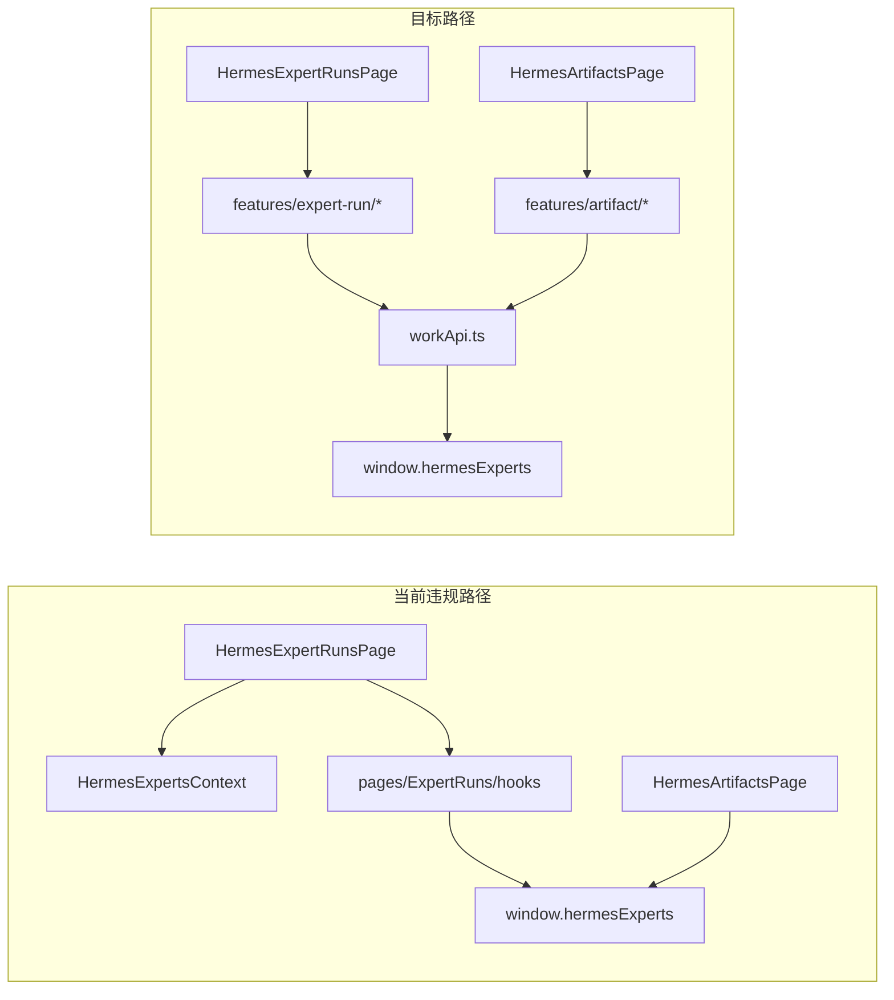

# PRD v1.3 下一阶段：Runs / Artifacts 页面（§17.4）

## 进度对照

| PRD 阶段 | 状态 | 说明 |
|---------|------|------|
| §17.1 Registry + Shell | 已完成 | 分组 Sidebar + `model/page.ts`；`shell/` 目录搬迁仍延后 |
| §17.2 Domain Model + workApi | 已完成 | [`api/workApi.ts`](src/renderer/src/screens/Hermes/api/workApi.ts)、`model/*` |
| §17.3 Experts / Teams | **已完成** | `features/expert-catalog|call|team`；Experts/Teams 页无 direct API |
| **§17.4 Runs / Artifacts** | **本阶段** | UI 骨架存在，仍用 `HermesExpertRun` + direct API |
| §17.5 Workbench 产品化 | 未开始 | 基础页有，未拆组件 |
| §17.6 高级分组 | 基本完成 | Sidebar 三段折叠 |

Phase 3 已接线 `navigateToExpertRun` + `pendingExpertRunId`，Runs 页可接收 Experts/Teams 召唤后的 run 聚焦；本阶段在此基础上完成 Runs/Artifacts 分层。

## 现状差距



**仍直接调用 `window.hermesExperts` 的文件：**

- [`pages/ExpertRuns/HermesExpertRunsPage.tsx`](src/renderer/src/screens/Hermes/pages/ExpertRuns/HermesExpertRunsPage.tsx) — cancel/retry
- [`pages/ExpertRuns/hooks/useExpertRuns.ts`](src/renderer/src/screens/Hermes/pages/ExpertRuns/hooks/useExpertRuns.ts) — list/detail/timeline/events
- [`pages/ExpertRuns/components/ExpertRunDetail.tsx`](src/renderer/src/screens/Hermes/pages/ExpertRuns/components/ExpertRunDetail.tsx) — preview/download/import
- [`pages/Artifacts/HermesArtifactsPage.tsx`](src/renderer/src/screens/Hermes/pages/Artifacts/HermesArtifactsPage.tsx) — 全页 monolithic

**已有可复用资产：**

- `workApi.runs.*` / `workApi.artifacts.*` 已封装 list/get/timeline/cancel/retry/preview/download/import
- `WorkRun` / `WorkArtifact` 基础类型在 [`model/run.ts`](src/renderer/src/screens/Hermes/model/run.ts)、[`model/artifact.ts`](src/renderer/src/screens/Hermes/model/artifact.ts)
- 组件骨架：`ExpertRunList`、`ExpertRunDetail`（单体）、`ExpertRunTimeline`、`ExpertRunMemberPanel`

## 目标架构

遵循 [`.cursor/rules/work-product.mdc`](.cursor/rules/work-product.mdc)：**pages → features → workApi → Preload**；不改 Main/Preload/IPC。

---

## Step 1：扩展域模型与 workApi

### 1.1 扩展 `WorkRun` 详情类型

[`model/run.ts`](src/renderer/src/screens/Hermes/model/run.ts) 新增：

```typescript
export interface WorkRunTimelineEvent {
  id: string;
  runId: string;
  eventType: string;
  sourceProfileId?: string;
  targetProfileId?: string;
  createdAt: string;
}

export interface WorkRunMemberSummary {
  memberProfileId: string;
  roleName: string;
  status: string;
  summary?: string;
}

export interface WorkRunDetail extends WorkRun {
  responseText?: string;
  catalogSlug?: string;
  catalogKind?: "expert" | "expert_team";
  invocationId?: string;
  remoteTaskId?: string;
  memberRuns: WorkRunMemberSummary[];
  artifacts: WorkArtifact[];
  timeline: WorkRunTimelineEvent[];
}
```

### 1.2 扩展 `WorkArtifact`

[`model/artifact.ts`](src/renderer/src/screens/Hermes/model/artifact.ts) 补充 UI 字段：`previewText?`、`source?`

### 1.3 workApi 补充

[`api/workApi.ts`](src/renderer/src/screens/Hermes/api/workApi.ts)：

- `mapHermesRunDetail(run: HermesExpertRun, timeline?)` — 映射完整详情
- `runs.getDetail(runId)` → `WorkRunDetail | null`（getExpertRun + getRunTimeline 合并）
- `runs.onRuntimeEvent(callback)` — 封装 `onExpertRuntimeEvent` 订阅
- `artifacts.listLocal` 已有；确认 `import` 入参类型与 [`hermes-experts-contract`](src/shared/hermes-experts/hermes-experts-contract.ts) 一致

---

## Step 2：新建 features 层

### 2.1 `features/expert-run/`

| 文件 | 职责 |
|------|------|
| `useExpertRuns.ts` | 列表 + filter + loading/error + refresh（替代 Context 列表依赖） |
| `useExpertRunDetail.ts` | 选中 runId → `WorkRunDetail` + 实时 event 订阅 reload |
| `runStatus.ts` | `canCancelRun` / `canRetryRun`（从 ExpertRunDetail 内联逻辑抽出） |
| `runFilter.ts` | 纯函数 status filter |

### 2.2 `features/artifact/`

| 文件 | 职责 |
|------|------|
| `useLocalArtifacts.ts` | 成果中心列表加载/refresh |
| `useArtifactPreview.ts` | preview 状态 + `workApi.artifacts.preview` |
| `useArtifactImport.ts` | import 对话框状态 + `workApi.artifacts.import` |

---

## Step 3：Runs 页面组件拆分（PRD §17.4 交付物）

| PRD 组件 | 动作 |
|---------|------|
| `RunFilterBar` | **新建** — 从 [`HermesExpertRunsPage`](src/renderer/src/screens/Hermes/pages/ExpertRuns/HermesExpertRunsPage.tsx) 抽出 filter tabs |
| `RunList` | **由 `ExpertRunList` 重构** — props 改 `WorkRun[]` |
| `RunDetailPanel` | **由 `ExpertRunDetail` 拆分** — 编排 Header/Status/Actions |
| `RunResult` | **新建** — 展示 `responseText` / completed 结果 |
| `RunTimeline` | **保留 `ExpertRunTimeline`**，改收 `WorkRunTimelineEvent[]` |
| `RunArtifacts` | **新建** — run 内产物列表 + preview/download/import 按钮（调 feature hooks） |
| `RunErrorPanel` | **新建** — `WorkError` 展示 |
| `ExpertRunMemberPanel` | **保留**，props 改 `WorkRunMemberSummary[]` |

**页面编排** [`HermesExpertRunsPage.tsx`](src/renderer/src/screens/Hermes/pages/ExpertRuns/HermesExpertRunsPage.tsx)：

- 移除 `useHermesExpertsCatalog` 列表依赖 → `useExpertRuns`
- 移除 cancel/retry 内 direct API → `workApi.runs.cancel/retry` 经 hook 封装
- **保留** Phase 3 的 `pendingExpertRunId` 消费逻辑
- 布局：`Header` + `RunFilterBar` + 双栏 `RunList` + `RunDetailPanel`

旧 hooks [`pages/ExpertRuns/hooks/useExpertRuns.ts`](src/renderer/src/screens/Hermes/pages/ExpertRuns/hooks/useExpertRuns.ts) → re-export 到 `features/expert-run/` 或删除。

---

## Step 4：Artifacts 页面产品化

[`HermesArtifactsPage.tsx`](src/renderer/src/screens/Hermes/pages/Artifacts/HermesArtifactsPage.tsx) 拆为：

| 组件 | 职责 |
|------|------|
| `ArtifactList` | `WorkArtifact[]` 行列表 + preview/download 操作 |
| `ArtifactPreviewPanel` | 侧栏/下方预览区（替代 inline `<pre>`） |
| `ArtifactImportDialog` | 导入路径确认 + `useArtifactImport` |
| 「Open Source Run」 | 点击 artifact → `navigateToExpertRun(artifact.runId)` |

页面仅编排 + `useLocalArtifacts` + `useArtifactPreview`；**无** `window.hermesExperts`。

---

## Step 5：Context 过渡（最小改动）

[`HermesExpertsContext.tsx`](src/renderer/src/screens/Hermes/context/HermesExpertsContext.tsx)：

- Runs 页**不再依赖** context 的 `runs` / `refreshRuns`
- Context 保留 `experts/teams` 供 [`HermesWorkbenchPage`](src/renderer/src/screens/Hermes/pages/Workbench/HermesWorkbenchPage.tsx) 过渡（§17.5 再迁 `features/workbench/`）
- 可选：`refreshRuns` 内部已走 `workApi.runs.listRaw`，Workbench recent runs 可继续用

---

## 明确不在本阶段

- Main / Preload / IPC 变更
- Workbench 组件化（§17.5）
- `shell/` 目录搬迁
- 补全 `docs/specs/work-product/` 全量 spec（可增量写 `04-runs-artifacts-page.md`，非阻塞）

---

## 验收清单（§17.4 + PRD §18.3 子集）

- [ ] Run 列表 / 状态过滤 / 详情面板正常
- [ ] completed run 显示 response 文本
- [ ] Run timeline / team member 面板正常
- [ ] cancel / retry 经 `workApi.runs.*`
- [ ] 成果中心列表 / 预览 / 下载正常
- [ ] 成果可导入本地 workspace（Import Dialog）
- [ ] 成果页可跳转来源 Run
- [ ] Runs / Artifacts pages 无 direct `window.hermesExperts`
- [ ] 召唤后跳转 Runs 聚焦仍可用（Phase 3 回归）
- [ ] `npm run typecheck` 通过

---

## 推荐实施顺序

1. 扩展 `WorkRunDetail` + `workApi.runs.getDetail/onRuntimeEvent`
2. 新建 `features/expert-run/*` + 重构 Runs 页与组件
3. 新建 `features/artifact/*` + 重构 Artifacts 页与组件
4. 清理旧 hooks re-export、`npm run typecheck`
5. 手工冒烟：召唤 → Runs 详情 → 成果预览/下载/导入
