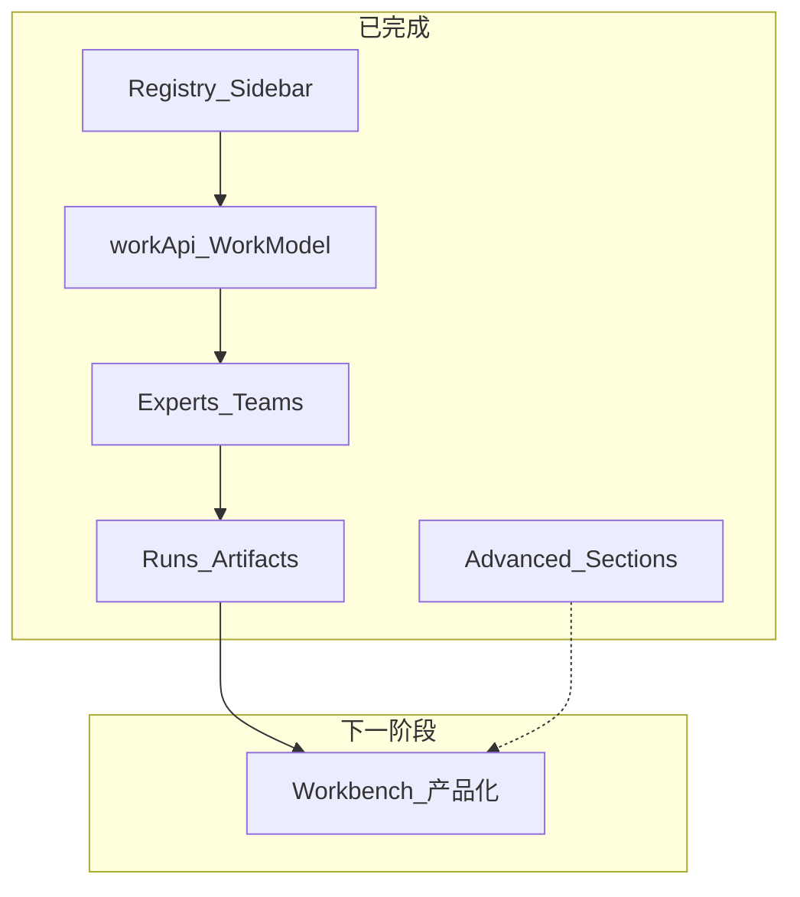

# PRD v1.3 进度分析与 Phase 5 计划

## 总体进度（对照 [prd_work/v1.3_project-layout-prompt.md](prd_work/v1.3_project-layout-prompt.md) §17）

| PRD 阶段 | 状态 | 代码证据 |
|---------|------|---------|
| **§17.1 Registry + Shell** | 基本完成 | [`model/page.ts`](src/renderer/src/screens/Hermes/model/page.ts)、[`registry/hermes-pages.tsx`](src/renderer/src/screens/Hermes/registry/hermes-pages.tsx)、[`components/HermesSidebar.tsx`](src/renderer/src/screens/Hermes/components/HermesSidebar.tsx) 三段导航；`shell/` 目录搬迁仍延后 |
| **§17.2 Domain + API** | 已完成 | [`api/workApi.ts`](src/renderer/src/screens/Hermes/api/workApi.ts) + `model/*`（命名 `Work*` / `workApi`，符合 [`.cursor/rules/work-product.mdc`](.cursor/rules/work-product.mdc)） |
| **§17.3 Experts / Teams** | 已完成 | `features/expert-catalog|call|team`；[`HermesExpertsPage`](src/renderer/src/screens/Hermes/pages/Experts/HermesExpertsPage.tsx) / [`HermesExpertTeamsPage`](src/renderer/src/screens/Hermes/pages/ExpertTeams/HermesExpertTeamsPage.tsx) 无 direct API |
| **§17.4 Runs / Artifacts** | 已完成 | `features/expert-run|artifact`；[`RunDetailPanel`](src/renderer/src/screens/Hermes/pages/ExpertRuns/components/RunDetailPanel.tsx) 等组件；[`HermesArtifactsPage`](src/renderer/src/screens/Hermes/pages/Artifacts/HermesArtifactsPage.tsx) 已拆分 |
| **§17.5 Workbench 产品化** | **下一阶段** | [`HermesWorkbenchPage.tsx`](src/renderer/src/screens/Hermes/pages/Workbench/HermesWorkbenchPage.tsx) 仍为 ~165 行单体页 |
| **§17.6 高级分组** | 基本完成 | [`HERMES_NAV_ITEMS`](src/renderer/src/screens/Hermes/constants.ts) primary/capability/advanced + Sidebar 默认折叠 capability/advanced |



---

## 仍存在的 PRD 差距（非 Phase 5 阻塞，可后续迭代）

- **Spec Pack 未建档**：PRD §15.2 要求的 `docs/specs/v1.3-workbuddy-product-line/` 目录不存在
- **工程结构延后项**：`shell/HermesShell.tsx` 等目录搬迁、Main `workbuddy/*` 聚合层（PRD §12 标注 MVP 可复用 `hermes-experts`，不阻塞 Renderer）
- **Context 过渡残留**：[`HermesExpertsContext`](src/renderer/src/screens/Hermes/context/HermesExpertsContext.tsx) 仍供 Workbench / Inspector 使用；Runs 页已脱离
- **Artifacts 页 Import**：成果中心主流程仅有 preview/download/open-run；Import Dialog 目前在 Run 详情 [`RunArtifacts`](src/renderer/src/screens/Hermes/pages/ExpertRuns/components/RunArtifacts.tsx) 内（PRD §8.5 可在 Phase 5 后补到 Artifacts 页）

---

## Phase 5 现状 vs PRD §8.1 / §17.5

当前 [`HermesWorkbenchPage.tsx`](src/renderer/src/screens/Hermes/pages/Workbench/HermesWorkbenchPage.tsx) 问题：

| PRD 交付物 | 当前状态 |
|-----------|---------|
| `ConnectionStatusCard` | 内联 `<article>`，无网关离线引导 |
| `QuickTaskEntry` | **缺失**（无任务输入 + 一键召唤） |
| `RecommendedExperts` | 内联 `experts.slice(0,4)`，仅跳转 experts 页 |
| `RecommendedTeams` | 内联 `teams.slice(0,3)`，仅跳转 teams 页 |
| `RecentRuns` | 使用 `HermesExpertRun[]` + `listRaw`；点击仅 `setActiveNavItem("expertRuns")`，**未** `navigateToExpertRun` |
| `RecentArtifacts` | **缺失** |
| Pending Confirmations | PRD §8.1 提及，可 MVP 占位或跳过 |

数据流违规（需在本阶段消除）：

```text
HermesWorkbenchPage
  → useHermesExpertsCatalog()     # Context + HermesExpert 原始类型
  → workApi.runs.listRaw()        # 绕过 WorkRun mapper
  → window.hermesExperts 守卫      # 页面层 API 可用性判断
```

目标路径：

```text
HermesWorkbenchPage
  → features/workbench/*
  → workApi + 已有 features（expert-catalog / expert-team / expert-run / artifact）
  → navigateToExpertRun / ExpertSummonDrawer
```

---

## Step 1：新建 `features/workbench/`

| 文件 | 职责 |
|------|------|
| [`useWorkbenchOverview.ts`](src/renderer/src/screens/Hermes/features/workbench/useWorkbenchOverview.ts) | 聚合加载：gateway health、desktop sync、diagnostics；recent runs（`workApi.runs.list` limit 5）；recent artifacts（`workApi.artifacts.listLocal` limit 5）；recommended experts/teams（复用 `workApi.experts.list` / `workApi.teams.list` 或轻量 query） |
| [`useQuickTaskEntry.ts`](src/renderer/src/screens/Hermes/features/workbench/useQuickTaskEntry.ts) | 管理 Quick Task 表单状态；提交时委托 `features/expert-call/useExpertCall`；成功后 `useNavigateToRun` |

可选纯函数：

- `pickRecommendedExperts(experts: WorkExpert[], limit)` — 按 status=ready + skillCount 排序
- `pickRecommendedTeams(teams: WorkExpertTeam[], limit)`

**约束**：feature 内可检查 `window.hermesExperts` 可用性；pages/components **禁止** direct API。

---

## Step 2：拆分 Workbench 组件（PRD §17.5 交付物）

在 [`pages/Workbench/components/`](src/renderer/src/screens/Hermes/pages/Workbench/components/) 新建：

| 组件 | Props 要点 | 行为 |
|------|-----------|------|
| `ConnectionStatusCard` | health, sync, catalogSource, diagnostics | 在线：展示 publishedExperts/callableSkills 等；离线：连接引导 + 跳转 `mcpGateway` |
| `QuickTaskEntry` | experts 摘要, onSummon | 任务 prompt 输入 + 专家下拉/推荐 + 打开 `ExpertSummonDrawer` 或直接 call |
| `RecommendedExperts` | `WorkExpert[]`, onView, onSummon | 卡片展示 displayName/category/skillCount；「查看」「召唤」 |
| `RecommendedTeams` | `WorkExpertTeam[]`, onView, onSummon | 同上，复用 `canSummonTeam` |
| `RecentRuns` | `WorkRun[]`, onOpenRun | 点击 → `navigateToExpertRun(run.id)` |
| `RecentArtifacts` | `WorkArtifact[]`, onPreview, onOpenRun | 点击预览或跳转 artifacts 页 / 来源 run |

复用现有资产（不重复实现召唤逻辑）：

- [`ExpertSummonDrawer`](src/renderer/src/screens/Hermes/pages/Experts/components/ExpertSummonDrawer.tsx) + [`useExpertCall`](src/renderer/src/screens/Hermes/features/expert-call/useExpertCall.ts)
- [`useNavigateToRun`](src/renderer/src/screens/Hermes/features/expert-call/useNavigateToRun.ts)
- [`canSummonExpert` / `canSummonTeam`](src/renderer/src/screens/Hermes/features/expert-call/canSummon.ts)

---

## Step 3：重构 `HermesWorkbenchPage`

页面仅负责：

1. 调用 `useWorkbenchOverview()` + refresh
2. 布局：`Header` + grid of cards
3. 编排 Summon Drawer 开闭与 `onSuccess → navigateToRun`
4. **移除** `useHermesExpertsCatalog` 与 `HermesExpertRun` 类型

默认页已是 workbench（[`HermesDefaultContext`](src/renderer/src/screens/Hermes/context/HermesDefaultContext.tsx) `activeNavItem` 默认 `"workbench"`）——无需改路由。

---

## Step 4：i18n 与样式（最小增量）

在 [`src/shared/i18n/locales/en/`](src/shared/i18n/locales/en/) 与 `zh-CN/` 的 workspaces.hermes.workbench 模块补充：

- 离线引导文案
- QuickTask placeholder / submit
- RecentArtifacts 标题
- Recommended 区 empty 状态

复用现有 `.hermes-workbench-grid` / `.hermes-workbench-card` CSS，必要时为 QuickTask 加少量 class。

---

## Step 5：Context 过渡（最小改动）

- Workbench **不再**依赖 `HermesExpertsContext`
- Context 保留 `experts/teams/runs` 供 Inspector / 其他过渡消费点；`refreshRuns` 可留作 Workbench 迁移后的 dead code 清理（非本阶段必须）

---

## 明确不在 Phase 5

- Main / Preload / IPC 变更
- `shell/` 物理目录搬迁
- `docs/specs/v1.3-workbuddy-product-line/` 全量建档（可增量写 `06-workbench-page.md`，非阻塞）
- Pending Confirmations 完整实现（无 IPC 时可 UI 占位 + empty）
- Artifacts 页 Import Dialog 补全（可列为 Phase 5.1 hotfix）

---

## 验收清单（§17.5 + PRD §8.1）

- [ ] 进入 Work 专家工作台默认显示 Workbench（已有，回归确认）
- [ ] 网关离线时显示连接引导（非空白卡片）
- [ ] 网关正常时展示专家/团队/运行/成果摘要
- [ ] QuickTask 可打开召唤并完成 → 跳转 Runs 聚焦
- [ ] Recommended 卡片可查看详情或召唤
- [ ] RecentRuns 点击 → `navigateToExpertRun`
- [ ] RecentArtifacts 可预览或跳转
- [ ] Workbench 页无 `useHermesExpertsCatalog`、无 `HermesExpertRun`、无 direct `window.hermesExperts`
- [ ] `npm run typecheck` 通过

---

## 推荐实施顺序

1. `features/workbench/useWorkbenchOverview.ts`
2. Workbench 六个展示组件
3. `QuickTaskEntry` + 复用 `ExpertSummonDrawer`
4. 重写 `HermesWorkbenchPage` 编排
5. i18n 补齐 → `npm run typecheck` → 手工冒烟（连接状态 / 召唤 / 最近 run 跳转）
