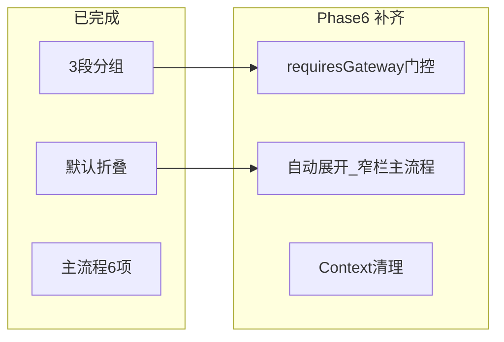

# PRD v1.3 Phase 6：高级分组收尾与导航门控

## 现状（Phase 1–5 已完成）

| 项 | 状态 | 证据 |
|---|---|---|
| 主流程 6 项 | 已满足 | [`HERMES_NAV_ITEMS`](src/renderer/src/screens/Hermes/constants.ts) primary：`workbench` / `chat` / `experts` / `expertTeams` / `expertRuns` / `artifacts` |
| 能力管理 3 项 | 已满足 | `skillCenter` / `mcp` / `mcpGateway` → section `capability` |
| 高级设置 6 项 | 已满足 | `sessions` / `skills` / `tools` / `memory` / `providers` / `models` → section `advanced` |
| 默认折叠 | 已满足 | [`HERMES_PAGE_SECTION_DEFAULT_COLLAPSED`](src/renderer/src/screens/Hermes/model/page.ts) capability+advanced=true；localStorage 持久化 |
| 分组 i18n | 已满足 | `workspaces.nav.section.{primary,capability,advanced}` en/zh-CN |
| 顶栏 Tab 命名 | 已满足 | `navigation.localHermes` → 「Work 专家工作台」/ `Work Expert Workspace` |
| **`requiresGateway`** | **未接线** | registry 字段存在，[`HermesSidebar`](src/renderer/src/screens/Hermes/components/HermesSidebar.tsx) 未读取 |
| **Context 旧 runs** | **可清理** | [`HermesExpertsContext`](src/renderer/src/screens/Hermes/context/HermesExpertsContext.tsx) 仍维护 `runs`/`refreshRuns`/`listRaw`，Runs/Workbench 已走 feature hooks |



---

## Step 1：Gateway 导航门控（registry 行为补齐）

PRD §10.3：`requiresGateway` 应在网关离线时影响导航可达性。

### 1.1 新建 [`features/nav/useGatewayNavGate.ts`](src/renderer/src/screens/Hermes/features/nav/useGatewayNavGate.ts)

- mount 时调用 `workApi.gateway.health()`，可选 30s 轻量 refresh（与 Workbench 一致，不引入新 IPC）
- 返回 `{ gatewayOnline: boolean; loading: boolean; refresh }`
- `window.hermesExperts` 不可用时 `gatewayOnline = false`

### 1.2 纯函数 [`features/nav/navItemAccess.ts`](src/renderer/src/screens/Hermes/features/nav/navItemAccess.ts)

```typescript
export function isNavItemAccessible(
  item: HermesNavItemDefinition,
  gatewayOnline: boolean,
): boolean {
  if (item.visible === false) return false;
  if (item.requiresGateway && !gatewayOnline) return false;
  return true;
}
```

### 1.3 更新 [`HermesSidebar.tsx`](src/renderer/src/screens/Hermes/components/HermesSidebar.tsx)

- 消费 `useGatewayNavGate()`
- `renderNavButton`：不可达项渲染为 `disabled` + `title` 提示（i18n：`workspaces.nav.requiresGateway`）
- **不隐藏** gateway 项（保留入口可见性，符合 PRD「旧页面入口不丢失」）

### 1.4 更新 [`HermesShell.tsx`](src/renderer/src/screens/Hermes/panels/HermesShell.tsx)

- 若当前 `activeNavItem` 对应项 `requiresGateway && !gatewayOnline` → `setActiveNavItem("workbench")`
- 避免用户停留在 experts/runs 等页而网关已断

---

## Step 2：Sidebar 交互 polish

### 2.1 自动展开分组

在 `HermesSidebar` 增加 `useEffect`：当 `activeNavItem` 属于 `capability` 或 `advanced` 时，自动将该 section 的 `sectionCollapsed[section]` 设为 `false` 并持久化。

### 2.2 窄栏（icon-only）仅显示主流程

当前 collapsed sidebar 扁平展示全部 nav 项，违背「主流程不超过 6 个」的产品意图。

- `sidebarCollapsed === true` 时：只渲染 `section === "primary"` 且 `isNavItemAccessible` 的项
- 能力/高级页仍可通过展开侧栏或 Workbench 跳转（MCP Gateway 按钮）进入

---

## Step 3：Context 清理（PRD 第 10 步 · 最小范围）

[`HermesExpertsContext.tsx`](src/renderer/src/screens/Hermes/context/HermesExpertsContext.tsx) 仍被 Inspector / Chat 使用（`getExpertById` / `refreshExperts`），**本阶段不删除 Provider**。

清理范围：

- 从 Context value 移除 `runs`、`refreshRuns`
- `loadFromApi` 不再 `workApi.runs.listRaw()`（减少无效请求）
- 保留 `experts` / `teams` / `getExpertById` / `getTeamById` 供 [`HermesExpertInspectorPanel`](src/renderer/src/screens/Hermes/panels/HermesExpertInspectorPanel.tsx)、[`HermesActiveExpertBar`](src/renderer/src/screens/Hermes/pages/Chat/components/HermesActiveExpertBar.tsx)

可选（若 grep 无引用则删）：

- [`pages/Experts/hooks/useSummonExpert.ts`](src/renderer/src/screens/Hermes/pages/Experts/hooks/useSummonExpert.ts) legacy hook
- [`TeamSummonDrawer.tsx`](src/renderer/src/screens/Hermes/pages/ExpertTeams/components/TeamSummonDrawer.tsx) 仅为薄包装 → ExpertTeams 页直接 import `ExpertSummonDrawer`（减一层 indirection）

---

## Step 4：i18n 与标签对齐

在 [`en/workspaces.ts`](src/shared/i18n/locales/en/workspaces.ts) / [`zh-CN/workspaces.ts`](src/shared/i18n/locales/zh-CN/workspaces.ts) 补充：

- `nav.requiresGateway` — 网关离线时 disabled tooltip
- `nav.skillCenter` 副标题对齐 PRD GeneHub（如 zh：`GeneHub 技能中心`，en：`GeneHub Skill Center`）

不改 `navigation.localHermes`（已符合 §20 产品验收）。

---

## Step 5：文档增量

更新 [`docs/renderer/screens/Hermes.md`](docs/renderer/screens/Hermes.md)：

- §17.6 完成说明：`requiresGateway` 门控、窄栏主流程、Context runs 移除
- 不新建全量 Spec Pack（PRD §15.2 仍列为 v1.3 后迭代）

---

## 明确不在 Phase 6

- `shell/` 物理目录搬迁（Phase 1 延后项）
- `requiresAdvancedMode` / Settings Drawer 迁移（DECISION-002 → v1.4）
- Inspector / Chat 完全脱离 `HermesExpertsContext`（超出 §17.6 范围）
- Main / Preload / IPC 变更
- Artifacts 页 Import Dialog（Phase 5.1 hotfix）

---

## 验收清单（§17.6 + PRD §20 导航子集）

- [ ] 展开侧栏：主流程 6 项始终可见；能力管理 / 高级设置有分组标题且默认折叠
- [ ] 窄栏：仅显示主流程 icon（最多 6 个）
- [ ] 网关离线：experts/teams/runs/artifacts nav 项 disabled + tooltip；当前页自动回 workbench
- [ ] 网关在线：上述 4 项可点击；MCP/技能/Provider/模型等高级入口仍可访问
- [ ] `HermesExpertsContext` 无 `runs`/`refreshRuns` 对外 API
- [ ] `npm run typecheck` 通过

---

## 推荐实施顺序

1. `features/nav/*` + Sidebar gateway 门控
2. Sidebar 自动展开 + 窄栏主流程
3. HermesShell 离线 redirect
4. Context runs 清理 + TeamSummonDrawer 内联
5. i18n → typecheck → 手工冒烟（折叠/展开、离线 disabled、高级页可达）
