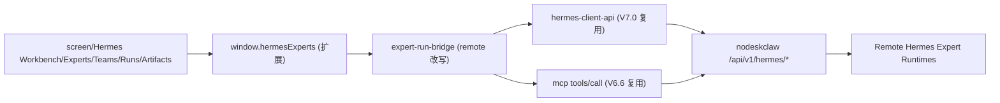

# Copilot Desktop 远端专家工作台转向实施计划

## 背景与核心结论

- 参考产品规划 [prd_work/nodeskclaw-remote-experts.md](prd_work/nodeskclaw-remote-experts.md)：专家/团队全部在 nodeskclaw MCP Gateway，desktop **不再本地安装专家 Profile**，只做 MCP Client、任务追踪、产物消费、本地上下文桥接。
- 现状（V7.1/V7.1.1）已实现一套**本地安装**模型：[expert-installer.ts](src/main/hermes-experts/expert-installer.ts)、[expert-profile-manager.ts](src/main/hermes-experts/expert-profile-manager.ts)、[expert-install-materializer.ts](src/main/hermes-experts/expert-install-materializer.ts)、`ExpertInstallPlanDrawer`、`useExpertInstall`、summon 启本地 9601+ Gateway、Chat 打本地端口。
- **关键复用**：新 PRD 所需远端能力大部分已存在——
  - MCP 连接/诊断/tools-list/tools-call：[src/main/mcp-skill-gateway-runtime/](src/main/mcp-skill-gateway-runtime/)（`mcp-gateway-invoke-test.ts`、`mcp-tools-cache.ts`）+ [HermesMcpGatewayPage.tsx](src/renderer/src/screens/Hermes/pages/McpGateway/HermesMcpGatewayPage.tsx)
  - 远端 agents/tools/readiness、task result、artifact preview/download：[hermes-client-api.ts](src/main/mcp-skill-gateway-runtime/hermes-client-api.ts) + [hermes-client-contract.ts](src/shared/hermes-client/hermes-client-contract.ts)，经 `window.mcpSkillGatewayRuntime` 的 `hermes-client:*` 暴露
  - 远端 catalog 拉取已存在：[expert-catalog-client.ts](src/main/hermes-experts/expert-catalog-client.ts) 已请求 `/api/v1/hermes/experts`（带 cache+mock 兜底）
- 因此本计划**不新建** `src/main/nodeskclaw/` 与 `window.nodeskclawAPI`，而是复用 `hermes-client` + 扩展 `window.hermesExperts`。

## 架构方向（目标态）

## 产品边界（写入规范）

- desktop 不安装专家/团队 Profile；不决定 Runtime Skill 执行实例。
- `tools/call` arguments **禁止** `_routing` / `_execution` / `route_config`。
- 不直接读远端 workspace 文件；server_artifacts 不伪装成本地文件，import 默认创建副本不覆盖。
- token 仅 Main Process（复用 [mcp-token-provider.ts](src/main/mcp-skill-gateway-runtime/mcp-token-provider.ts) / [token-store.ts](src/main/auth/token-store.ts)），Renderer 不接触。

## 导航调整

当前 [constants.ts](src/renderer/src/screens/Hermes/constants.ts) `HERMES_NAV_ITEMS`：`chat, experts, expertTeams, expertRuns, sessions, skills, skillCenter, mcp, mcpGateway, tools, memory, providers, models`。

目标新增/语义调整：
- 新增 `workbench`（默认首页）、`artifacts`（成果中心）。
- `experts` / `expertTeams` / `expertRuns` 语义转为远端；`mcpGateway` 复用为「MCP Gateway 连接」入口。
- `chat` + `sessions/skills/tools/memory/providers/models` 归入 Local Hermes 本地助手范畴（保留）。

---

## Phase 0 — 架构收敛与边界落档（spec/docs）

- 在 `docs/specs/` 新增远端专家边界说明（复用 PRD §12 目录建议的精简版），记录：无本地安装、复用 hermes-client、route override 禁止规则。
- 标记 deprecated（不删除、解绑）：[expert-installer.ts](src/main/hermes-experts/expert-installer.ts)、[expert-install-materializer.ts](src/main/hermes-experts/expert-install-materializer.ts)、[expert-profile-manager.ts](src/main/hermes-experts/expert-profile-manager.ts) 中的本地 Gateway 启停；contract 中 `previewInstallExpert/installExpert/previewInstallTeam/installTeam/preflightExpert/dispatchTeam` 标注 deprecated。

## Phase 1 — 远端召唤 MVP（核心，复用 V7.0/V6.6）

- 改写 [expert-runtime.ts](src/main/hermes-experts/expert-runtime.ts) `summonExpert`：由「startProfile 本地」改为「`tools/call` 远端」——经 [mcp-gateway-invoke-test.ts](src/main/mcp-skill-gateway-runtime/mcp-gateway-invoke-test.ts)/hermes-client 发起，返回 `task_id`，写入本地 run cache（[expert-runtime-db.ts](src/main/hermes-experts/expert-runtime-db.ts) 仅作 UI 缓存）。
- 新增 remote run 解析：[expert-run-bridge.ts](src/main/hermes-experts/expert-run-bridge.ts) 改为消费 [hermes-client-api.ts](src/main/mcp-skill-gateway-runtime/hermes-client-api.ts) 的 `getTaskResult` + `getTaskEventsToken`（SSE/轮询）→ 映射为 `HermesExpertRun` + `ExpertRunEvent`。
- Runs 页 [ExpertRunDetail.tsx](src/renderer/src/screens/Hermes/pages/ExpertRuns/components/ExpertRunDetail.tsx)/[ExpertRunTimeline.tsx](src/renderer/src/screens/Hermes/pages/ExpertRuns/components/ExpertRunTimeline.tsx) 改为远端事件驱动；保留 Cancel/Retry。
- Artifacts：召唤完成后用 hermes-client `previewArtifact/downloadArtifact`（已具备）。
- Experts 页移除「安装」动作，改为「召唤」Call Drawer（参数确认 → tools/call）；[useExpertInstall.ts](src/renderer/src/screens/Hermes/pages/Experts/hooks/useExpertInstall.ts) deprecate，[useSummonExpert.ts](src/renderer/src/screens/Hermes/pages/Experts/hooks/useSummonExpert.ts) 接远端。
- **验收**：连接 nodeskclaw → 列出远端专家 → 召唤 → 远端创建 task → completed 后看到 result + 可预览/下载 server_artifacts；未创建本地 expert profile；未传 route override。

## Phase 2 — 专家/团队目录产品化（多为现有 UI 调整）

- [expert-catalog-client.ts](src/main/hermes-experts/expert-catalog-client.ts) catalog 映射对齐 PRD `RemoteExpert/RemoteExpertTeam`（category/tags/starterPrompts/riskLevel/approvalMode/authorized/inputSchema）；优先 `/api/v1/hermes/client/experts`，`tools/list` 兜底。
- [ExpertDetailDrawer.tsx](src/renderer/src/screens/Hermes/pages/Experts/components/ExpertDetailDrawer.tsx)/[ExpertTeamDetailModal.tsx](src/renderer/src/screens/Hermes/pages/ExpertTeams/components/ExpertTeamDetailModal.tsx) 展示输入 schema / 输出策略 / 风险等级 / 成员职责。
- 分类/搜索/推荐（catalog 已有 filter）。

## Phase 3 — 团队编排时间线消费（server_managed）

- desktop **不**直接调成员工具；[expert-team-runtime.ts](src/main/hermes-experts/expert-team-runtime.ts) 召唤团队 = `tools/call` team tool；消费 `team.plan.* / team.member.* / team.merge.*` 时间线。
- [ExpertRunMemberPanel.tsx](src/renderer/src/screens/Hermes/pages/ExpertRuns/components/ExpertRunMemberPanel.tsx) 展示成员执行过程与最终 team artifact；移除本地 leader_dispatch 逻辑。

## Phase 4 — Workbench 首页 + Artifacts 页 + GeneHub Skill Push

- 新增 `pages/Workbench/HermesWorkbenchPage.tsx`：连接状态、Quick Task、推荐专家/团队、最近 Runs、最近 Artifacts、待审批（复用 catalog/recent-tasks）。设为 Hermes 默认页。
- 新增 `pages/Artifacts/HermesArtifactsPage.tsx`：按 Run/时间浏览，预览/下载/导入本地 workspace（导入索引 `LocalImportedArtifact`，复用 hermes-client 下载）。
- GeneHub：在现有 [GeneHubSkillCenterPage.tsx](src/renderer/src/screens/Hermes/pages/GeneHub/GeneHubSkillCenterPage.tsx) 增「Skill Push / My Submissions / Pull Job 状态」（普通用户能力；审核/发布在 Portal）。

## Phase 5 — WebOperator / Screen 上下文桥接

- 当前网页/屏幕摘要、本地文件 → 注入 tools/call `arguments.context`（不含 route override）；artifact 回写本地 workspace。

---

## 契约 / IPC 改动（复用为主）

- 扩展 [hermes-experts-contract.ts](src/shared/hermes-experts/hermes-experts-contract.ts)：新增 `RemoteRun/RemoteRunEvent/RemoteArtifact` 远端语义；`summon*` 返回 `taskId`；install* 标 deprecated。
- 新增 IPC（按 [.cursor/rules/003-ipc-contract.mdc](.cursor/rules/003-ipc-contract.mdc) 全链路）：`hermes-experts:get-run-result`、`:get-run-timeline`、`:list-run-artifacts`、`:import-artifact`（其余复用 `hermes-client:*`）。
- 同步 [src/preload/hermes-experts-api.ts](src/preload/hermes-experts-api.ts) + `index.d.ts` + [docs/API_CONTRACTS.md](docs/API_CONTRACTS.md)。

## 测试与文档

- Vitest：catalog 映射、remote summon（mock fetch）、run-bridge 事件映射、preload surface。
- 按 [.cursor/rules/007-sync-project-docs.mdc](.cursor/rules/007-sync-project-docs.mdc) 增量更新 [docs/INDEX.md](docs/INDEX.md)、[AGENTS.md](AGENTS.md)、[docs/renderer/screens/Hermes.md](docs/renderer/screens/Hermes.md)、API_CONTRACTS。

## 附：nodeskclaw 后端待补接口（仅清单，不在本仓库实现）

- `GET /api/v1/hermes/client/experts`、`/expert-teams`（产品化目录 + metadata + starter prompts + 授权/风险）
- `tools/call` 返回 `task_id / result_url / artifact_url`；`GET /tasks/{id}`、`/timeline`、`/artifacts`
- team_tool_orchestrator + `team.*` timeline 事件
- `GET/POST /api/v1/genehub/skills|submissions|pull-jobs`

## 不在本阶段范围

- nodeskclaw 服务端实现；本地安装代码物理删除（仅 deprecate）；复杂 DAG 编排 / 企业 RBAC 后台。