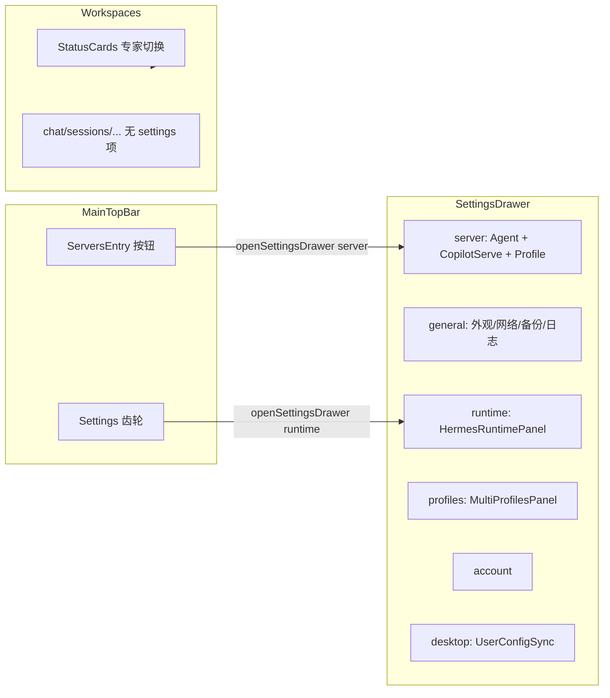

# 全局 Settings 重构：Server 面板 + 顶栏收敛

## 背景与约束

- Renderer **无 Tailwind 编译**；新 UI 继续用 [`SettingsDrawer.css`](src/renderer/src/screens/SettingsDrawer/SettingsDrawer.css) 的 `settings-drawer-*` + [`main.css`](src/renderer/src/assets/main.css) 既有 `settings-*` / `btn` / `input`（与现 [`Settings.tsx`](src/renderer/src/screens/Workspaces/pages/Settings/Settings.tsx) 一致）。
- **不改** IPC / Preload；继续 `window.hermesAPI`、`window.copilotServe`、`window.profileRuntime`。
- **两套 Profile 概念保持分离**：
  - **全局 Profile**（`useDesktopNavigation().activeProfile`，原 `MainProfileSwitch`）→ 迁入 **server 面板**
  - **Workspaces 专家 Profile 卡片**（`WorkspacesContext.activeProfileId`）→ 仍在 [`WorkspaceStatusCards`](src/renderer/src/screens/Workspaces/components/WorkspaceStatusCards.tsx)，不动



---

## 1. 新增 `SettingsDrawer/server` 模块

**目录结构（新建）**

```text
src/renderer/src/screens/SettingsDrawer/
  server/
    ServerPanel.tsx          # 主面板（组合子区块）
    GlobalProfileSection.tsx # 全局 Profile 列表/切换（原 MainProfileSwitch 能力）
    HermesAgentSection.tsx   # 从 Settings.tsx 抽取：版本/Doctor/Update/Home
    index.ts                 # 可选 re-export
```

**`ServerPanel.tsx` 职责**

| 区块 | 来源 | API |
|------|------|-----|
| 全局 Profile | 新 `GlobalProfileSection` | `hermesAPI.listProfiles`、`onSelectProfile`（由 Drawer 传入） |
| Hermes Agent | 抽取 `Settings.tsx` L407–538 | `getHermesVersion`、`runHermesDoctor`、`runHermesUpdate` 等 |
| Copilot Serve | 现有 [`CopilotServeRuntimeSection`](src/renderer/src/modules/hermes-runtime/sections/CopilotServeRuntimeSection.tsx) | `window.copilotServe.*` |
| 连接模式 local/remote/ssh | 抽取 `Settings.tsx` L564–760 | `getConnectionConfig`、`setConnectionConfig` 等 |

- `ServerPanel` 接收 props：`activeProfile: string`、`onSelectProfile: (name: string) => void`（与 Layout 中 `navigation.handleSelectProfile` 对齐）。
- `GlobalProfileSection`：页面内列表/卡片切换（复用 [`ProfileSwitcherDropdown`](src/renderer/src/components/dropdowns/ProfileSwitcherDropdown.tsx) 的数据加载逻辑，改为 **内嵌列表**，避免顶栏锚点下拉）；保留「管理 Profiles」→ `onPanelChange("profiles")`、「创建工作区」→ `onNavigate("workspaces")`（通过 props 回调）。

**样式**：区块容器用 `settings-drawer-section` / `settings-section`（main.css）；不新增 Tailwind。

---

## 2. SettingsDrawer 增加 `server` 与 `general` 面板

更新 [`settings-drawer-types.ts`](src/renderer/src/screens/SettingsDrawer/settings-drawer-types.ts)：

```ts
export type SettingsDrawerPanel =
  | "server"   // 新增，置顶或紧随 account
  | "general"  // 新增（用户已选：非 Agent 区块放此）
  | "account"
  | "runtime"
  | "profiles"
  | "desktop";
```

更新 [`SettingsDrawer.tsx`](src/renderer/src/screens/SettingsDrawer/SettingsDrawer.tsx)：

- `PANEL_LABEL_KEYS`：`server` → `navigation.server` 或 `settings.sections.server`（i18n 补齐 en/zh-CN）
- `panel === "server"` → `<ServerPanel activeProfile={...} onSelectProfile={...} onOpenPanel={onPanelChange} />`
- `panel === "general"` → `<GeneralPanel />`（新建 [`SettingsDrawer/general/GeneralPanel.tsx`](src/renderer/src/screens/SettingsDrawer/general/GeneralPanel.tsx)）

**`GeneralPanel` 从 `Settings.tsx` 迁入**

- 外观 / 语言（`ThemeProvider`、`LanguageSelect`）
- 网络（force IPv4、HTTP proxy）
- OpenClaw 迁移横幅
- 数据备份/导入
- 日志查看器
- Community Telegram（可选保留）

抽取时把 `LanguageSelect` 移到 `general/LanguageSelect.tsx` 或同文件私有组件，避免 Workspaces 依赖。

**持久化**：[`Layout.tsx`](src/renderer/src/screens/Layout/Layout.tsx) 恢复 `lastSettingsDrawerPanel` 时加入 `"server" | "general"` 白名单（约 L109–116）。

---

## 3. MainTopBar：移除 `MainProfileSwitch`

[`MainTopBar.tsx`](src/renderer/src/screens/MainPage/MainTopBar.tsx) L139–144：

- **删除** `<MainProfileSwitch ... />` 及对 `onSelectProfile` / `onNavigate` 的顶栏专用传递（若仅 Servers 需要，`MainPage`/`Layout` 改为传给 `SettingsDrawer`）。
- **替换为** `ServersEntry`（新组件，可放 `MainPage/ServersEntry.tsx`）：
  - 展示当前 `activeProfile` 文本 + 可选运行状态点（可读 `profileRuntime` 或简化为纯文本）
  - 点击 → `onOpenSettingsDrawer("server")`
  - 样式复用 `main-page.css` 中 `.MainProfileSwitch` 尺寸规则，改名为 `.MainServersEntry`（避免语义混淆）

顶栏 **Settings 齿轮**（L228–235）：建议改为 `onOpenSettingsDrawer("server")`（全局服务入口），或保持 `runtime` 仅 Hermes 运维——**默认改为 `server`**，与「全局 setting」目标一致；`UserCircle` 仍打开 `account`。

Props 调整链：`MainTopBar` 可移除 `onSelectProfile`、`onNavigate`（若 `ServersEntry` 不需要 navigate）；`Layout` → `SettingsDrawer` 传入 `onSelectProfile={navigation.handleSelectProfile}`。

---

## 4. Workspaces 侧栏移除 Settings 页

| 文件 | 变更 |
|------|------|
| [`constants.ts`](src/renderer/src/screens/Workspaces/constants.ts) | `NavItemKey` 去掉 `"settings"`；`SIDEBAR_NAV_ITEMS` 删除 settings 项 |
| [`workspace-pages.tsx`](src/renderer/src/screens/Workspaces/registry/workspace-pages.tsx) | 删除 `SettingsPage` lazy 与 registry 项 |
| [`WorkspacesShell.tsx`](src/renderer/src/screens/Workspaces/panels/WorkspacesShell.tsx) | 默认/持久化 `activeNavItem === "settings"` 时回退为 `"chat"` |
| `pages/Settings/Settings.tsx` | **删除**或保留薄 re-export 指向 deprecated（推荐删除整目录，逻辑已拆分） |

[`WorkspaceStatusCards`](src/renderer/src/screens/Workspaces/components/WorkspaceStatusCards.tsx) 的 Settings 按钮：改为 `onOpenSettingsDrawer?.("server")` 或 `("general")`——通过 `WorkspacesScreen` 新增 prop `onOpenSettingsDrawer`，由 `Layout` 传入（替代当前 `onOpenRuntimeSettings` 仅开 runtime）。

---

## 5. i18n 与门禁

- [`en/navigation.ts`](src/shared/i18n/locales/en/navigation.ts)、[`zh-CN/navigation.ts`](src/shared/i18n/locales/zh-CN/navigation.ts)：增加 `server`、`general`（及 Drawer 侧栏文案）。
- [`scripts/check-workspaces-no-tailwind.cjs`](scripts/check-workspaces-no-tailwind.cjs)：确认 `SettingsDrawer/server`、`general` 无 `flex ` / `zinc-` 等（已扫描 SettingsDrawer 时可一并覆盖）。

---

## 6. 验证清单

1. 顶栏点击原 Profile 区域 → 打开 Drawer **server** 面板，可切换全局 Profile。
2. server 面板：Hermes Agent 信息、Copilot Serve 启停/部署、连接模式可用。
3. Drawer **general**：主题/语言/网络/备份/日志与迁移前行为一致。
4. Workspaces 左栏无 Settings；原 `settings` 持久化导航落到 chat。
5. `npm run check:workspaces-no-tailwind` + `npm run typecheck` 通过。
6. 功能收尾：按 [`.agents/skills/sync-project-docs/SKILL.md`](.agents/skills/sync-project-docs/SKILL.md) 增量更新 `AGENTS.md` / `docs/INDEX.md`（新增 SettingsDrawer server/general、移除 Workspaces settings 页）。

---

## 关键文件一览

| 操作 | 路径 |
|------|------|
| 新建 | `SettingsDrawer/server/ServerPanel.tsx`, `GlobalProfileSection.tsx`, `HermesAgentSection.tsx` |
| 新建 | `SettingsDrawer/general/GeneralPanel.tsx` |
| 修改 | `settings-drawer-types.ts`, `SettingsDrawer.tsx`, `Layout.tsx`, `MainTopBar.tsx`, `MainPage.tsx` |
| 新建 | `MainPage/ServersEntry.tsx`（或内联于 MainTopBar） |
| 修改 | Workspaces `constants.ts`, `workspace-pages.tsx`, `index.tsx`, `WorkspacesShell.tsx` |
| 删除 | `Workspaces/pages/Settings/**` |
| 可选保留 | `CopilotServeRuntimeSection.tsx` 位置不变，由 ServerPanel import |
