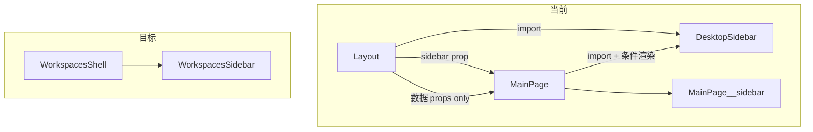

# 主窗体不再承载 Sidebar 导入

## 背景

当前 [`Layout.tsx`](src/renderer/src/screens/Layout/Layout.tsx) 负责：

- `import { DesktopSidebar } from "../../components/layout/DesktopSidebar"`
- 组装 `sidebar={<DesktopSidebar ... />}` 传给 [`MainPage`](src/renderer/src/screens/MainPage/MainPage.tsx)

而 [`workspace-secondary-nav.ts`](src/shared/workspace/workspace-secondary-nav.ts) 已标明 **`portal` / `workspaces` 二级导航为空**（`team_v1.5`：Workspaces 三栏自包含）。全局 `DesktopSidebar` 在这些 Tab 下只剩空白导航 + 底部更新按钮，与 [`WorkspacesShell`](src/renderer/src/screens/Workspaces/panels/WorkspacesShell.tsx) 内的 `WorkspacesSidebar` 重复。



## 目标行为

| Workspace | 全局 `DesktopSidebar` |
|-----------|----------------------|
| `portal` | 不显示 |
| `workspaces` | 不显示（用 `WorkspacesSidebar`） |
| `task-workbench` | 不显示 |
| `web-operator` | 显示（browser-state / screenshot / action-log） |
| `office` | 显示（office 面板） |
| `external-browser:*` | 不显示 |

侧栏显隐公式：

```ts
showGlobalSidebar =
  isStaticWorkspaceId(activeView) &&
  SECONDARY_NAV_BY_WORKSPACE[activeView].length > 0 &&
  sidebarMode !== "hidden"
```

---

## 实现步骤

### 1. 抽出共享判断（可选小工具，避免重复）

在 [`src/renderer/src/workspace/`](src/renderer/src/workspace/) 新增例如 `has-global-secondary-nav.ts`：

- 导出 `hasGlobalSecondaryNav(view: View): boolean`
- 内部复用 `isStaticWorkspaceId` + `SECONDARY_NAV_BY_WORKSPACE`

或直接在 `MainPage` 内联（仅两处用时也可内联）。

### 2. 修改 [`MainPage.tsx`](src/renderer/src/screens/MainPage/MainPage.tsx)

- **删除** `sidebar: React.ReactNode` prop
- **新增** props（由 Layout 传入，不 import 侧栏组件）：
  - `activeView` 已有
  - `secondaryPanel` / `onSecondaryPanelChange`
  - `updateState` / `updateError` / `updateVersion` / `downloadPercent` / `onUpdate`
- **import** `DesktopSidebar`
- 渲染逻辑：

```tsx
const showGlobalSidebar = hasGlobalSecondaryNav(activeView) && sidebarMode !== "hidden";

// MainPage__body
{showGlobalSidebar ? (
  <aside className="MainPage__sidebar">
    <DesktopSidebar ... />
  </aside>
) : null}
```

- 向 `MainTopBar` 传入 `showSidebarToggle={hasGlobalSecondaryNav(activeView)}`（见下）

### 3. 修改 [`Layout.tsx`](src/renderer/src/screens/Layout/Layout.tsx)

- **移除** `DesktopSidebar` import
- **移除** `sidebar={...}` 整块 JSX
- **保留** `useUpdateState()`（仍供 `StatusBar` 使用）
- 将 update 相关字段与 `secondaryPanel` / `handleSecondaryPanelChange` 作为新 props 传给 `MainPage`

`WorkspaceOutlet` 仍由 Layout 传入 `secondaryPanel`（与侧栏/WebOperator 同步），**无需改动** outlet 契约。

### 4. 修改 [`MainTopBar.tsx`](src/renderer/src/screens/MainPage/MainTopBar.tsx)

- 新增 `showSidebarToggle?: boolean`（默认 `true` 或显式传入）
- 当 `showSidebarToggle === false` 时：
  - **隐藏**侧栏折叠按钮（`PanelLeftClose` / `PanelLeftOpen`），避免在 `workspaces` 上切换无意义的 `sidebarMode`
- 可选：在 `workspaces` 下若持久化状态为 `expanded`，不在 Layout 自动改 state（仅靠 `showGlobalSidebar` 不渲染即可，持久化值可保留）

### 5. 样式 [`main-page.css`](src/renderer/src/screens/MainPage/main-page.css)

- 确认无侧栏时 `MainPage__content` 占满 `MainPage__body` 宽度（现有 flex 布局通常已满足；若无则加 modifier，例如 `MainPage--no-global-sidebar`）

### 6. 更新按钮 UX（说明）

条件隐藏侧栏后，`portal` / `workspaces` 下不再显示侧栏底部的更新按钮。`StatusBar` 仍展示 `Update: {updateState}` 文本（[`StatusBar.tsx`](src/renderer/src/components/layout/StatusBar.tsx)）。若后续需要可点击更新，可单独在 StatusBar/TopBar 补按钮——**本次不扩 scope**。

---

## 验证

- `pnpm run typecheck:web`
- 手动切换 Tab：
  - `workspaces`：无左侧全局空栏；`WorkspacesSidebar` 正常
  - `web-operator`：二级导航可见；切换 panel 仍驱动 `WorkspaceOutlet`
  - `office`：office 二级项可见
  - 顶栏侧栏按钮仅在 `web-operator` / `office` 出现

## 文档（收尾）

按 [007-sync-project-docs](.cursor/rules/007-sync-project-docs.mdc) 增量更新：

- [`docs/MODULES.md`](docs/MODULES.md) / [`AGENTS.md`](AGENTS.md)：注明全局二级侧栏由 `MainPage` 条件渲染，非 `Layout` 组装

---

## 不涉及

- 不改动 `WorkspacesShell` / `WorkspacesSidebar`
- 不改动 `workspace-secondary-nav` 空数组配置（已符合产品意图）
- 不迁移 `sidebarMode` 持久化逻辑（仍在 `Layout`）
