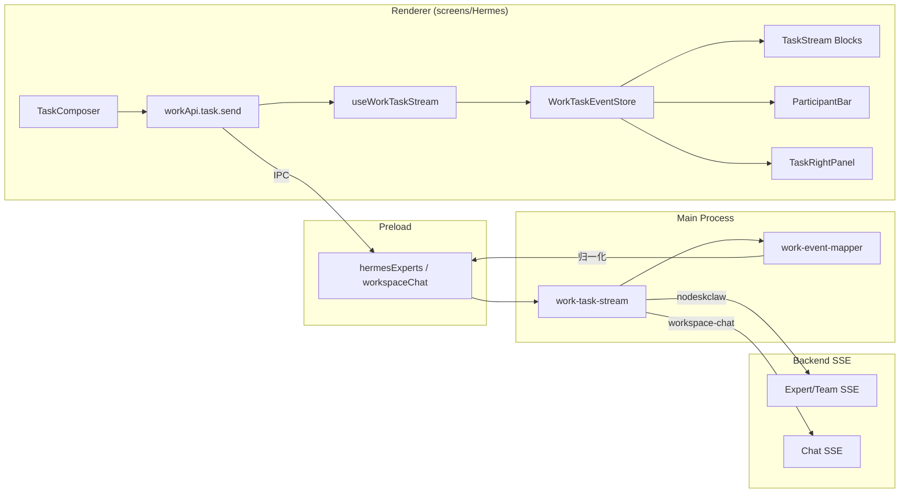

# v1.4 Work 任务窗口与实时 Agent SSE 交互

## 现状分析

当前 `screens/Hermes/` 已有完整的 Work 专家工作台架构：

- **壳层**：`HermesShell` 三栏（Sidebar + Center + RightPanel），`HermesDefaultContext` 管理导航/面板状态
- **导航**：`constants.ts` 定义 15 个 `HermesNavItemKey`（workbench/chat/experts/expertTeams/expertRuns/artifacts...），分 primary/capability/advanced 三段
- **页面注册**：`registry/hermes-pages.tsx` lazy 加载全部页面组件
- **API 适配层**：`api/workApi.ts` 封装 `window.hermesExperts` → `Work*` model 类型映射
- **领域模型**：`model/` 下有 `expert.ts`、`run.ts`、`artifact.ts`、`error.ts`、`expert-team.ts`、`page.ts`

v1.4 核心变化：**新增 "任务" 导航项 + TaskWindow 三栏任务操作面板 + SSE 事件流渲染**，替代原先分散的 Chat/ExpertRuns/Artifacts 交互模式。

## 架构决策

1. **不新建 `screens/Work/`**：PRD 建议可先在 `screens/Hermes/` 内扩展（v1.4 不删旧页面，旧导航保留），避免重复壳层
2. **不新增 `window.work` Preload**：v1.4 继续用 `workApi.ts` 适配层，扩展 `workApi.task.*` 子域
3. **领域契约**：新建 `src/shared/work/` 存放 `WorkTask`/`WorkTaskEvent`/`WorkOutput`/`WorkParticipant` 等核心类型
4. **Main 预留**：新建 `src/main/work/` 骨架（IPC channel + event mapper），MVP 先包装现有 `workspace-chat` 和 `hermesExperts` SSE
5. **Mock 模式**：内置 `VITE_WORK_MOCK_MODE` 环境变量，完整 mock 销售作战团队场景

## 关键数据流

## 文件变更范围

### 新建文件

**Shared 领域契约** (`src/shared/work/`):
- `work-task-contract.ts` - WorkTask / WorkTaskStatus / WorkTaskType
- `work-event-contract.ts` - WorkTaskEvent / WorkTaskEventType / BaseWorkTaskEvent
- `work-output-contract.ts` - WorkOutput
- `work-participant-contract.ts` - WorkParticipant / ParticipantStatus
- `work-context-contract.ts` - WorkContextRef / WorkWebContextRef
- `work-error-contract.ts` - WorkErrorCode (扩展现有 error.ts)

**Main Process 预留** (`src/main/work/`):
- `work-ipc.ts` - IPC channel 注册（`work:task-event` / `work:task-send` / `work:task-stop`）
- `work-task-stream.ts` - SSE 订阅/取消/断线处理
- `work-event-mapper.ts` - chat.chunk -> agent.message.delta 等归一化
- `work-types.ts` - Main 侧类型

**Renderer 页面** (`src/renderer/src/screens/Hermes/pages/Tasks/`):
- `WorkTasksPage.tsx` - 任务页主容器（TaskHomeEntry / TaskWindow 切换）
- `components/TaskHomeEntry.tsx` - 任务首页（Hero + 场景 Tabs + 快捷 Chips + Composer + 最近任务）
- `components/NewTaskComposer.tsx` - 新任务创建输入区
- `components/ScenarioTabs.tsx` - 场景标签页
- `components/QuickPromptChips.tsx` - 快捷提示词
- `components/RecentTaskCards.tsx` - 最近任务卡片
- `components/TaskWindow.tsx` - 三栏布局容器
- `components/TaskHeader.tsx` - 任务标题栏
- `components/TaskListPanel.tsx` - 左侧任务列表
- `components/TaskConversationRegion.tsx` - 中栏对话区
- `components/TaskStream.tsx` - 事件流渲染器
- `components/ParticipantBar.tsx` - 参与者胶囊栏
- `components/TaskComposer.tsx` - 底部输入区
- `components/TaskRightPanel.tsx` - 右侧面板容器

**Stream Blocks** (`src/renderer/src/screens/Hermes/pages/Tasks/components/stream-blocks/`):
- `UserMessageBlock.tsx`
- `AgentMessageBlock.tsx`
- `ThinkingSummaryBlock.tsx`
- `TeamCreatedBlock.tsx`
- `TeamPlanBlock.tsx`
- `MemberDispatchBlock.tsx`
- `MemberProgressBlock.tsx`
- `ToolCallBlock.tsx`
- `ApprovalBlock.tsx`
- `OutputCreatedBlock.tsx`
- `ErrorBlock.tsx`

**Composer 子组件** (`components/composer/`):
- `TeamSelector.tsx`
- `ExpertSelector.tsx`
- `SkillSelector.tsx`
- `PermissionSelector.tsx`

**Right Panel Tabs** (`components/right-panel/`):
- `OutputPreviewPanel.tsx`
- `ContextPanel.tsx`
- `ParticipantsPanel.tsx`
- `SkillsPanel.tsx`
- `GovernancePanel.tsx`

**Features** (`src/renderer/src/screens/Hermes/features/`):
- `task-store/useWorkTaskStore.ts` - 任务状态管理 (React state + reducer)
- `task-store/workTaskReducer.ts` - 任务事件 reducer
- `task-store/workTaskSelectors.ts` - 选择器
- `task-stream/useWorkTaskStream.ts` - SSE 订阅 hook
- `task-stream/workEventNormalizer.ts` - 事件归一化
- `task-stream/workEventAggregator.ts` - delta 聚合

**Mock** (`src/renderer/src/screens/Hermes/mock/`):
- `mockTasks.ts`
- `mockExperts.ts`
- `mockTeams.ts`
- `mockEvents.ts` - 销售作战团队完整 mock 事件序列
- `mockOutputs.ts`

### 修改文件

- `src/renderer/src/screens/Hermes/constants.ts` - 新增 `"tasks"` 导航项
- `src/renderer/src/screens/Hermes/registry/hermes-pages.tsx` - 注册 TasksPage
- `src/renderer/src/screens/Hermes/api/workApi.ts` - 扩展 `workApi.task.*` 子域
- `src/renderer/src/screens/Hermes/model/error.ts` - 扩展 WorkErrorCode
- `src/renderer/src/screens/Hermes/Hermes.css` - 新增 TaskWindow 样式
- `src/shared/i18n/locales/en/workspaces.ts` - 新增 tasks 相关 i18n key
- `src/shared/i18n/locales/zh-CN/workspaces.ts` - 对应中文翻译
- `src/main/index.ts` - 注册 work IPC handler
- `src/preload/index.d.ts` - 预留 work 类型声明（如有新 IPC）

## 不改文件

- `Layout.tsx` / `MainPage/` - 不改壳层
- `WorkspaceRenderer.tsx` - 不改路由分发
- `HermesShell.tsx` / `HermesSidebar.tsx` - 仅通过 constants/registry 新增项驱动，不改壳层逻辑
- `components/ui/*` - 不改 Shadcn 基座
- 旧 pages（Chat/ExpertRuns/Artifacts/Experts/...）- 全部保留，不删不改

## 样式策略

延续 `Hermes.css` 的 BEM 命名，新增以下 class 前缀：
- `.hermes-task-*` - TaskWindow 相关
- `.hermes-stream-*` - TaskStream 事件块相关
- `.hermes-composer-*` - TaskComposer 相关

尺寸参考：
- TaskListPanel: 280px (min 240, max 340)
- TaskRightPanel: 420px (min 360, max 560)
- TaskComposer: min-height 120px
- AgentMessage max-width: 760px
- UserMessage max-width: 640px

