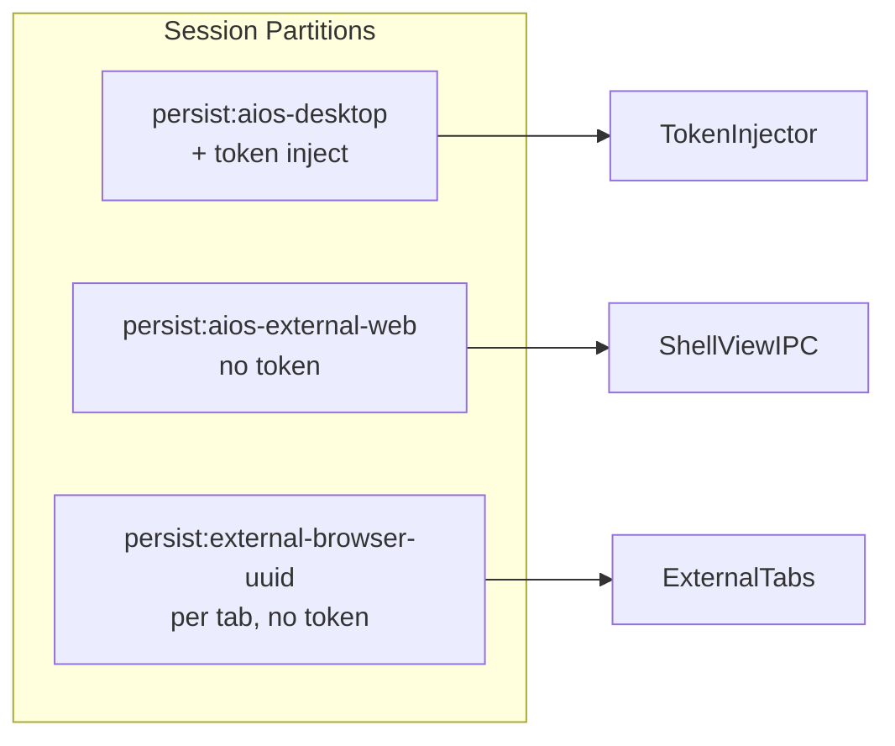
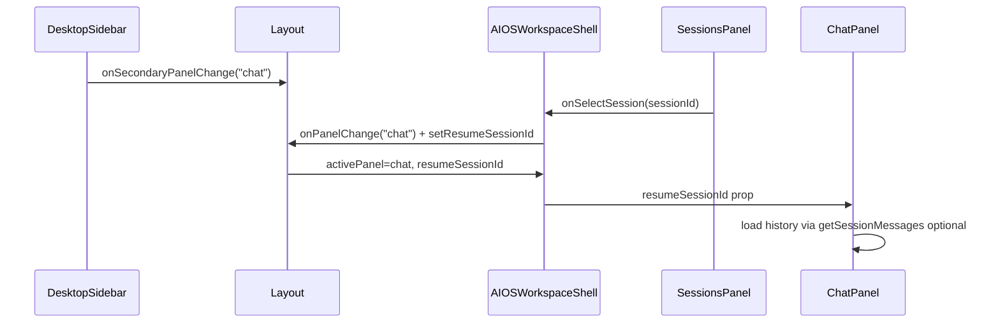

# V3.2.1 MainPage Hotfix 计划

## 背景与范围

基于 [v3.2_mainpage 迭代计划](.cursor/plans/v3.2_mainpage_迭代_a70f501d.plan.md) 的实现 Review，本 hotfix **不重复 V3.2 功能开发**，仅修复已识别缺口。父计划文件 **不修改**。

**默认产品决策（未单独确认时采用）：**

- **PRD #5**：**收敛入口** — 所有 Runtime 运维操作仍只发生在 `SettingsDrawer` 的 Runtime panel；`RuntimeGuard` / `MainProfileSwitch` 仅提供「打开 Settings → Runtime」快捷方式，不再伪装成独立 Setup/Logs/Diagnostics 能力。
- **Sessions ↔ Chat**：**纳入 v3.2.1** — 点击会话 → 切到 Chat panel 并带上 `resumeSessionId`。

---

## 目标架构（分区与入口）



| 分区 | 用途 | Token 注入 |
|------|------|------------|
| `persist:aios-desktop` | `aios-home` | 是（frontend/backend 端口） |
| `persist:aios-external-web` | `web-operator` | 否 |
| `persist:external-browser-{uuid}` | 每个 `external-browser:{uuid}` | 否 |

---

## P0 — 安全 / 产品语义

### 1. External tab 按 Tab 分 partition

**问题**：[`useExternalBrowserTabs.ts`](src/renderer/src/screens/MainPage/useExternalBrowserTabs.ts) 创建 ShellView 时未传 `partition`，全部落在 registry 默认 `persist:external-browser`，导致跨 Tab Cookie 泄漏。

**改动**：

1. 新增共享工具 [`src/shared/shell/browser-partitions.ts`](src/shared/shell/browser-partitions.ts)（新建）：

```ts
/** layerId: external-browser:{uuid} → persist:external-browser-{uuid} */
export function externalBrowserPartition(layerId: string): string {
  const suffix = layerId.startsWith("external-browser:")
    ? layerId.slice("external-browser:".length)
    : layerId;
  return `persist:external-browser-${suffix}`;
}
```

2. [`useExternalBrowserTabs.ts`](src/renderer/src/screens/MainPage/useExternalBrowserTabs.ts)：`openExternalTab` / `restoreExternalTabs` 的 `shellView.create` 增加 `partition: externalBrowserPartition(id)`。

3. [`view-registry.ts`](src/main/shell/views/view-registry.ts)：`external-browser` 的 `defaultPartition` 改为文档说明「创建时必须显式传入 per-tab partition」；默认值可保留 fallback 或改为 `undefined` 强制显式传参（推荐 **undefined + create 时必填** 以防遗漏）。

4. **测试**：`tests/browser-partitions.test.ts` — 验证 `external-browser:abc` → `persist:external-browser-abc`。

---

### 2. Token 注入端口从 aios-config 读取

**问题**：[`token-header-injector.ts`](src/main/auth/token-header-injector.ts) 硬编码 `3000/8000/8080`。

**改动**：

1. `shouldInject(url)` 内调用 [`getAiOsEnvConfig()`](src/main/aios/aios-config.ts)，允许端口集合为 `{ frontendPort, backendPort }`（默认 3000/8000）。

2. 仅匹配 `127.0.0.1` / `localhost` + 上述端口；**不**注入 Gateway `8642`（除非后续 PRD 明确要求）。

3. **测试**：`tests/token-header-injector.test.ts` — mock `getAiOsEnvConfig` 返回自定义端口，断言 `shouldInject` 行为（将 `shouldInject` 导出为纯函数便于单测，或抽 `src/main/auth/token-inject-url.ts`）。

---

### 3. PRD #5 — 收敛 Runtime 入口

**问题**：[`RuntimeGuard.tsx`](src/renderer/src/components/runtime/RuntimeGuard.tsx) 三个按钮均 `openSettings`；与「Runtime 仅在 Settings 管理」易被理解为多套入口。

**改动**：

1. **RuntimeGuard**：保留「启动 Gateway」主按钮；将 Setup / Logs / Diagnostics **合并为一个**「打开设置」按钮 → `onOpenRuntimeSettings()`（即 Layout 的 `openSettingsDrawer("runtime")`）。

2. **MainProfileSwitch**：`onManageProfiles` 保持打开 Settings Runtime（已是 Drawer，无需改行为）；更新 [`ProfileSwitcherDropdown`](src/renderer/src/components/dropdowns/ProfileSwitcherDropdown.tsx) 文案为 i18n「管理配置 / Settings」类（若当前写死英文）。

3. **文档**（不改正文 PRD 文件亦可）：
   - [`AGENTS.md`](AGENTS.md) V3.2.1 验收：允许 TopBar / Home / Profile 下拉 **打开 Settings Drawer(runtime)**，禁止独立 HermesRuntimeSettingsDrawer。
   - [`docs/API_CONTRACTS.md`](docs/API_CONTRACTS.md) 补一句快捷入口语义。

4. **不重命名** `onOpenRuntimeSettings` prop（减少扩散）；在 Layout 注释说明其等价于 `openSettingsDrawer("runtime")`。

---

## P1 — 架构一致性

### 4. WorkspaceRenderer 按 `module.kind` 分发

**问题**：[`WorkspaceRenderer.tsx`](src/renderer/src/components/workspace/WorkspaceRenderer.tsx) `switch (module.id)`，`kind` 字段未使用。

**改动**：

```ts
switch (module.kind) {
  case "webview":    // 仅 aios-home
  case "composite":  // web-operator
  case "react":      // 再 switch module.id: aios-workspace | office
}
```

- `external-browser:*` 仍在 kind 解析前走 `WebViewWorkspace`。
- 保持 `ReactWorkspace` / `CompositeWorkspace` / KeepAlive 行为不变。

---

### 5. 统一 web-operator partition

**问题**：三处不一致 — registry `persist:browser`、IPC [`BROWSER_PARTITION`](src/main/browser/browser-types.ts) = `persist:aios-external-web`、`shell-view-ipc` 显式传后者。

**决策**：以 **`persist:aios-external-web`（`BROWSER_PARTITION`）为唯一真相源**。

**改动**：

1. [`view-registry.ts`](src/main/shell/views/view-registry.ts)：`web-operator.defaultPartition` → `persist:aios-external-web`；文件头增加三分区策略注释（aios-home / web-operator / external per-tab）。

2. [`shell-view-ipc.ts`](src/main/shell/shell-view-ipc.ts)：`ensureWebOperatorView` 继续传 `BROWSER_PARTITION`（或改为 `viewRegistry.get("web-operator")!.defaultPartition` 单源读取）。

3. **不**向 token injector 注册 `persist:aios-external-web`。

---

### 6. MainViewTabs 使用 registry 的 closeable / draggable

**问题**：[`FIXED_TAB_IDS`](src/renderer/src/screens/MainPage/tab-order.ts) 与 registry 中 `web-operator`/`office` 的 `draggable: true` 矛盾。

**改动**：

1. [`workspace-registry.ts`](src/renderer/src/workspace/workspace-registry.ts)：将 `web-operator`、`office` 的 `draggable` 改为 `false`（与产品一致：仅 external tab 可拖）。

2. [`MainViewTabs.tsx`](src/renderer/src/screens/MainPage/MainViewTabs.tsx)：
   - 固定 Tab：`resolveWorkspaceModule(id)` 且 `!module.draggable`
   - 可拖 Tab：仅 `external-browser:*`（或 `module.draggable === true`）
   - 移除对 `FIXED_TAB_IDS` 的依赖

3. [`tab-order.ts`](src/renderer/src/screens/MainPage/tab-order.ts)：`FIXED_TAB_IDS` 改为从 `STATIC_WORKSPACE_MODULES.filter(m => !m.draggable).map(m => m.id)` 导出，或删除并由测试直接 assert registry。

4. [`workspace-tabs.ts`](src/renderer/src/workspace/workspace-tabs.ts)：`isWorkspaceTabView` 改为复用 `isStaticWorkspaceId` from registry。

---

## P2 — 体验与维护

### 7. 二级侧栏 i18n（四语言）

**问题**：[`SECONDARY_PANEL_LABEL_KEYS`](src/shared/workspace/workspace-secondary-nav.ts) 使用 `navigation.chat` 等，但 [`navigation.ts`](src/shared/i18n/locales/en/navigation.ts) 仅有顶栏 key。

**改动**：在 `en` / `zh-CN` / `es` / `pt-BR` 的 `navigation.ts` 增加：

- `chat`, `sessions`, `agents`
- `browserState`, `screenshot`, `actionLog`
- `chatPlaceholder`, `send`, `searchSessions`, `noSessions`, `active`
- （可选）`openSettings` 供 RuntimeGuard 收敛按钮使用

模块已在 i18n 聚合中注册则无需改 index；按 [`AGENTS.md`](AGENTS.md) 四语言同步。

---

### 8. 删除未使用 Drawer 组件

删除（无引用，仅定义文件）：

- [`src/renderer/src/modules/hermes-runtime/HermesRuntimeSettingsDrawer.tsx`](src/renderer/src/modules/hermes-runtime/HermesRuntimeSettingsDrawer.tsx)
- [`src/renderer/src/modules/auth/UserMenuDrawer.tsx`](src/renderer/src/modules/auth/UserMenuDrawer.tsx)

确认 `grep` 无测试/import 残留。

---

### 9. 修复 ChatPanel 流式收尾

**问题**：[`ChatPanel.tsx`](src/renderer/src/screens/AIOSWorkspace/panels/ChatPanel.tsx) 在 `setStreaming` 回调内调用 `setMessages`。

**改动**：

- 使用 `streamingRef` 累积 chunk；`onChatChunk` 更新 ref + `setStreaming` 触发渲染。
- `onChatDone`：读取 ref 最终文本 → `setMessages` → 清空 ref/streaming；`setBusy(false)`。
- `onChatError` 同样清空 ref。

---

### 10. SessionsPanel 选中会话 ↔ Chat 联动

**数据流**：



**改动**：

1. [`AIOSWorkspaceScreen.tsx`](src/renderer/src/screens/AIOSWorkspace/AIOSWorkspaceScreen.tsx)：本地 state `resumeSessionId`；把 `onPanelChange` 传给 Shell。

2. [`AIOSWorkspaceShell.tsx`](src/renderer/src/screens/AIOSWorkspace/panels/AIOSWorkspaceShell.tsx)：向 `SessionsPanel` / `ChatPanel` 透传 `resumeSessionId`、`onSelectSession`。

3. [`SessionsPanel.tsx`](src/renderer/src/screens/AIOSWorkspace/panels/SessionsPanel.tsx)：列表项可点击 → `onSelectSession(id)`；选中态样式。

4. [`ChatPanel.tsx`](src/renderer/src/screens/AIOSWorkspace/panels/ChatPanel.tsx)：
   - `resumeSessionId` prop 变化时：`getSessionMessages` 填充 `messages`，保留 `sessionId` 供后续 `sendMessage`。
   - 新会话：用户发送第一条消息后沿用现有 `onChatDone` 更新 `sessionId`。

5. **不**把 `resumeSessionId` 写入 `workspaceSecondaryState` 持久化（避免脏状态）；仅内存。

---

## 测试与文档

| 类型 | 内容 |
|------|------|
| 新增单测 | `browser-partitions.test.ts`、`token-inject-url.test.ts`（或 injector 导出测试） |
| 更新单测 | `workspace-registry.test.ts`（draggable 标志）、`main-page-tabs.test.ts` |
| 手动验收 | 两个 external tab 登录不同站点互不影响；登录后 `aios-home` 带 Authorization；Settings 打开不切换 Tab；Sessions 点击后在 Chat 续聊 |
| 文档 | `AGENTS.md` V3.2.1 小节、`docs/API_CONTRACTS.md` partition + PRD #5 说明 |

**命令**：`npm run typecheck`、`npm test -- tests/browser-partitions.test.ts tests/token-* tests/workspace-registry.test.ts tests/main-page-tabs.test.ts`

---

## 建议 PR 切分

| PR | 内容 |
|----|------|
| **PR-H1** | P0：partition + token ports + PRD #5 RuntimeGuard |
| **PR-H2** | P1：WorkspaceRenderer kind、partition 统一、MainViewTabs registry |
| **PR-H3** | P2：i18n、删 dead code、ChatPanel、Sessions↔Chat + 测试文档 |

---

## 验收清单（V3.2.1）

1. 每个 `external-browser:{uuid}` 使用独立 `persist:external-browser-{uuid}` partition。
2. Token 注入端口跟随 `getAiOsEnvConfig().frontendPort/backendPort`。
3. 无独立 HermesRuntimeSettingsDrawer；Runtime 操作仅在 SettingsDrawer runtime panel。
4. RuntimeGuard 仅一个「打开设置」类入口 + 启动 Gateway。
5. `WorkspaceRenderer` 按 `kind` 分发；registry `draggable` 与 Tab 行为一致。
6. web-operator 分区统一为 `persist:aios-external-web`。
7. 四语言二级侧栏文案完整。
8. Chat 流式结束无 duplicate/丢失消息；Sessions 点击可续聊。
