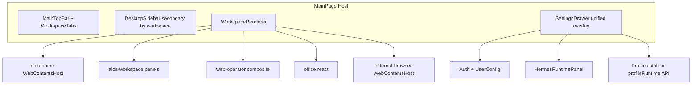

# V3.2 MainPage 模块迭代计划

## 基线（已完成，本计划不重复实现）

| 能力 | 现状 |
|------|------|
| 一级 View | [`desktop-shell.ts`](src/renderer/src/types/desktop-shell.ts) 仅 `aios-home` / `aios-workspace` / `web-operator` / `office` / `external-browser:*` |
| Auth / Bootstrap | [`desktopAuth`](src/preload/auth-api.ts) + [`desktopUserConfig`](src/preload/user-config-api.ts)；[`LoginGate`](src/renderer/src/modules/auth/LoginGate.tsx) + Layout overlay diff |
| Hermes 运维 | [`HermesRuntimeSettingsDrawer`](src/renderer/src/modules/hermes-runtime/HermesRuntimeSettingsDrawer.tsx)（6 个 section） |
| TopBar Settings | 已 `onOpenRuntimeSettings`，但仍有 **Home/Web Operator 快捷按钮**（[`MainTopBar.tsx`](src/renderer/src/screens/MainPage/MainTopBar.tsx) L228–233） |
| MainPage 状态 | 仍为 **V1**（[`main-page-state-contract.ts`](src/shared/shell/main-page-state-contract.ts)） |
| Workspace Registry | **不存在** |
| Settings 统一 Drawer | **拆分**：Runtime Drawer + UserMenuDrawer + ConfigDiffConfirmDrawer |
| Token 注入 | **未实现** |
| `office` Tab | **缺失**：[`main-page-tabs.ts`](src/renderer/src/screens/MainPage/main-page-tabs.ts) 静态 Tab 未含 `office`（与 NAV 不一致，需修复） |

**已确认**：`aios-workspace` 二级导航采用 **在 `AIOSWorkspace` 下新建 `panels/` 子模块**，恢复 Chat/Sessions/Agents 等 UI（`hermesAPI`），**不**恢复顶层 `View` 路由。

---

## 目标架构



---

## Step 1 — Workspace Module Registry

**新增**

| 文件 | 职责 |
|------|------|
| [`src/shared/workspace/workspace-contract.ts`](src/shared/workspace/workspace-contract.ts) | `WorkspaceId`、`WorkspaceKind`、`WorkspaceModule`（与 PRD §3.1 对齐） |
| [`src/renderer/src/workspace/workspace-registry.ts`](src/renderer/src/workspace/workspace-registry.ts) | `STATIC_WORKSPACE_MODULES` + `resolveWorkspaceModule(id)` |
| [`src/renderer/src/workspace/workspace-tabs.ts`](src/renderer/src/workspace/workspace-tabs.ts) | `buildWorkspaceTabs(externalTabs)`，替代 [`main-page-tabs.ts`](src/renderer/src/screens/MainPage/main-page-tabs.ts) 硬编码 |
| [`src/renderer/src/workspace/resolve-workspace.ts`](src/renderer/src/workspace/resolve-workspace.ts) | `resolveShellLayerId(workspaceId)`，替代 [`shell-layer-id.ts`](src/renderer/src/screens/MainPage/shell-layer-id.ts) 分支 |

**修改**

- [`MainViewTabs.tsx`](src/renderer/src/screens/MainPage/MainViewTabs.tsx)：用 registry + `buildWorkspaceTabs`；移除对 `profileEntries` 生成一级 Tab 的依赖（已无 profile-workspace tab）
- [`tab-order.ts`](src/renderer/src/screens/MainPage/tab-order.ts)：`FIXED_TAB_IDS` 含 `office`
- [`main-page-tabs.ts`](src/renderer/src/screens/MainPage/main-page-tabs.ts)：薄封装转发到 `workspace-tabs` 或标记 deprecated 后删除

**验收**：顶栏固定 Tab 为 home / workspace / web-operator / office；`external-browser:*` 可增删拖；无 `profile-workspace:*` 一级 Tab。

---

## Step 2 — WorkspaceOutlet V2 + WorkspaceRenderer

**新增** `src/renderer/src/components/workspace/`

- `WorkspaceRenderer.tsx` — 按 registry `kind` 分发（PRD §4）
- `WebViewWorkspace.tsx` — `WebContentsHost` 包装
- `ReactWorkspace.tsx` — KeepAlive + 子 screen
- `CompositeWorkspace.tsx` — `web-operator` 专用（或内联在 Renderer）

**修改**

- 将 [`WorkspaceOutlet.tsx`](src/renderer/src/components/layout/WorkspaceOutlet.tsx) 重构为调用 `WorkspaceRenderer`（可保留文件名，内部 V2）
- `office` 使用 `officeVisited` + KeepAlive 逻辑保持不变
- `external-browser:*` 始终 `WebContentsHost(layerId)`，不卸载 native view

**验收**：切换 Workspace 不销毁 `aios-home` / `web-operator` WebContents；external tab 切换仅改 bounds。

---

## Step 3 — 统一 Settings Drawer

**目标**：单一 overlay Drawer，打开时不切换 Workspace、不改变 `MainPage__content` 尺寸（PRD §11）。

**新增** `src/renderer/src/screens/SettingsDrawer/`

| 组件 | 内容 |
|------|------|
| `SettingsDrawer.tsx` | 左侧 panel 导航 + 右侧内容；`panel: account \| runtime \| profiles \| desktop` |
| `AuthPanel.tsx` | 会话信息、登录/登出（复用 [`AuthProvider`](src/renderer/src/modules/auth/AuthProvider.tsx)） |
| `UserConfigSyncPanel.tsx` | 拉取/同步状态；入口触发 `desktopUserConfig.bootstrap` / diff |
| `ConfigDiffViewer.tsx` | 复用 [`ConfigDiffConfirmDrawer`](src/renderer/src/modules/auth/ConfigDiffConfirmDrawer.tsx) 逻辑或内嵌 |
| `HermesRuntimePanel.tsx` | 包装现有 [`HermesRuntimeSettings`](src/renderer/src/modules/hermes-runtime/HermesRuntimeSettings.tsx) |

**修改** [`Layout.tsx`](src/renderer/src/screens/Layout/Layout.tsx)

- 合并 `runtimeSettingsOpen` / `userMenuOpen` → `settingsDrawerOpen` + `settingsPanel`
- TopBar：单一 Settings 按钮 → `openSettingsDrawer("runtime")`；User 可并入 Account panel 或保留快捷入口打开 `account`
- 移除独立 `HermesRuntimeSettingsDrawer` / `UserMenuDrawer` 挂载（或保留为 SettingsDrawer 内部实现）
- **保留** `ConfigDiffConfirmDrawer` 作为登录后 diff overlay（V3 行为），Settings 内 `UserConfigSyncPanel` 提供手动同步入口

**修改** [`MainTopBar.tsx`](src/renderer/src/screens/MainPage/MainTopBar.tsx)

- 删除 L228–233 `AI-OS Home` / `Web Operator` 硬编码跳转（一级切换仅通过 Tabs）
- Settings → `onOpenSettingsDrawer(panel?)`；可选保留 User 图标打开 `account` panel

**验收**：点 Settings 不 `navigate`；当前 Workspace 与 WebView 保持；Runtime 启停/Doctor/Logs 可用。

---

## Step 4 — Sidebar 二级化 + AIOSWorkspace Panels

**新增** `src/renderer/src/screens/AIOSWorkspace/panels/`

| Panel | 职责 |
|-------|------|
| `ChatPanel.tsx` | 复刻原 Chat 能力：`hermesAPI.sendMessage` / `onChatChunk` 等（参考 git 历史或 PRD 描述） |
| `SessionsPanel.tsx` | 会话列表：`listCachedSessions` / `searchSessions` |
| `AgentsPanel.tsx` | Profile 列表：`listProfiles` 等 |
| `AIOSWorkspaceShell.tsx` | 侧栏二级项 + 主内容区 panel 路由（**本地 state**，非 `View`） |

**新增** `src/shared/workspace/workspace-secondary-nav.ts`（或 renderer 内常量）

```ts
SECONDARY_NAV_BY_WORKSPACE = {
  "aios-home": [] | minimal,
  "aios-workspace": ["chat", "sessions", "agents"],
  "web-operator": ["browser-state", "screenshot", "action-log"],
  "office": ["office"],
}
```

**修改** [`DesktopSidebar.tsx`](src/renderer/src/components/layout/DesktopSidebar.tsx)

- Props：`workspaceId: View`（一级）、`secondaryPanel`、`onSecondaryPanelChange`
- **不再**用 `navItems` 切换一级 Workspace（一级改由 TopBar Tabs）
- `Layout` 传入 `activeWorkspace` + 二级 state；持久化写入 `workspaceSecondaryState`（Step 5）

**web-operator**：二级项可滚动/聚焦右侧已有 panel（`BrowserStatePanel` / `ScreenshotPanel` / `BrowserActionLog`），通过 ref 或 context 切换高亮，避免重复 UI。

**验收**：Sidebar 不显示 gateway/settings/models 等；`aios-workspace` 可切换 Chat/Sessions/Agents panel。

---

## Step 5 — MainPage 状态 V2 与迁移

**修改** [`main-page-state-contract.ts`](src/shared/shell/main-page-state-contract.ts)

```ts
export interface MainPagePersistedStateV2 {
  version: 2;
  sidebarMode: SidebarMode;
  workspaceOrder: string[];
  externalTabs: ExternalBrowserTabState[];
  lastActiveWorkspace?: string;
  lastSettingsDrawerPanel?: string;
  workspaceSecondaryState?: Record<string, unknown>;
}
```

**修改** [`main-page-state-store.ts`](src/main/shell/main-page-state-store.ts)

- `migrateMainPageState(input)`：V1 `tabOrder` → `workspaceOrder`，`lastActiveView` → `lastActiveWorkspace`
- 读写 V2；Renderer [`Layout.tsx`](src/renderer/src/screens/Layout/Layout.tsx) 持久化字段同步更名

**验收**：旧 `main-page-state.json` 升级后仍可恢复 external tabs 与 last workspace。

---

## Step 6 — WebView 分区与 Token 注入（增量）

**修改** [`view-registry.ts`](src/main/shell/views/view-registry.ts)

- `external-browser`：`defaultPartition: "persist:external-browser"`（或按 tab id 扩展，PRD §7.1）
- 文档注释明确三分区策略

**新增** [`src/main/auth/token-header-injector.ts`](src/main/auth/token-header-injector.ts)（或 `src/main/shell/token-header-injector.ts`）

- 在 `session` 存在时，对 `127.0.0.1:3000` / backend port 注入 `Authorization`（从 [`token-store`](src/main/auth/token-store.ts) 读取，**不**暴露 Renderer）
- **禁止**对 `external-browser:*`、`web-operator` partition 注入
- 在 [`index.ts`](src/main/index.ts) `app.whenReady` 后 `installTokenHeaderInjector()`

**验收**：`aios-home` 登录态可访问本地 frontend；external-browser 打开外站无 Authorization header。

---

## Auth / UserConfig 与 PRD 差异说明

PRD §5 使用 `window.auth` 命名；项目已定型 **`window.desktopAuth` / `window.desktopUserConfig`**（[`AGENTS.md`](AGENTS.md)）。V3.2 **保持现有 API**，仅在 SettingsDrawer 内聚合 UI，不重命名 IPC（避免破坏 Preload 契约）。

PRD `UserConfigSnapshot` 与现有 [`DesktopBootstrapConfig`](src/shared/user-config/user-config-contract.ts) 字段不同：Step 2 Settings 的 `UserConfigSyncPanel` 对接 **现有** bootstrap/diff 流程；若 backend DTO 变更，在 `user-config-client.ts` 做适配层，不在本阶段重写 applier。

---

## 测试与文档

| 项 | 内容 |
|----|------|
| 单测 | `workspace-registry.test.ts`、`migrateMainPageState.test.ts` |
| 回归 | 现有 `main-page-tabs` / `tab-order` / `user-config-*` / `preload-api-surface` 测试更新 |
| 文档 | [`docs/API_CONTRACTS.md`](docs/API_CONTRACTS.md) Settings Drawer + state V2；[`AGENTS.md`](AGENTS.md) V3.2 索引 |

---

## 建议 PR 切分（6 步对应 4 PR）

| PR | 范围 |
|----|------|
| PR-A | Step 1 + office tab 修复 + Step 2 WorkspaceRenderer |
| PR-B | Step 3 SettingsDrawer + TopBar 清理 |
| PR-C | Step 4 Sidebar + AIOSWorkspace panels |
| PR-D | Step 5 state V2 + Step 6 token/partition |

---

## 最终验收（PRD §12）

1. 默认 `aios-home`
2. TopBar 四个固定 Workspace + external tabs
3. 切换 Workspace 保活 WebView / React 状态
4. Settings Drawer 不改变 active workspace
5. Hermes Runtime 仅能从 Settings 管理
6. Sidebar 无 gateway/settings 一级项；`aios-workspace` 有 Chat/Sessions/Agents panels
7. Token 仅 Main 加密存储
8. 首次/后续 config 同步行为与 V3 一致（登录 bootstrap + diff overlay）
