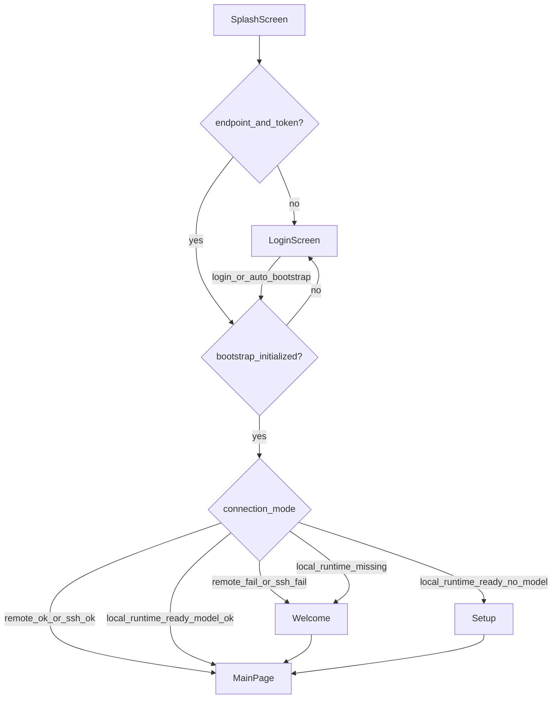

# V3.3.1 Auth Embed Hotfix

## 背景与目标

V3.3 主体已落地，但存在三类缺口：

1. **P0**：本地模式已登录但未 bootstrap 时仍可能进 `main`；Remote/SSH 绕过 auth
2. **P1**：bootstrap apply 未同步 endpoint / 未主动 reload aios-home；文档分区名滞后
3. **P2**：可选 IPC、Mock 策略、测试补强

**已确认产品决策**：Remote / SSH / Local **统一**先过 `endpoint + auth + bootstrap`，再进入各模式后续路由。

---

## 目标启动流程



---

## P0 — 启动门控修复

### 1. 重构 [`src/main/startup/startup-decision.ts`](src/main/startup/startup-decision.ts)

将 auth + bootstrap 检查**提取为所有模式的前置步骤**（放在 remote/ssh/local 分支之前）：

```ts
// 伪代码顺序
await hydrateTokenStore();
const endpointConfig = readAuthEndpointConfig();
const session = await readStoredSession();
if (!endpointConfig || !session?.accessToken) {
  return { nextScreen: "login", reason: "auth-required", ... };
}

const bootstrap = readBootstrapState();
if (!bootstrap.initialized) {
  return { nextScreen: "login", reason: "bootstrap-pending", ... };
}

// 之后才进入 remote / ssh / local runtime 分支
```

**Local 分支变更**：在 `runtimeReady && modelConfigured` 判定前，bootstrap 已通过，不再出现「有 token 无 bootstrap 直进 main」。

**Remote / SSH 分支变更**：连接检测逻辑保留，但仅在 auth + bootstrap 通过后执行；reachable → `main`，unreachable → `welcome`（与现行为一致，只是多了 login 前置）。

### 2. 扩展启动契约 [`src/shared/startup/startup-contract.ts`](src/shared/startup/startup-contract.ts)

- `StartupDecisionReason` 新增 `"bootstrap-pending"`
- 更新 [`src/main/startup/startup-decision.ts`](src/main/startup/startup-decision.ts) 文件头注释，反映 V3.3.1 规则

### 3. LoginScreen 自动 bootstrap 重试 [`src/renderer/src/modules/auth/LoginScreen.tsx`](src/renderer/src/modules/auth/LoginScreen.tsx)

当 `reason === bootstrap-pending` 或（已 authenticated && `!bootstrapState.initialized`）时：

- 挂载后并行调用 `desktopAuth.getState()` + `desktopUserConfig.getBootstrapState()`
- 若已登录且 bootstrap 未完成 → 显示 `BootstrapScreen`，自动执行现有 `runBootstrap()`（无需重新输入密码）
- 成功后 `onSuccess()` → `recheck()`

这与 PRD §2.1「已登录但 bootstrap 未完成」一致，复用 login 屏而非新建 route。

### 4. 测试更新 [`tests/startup-decision.test.ts`](tests/startup-decision.test.ts)

- Mock `readBootstrapState`（新增 vi.mock `user-config-store`）
- **新增用例**：auth 通过 + `initialized: false` → `login` + `bootstrap-pending`
- **新增用例**：auth 通过 + bootstrap 完成 + runtime ready → `main`
- **Remote/SSH 用例调整**：补充 endpoint/session/bootstrap mock；未登录时 remote 也应 → `login`（不再直进 main）

---

## P1 — Bootstrap Apply 与文档

### 5. Apply 时同步 endpoint config [`src/main/user-config/user-config-applier.ts`](src/main/user-config/user-config-applier.ts)

在 `writeLocalBootstrapConfig` 之前增加：

```ts
import { writeAuthEndpointConfig } from "../auth/auth-endpoint-config-store";
import { updateTokenInjectionPolicy } from "../auth/token-injection-policy";
import { readStoredSession } from "../auth/token-store";

const endpoint = writeAuthEndpointConfig({
  backendUrl: remote.aios.backendUrl,
  authPrefix: remote.aios.authPrefix,
  aiosHomeUrl: remote.aios.aiosHomeUrl ?? remote.aios.frontendUrl ?? "",
});
const session = await readStoredSession();
updateTokenInjectionPolicy(endpoint, Boolean(session?.accessToken));
```

确保 bootstrap 应用的 remote `aios.*` 与 token 注入白名单一致。

### 6. Bootstrap apply 后主动 reload aios-home

**问题**：[`user-config-bootstrap.ts`](src/main/user-config/user-config-bootstrap.ts) 仅调 `beforeLoadAiosHome()` 更新 policy，已存在的 WebContentsView 不会立即换 URL。

**方案**（最小侵入）：

1. **新增** [`src/main/shell/aios-home-view-coordinator.ts`](src/main/shell/aios-home-view-coordinator.ts)
   - `bindShellViewManager(svm)` — 在 [`src/main/index.ts`](src/main/index.ts) 创建 SVM 后注册
   - `refreshAiosHomeView()` — 从 [`shell-view-ipc.ts`](src/main/shell/shell-view-ipc.ts) 抽取 `ensureAiosHomeView` 核心逻辑（`beforeLoadAiosHome` + URL diff reload/recreate）

2. **重构** [`src/main/shell/shell-view-ipc.ts`](src/main/shell/shell-view-ipc.ts) 调用 coordinator，避免重复

3. **调用点**：
   - [`user-config-bootstrap.ts`](src/main/user-config/user-config-bootstrap.ts) — `applyUserConfig` / `applyRemoteUserConfig` 成功后 `await refreshAiosHomeView()`
   - 可选：[`auth-ipc.ts`](src/main/auth/auth-ipc.ts) 的 `save-endpoint-config` 成功后也 refresh（endpoint 手改场景）

### 7. 文档清扫

| 文件 | 变更 |
|------|------|
| [`docs/INDEX.md`](docs/INDEX.md) | `persist:aios-home` / `persist:web-operator`；origin 白名单注入 |
| [`docs/ARCHITECTURE.md`](docs/ARCHITECTURE.md) | 三分区表 + Token 注入段落更新为 V3.3 |
| [`docs/MODULES.md`](docs/MODULES.md) | web-operator / token-injector 分区名 |
| [`docs/API_CONTRACTS.md`](docs/API_CONTRACTS.md) | 分区表当前值（V3.2 superseded 段落保留历史说明） |
| [`AGENTS.md`](AGENTS.md) | V3.2 段落分区名；新增 **V3.3.1 Hotfix** 索引行 |

**Remote/SSH 文档说明**（[`docs/ARCHITECTURE.md`](docs/ARCHITECTURE.md) 或 [`docs/API_CONTRACTS.md`](docs/API_CONTRACTS.md)）：

> 所有连接模式均要求 Desktop Auth（endpoint + token）与 bootstrap 完成后，才进入 main；Portal Home token 注入仅作用于 `persist:aios-home` 分区。

### 8. CHANGELOG

仓库无现有 CHANGELOG — **新增** [`CHANGELOG.md`](CHANGELOG.md)（根目录），首条 `[0.3.6] - V3.3.1`：

- `persist:aios-desktop` → `persist:aios-home`（用户需重新登录 Portal Portal）
- `persist:aios-external-web` → `persist:web-operator`（Web Operator cookie 重置）
- 启动门控：bootstrap 未完成不再直进 main
- Remote/SSH 统一 auth 门控

---

## P2 — 可选增强（本 hotfix 可分批）

### 9. AIOSHome 只读 URL IPC（可选）

- **新增** Main handler：`aios:get-home-url` → `{ url: resolveAiosHomeUrl() }`
- 注册于 [`src/main/aios/`](src/main/aios/) 或现有 aios IPC 模块；Preload 暴露 `window.aiosRuntime.getHomeUrl()`（或扩展现有 API）
- [`AIOSHomeScreen.tsx`](src/renderer/src/screens/AIOSHome/AIOSHomeScreen.tsx) 可选展示 debug URL / 错误态（不暴露 token）

### 10. ipc-handlers 显式 auth 断言 [`tests/ipc-handlers.test.ts`](tests/ipc-handlers.test.ts)

新增 describe block：

```ts
const authChannels = [
  "auth:get-state",
  "auth:save-endpoint-config",
  "auth:login",
  "auth:logout",
  "auth:refresh",
];
```

### 11. Mock Auth 改为 opt-in（可选，Breaking）

[`src/main/auth/auth-client.ts`](src/main/auth/auth-client.ts) + [`user-config-client.ts`](src/main/user-config/user-config-client.ts)：

```ts
// 从 !== "false" 改为 === "true"
function useMockAuth(): boolean {
  return process.env.HERMES_USE_MOCK_AUTH === "true";
}
```

同步更新 [`docs/API_CONTRACTS.md`](docs/API_CONTRACTS.md)；开发文档注明 dev 需 `HERMES_USE_MOCK_AUTH=true`。

**替代（更温和）**：保持默认 mock，LoginScreen 在 mock token 时显示小 badge「开发 Mock 模式」— 改动面更小。

**建议**：hotfix 默认采用 **温和方案（UI badge）**；opt-in 可作为 follow-up PR，避免打断现有 dev 流程。

---

## 验收命令

```bash
npm run typecheck
npm test -- tests/startup-decision.test.ts tests/user-config-bootstrap.test.ts tests/token-injection-policy.test.ts tests/browser-partitions.test.ts tests/ipc-handlers.test.ts
npm run lint
```

**手工验收**：

1. 清 `bootstrap-state.json` + 保留 token → 冷启动应到 login 并自动 bootstrap，不进 main
2. Login 成功后 apply config → aios-home 立即加载新 URL（无需切换 tab）
3. Remote 模式未登录 → login；登录+bootstrap 后 remote reachable → main
4. web-operator / external-browser 请求无 Authorization header

---

## 文件变更汇总

| 优先级 | 文件 |
|--------|------|
| P0 | `startup-decision.ts`, `startup-contract.ts`, `LoginScreen.tsx`, `startup-decision.test.ts` |
| P1 | `user-config-applier.ts`, `user-config-bootstrap.ts`, `aios-home-view-coordinator.ts`, `shell-view-ipc.ts`, `index.ts`, docs×4, `AGENTS.md`, `CHANGELOG.md` |
| P2 | `aios-home-url` IPC, `ipc-handlers.test.ts`, `auth-client.ts`（或 LoginScreen badge） |

**不修改**：[`.cursor/plans/v3.3_auth_embed_cb289475.plan.md`](.cursor/plans/v3.3_auth_embed_cb289475.plan.md)（原 plan 文件保持只读）
