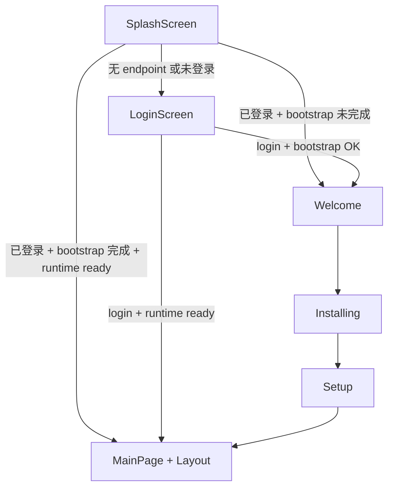
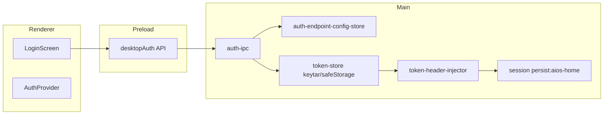

# V3.3 Auth Config + Token Injection + AIOS Home Embed

## 现状与差距

当前已具备 V3.0/V3.2 基础能力，但与 PRD 仍有系统性差距：

| 领域 | 现状 | PRD 目标 |
|------|------|----------|
| 启动流程 | `splash → welcome/install/setup → main` + `LoginGate` | `splash → login → welcome/install/setup → main`（**已确认严格采用**） |
| Auth API | `AuthAPI.getSession()` / `auth:get-session` | `DesktopAuthAPI.getState()` + `saveEndpointConfig` |
| Endpoint | 无独立配置存储；backend 端口来自 `getAiOsEnvConfig()` | `auth-endpoint-config.json` + 登录表单三字段 |
| Token 存储 | `safeStorage` + **dev 明文 fallback** | keytar 优先；不可加密时**禁止明文落盘**，仅内存 |
| 注入策略 | 按 `127.0.0.1` + frontend/backend **端口** | 按 `aiosHomeUrl` / `backendUrl` **origin 白名单** |
| 分区 | `persist:aios-desktop` | **`persist:aios-home`**（**已确认重命名**） |
| aios-home URL | 硬编码 `http://127.0.0.1:${frontendPort}` | bootstrap config → endpoint config → 默认 |
| User config | `schemaVersion: 1`，`frontendUrl` only | `schemaVersion: 2` + `authPrefix` / `aiosHomeUrl` |
| Login UI | 简易表单（username/password/tenant） | Endpoint + Login 合一；参考 ai-os-full 视觉（**不迁移 Web token 逻辑**） |

关键现有文件：

- Auth：[`src/shared/auth/auth-contract.ts`](src/shared/auth/auth-contract.ts)、[`src/main/auth/auth-ipc.ts`](src/main/auth/auth-ipc.ts)、[`src/main/auth/token-store.ts`](src/main/auth/token-store.ts)、[`src/main/auth/token-header-injector.ts`](src/main/auth/token-header-injector.ts)
- 分区/URL：[`src/shared/shell/browser-partitions.ts`](src/shared/shell/browser-partitions.ts)、[`src/main/shell/shell-view-ipc.ts`](src/main/shell/shell-view-ipc.ts)
- UI 门控：[`src/renderer/src/App.tsx`](src/renderer/src/App.tsx)、[`src/renderer/src/modules/auth/LoginGate.tsx`](src/renderer/src/modules/auth/LoginGate.tsx)

---

## 目标架构





**硬性边界（PRD §1.2）**：Renderer/Preload 永不返回 `accessToken`/`refreshToken`；`web-operator` / `external-browser:*` / `office` / `aios-workspace` 不注入 Authorization。

---

## 实施阶段（按 PRD §14 顺序）

### Phase 1 — Shared Contract 与 URL 工具

**修改** [`src/shared/auth/auth-contract.ts`](src/shared/auth/auth-contract.ts)

- 新增 `AuthEndpointConfig`、`DesktopAuthState`、`LoginInput { endpointConfig, username, password }`
- 将公开 API 重命名为 `DesktopAuthAPI`：`getState` / `saveEndpointConfig` / `login` / `logout` / `refresh`
- 保留 `InternalAuthSession`（Main 专用）；`toPublicState()` 替代/并存 `toPublicSession()`，确保无 token 字段
- **破坏性变更**：移除 Renderer 对 `getSession` / `PublicAuthSession` 的依赖（全仓替换）

**新增** [`src/main/auth/auth-url.ts`](src/main/auth/auth-url.ts)

- `normalizeBaseUrl` / `normalizePrefix` / `buildAuthUrl(config, 'login'|'refresh'|'me')`

**新增** [`src/shared/auth/auth-url.ts`](src/shared/auth/auth-url.ts)（可选）

- 若需在 Renderer 做表单校验，可复用纯函数；Main 与 shared 二选一避免重复

**测试**：扩展 [`tests/auth-public-session.test.ts`](tests/auth-public-session.test.ts) → 覆盖 `toPublicState` 与 URL normalize

---

### Phase 2 — Endpoint Config Store

**新增** [`src/main/auth/auth-endpoint-config-store.ts`](src/main/auth/auth-endpoint-config-store.ts)

- 路径：`app.getPath("userData")/auth-endpoint-config.json`
- `read` / `write` / `getDefaultAuthEndpointConfig()`
- 校验：`http(s)://`、`authPrefix` 以 `/` 开头

**验收**：`api/auth` → `/api/auth`；URL 去尾斜杠

---

### Phase 3 — TokenStore 加固

**修改** [`src/main/auth/token-store.ts`](src/main/auth/token-store.ts)

- 引入 **keytar**（`package.json` dependencies；Windows 下需 `electron-builder install-app-deps`）
- 优先级：keytar → safeStorage → **仅内存**（删除 dev `session.json` 明文路径）
- 接口：`read()` / `write()` / `clear()` / `getCachedAccessToken()`；logout 清空磁盘 + 缓存 + 注入 policy

**依赖**：在 [`package.json`](package.json) 添加 `keytar`；postinstall 已有 `electron-builder install-app-deps`

---

### Phase 4 — AuthClient 真实登录

**修改** [`src/main/auth/auth-client.ts`](src/main/auth/auth-client.ts)

- `HttpAuthClient.login` 使用 `buildAuthUrl(endpointConfig, 'login')` → `POST {backend}{authPrefix}/login`
- 请求体：`{ username, password }`；响应映射到 `StoredAuthSession`（PRD §6）
- `refresh` / `logout` 同步使用 endpoint config
- Mock 模式保留（`HERMES_USE_MOCK_AUTH`），但 Mock 也应接受 `endpointConfig` 并写入 store
- 登录成功后调用 `updateTokenInjectionPolicy()`（见 Phase 6）

**注意**：与现有 `/api/v1/desktop/auth/*` 路径不兼容，需 AI-OS backend 提供 `/api/auth/login`（或用户配置的 prefix）；文档中注明环境变量切换 mock/real

---

### Phase 5 — Auth IPC + Preload

**修改** [`src/main/auth/auth-ipc.ts`](src/main/auth/auth-ipc.ts)、[`src/preload/auth-api.ts`](src/preload/auth-api.ts)、[`src/preload/index.d.ts`](src/preload/index.d.ts)

| Channel | 行为 |
|---------|------|
| `auth:get-state` | 返回 `DesktopAuthState`（含 `endpointConfig`，无 token） |
| `auth:save-endpoint-config` | 持久化 endpoint；返回规范化结果 |
| `auth:login` | 写 TokenStore + 更新注入策略；返回 `DesktopAuthState` |
| `auth:logout` | 远程 logout（best-effort）+ clear + 停止注入 |
| `auth:refresh` | 刷新 token；失败则 clear |

- **删除** `auth:get-session`（或短期 alias 一层转发到 `get-state`，单测通过后移除）
- 更新 [`docs/API_CONTRACTS.md`](docs/API_CONTRACTS.md)、[`tests/preload-api-surface.test.ts`](tests/preload-api-surface.test.ts)、[`tests/ipc-handlers.test.ts`](tests/ipc-handlers.test.ts)

---

### Phase 6 — Partition 重命名 + Token Injector

**修改** [`src/shared/shell/browser-partitions.ts`](src/shared/shell/browser-partitions.ts)

```ts
export const SHELL_PARTITIONS = {
  AIOS_HOME: "persist:aios-home",
  AIOS_WORKSPACE: "persist:aios-workspace",
  WEB_OPERATOR: "persist:web-operator",
  OFFICE: "persist:office",
  EXTERNAL_BROWSER_PREFIX: "persist:external-browser:",
} as const;
```

- 将 `AIOS_HOME_PARTITION` 重定向或替换为 `SHELL_PARTITIONS.AIOS_HOME`
- `WEB_OPERATOR_PARTITION`：`persist:aios-external-web` → `persist:web-operator`（与 PRD 对齐；**会清空 web-operator cookie**）
- 保留 `externalBrowserPartition()` 逻辑

**修改** [`src/main/auth/token-inject-url.ts`](src/main/auth/token-inject-url.ts) + [`token-header-injector.ts`](src/main/auth/token-header-injector.ts)

- 仅绑定 `SHELL_PARTITIONS.AIOS_HOME`
- `buildAllowedOrigins(endpointConfig)` + `isAllowedUrl`
- 注入 policy 对象：`{ enabled, allowedOrigins }`；login/logout/endpoint 变更时更新
- 使用 `getCachedAccessToken()` 避免每次读盘

**修改引用处**（grep 全仓）：[`view-registry.ts`](src/main/shell/views/view-registry.ts)、[`shell-view-ipc.ts`](src/main/shell/shell-view-ipc.ts)、[`aios-webcontents-controller.ts`](src/main/aios/aios-webcontents-controller.ts)、[`browser-types.ts`](src/main/browser/browser-types.ts) 等

**新增测试** `tests/token-injection-policy.test.ts`：origin 白名单、logout 禁用、非 aios-home partition 不注册 hook（可用 mock session）

---

### Phase 7 — aios-home 动态 URL

**新增/修改** Main 侧 URL 解析（建议 [`src/main/aios/aios-home-url.ts`](src/main/aios/aios-home-url.ts)）

优先级：

1. `readLocalBootstrapConfig()?.aios.aiosHomeUrl`
2. `readAuthEndpointConfig()?.aiosHomeUrl`
3. `http://127.0.0.1:3000`

**修改**：

- [`src/main/shell/shell-view-ipc.ts`](src/main/shell/shell-view-ipc.ts) — `getAiOsHomeUrl()` 改用 resolver；`ensureAiosHomeView` 前 `await beforeLoadAiosHome()`
- [`src/renderer/src/screens/AIOSHome/AIOSHomeScreen.tsx`](src/renderer/src/screens/AIOSHome/AIOSHomeScreen.tsx) — 如需展示当前 URL/错误态，通过 IPC 只读 getter（不暴露 token）

---

### Phase 8 — User Config Schema v2

**修改** [`src/shared/user-config/user-config-contract.ts`](src/shared/user-config/user-config-contract.ts)

- `schemaVersion: 2`；`aios.authPrefix`、`aios.aiosHomeUrl`；`frontendUrl` 兼容读写

**修改** [`src/main/user-config/user-config-store.ts`](src/main/user-config/user-config-store.ts)（或 bootstrap 入口）

- `normalizeBootstrapConfig()`：旧 v1 → v2 迁移

**修改** [`user-config-client.ts`](src/main/user-config/user-config-client.ts)、[`user-config-applier.ts`](src/main/user-config/user-config-applier.ts)

- Mock/Remote 填充新字段；apply 后触发 aios-home reload + injection policy 刷新

**测试**：更新 [`tests/user-config-bootstrap.test.ts`](tests/user-config-bootstrap.test.ts)

---

### Phase 9 — 启动流程重构（严格 PRD）

**修改** [`src/renderer/src/App.tsx`](src/renderer/src/App.tsx)

- `type Screen` 增加 `"login"`
- 新建 hook `useStartupGate`（或扩展现有 [`useStartupGate.ts`](src/renderer/src/hooks/useStartupGate.ts)）：
  1. splash 期间并行：`desktopAuth.getState()`、`read endpoint`、`getRuntimeState()`、`desktopUserConfig` bootstrap state
  2. 路由决策（与 PRD §2.1 一致）
- `main` 不再包 `LoginGate`（login 已在顶层完成）；`AuthProvider` 可提升到 `App` 根或保留在 `main` 仅用于 UserMenu

**修改** [`LoginGate.tsx`](src/renderer/src/modules/auth/LoginGate.tsx)

- 降级为 session 刷新保护（可选）或删除，避免双重 login

**Splash 逻辑示意**：

```ts
if (!endpointConfig || !authState.authenticated) return "login";
if (!bootstrapInitialized || !runtimeReady) return "welcome" | "setup" | ...;
return "main";
```

---

### Phase 10 — Login UI 迁移

**重构** [`src/renderer/src/modules/auth/LoginScreen.tsx`](src/renderer/src/modules/auth/LoginScreen.tsx)

**新增组件**（PRD §11.2）：

- `components/EndpointConfigPanel.tsx`
- `components/LoginForm.tsx`
- `components/LoginBrandPanel.tsx`
- `styles/login.css`（或 Tailwind 等价）

**行为**：

1. 加载时 `getState()` 预填 endpoint
2. Submit → `saveEndpointConfig`（可选分步）→ `login` → `desktopUserConfig.bootstrap()`
3. 有 diff → `ConfigDiffConfirmDrawer`（已有）
4. 成功后 `App` 切换到 welcome/main

**视觉**：参考 `ai-os-full/frontend` 登录页布局（仓库外，运行时位于 `$runtimeRoot/ai-os-full`）；仅迁移布局/校验/状态，**禁止** next-auth / localStorage / cookie token

**i18n**：四语言 `auth.*` keys（en / es / pt-BR / zh-CN）

---

## 文件变更清单（汇总）

| 操作 | 路径 |
|------|------|
| 修改 | `src/shared/auth/auth-contract.ts` |
| 新增 | `src/main/auth/auth-endpoint-config-store.ts`, `auth-url.ts` |
| 修改 | `src/main/auth/token-store.ts`, `auth-client.ts`, `auth-ipc.ts`, `token-header-injector.ts`, `token-inject-url.ts` |
| 修改 | `src/shared/shell/browser-partitions.ts` + 全仓 partition 引用 |
| 新增 | `src/main/aios/aios-home-url.ts`（或并入 aios-config） |
| 修改 | `src/main/shell/shell-view-ipc.ts`, `view-registry.ts` |
| 修改 | `src/shared/user-config/user-config-contract.ts` + main user-config 模块 |
| 修改 | `src/preload/auth-api.ts`, `index.d.ts` |
| 修改 | `src/renderer/src/App.tsx`, `modules/auth/*` |
| 修改 | `docs/API_CONTRACTS.md`, `AGENTS.md`（V3.3 索引） |
| 修改 | `package.json`（keytar） |
| 新增/修改 | `tests/auth-*`, `tests/token-injection-*`, `tests/user-config-*` |

---

## 验收清单（PRD §13）

**登录配置**

- 首次启动 → login；三字段可保存并重启保留；失败不写入 token

**Token 安全**

- `desktopAuth.getState()` 无 token；无 localStorage/cookie 明文；logout 清 vault；无加密时不落盘

**Header 注入**

- aios-home 白名单 origin 带 `Authorization`；external-browser / web-operator / office 同 URL 不带；切换 `aiosHomeUrl` 后旧 origin 失效

**Bootstrap**

- 首次登录可覆盖本地；后续 diff 需确认

**命令**

```bash
npm run typecheck
npm test
npm run lint
```

---

## 风险与缓解

1. **分区重命名导致 Cookie 丢失**：预期行为；在 PR/CHANGELOG 注明用户需重新登录 AI-OS Portal
2. **Auth API 路径变更**：需 AI-OS backend 实现 `POST /api/auth/login`；开发期保留 mock
3. **先 login 后 install**：未登录无法进入 welcome；需确保 login 页在 offline/mock 下可完成以继续 Hermes 安装
4. **keytar 原生模块**：Windows 构建需验证 `electron-builder install-app-deps`；CI 增加 typecheck + 相关单测

---

## 建议执行顺序（单 Agent 会话）

按 Phase 1→10 顺序提交；每 Phase 结束运行 `typecheck` + 相关 vitest；Phase 6 与 Phase 9 改动面大，单独验证 ShellView 与启动路径。
