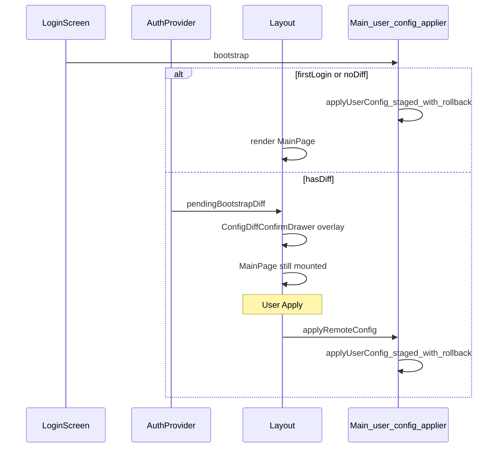

# V3 Review 修复计划

## 背景与目标

基于 [V3 模块重构 Review](.cursor/plans/v3_模块重构计划_c29a3e63.plan.md) 结论，本计划聚焦 **未闭环的高风险项**，不改变 V3 已完成的壳层收敛（View / Drawer / Auth IPC）。

**已确认产品决策**：应用启动时 **不** 在已有 session 下自动 `bootstrap`（仅登录成功后执行，与 [prd/v3.1_module.md](prd/v3.1_module.md) §15.2 一致）。

---

## 架构目标（修复后）



---

## Phase P0 — Applier 完整化 + 失败回滚（必须）

### P0.1 重构 Applier 为分步流水线

**主文件**：[src/main/user-config/user-config-applier.ts](src/main/user-config/user-config-applier.ts)

按 PRD §13.1 / §13.2 拆为有序步骤（建议抽取 `applyHermesBootstrapConfig()` 到同目录或 `user-config-applier-hermes.ts`，保持 `applyUserConfig` 为唯一入口）：

| 步骤 | 动作 | 复用 Main API |
|------|------|----------------|
| 1 | 暂存 remote（见 P0.2） | `writeLocalBootstrapConfig` **延后到成功末** |
| 2 | Connection | `setConnectionConfig`（[config.ts](src/main/config.ts)） |
| 3 | Active profile | `setActiveProfile`（[profiles.ts](src/main/profiles.ts)） |
| 4 | Profiles | 遍历 `remote.hermes.profiles`：`createProfile`（不存在时）、`setEnvValue` / `setConfigValue`（profile.env / profile.config） |
| 5 | Models | `setModelConfig(provider, model, baseUrl, profileName)` |
| 6 | Soul / User / Memory | `writeSoul`、`writeUserProfile`；memory 文本若 PRD 为整文件则评估是否需新增 `writeMemoryFile` 或复用 `addMemoryEntry`（仅当 bootstrap 提供全文） |
| 7 | Toolsets / Platforms | `setToolsetEnabled`、`setPlatformEnabled` |
| 8 | AI-OS env | 现有 `saveAiOsEnvConfig` + `writeAiOsEnvFile` |
| 9 | Runtime | `reconcileAiOsRuntime` → 条件 `startAiOs` |
| 10 | Gateway | `restartGateway(activeProfile)` |
| 11 | Commit | `writeLocalBootstrapConfig` + `writeBootstrapState` |

**`apiKey` / `apiKeyRef` 修复（Review H1）**：

- 禁止 `apiKey: ""` 硬编码清空。
- 策略：
  1. 先应用 profile/connection 相关 `env`（若 remote 提供）。
  2. 若 `connection.apiKeyRef` 存在：用 `readEnv(apiKeyRef)` 解析后写入 `setConnectionConfig({ ..., apiKey })`。
  3. 若 remote 模式且无 ref：保留当前 `getConnectionConfig().apiKey`。
- 模型级 `apiKeyRef`：通过 `setEnvValue` 写入对应 profile 的 `.env`（ref 作 key，值由 backend mock/真实 API 在 bootstrap JSON 的 env 块携带；mock 需在 [user-config-client.ts](src/main/user-config/user-config-client.ts) 样例中补齐）。

**`installSource`（PRD 步骤 2）**：

- **不在每次 apply 时调用** `runInstallWithSource`（避免登录覆盖触发重装）。
- 仅在 `readBootstrapState().initialized === false` 且本地 `checkInstall` 未就绪时，记录 warn 并跳过（Enterprise Install 仍由 welcome/install 向导负责）；在 applier 文件头注释与 [user-config-bootstrap.ts](src/main/user-config/user-config-bootstrap.ts) 对齐计划风险 §2。

### P0.2 原子提交与回滚

**新增**：[src/main/user-config/user-config-rollback.ts](src/main/user-config/user-config-rollback.ts)

```ts
interface ApplySnapshot {
  localConfig: DesktopBootstrapConfig | null;
  bootstrapState: BootstrapState;
  connection: ConnectionConfig; // from getConnectionConfig()
}
```

- `applyUserConfig` **开始前** `captureApplySnapshot()`。
- **成功末** 再 `writeLocalBootstrapConfig` + `writeBootstrapState`（修正当前“先写 cache 再应用”导致半失败脏数据的问题）。
- **任一步骤 throw**：`restoreApplySnapshot(snapshot)`，并 rethrow。
- 修正 [user-config-bootstrap.ts](src/main/user-config/user-config-bootstrap.ts) `applyRemoteUserConfig` catch：删除无效的 `writeBootstrapState(state)`（当前不恢复 local config）；改为调用 rollback。

**单测**：`tests/user-config-applier.test.ts` — mock `setConnectionConfig` 等，验证失败时 snapshot 恢复、成功时 state 更新。

---

## Phase P1 — UX / i18n / Drawer（应尽快）

### P1.1 Config Diff 改为 Layout overlay（Review M1）

**状态提升**：在 [AuthProvider.tsx](src/renderer/src/modules/auth/AuthProvider.tsx) 增加 `pendingBootstrapDiff` / `setPendingBootstrapDiff`（或独立 `BootstrapDiffContext`）。

**改动**：

| 文件 | 变更 |
|------|------|
| [LoginGate.tsx](src/renderer/src/modules/auth/LoginGate.tsx) | 有 session 时 **始终** `return children`；去掉 diff 时替换 Layout 的分支 |
| [LoginScreen.tsx](src/renderer/src/modules/auth/LoginScreen.tsx) | `onConfigDiff` → `setPendingBootstrapDiff`（context） |
| [Layout.tsx](src/renderer/src/screens/Layout/Layout.tsx) | `drawerLayer` 增加 `<ConfigDiffConfirmDrawer>`，`open={!!pendingDiff}`；Apply 后 `setPendingBootstrapDiff(null)` |

`ConfigDiffConfirmDrawer` 保持现有 IPC 调用，仅改为 overlay（`z-index` 高于 `DrawerLayer`，不卸载 `MainPage`）。

### P1.2 i18n 接入（Review M2）

替换硬编码英文：

- [LoginScreen.tsx](src/renderer/src/modules/auth/LoginScreen.tsx) → `t("auth.login")` 等（keys 已存在于 [locales/zh-CN/auth.ts](src/shared/i18n/locales/zh-CN/auth.ts)）
- [BootstrapScreen.tsx](src/renderer/src/modules/auth/BootstrapScreen.tsx)
- [ConfigDiffConfirmDrawer.tsx](src/renderer/src/modules/auth/ConfigDiffConfirmDrawer.tsx)
- [UserMenuDrawer.tsx](src/renderer/src/modules/auth/UserMenuDrawer.tsx)
- [HermesRuntimeSettings.tsx](src/renderer/src/modules/hermes-runtime/HermesRuntimeSettings.tsx) + sections 标题 → `t("runtimeSettings.gateway")` 等

四语言文件已注册于 [src/shared/i18n/index.ts](src/shared/i18n/index.ts)，仅需 Renderer 引用。

### P1.3 隐藏未实现 Hermes Drawer Tab（Review M3）

[src/renderer/src/modules/hermes-runtime/hermes-runtime-types.ts](src/renderer/src/modules/hermes-runtime/hermes-runtime-types.ts)：

- 导出 `HERMES_RUNTIME_IMPLEMENTED_SECTIONS`（当前 6 项：overview / install / gateway / connection / doctor / logs）。
- `HERMES_RUNTIME_SECTIONS` 侧栏仅渲染 implemented 列表；保留 union 类型供后续扩展。
- 删除或不再渲染 default 分支 “coming soon” 占位（避免用户点到空 Tab）。

---

## Phase P2 — 工程化与测试（排期）

### P2.1 Mock 开关拆分（Review M4）

| 变量 | 模块 |
|------|------|
| `HERMES_USE_MOCK_AUTH` | [auth-client.ts](src/main/auth/auth-client.ts)（保持） |
| `HERMES_USE_MOCK_USER_CONFIG`（新，默认与 mock auth 同 true；显式 `false` 时走 HTTP） | [user-config-client.ts](src/main/user-config/user-config-client.ts) |

文档：[docs/API_CONTRACTS.md](docs/API_CONTRACTS.md) 环境变量小节。

### P2.2 测试补强

| 测试 | 内容 |
|------|------|
| `tests/user-config-applier.test.ts` | 分步 apply + 失败回滚 |
| `tests/user-config-bootstrap.test.ts` | firstLogin apply / secondLogin diff+token（mock store） |
| 更新 [tests/ipc-handlers.test.ts](tests/ipc-handlers.test.ts) | 若新增 env 文档无 IPC 变更则不动 |
| **可选** `tests/shell-view-manager.test.ts` | mock `webContents.getURL` / `getTitle` 修复 31 个历史失败中的 ShellView 类（与 V3 无关，但可恢复 CI 绿） |

验收：`npx vitest run tests/user-config-* tests/auth-* tests/ipc-handlers.test.ts tests/preload-api-surface.test.ts` 全绿；`npm run typecheck` 通过。

### P2.3 safeStorage 降级（Review M5，轻量）

[src/main/auth/token-store.ts](src/main/auth/token-store.ts)：

- `saveEncryptedSession`：若 `!safeStorage.isEncryptionAvailable()`，在 **仅 dev**（`!app.isPackaged`）允许明文 fallback 到 `session.json` 并 `console.warn`；生产仍 throw 并给出可读错误。
- 单测或注释说明 Linux CI 限制。

---

## 明确不做（本计划范围外）

- **启动时自动 bootstrap**（用户已选 `login_only`）。
- **Hermes Drawer 全量 sections 实现**（models/providers/skills 等）— 仅隐藏占位，不新做页面。
- **全库 ESLint CRLF 清理**。
- **修改** [.cursor/plans/v3_模块重构计划_c29a3e63.plan.md](.cursor/plans/v3_模块重构计划_c29a3e63.plan.md) 计划文件本身。

---

## 建议 PR 切分

| PR | 内容 | 风险 |
|----|------|------|
| PR-1 | P0 Applier + rollback + 单测 | 高 — 需手动验证首次登录/二次 diff |
| PR-2 | P1 overlay + i18n + Drawer tabs | 中 — UI 可测 |
| PR-3 | P2 mock 开关 + safeStorage + 可选 ShellView 测试修复 | 低 |

---

## 手动验收清单（对应 Review + PRD §22）

- [ ] 首次 mock 登录：本地 Hermes connection/profile/model 被写入；Gateway 可 restart
- [ ] 二次 mock 登录：弹出 Config Diff overlay，**主界面仍可见**；Cancel 不 apply；Apply 后配置生效
- [ ] Apply 中途模拟失败（可单测）：本地 `bootstrap-config.json` 与 connection 回滚
- [ ] Renderer 仍无 `accessToken`；Settings 打开 Hermes Drawer，侧栏无 “coming soon” Tab
- [ ] 切换 zh-CN / en：登录与 diff 文案正确
