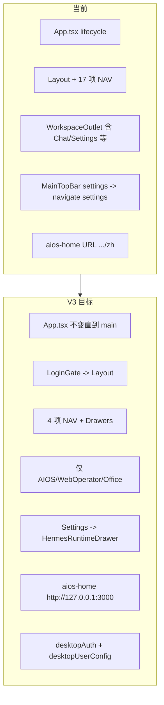
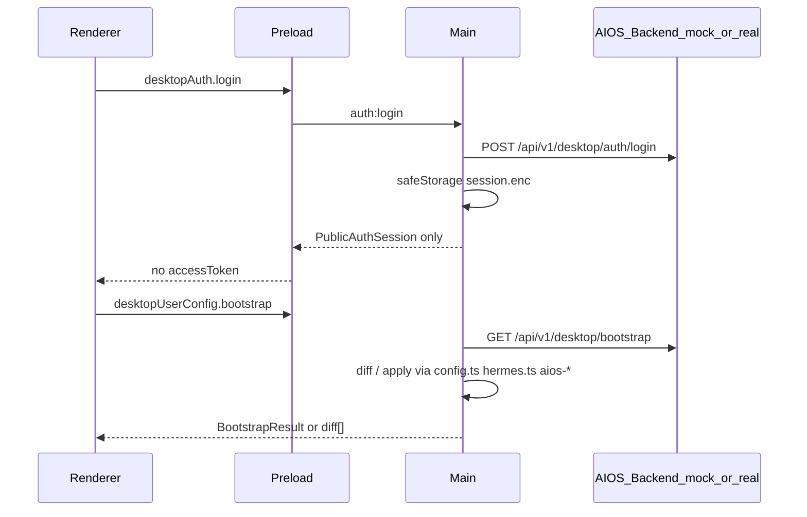

# V3 模块重构实施计划

## 产品目标（已定口径）

| 项 | 目标 |
|---|---|
| 主应用 | `aios-home` → `http://127.0.0.1:3000`（去掉 `/zh`） |
| View 收敛 | 仅 `aios-home` / `aios-workspace` / `web-operator` / `office` / `external-browser:*` |
| Hermes 运维 | 从 Renderer 页面路由迁到 **TopBar Settings Drawer** |
| 登录 | 进入 `main`（[Layout.tsx](src/renderer/src/screens/Layout/Layout.tsx)）后 `LoginGate` 拦截 |
| Token | Main `safeStorage` 加密；Renderer 只见 `PublicAuthSession` |
| 配置同步 | 首次覆盖；后续 diff 确认（backend 未就绪阶段用 mock 数据验证流程） |

**用户确认**：backend API 未就绪 → Phase 4–5 用 mock；安装向导 `splash → welcome → install → setup` 保持不变，登录仅包裹 `Layout`。

---

## 当前基线 vs 目标差距



**已存在可复用能力**（PRD 判断正确，无需重写底层）：

- Preload：`window.hermesAPI`（install/gateway/config/profiles/skills…）、`window.aiosRuntime`、`window.shellView`
- Main：`registerAiosIpc`、`getAiOsEnvConfig` / `writeAiOsEnvFile`（[aios-config.ts](src/main/aios/aios-config.ts)，`DEFAULT_FRONTEND_PORT = 3000`）
- UI 壳：`MainPage.drawerLayer`、`DrawerLayer`、[AIOSHomeScreen](src/renderer/src/screens/AIOSHome/AIOSHomeScreen.tsx) + `WebContentsHost`

**必须改动的热点**（与 PRD 一致）：

- [desktop-shell.ts](src/renderer/src/types/desktop-shell.ts)：`View` 仍含 `chat/settings/profile-workspace:*` 等 15+ 路由
- [Layout.tsx](src/renderer/src/screens/Layout/Layout.tsx)：`NAV_ITEMS` 17 项；`isValidRestoredView` 允许旧 view
- [WorkspaceOutlet.tsx](src/renderer/src/components/layout/WorkspaceOutlet.tsx)：仍 import 全部 Hermes 页面
- [MainTopBar.tsx](src/renderer/src/screens/MainPage/MainTopBar.tsx) L228：`onNavigate("settings")`
- [shell-view-ipc.ts](src/main/shell/shell-view-ipc.ts) + [aios-webcontents-controller.ts](src/main/aios/aios-webcontents-controller.ts) + [aios-runtime-supervisor.ts](src/main/aios/aios-runtime-supervisor.ts)：硬编码 `/zh`

---

## 架构：进程边界（保持不变）



新增全局 API（[preload/index.ts](src/preload/index.ts) + [index.d.ts](src/preload/index.d.ts)）：

- `window.desktopAuth` ← [auth-api.ts](src/preload/auth-api.ts)
- `window.desktopUserConfig` ← [user-config-api.ts](src/preload/user-config-api.ts)

IPC 注册于 [index.ts](src/main/index.ts) `setupIPC()`：`registerAuthIpc()`、`registerUserConfigIpc(mainWindow)`。

---

## Phase 1：Shell View 与 View 类型收敛

**修改**

| 文件 | 变更 |
|---|---|
| [desktop-shell.ts](src/renderer/src/types/desktop-shell.ts) | `View` / `VIEW_TITLE_KEYS` / `resolveViewTitleKey` 按 PRD §3 |
| [useDesktopNavigation.ts](src/renderer/src/hooks/useDesktopNavigation.ts) | 默认 view `aios-home`；移除 `setView("chat")` 等 |
| [Layout.tsx](src/renderer/src/screens/Layout/Layout.tsx) | `NAV_ITEMS` 4 项；`isValidRestoredView` 收紧 |
| [shell-layer-id.ts](src/renderer/src/screens/MainPage/shell-layer-id.ts) | 去掉 `profile-workspace` 分支 |
| [main-page-tabs.ts](src/renderer/src/screens/MainPage/main-page-tabs.ts) | 移除 profile-workspace tab 生成 |
| [tab-order.ts](src/renderer/src/screens/MainPage/tab-order.ts) | 仅 `external-browser:*` 动态 tab |
| [shell-view-ipc.ts](src/main/shell/shell-view-ipc.ts) | `getAiOsHomeUrl()` 去掉 `/zh` |
| [aios-webcontents-controller.ts](src/main/aios/aios-webcontents-controller.ts) | `homeUrl` 同步 |
| [aios-runtime-supervisor.ts](src/main/aios/aios-runtime-supervisor.ts) | `healthUrl` / `webAppUrl` 同步 |
| [view-registry.ts](src/main/shell/views/view-registry.ts) | 废弃或移除 `profile-page` 注册（若无引用） |
| [view-contract.ts](src/shared/shell/view-contract.ts) | 同步 `ShellViewKind` |

**验收**：类型仅剩 5 类 view；持久化 `lastActiveView` 为旧值时回落 `aios-home`；`aios-home` 加载根 URL。

---

## Phase 2：Sidebar / WorkspaceOutlet 去耦旧页面

**修改**

- [DesktopSidebar.tsx](src/renderer/src/components/layout/DesktopSidebar.tsx)：删除 Hermes 侧栏项与 `profile-workspace` 导航
- [WorkspaceOutlet.tsx](src/renderer/src/components/layout/WorkspaceOutlet.tsx)：按 PRD §5 仅保留 `AIOSHome` / `AIOSWorkspace` / `WebOperator` / `Office` / `external-browser`；**暂时保留旧 screen 文件**，仅从 outlet 断开 import（Phase 6 再物理删除）
- [Layout.tsx](src/renderer/src/screens/Layout/Layout.tsx)：精简传给 `WorkspaceOutlet` 的 props（移除 chat messages / `onNewChat` 等仅 Chat 用的状态，需同步 [useDesktopNavigation](src/renderer/src/hooks/useDesktopNavigation.ts)）
- [useRemoteMode.ts](src/renderer/src/hooks/useRemoteMode.ts)：不再依赖 Hermes view 枚举

**验收**：UI 无法进入 `chat`/`settings`/`gateway`；`npm run typecheck` 无旧 `View` 分支错误。

---

## Phase 3：TopBar Settings → Hermes Runtime Drawer

**新增目录** `src/renderer/src/modules/hermes-runtime/`（PRD §9）：

- `HermesRuntimeSettingsDrawer.tsx` + `HermesRuntimeSettings.tsx`
- `hermes-runtime-types.ts`（`HermesRuntimeSection` union）
- `sections/*`：优先实现 **overview / install / gateway / doctor / logs / connection**（调用现有 `window.hermesAPI`）
- `hooks/*`：薄封装 IPC，loading/error/empty 态

**修改**

- [MainTopBar.tsx](src/renderer/src/screens/MainPage/MainTopBar.tsx)：Settings → `onOpenRuntimeSettings`；新增 User → `onOpenUserMenu`（UserCircle）
- [MainPage.tsx](src/renderer/src/screens/MainPage/MainPage.tsx)：透传 props
- [Layout.tsx](src/renderer/src/screens/Layout/Layout.tsx)：`runtimeSettingsOpen` / `userMenuOpen` state；`drawerLayer` 挂载 Drawer（与现有 `<DrawerLayer />` 并列）

**验收**：点击 Settings 不触发 `navigate("settings")`；Drawer 可展示 version、gateway status、doctor、restart gateway、读 logs。

---

## Phase 4：Auth 模块（契约 + mock）

**新增**

```
src/shared/auth/auth-contract.ts
src/main/auth/
  auth-client.ts      # 接口 + MockAuthClient / HttpAuthClient 切换
  auth-ipc.ts
  token-store.ts      # safeStorage -> userData/auth/session.enc
  auth-session-store.ts
src/preload/auth-api.ts
src/renderer/src/modules/auth/
  AuthProvider.tsx
  LoginGate.tsx
  LoginScreen.tsx
  BootstrapScreen.tsx   # checking-session 态
  UserMenuDrawer.tsx    # logout
```

**Mock 策略**（backend 未就绪）：

- `auth-client.ts`：`USE_MOCK_AUTH=true`（env 或 `desktop-runtime.json` 开关）时返回固定 `PublicAuthSession`；`login` 校验非空用户名即可
- `HttpAuthClient` 预留：`http://127.0.0.1:${backendPort}/api/v1/desktop/auth/*`，backend 就绪后单点切换

**Renderer 接入**（[App.tsx](src/renderer/src/App.tsx)）：

```tsx
case "main":
  return (
    <AuthProvider>
      <LoginGate>
        <Layout />
      </LoginGate>
    </AuthProvider>
  );
```

`LoginGate`：无 session → `LoginScreen`；有 session → children。**不**改动 splash/welcome/install/setup。

**文档**：更新 [docs/API_CONTRACTS.md](docs/API_CONTRACTS.md) 增加 `auth:*` channels。

**验收**：未登录只见 Login；Renderer 类型无 `accessToken`；logout 删除 `session.enc`。

---

## Phase 5：User Config Bootstrap（契约 + mock + diff UI）

**新增**

```
src/shared/user-config/user-config-contract.ts
src/main/user-config/
  user-config-client.ts    # mock bootstrap JSON + Http 切换
  user-config-store.ts     # bootstrap-state.json + 本地缓存
  user-config-diff.ts
  user-config-applier.ts   # 调用 config.ts / profiles / aios reconcile
  user-config-bootstrap.ts
  user-config-ipc.ts
src/preload/user-config-api.ts
src/renderer/src/modules/auth/
  ConfigDiffConfirmDrawer.tsx
```

**应用顺序**（PRD §13，在 `user-config-applier.ts` 单函数串联）：

1. 缓存 remote config → 2. Hermes connection/profiles/models/soul/memory/toolsets → 3. Portal env + `writeAiOsEnvFile` → 4. `reconcileAiOsRuntime` / optional `startAiOs` → 5. `restartGateway` if needed → 6. 写 `bootstrap-state.json`

**Mock**：`fetchRemoteBootstrapConfig()` 返回 PRD §12.3 结构样例；`diff` 在第二次 login 时注入字段变更以验证 Drawer。

**登录成功流**（[LoginScreen](src/renderer/src/modules/auth/LoginScreen.tsx)）：

```
login → desktopUserConfig.bootstrap()
  → firstLogin: auto apply → navigate aios-home
  → diff.length: open ConfigDiffConfirmDrawer
  → applyRemoteConfig(confirmToken) on confirm
```

敏感字段 mask 规则：PRD §16.1 path 关键字列表。

**Layout 集成**：`configDiffOpen` state + `ConfigDiffConfirmDrawer`（PRD §4.5）。

**验收**：首次 mock 覆盖；二次显示 diff；Apply 前不 mutate 本地 Hermes 配置。

---

## Phase 6：旧页面物理删除 + i18n 清理

**删除**（PRD §10.1 / §20 Phase 6）：

`screens/Chat|S sessions|Agents|Settings|Skills|Soul|Memory|Tools|Gateway|Models|Providers|Schedules|ProfileRuntime|ProfileWorkspace|RuntimeSetup`

**清理**

- [shared/i18n](src/shared/i18n/)：移除旧 `navigation.*` keys；新增 `runtimeSettings.*`、`auth.*`（en / zh-CN / es / pt-BR）
- 全库 grep：`navigate("settings")`、`view === "gateway"`、`profile-workspace`（Renderer 路由）
- 可选：Drawer sections 逐步补齐 models/providers/skills 等（Phase 3 可先做骨架 Tab，Phase 6 前填满）

**验收**：`npm run typecheck`、`npm run lint`、`npm test`（相关 IPC/preload 测试增补）。

---

## 测试与文档清单

| 类型 | 内容 |
|---|---|
| 单测 | `user-config-diff.test.ts`、mock auth session roundtrip |
| 集成 | [tests/preload-api-surface.test.ts](tests/preload-api-surface.test.ts) 增加 `desktopAuth` / `desktopUserConfig` |
| 文档 | [docs/API_CONTRACTS.md](docs/API_CONTRACTS.md)、[AGENTS.md](AGENTS.md) V3 索引行 |
| 手动 | PRD §22 验收清单 A–G |

---

## 风险与约束

1. **Backend 切换**：`auth-client` / `user-config-client` 使用工厂 + 环境变量，避免 Renderer 感知 mock/real。
2. **安装向导 vs 登录**：本地 welcome/install 仍可能写 Hermes 配置；bootstrap **overwrite** 仅在首次登录后执行——需在 applier 文档注释中与 enterprise install 边界对齐。
3. **`/zh` 移除**：health check URL 同步修改，避免 RuntimeGuard 误判 frontend 未就绪。
4. **Chat 状态移除**：`Layout` 中 `messages` / `currentSessionId` 等 state 随 Phase 2 删除，避免死代码。
5. **不删 Main Hermes 模块**：`hermes.ts`、`installer.ts` 等保留，仅 Drawer 消费。

---

## 建议执行顺序与预估

| Phase | 依赖 | 预估 |
|---|---|---|
| 1 | 无 | 0.5–1d |
| 2 | 1 | 1d |
| 3 | 2 | 2–3d（Drawer sections 可分 PR） |
| 4 | 无（可与 1–3 并行） | 1–2d |
| 5 | 4 | 2–3d |
| 6 | 1–5 | 1d |

**推荐 PR 切分**：P1+P2 → P3 → P4+P5 → P6，便于 review 与回滚。
