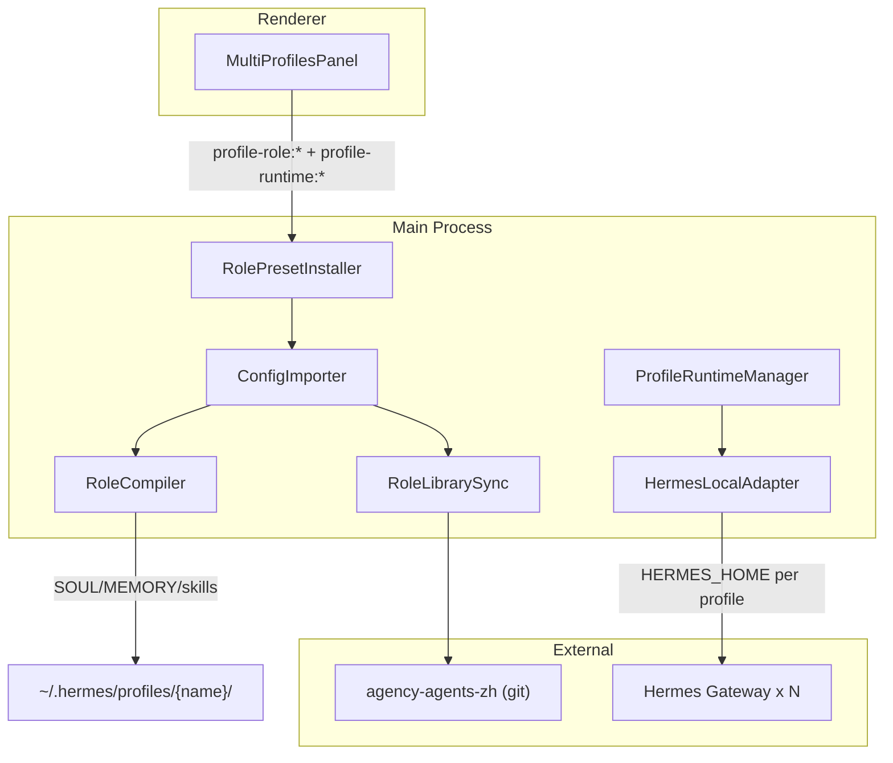
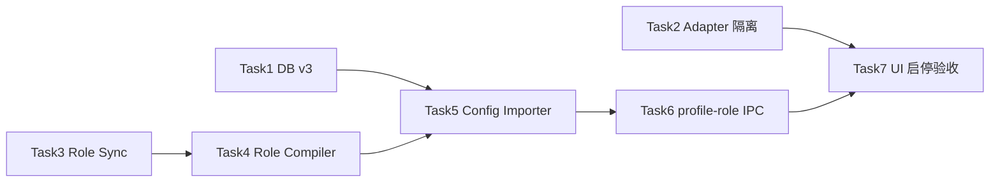

# v4.0 Multi Profiles 功能需求分析

## 1. 产品定位与边界

**目标**：在本地 Hermes Desktop 上，用 `agency-agents-zh` 角色源一键安装 6 个「专家 Profile」，每个 Profile 拥有独立 `profile home`、端口、SOUL/MEMORY/技能源文件，并通过 Settings Drawer 完成安装、启停、角色同步与诊断。

**明确不做**（[prd/v4.0_multi_profiles.md](prd/v4.0_multi_profiles.md) §15）：

- 跨设备团队协作 / 任务分派
- 远程 Hermes Profile
- AI-OS Backend 下发 Profile
- 角色市场

**架构原则**：不重写 `profile-runtime` 模块；在现有 SQLite + Manager + IPC + Capability 上增量扩展。



---

## 2. 与现有实现的对照（PRD 判断验证）

| PRD 论断 | 代码现状 | 结论 |
|---------|---------|------|
| SQLite 控制面已具备 | [`profile-runtime-db.ts`](src/main/profile-runtime-db.ts)：`profiles`、`runtime_instances`、`profile_entries`、`profile_capabilities`、`profile_skills`、`delegation_events` 等；`CURRENT_SCHEMA_VERSION = 2` | **成立** |
| Runtime Manager 可启停/批量/端口检查 | [`profile-runtime-manager.ts`](src/main/profile-runtime-manager.ts) + [`profile-runtime-ipc.ts`](src/main/profile-runtime-ipc.ts) 已注册 `startProfile`/`stopAll`/`delegate` 等 | **成立** |
| Config 导入骨架存在 | [`config-importer.ts`](src/main/config-importer.ts) 支持 YAML、端口冲突、`createProfileDirectories` | **成立，需扩展 `roleSpec`** |
| IPC 足够支撑 UI | [`profile-runtime-api.ts`](src/preload/profile-runtime-api.ts) 约 20 个方法 | **成立，需新增 `profile-role:*`** |
| Gateway 未真隔离 | [`hermes-local-adapter.ts`](src/main/hermes-local-adapter.ts)：`spawn(..., { cwd: HERMES_REPO, env })` **未设置** `HERMES_HOME`；`stop()` 使用 `profileHome()` **无参** → 读 default 的 `gateway.pid`（L175） | **PRD 风险确认，P0** |
| overwrite 有运行时 bug | `config-importer.ts` L220：`require("./profile-runtime-db").getDb()`，而 `getDb` **未 export** | **PRD 风险确认，P0** |
| 角色模块 / 预设 / DB v3 | 无 `src/main/profile-roles/`、无 `hermes-expert-profiles.v1.yaml`、无 `profile_role_specs` 表 | **全部待建** |
| Multi Profiles 管理 UI | [`ProfilesPanel.tsx`](src/renderer/src/screens/SettingsDrawer/ProfilesPanel.tsx) 仅只读列表；[`HermesRuntimeSettings`](src/renderer/src/modules/hermes-runtime/HermesRuntimeSettings.tsx) 无 multi-profiles 分区 | **待建** |

---

## 3. 功能需求拆解（按用户价值）

### 3.1 专家 Profile 预设（6 个）

| Profile ID | 端口 | 显示名 | 角色源路径（agency-agents-zh） |
|------------|------|--------|-------------------------------|
| `writer-9601` | 9601 | 写作生文专家 | `marketing/marketing-content-creator.md` |
| `engineer-9612` | 9612 | 智能体工程专家 | `engineering/engineering-ai-engineer.md` + `engineering-software-architect.md` |
| `research-9602` | 9602 | 数据研究专家 | `strategy/playbooks/phase-0-discovery.md` + `paid-media/paid-media-search-query-analyst.md` |
| `hurman-9621` | 9621 | 招聘专家 | `hr/hr-recruiter.md`（**保留拼写 hurman**，不改为 human） |
| `finance-9631` | 9631 | 财经专家 | `finance/finance-financial-analyst.md` |
| `sales-9641` | 9641 | 销售专家 | `sales/sales-account-strategist.md` |

**能力包**（每个专家）：`delegation`、`skill-sync`、`session-share`、`gateway-supervisor`；`autoStart: false`（按需启动，避免 6 路 Gateway 同时占资源）。

**交付物**：[`resources/profile-presets/hermes-expert-profiles.v1.yaml`](resources/profile-presets/hermes-expert-profiles.v1.yaml)（PRD §6 全文已给出 schema）。

### 3.2 角色库同步（Role Library Sync）

- **源**：`https://github.com/jnMetaCode/agency-agents-zh.git`（branch: main）
- **本地缓存**：`{HERMES_HOME}/desktop/role-library/agency-agents-zh`
- **行为**：首次 `git clone`；已存在则 `fetch` + `pull`/`reset`；失败返回明确错误，**不阻断**已运行 Profile
- **审计**：写入 `audit_events`（与现有控制面一致）

### 3.3 角色编译与落盘（Role Compiler）

每个 Profile 安装后生成：

```text
~/.hermes/profiles/{profileName}/
  SOUL.md          # 压缩后的 profile 指令（非原文整库粘贴）
  MEMORY.md
  profile-role.json
  skills/role-source/agency-agents-zh/*.md
  memories/ + desktop/shared-context/  # 沿用 config-importer 目录创建
```

**SOUL 内容结构**：身份、角色来源路径、工作边界（含跨 Profile 委派规则）、默认交付物（PRD §7 示例）。

**持久化元数据**：`profile_role_specs` 表记录 `role_key`、`source_paths`、`checksum`、`soul_path` 等（PRD §5），与 `profiles.description` 分离以便审计与重编译。

### 3.4 Gateway 真隔离（Hermes Local Adapter）

启动时必须注入（PRD §8）：

```ts
env.HERMES_HOME = home;
env.HERMES_PROFILE = profile.name;
env.HERMES_PROFILE_HOME = home;
env.HERMES_GATEWAY_HOST = instance.host;
env.HERMES_GATEWAY_PORT = String(instance.port);
```

停止时 `gateway.pid` 必须来自 **当前 profile 的 home**，而非 default。

**验收标准**：6 个端口分别 `curl http://127.0.0.1:{port}/health` 成功，且各 Profile 读取各自 `config.yaml` / `SOUL.md`。

### 3.5 配置导入增强（Config Importer）

导入流水线（PRD §9）：

```text
parse YAML → validate → DB(profile/runtime/entry/capability)
  → if roleSpec: sync library → compile → write files → profile_role_specs + profile_skills + audit
```

**覆盖安装**：`overwrite=true` 时必须走导出的 `deleteProfileCascade(id)`，**禁止** `require().getDb()` 私有访问。

**错误码**：`PROFILE_PORT_CONFLICT`、`PROFILE_ALREADY_EXISTS` 等沿用 [`profile-runtime-errors.ts`](src/shared/profile-runtime/profile-runtime-errors.ts)。

### 3.6 Settings Drawer — Multi Profiles 管理

PRD 建议入口：`TopBar Settings Drawer → Hermes Runtime → Multi Profiles`。

**当前 UI 现状**：

- 已有独立 panel：`profiles`（[`SettingsDrawer.tsx`](src/renderer/src/screens/SettingsDrawer/SettingsDrawer.tsx)）
- `runtime` panel 走 [`HermesRuntimePanel`](src/renderer/src/screens/SettingsDrawer/HermesRuntimePanel.tsx)，无 multi-profiles 子页

**建议 UI 能力**（PRD §12）：

| 子组件 | 功能 |
|--------|------|
| `ProfilePresetInstallCard` | 一键安装 6 专家、覆盖开关、端口冲突预检 |
| `ProfileRuntimeActions` | 单 Profile Start/Stop/Restart + Start All/Stop All |
| `ProfileRoleSourceView` | 展示 roleName、sourceRepo、sourcePaths、checksum、触发 sync/recompile |
| `ProfileLogViewer` | Gateway 日志、audit、role sync 事件 |

**新增 IPC**（需 Preload + `index.d.ts` + `docs/API_CONTRACTS.md`）：

- `profile-role:syncLibrary`
- `profile-role:installPreset`
- `profile-role:getSpec` / `listSpecs`
- `profile-role:recompile`

注：Main 已有 `profile-runtime:importConfigContent`，但 Preload [`profile-runtime-api.ts`](src/preload/profile-runtime-api.ts) **未暴露**；安装内置预设应通过 `installPreset` 读 resources 路径，避免 Renderer 传文件路径。

---

## 4. 与 V1.1 遗留 Profile 的关系（重要决策点）

现有模板 [`profile-runtime.template.yaml`](resources/profiles/profile-runtime.template.yaml) 使用 **短名 + 8642–8648**：

- `default:8642`、`writer:8643`、`coding:8644`、`research:8645`、`recruiters:8646`、`finance:8647`、`agenter:8648`

v4.0 预设使用 **新 ID + 9601–9641**，且角色映射有变化（如 `coding` → `engineer-9612`，`recruiters` → `hurman-9621`，新增 `sales-9641`）。

| 策略 | 说明 |
|------|------|
| **并存（PRD 默认）** | 不自动删除旧 Profile；用户机器上可能同时存在两套端口段；安装前必须端口冲突检查 |
| **迁移替换** | 需额外 PRD：旧 Profile 数据/会话如何迁移，超出 v4.0 范围 |
| **UI 提示** | 安装卡片应显示「将新增 6 个专家 Profile」，若检测到 864x 段已占用需明确提示 |

---

## 5. 实施任务与依赖（PRD §13 映射）



| 任务 | 优先级 | 关键文件 | 验收要点 |
|------|--------|----------|----------|
| Task 1 DB migration v3 | P0 | [`profile-runtime-db.ts`](src/main/profile-runtime-db.ts)、新建 [`profile-role-contract.ts`](src/shared/profile-roles/profile-role-contract.ts) | `profile_role_specs` CRUD；不破坏 v1/v2 |
| Task 2 Adapter 隔离 | P0 | [`hermes-local-adapter.ts`](src/main/hermes-local-adapter.ts) | 启停读写正确 profile home；6 端口 health |
| Task 3 role-library-sync | P1 | `src/main/profile-roles/role-library-sync.ts` | clone/更新；失败可恢复 |
| Task 4 role-compiler + file-writer | P1 | `role-compiler.ts`、`role-file-writer.ts` | SOUL/MEMORY/manifest + checksum 可复算 |
| Task 5 config-importer + preset YAML | P1 | [`config-importer.ts`](src/main/config-importer.ts)、`resources/profile-presets/...` | 6 Profile 导入；修复 overwrite |
| Task 6 profile-role-ipc | P1 | `profile-role-ipc.ts`、`index.ts`、preload | Renderer 不碰 FS |
| Task 7 Multi Profiles UI | P2 | 增强 [`ProfilesPanel`](src/renderer/src/screens/SettingsDrawer/ProfilesPanel.tsx) 或 PRD 所述 `features/settings/multi-profiles/*` | 安装/启停/角色源/日志四块齐全 |

**质量门禁**（PRD §14）：`npm run typecheck`、`lint`、`build`、`test` + 手工 6 端口 health + 6 个 `SOUL.md` 存在 + SQL 查 `profile_role_specs`。

**收尾**：按 [007-sync-project-docs](.cursor/rules/007-sync-project-docs.mdc) 同步 `AGENTS.md`、`docs/API_CONTRACTS.md` 等。

---

## 6. 风险与待澄清项

1. **Hermes Agent 是否识别 `HERMES_HOME`**：PRD 假设环境变量即可隔离；实现前应在 [`hermes-agent`](src/main/hermes.ts) / spawn 文档或源码确认 CLI 读取顺序，避免「写了 env 仍读 default」。
2. **Git 依赖**：role sync 需要本机 `git`；企业安装路径若无 git，需与 Enterprise Install 预检对齐或降级为 zip 下载（PRD 未写，属实现细节）。
3. **UI 挂载点**：PRD 写「Hermes Runtime 下 Multi Profiles」，现有 drawer 已有顶层 `profiles` panel——实现时二选一或合并，避免用户找两处。
4. **`importConfigContent` Preload 缺口**：若 `installPreset` 内部调用 Main 读 resources，可不必暴露 content IPC；需在 Task 6 设计时固定。

---

## 7. 总结

**v4.0 本质**：把 Multi Profile 从「多端口 + DB 记录」升级为「可复现的专家角色包 + 文件级隔离 + 可运维 UI」。

**已有资产**：运行时状态机、IPC、委派/技能同步/会话共享、模板导入、只读 Profiles 列表。

**必须补齐的四块**：`profile_role_specs` + 角色编译链、Gateway `HERMES_HOME` 隔离、专家预设 YAML、Settings Multi Profiles 全功能面板。

**最大技术债**：[`hermes-local-adapter.ts`](src/main/hermes-local-adapter.ts) 启停隔离 + [`config-importer.ts`](src/main/config-importer.ts) overwrite 崩溃路径——应作为第一批修复，否则后续 6 Profile 验收不可靠。
