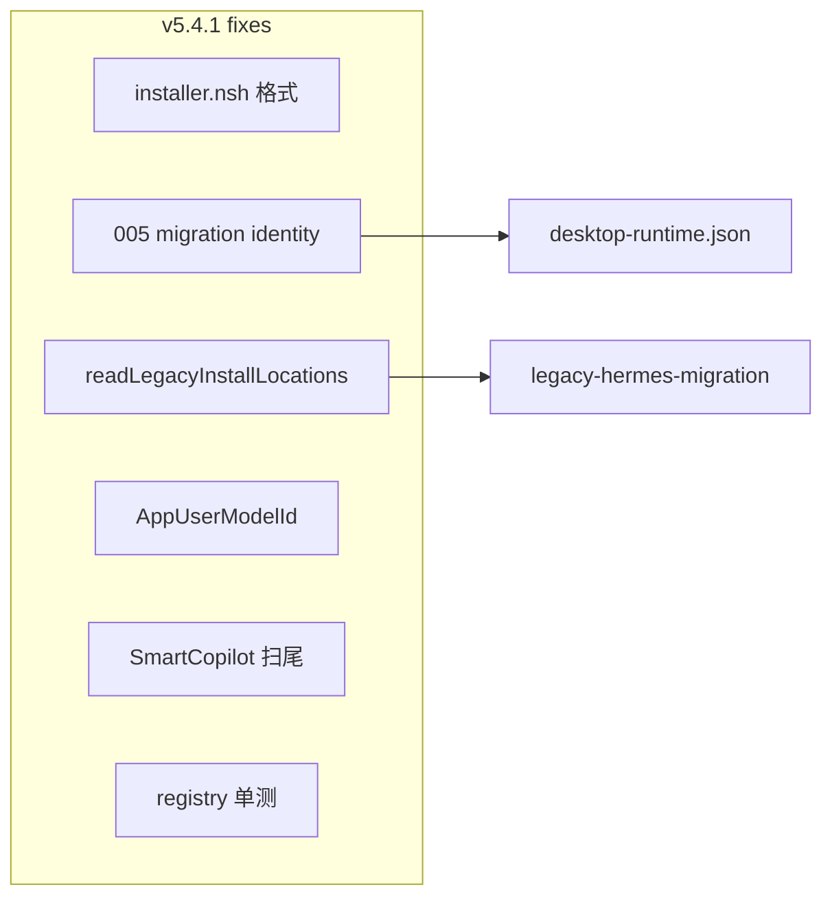

# v5.4.1_hotfix — Review 问题修复计划

## 背景

[v5.4 实施](d:\git_ai\ai-os-desktop\.cursor\plans\v5.4_安装路径统一_b0c26071.plan.md) 已完成核心路径统一；本次 hotfix 仅处理 review 报告中 **「问题与风险」** 的 6 项可修复问题（不含「信息 — 产品边界」类非 bug 项）。

用户确认：**desktop-runtime.json** 升级刷新仅通过 **Main migration**，不在 NSIS 内做 JSON patch。



---

## 1. 中 — 规范化 [`build/installer.nsh`](build/installer.nsh)

**问题**：当前约 377 行，逻辑 ~188 行，行间多空行（疑似 `\r\r\n`），diff 噪音大。

**做法**：
- 按 [`build/nsis/Include/AddToPathSafe.nsh`](build/nsis/Include/AddToPathSafe.nsh) 风格重写为**单行逻辑 + 正常 CRLF**，**不改变** v5.4 已实现的宏/分支（`SMC_COPILOT_*` 常量、`preInit` legacy 仅记录、`desktop.cmd` 等）。
- 改完后用 `git diff --stat build/installer.nsh` 确认行数回落到 ~190 行量级。

**验收**：内容与现网逻辑一致；后续 `npm run build:win` 能过 NSIS 编译（网络可用时）。

---

## 2. 中 — 升级时刷新 `desktop-runtime.json`（Migration only）

**问题**：NSIS `IfFileExists ... skip_desktop_runtime_json` 导致原地升级保留旧 `productName` / `executableName`；`001-install-location` 仅在 `schemaVersion < 1` 执行（[`migration-runner.ts`](src/main/migrations/migration-runner.ts) L52–55）。

**做法**：

1. 新增 [`src/main/migrations/005-v541-install-identity.ts`](src/main/migrations/005-v541-install-identity.ts)：
   - 导出 `migrateV541InstallIdentity(location: DesktopInstallLocation)`
   - 读取 `{runtimeRoot}/desktop-runtime.json`，**仅 merge** 身份字段（不覆盖 `agentSource` / `pipMirror` 等用户字段）：
     - `productName: "SMC-Copilot"`
     - `appId: "com.smc.smc-ai-copilot"`
     - `executableName: "desktop"`
     - `registryKey: "HKCU\\Software\\SMC\\copilot"`
     - `legacyProductNames: ["SMC Copilot", "CopilotSMC", "HermesDesktop"]`（可选，与 NSIS 首次写入一致）
   - 同步更新 `installDir` / `runtimeRoot` / `binDir`（与 [`001-install-location.ts`](src/main/migrations/001-install-location.ts) 一致，保证路径与当前 `location` 对齐）

2. 更新 [`migration-runner.ts`](src/main/migrations/migration-runner.ts)：
   - `CURRENT_SCHEMA_VERSION`：`4` → `5`
   - 在 `schemaVersion < 5` 时调用 `migrateV541InstallIdentity` 并 bump 到 5

**验收**：
- 预置 `schemaVersion: 4` + 旧 JSON（`executableName: "smc-ai-copilot"`）的 temp 目录，跑 `runDesktopMigrations()` 后 JSON 字段为 v5.4 标准。
- 扩展 [`tests/migration-runner.test.ts`](tests/migration-runner.test.ts)：期望 `schemaVersion === 5`（当前测试仍写 `3`，与代码 `4` 已不一致，一并修正）。

---

## 3. 中 — 收紧 [`readLegacyInstallLocations`](src/main/enterprise/windows/install-location-resolver.ts)

**问题**：`readRegistryInstallInfo()` 结果无条件 `unshift`，primary 安装目录会被标为 legacy，干扰 [`legacy-hermes-migration.ts`](src/main/migrations/legacy-hermes-migration.ts)。

**做法**（[`install-location-resolver.ts`](src/main/enterprise/windows/install-location-resolver.ts) L151–158）：

```ts
if (
  regInfo.installLocation &&
  regInfo.registryKey &&
  !PRIMARY_REGISTRY_KEYS.has(regInfo.registryKey)
) {
  candidates.unshift({ installDir: regInfo.installLocation, source: ... });
}
```

- 仅当注册表命中 **legacy 键**（`Copilot` / `CopilotSMC` / `HermesDesktop` / uninstall）时才 unshift。
- 文件系统候选（`Programs\SMC Copilot` 等）保持不变。

**验收**：新增单测（见 §6）— primary 注册表场景下 legacy 列表不包含当前 primary 路径。

---

## 4. 低 — 对齐 `AppUserModelId`

**问题**：[`src/main/index.ts`](src/main/index.ts) L1348 为 `com.smc.smc-copilot`，与 [`electron-builder.yml`](electron-builder.yml) `appId: com.smc.smc-ai-copilot` 不一致。

**做法**：

```ts
electronApp.setAppUserModelId("com.smc.smc-ai-copilot");
```

**验收**：与 `appId`、NSIS / migration 写入的 `appId` 一致。

---

## 5. 低 — SmartCopilot 品牌扫尾

| 文件 | 改动 |
|------|------|
| [`src/renderer/modals/update-ready/update-ready.html`](src/renderer/modals/update-ready/update-ready.html) | subtitle → SMC-Copilot |
| [`src/renderer/src/assets/main.css`](src/renderer/src/assets/main.css) | 注释中的 SmartCopilot → SMC-Copilot |
| [`src/renderer/src/modules/auth/styles/login.css`](src/renderer/src/modules/auth/styles/login.css) | 注释同上 |
| [`src/renderer/src/screens/SplashScreen/SplashScreen.tsx`](src/renderer/src/screens/SplashScreen/SplashScreen.tsx) | 注释 alt 文案（可选，一行） |

不扩大 i18n 全库扫描（v5.4 已改 auth / install fallback）。

---

## 6. 低 — 补注册表优先级测试

**文件**：[`tests/install-location-resolver.test.ts`](tests/install-location-resolver.test.ts)

**做法**：
- `vi.mock("node:child_process")` 的 `execFileSync`，按调用顺序模拟 `reg query` 输出。
- 用例 1：HKCU `copilot` 有路径 → `resolveInstallLocation().source === "registry"`，路径为 primary。
- 用例 2：仅 HKCU `Copilot`（legacy）有路径 → `source === "legacy-registry"`。
- 用例 3：`readLegacyInstallLocations()` 在仅 primary 注册表时，**不**包含与 primary 相同的 unshift 项（可与用例 1 组合，在 `Programs\SMC-Copilot` 不存在于磁盘时断言列表无 duplicate primary）。

每个用例后 `vi.resetModules()` + 清理 env（沿用现有 `beforeEach`/`afterEach` 模式）。

---

## 7. 验证与文档

### 命令

```powershell
npm run typecheck
npx vitest run tests/install-location-resolver.test.ts tests/migration-runner.test.ts tests/runtime-paths.test.ts
npm run build:win   # 网络可用时；确认 SMC-Copilot-*-setup.exe
```

全量 `npm test` 基线失败（better-sqlite3、IPC 表面）**不在本 hotfix 范围**；PR 说明中注明 v5.4.1 专项测试通过即可。

### 文档（rule 007，增量）

| 文档 | 更新 |
|------|------|
| [`AGENTS.md`](AGENTS.md) | 版本索引增加 **V5.4.1**；migration schema 5 / identity 刷新一句 |
| [`docs/INDEX.md`](docs/INDEX.md) | V5.4.1 hotfix  bullet |
| [`docs/API_CONTRACTS.md`](docs/API_CONTRACTS.md) | 新增 **Windows 安装注册表（非 IPC）** 小节：primary `HKCU\Software\SMC\copilot`、legacy 键列表、与 `resolveInstallLocation` 关系 |

---

## 变更文件清单

| 优先级 | 文件 |
|--------|------|
| 必改 | `build/installer.nsh`, `005-v541-install-identity.ts`, `migration-runner.ts`, `install-location-resolver.ts`, `index.ts`, `tests/install-location-resolver.test.ts`, `tests/migration-runner.test.ts` |
| 品牌 | `update-ready.html`, `main.css`, `login.css`, `SplashScreen.tsx`（注释） |
| 文档 | `AGENTS.md`, `docs/INDEX.md`, `docs/API_CONTRACTS.md` |

**明确不做**（review「信息」项 / 用户选择）：
- NSIS 内 JSON patch
- 修改 `appId` / `nsis.guid`
- 自动删除旧 `Programs\SMC Copilot` 目录
- 修复全量 26 个无关 failing tests
