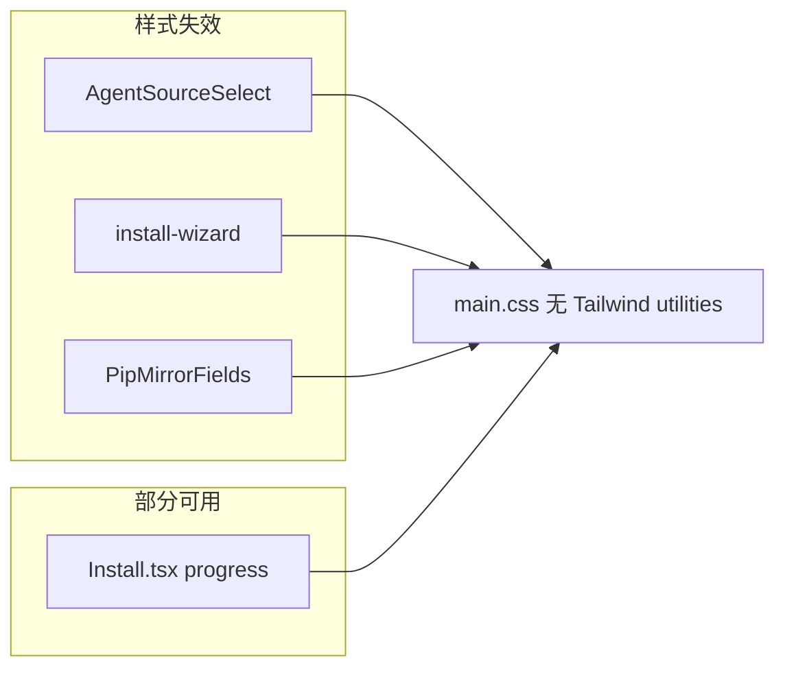

# V5.4.2 Install 模块样式修复计划

## 问题与根因

当前安装相关组件（[`AgentSourceSelect.tsx`](src/renderer/src/screens/Install/AgentSourceSelect.tsx)、[`install-wizard.tsx`](src/renderer/src/components/install-wizard/install-wizard.tsx)、[`PipMirrorFields.tsx`](src/renderer/src/components/install/PipMirrorFields.tsx)）大量使用 Tailwind utility（`flex`、`max-w-lg`、`rounded-xl`、`dark:` 等），但 Renderer 仅加载 [`main.css`](src/renderer/src/assets/main.css)，且**未** `@import "tailwindcss"`，导致布局/卡片/按钮样式失效。

进度页 [`Install.tsx`](src/renderer/src/screens/Install/Install.tsx) 已部分使用 `install-*` class，且 [`main.css` L495–606](src/renderer/src/assets/main.css) 内已有 `.install-screen`、进度条、日志区等规则，因此进度页大致可用；来源选择页与 Wizard 几乎全靠失效的 Tailwind。



## 约束（来自 PRD）

| 允许 | 禁止 |
|------|------|
| 新增 [`install.css`](src/renderer/src/screens/Install/install.css) | 修改 `main.css` / `main.tsx` / `electron.vite.config.ts` / `package.json` |
| 改 4 个 TSX + 引入 CSS | 全局启用 Tailwind、改全局 `.btn`/`.input` |
| 仅 class 替换，保留状态与 IPC 逻辑 | 重构安装流程、抽取共享组件 |

## 实施步骤

### Task 1：新增 `install.css`

- 在 [`src/renderer/src/screens/Install/install.css`](src/renderer/src/screens/Install/install.css) 写入 PRD 第 6 节完整 CSS（约 600 行），覆盖：
  - **进度页**：`.install-screen`、`.install-title`、进度条、日志、错误 banner、`.install-done`
  - **表单控件**：`.install-form-input` / `.install-form-select`、`.install-btn-*`
  - **来源选择**：`.install-source-*`（卡片 560px、选项按钮、ZIP/Git 表单、actions）
  - **PyPI**：`.install-pip-*`
  - **Wizard**：`.install-wizard-*`、`.install-spin`
  - **响应式**：`@media (max-width: 640px)` 纵向堆叠
- 样式依赖 `main.css` 已定义的 CSS 变量（`--bg-primary`、`--accent`、`--radius-lg` 等），**无需**改主题文件。

> **与 main.css 的关系**：PRD 禁止改 `main.css`，因此 `install.css` 会与 main.css 中既有 `.install-screen` 等规则**并存**；`Install.tsx` 引入 `install.css` 后，同选择器以加载顺序覆盖，进度页以专用文件为准。后续版本可单独清理 main.css 重复块（本版不做）。

### Task 2：[`Install.tsx`](src/renderer/src/screens/Install/Install.tsx)

1. 顶部增加：`import "./install.css";`
2. 按钮 class 替换（业务逻辑不变）：
   - `btn btn-primary btn-sm` → `install-btn install-btn-primary install-btn-sm`（Retry）
   - `btn btn-secondary btn-sm` → `install-btn install-btn-secondary install-btn-sm`（Copy Logs）
   - `btn btn-primary` → `install-btn install-btn-primary`（Continue）
3. 保留：`screen install-screen`、现有 progress / log / error 结构与 `hermesAPI` 调用。

`AgentSourceSelect` 作为子组件渲染时，因父模块已 import `install.css`，PipMirror 与来源页样式会一并生效。

### Task 3：[`AgentSourceSelect.tsx`](src/renderer/src/screens/Install/AgentSourceSelect.tsx)

按 PRD 第 8 节替换 DOM 结构与 class（**不**新增 `import "./install.css"`）：

| 原 Tailwind 布局 | 新结构 |
|------------------|--------|
| `flex min-h-screen ... max-w-lg` | `.install-source-screen` > `.install-source-card` |
| 标题区 | `.install-source-header` / `-title` / `-desc` |
| 来源按钮 | `.install-source-options` + `.install-source-option` + `--active` |
| ZIP 表单 | `.install-source-section` + `.install-source-row` + `.install-form-input` |
| Git 表单 | `.install-source-git-grid` + `.install-source-checkbox` |
| 错误 | `.install-source-error` + `install-icon-sm` |
| 操作 | `.install-source-actions` + `install-btn-*` |

图标：`w-6 h-6 text-blue-500` 等 Tailwind 改为 `.install-source-option-icon`（颜色由 CSS `var(--accent-text)` 统一）。

验收：`Select-String` 对 `bg-gray|dark:|space-y|rounded-xl|max-w-lg|items-center|justify-center` 应无匹配。

### Task 4：[`PipMirrorFields.tsx`](src/renderer/src/components/install/PipMirrorFields.tsx)

按 PRD 第 9 节：

- 外层：`install-pip`
- 标题：`install-pip-header` / `-title` / `-desc`
- `select`：`install-form-select`（替换 `input w-full`）
- Custom 字段：`install-pip-custom-fields` / `-field` / `-label` + `install-form-input`
- 预设 URL 展示：`install-pip-url`

保留：`PIP_MIRROR_PRESETS`、`resolvePipMirrorFromPreset`、`trustedHostFromPipIndexUrl` 及全部 state 逻辑。

### Task 5：[`install-wizard.tsx`](src/renderer/src/components/install-wizard/install-wizard.tsx)

1. 增加：`import "../../screens/Install/install.css";`
2. 外层：`install-wizard-screen` > `install-wizard-card`
3. 各 stage 按 PRD 第 10 节替换 class（**不**重构为复用 `AgentSourceSelect`）：
   - detect / installing / verifying → `install-wizard-status` + `install-spin`
   - completed / error → `install-wizard-center` + 图标/副标题/按钮
   - select-source 区块与 AgentSourceSelect 使用同一套 `install-source-*` / `install-form-*` / `install-btn-*`
4. 关闭按钮：`install-wizard-close`

说明：该组件当前**未**挂载于 [`App.tsx`](src/renderer/src/App.tsx) 主路由（仅 `Install` 屏在用），但 PRD 要求独立入口样式一致，仍须完成 class 迁移。

### Task 6：验证

```powershell
npm run typecheck
npm test
```

手动/UI（PRD 第 12–13 节）：

- **来源选择**：居中、卡片 ≤560px、选项卡片式高亮、ZIP+Browse 横排、PyPI 分隔区、Cancel/Start 等宽
- **进度页**：进度条/日志/错误 banner/按钮正常
- **小窗**：640px 以下表单与按钮纵向堆叠
- **回归**：ZIP 安装、Git 安装、Custom PyPI 校验、Cancel 回 Welcome
- **主应用**：Layout / MainPage / Settings 无视觉回归（未改全局 CSS）

可选 grep 验收（PRD 已给出命令）对三个 TSX 扫描 Tailwind 残留。

## 文档同步

本次为 **纯 UI/CSS**，无 IPC/路由/行为契约变更，按 [007-sync-project-docs](.cursor/rules/007-sync-project-docs.mdc) **跳过** `AGENTS.md` / `docs/*` 更新。

## 风险与注意点

1. **`.screen` 叠加**：进度页保留 `className="screen install-screen"`；`install.css` 中 `.install-screen` 定义完整 flex 布局，可能覆盖 `.screen` 的 `justify-content: center`，与 PRD「进度内容靠上」一致。
2. **按钮两套体系**：Install 模块统一 `install-btn-*`，避免依赖全局 `.btn`（来源页原先混用 `btn` + Tailwind 导致更乱）。
3. **Checkbox 原生样式**：浅克隆 checkbox 保持原生，仅外层 `.install-source-checkbox` 排版（与 PRD 一致）。

## 交付清单

| 操作 | 路径 |
|------|------|
| 新增 | `src/renderer/src/screens/Install/install.css` |
| 修改 | `Install.tsx`, `AgentSourceSelect.tsx`, `PipMirrorFields.tsx`, `install-wizard.tsx` |
| 不改 | `main.css`, `main.tsx`, `electron.vite.config.ts`, `package.json` |
