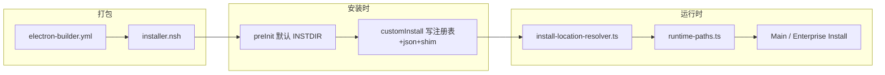

# v5.4 安装包名称与路径统一实施计划

## 背景与目标（来自 PRD + [AGENTS.md](AGENTS.md)）

Hermes Desktop / SMC Copilot 的 Windows 部署链路为 **electron-builder + NSIS（`build/installer.nsh`）+ Main 路径解析（`install-location-resolver.ts` → `runtime-paths.ts`）**。V5.3 已将 runtime 子目录收敛到 `runtime/hermes|serve|portal`；V5.4 解决的是**产品显示名、默认安装目录空格、主 exe 名、业务注册表键**不一致。

**统一后的标准：**

| 项 | 目标值 |
|---|---|
| 默认安装目录 | `%LOCALAPPDATA%\Programs\SMC-Copilot` |
| 主程序 | `desktop.exe` |
| 安装包文件名 | `SMC-Copilot-<version>-setup.exe` |
| 业务注册表（写入） | `HKCU\Software\SMC\copilot` |
| 兼容读取 | `HKCU\Software\SMC\Copilot`、`CopilotSMC`、`HermesDesktop`、legacy uninstall 项 |
| `appId` / `nsis.guid` | **不改**（避免升级/卸载断链） |



---

## 当前仓库状态（调研结论）

### 已完成（工作区未提交）

[`electron-builder.yml`](electron-builder.yml) 已部分对齐：

- `productName: SMC-Copilot`
- `win.executableName: desktop`
- `shortcutName` / `uninstallDisplayName: SMC-Copilot`

**仍缺：** `nsis.artifactName` 仍为 `smc-copilot-${version}-setup.${ext}`，PRD 要求 `SMC-Copilot-${version}-setup.${ext}`。

### 未完成（PRD 核心）

| 文件 | 现状 | 需改 |
|---|---|---|
| [`build/installer.nsh`](build/installer.nsh) | 默认 `$LOCALAPPDATA\Programs\SMC Copilot`；读写 `Software\SMC\Copilot`；升级会复用 legacy 含空格目录；`desktop-runtime.json` 仍为 `SMC Copilot` / `smc-ai-copilot` | 按 PRD §3.2–3.3 重写 `preInit` / `customInstall` / `customUnInstall` |
| [`install-location-resolver.ts`](src/main/enterprise/windows/install-location-resolver.ts) | Primary=`Software\SMC\Copilot`；`DEFAULT_PROGRAM_FOLDER=SmartCopilot` | Primary=`Software\SMC\copilot`；默认文件夹 `SMC-Copilot`；legacy 键单独列出 |

### 关联缺口（你已选 extended_consistency）

- [`shim-manager.ts`](src/main/enterprise/shim-manager.ts)：`createDesktopShim` 仍指向 `smc-copilot.exe`，安装后 Electron 刷新 shim 会写错目标。
- [`runtime-state-resolver.ts`](src/main/enterprise/runtime-state-resolver.ts)：硬编码 `HKCU\Software\SMC\Copilot` 读 `PreviousVersion`。
- [`migrations/001-install-location.ts`](src/main/migrations/001-install-location.ts)：写入过时的 `productName` / `executableName`。
- 测试：[`tests/runtime-paths.test.ts`](tests/runtime-paths.test.ts) mock 路径仍用 `SMC Copilot`（带空格）。
- 文档：[`AGENTS.md`](AGENTS.md) 安装目录描述仍为 `SMC Copilot`（实现后走 [sync-project-docs skill](.agents/skills/sync-project-docs/SKILL.md)）。

**不需改（PRD 确认）：** [`runtime-paths.ts`](src/main/runtime/runtime-paths.ts)、[`desktop-runtime-config.ts`](src/main/enterprise/desktop-runtime-config.ts) — 路径已从 `resolveInstallLocation()` 推导。

---

## 实施阶段

### Phase 1：收尾 electron-builder（Task 1）

文件：[`electron-builder.yml`](electron-builder.yml)

- 将 `nsis.artifactName` 改为 `SMC-Copilot-${version}-setup.${ext}`
- 确认 `appId`、`nsis.guid` 保持不变

验收：

```powershell
npm run build:win
dir dist
# 期望: SMC-Copilot-0.1.8-setup.exe
```

---

### Phase 2：NSIS 安装器（Task 2 + Task 4 + Task 5）

文件：[`build/installer.nsh`](build/installer.nsh)

**2.1 增加常量（PRD §3.2.1）**

```nsh
!define SMC_COPILOT_REG_KEY "Software\SMC\copilot"
!define SMC_COPILOT_LEGACY_REG_KEY "Software\SMC\Copilot"
!define SMC_COPILOT_DEFAULT_DIR "$LOCALAPPDATA\Programs\SMC-Copilot"
```

**2.2 重写 `preInit`（关键行为变更）**

- **仅**从 `Software\SMC\copilot`（HKCU → HKLM）读取 `$ExistingInstallDir` 作为可复用安装目录
- Legacy 键（`Copilot`、`CopilotSMC`、`HermesDesktop`、uninstall 项）只写入 `$LegacyInstallDir`，**不**赋给 `$INSTDIR`
- 无 primary 时默认 `SMC-Copilot`（无空格）
- 继续向 `${INSTALL_REGISTRY_KEY}` 写入 InstallLocation（供 electron-builder 目录页）

这样满足 PRD §4.2：旧 `SMC Copilot` 用户升级时**默认新目录**，避免继续写入带空格路径；已在新目录安装的用户仍走原地升级。

**2.3 `customInstall`**

- 注册表写入改为 `${SMC_COPILOT_REG_KEY}`
- `PreviousAppVersion` 从 legacy `${SMC_COPILOT_LEGACY_REG_KEY}` 读取（兼容首次从旧版升级）
- `desktop-runtime.json`（仅首次创建时）字段：
  - `productName: "SMC-Copilot"`
  - `executableName: "desktop"`
  - 可选：`registryKey`、`legacyProductNames`（PRD 建议；若 `desktop-runtime-config` 暂不消费，仅作安装元数据）
- **新增** `bin\desktop.cmd`（PRD Task 5）：

```cmd
@echo off
"%~dp0..\desktop.exe" %*
```

- 现有 `smc-copilot.cmd` / `hermes-desktop.cmd` 继续用 `${APP_EXECUTABLE_FILENAME}`（将解析为 `desktop.exe`）

**2.4 `customUnInstall`**

- 从 `${SMC_COPILOT_REG_KEY}` 读 RuntimeRoot/BinDir
- 删除：`copilot`、`Copilot`（legacy）、`CopilotSMC`（按 PRD）

**注意：** installer 仍创建 `runtime\hermes-agent` 等旧目录名用于升级兼容；V5.3 runtime 布局由 Electron bootstrap / migration 负责，本 PRD 不强制改 NSIS 目录树（与 PRD §8 一致）。

---

### Phase 3：运行时安装目录解析（Task 3）

文件：[`src/main/enterprise/windows/install-location-resolver.ts`](src/main/enterprise/windows/install-location-resolver.ts)

```ts
const REGISTRY_KEY_PRIMARY = "HKCU\\Software\\SMC\\copilot";
const REGISTRY_KEY_PRIMARY_HKLM = "HKLM\\Software\\SMC\\copilot";
const REGISTRY_KEY_LEGACY_SMC_COPILOT = "HKCU\\Software\\SMC\\Copilot";
// ... CopilotSMC, HermesDesktop, uninstall ...

const DEFAULT_PROGRAM_FOLDER = "SMC-Copilot";
```

`readRegistryInstallInfo()` 读取顺序（PRD §3.4）：

1. primary HKCU → HKLM
2. legacy `Copilot` → `CopilotSMC` → `HermesDesktop` → uninstall

`resolveInstallLocation()` 中 `source === "registry"` 判断改为匹配 **primary** 键（非 legacy）。

可选增强：`readLegacyInstallLocations()` 增加候选 `%LOCALAPPDATA%\Programs\SMC Copilot`（便于后续清理 UI，PRD §4.3）。

---

### Phase 4：关联运行时一致性（extended）

| 文件 | 改动 |
|---|---|
| [`shim-manager.ts`](src/main/enterprise/shim-manager.ts) | `createDesktopShim`：`desktop.exe`；新增/更新 `desktop.cmd`；保留 `smc-copilot.cmd` 别名指向同一 exe |
| [`runtime-state-resolver.ts`](src/main/enterprise/runtime-state-resolver.ts) | `PreviousVersion` 优先读 `Software\SMC\copilot`，fallback legacy `Copilot` |
| [`migrations/001-install-location.ts`](src/main/migrations/001-install-location.ts) | `productName: "SMC-Copilot"`，`executableName: "desktop"`，`appId` 保持 `com.smc.smc-ai-copilot` |

**UI 品牌（SmartCopilot → SMC-Copilot）** — 建议本轮仅改**安装/运维相关**文案，避免大范围 i18n：

- [`index.ts`](src/main/index.ts) `app.name`
- [`tray-manager.ts`](src/main/shell/tray-manager.ts)、[`window-manager.ts`](src/main/shell/window-manager.ts) 默认标题
- [`renderer/index.html`](src/renderer/index.html) `<title>`
- 安装向导 fallback 字符串（`install-wizard.tsx`、`AgentSourceSelect.tsx`）

登录页 `auth.ts` 的 SmartCopilot 可单独 PR 或本批一并改为 `SMC-Copilot`（与产品名一致）。

---

### Phase 5：测试与验证

**单元测试更新：**

- [`tests/runtime-paths.test.ts`](tests/runtime-paths.test.ts)：mock 路径改为 `C:\Programs\SMC-Copilot`（无空格）
- 可选：为 `install-location-resolver` 增加 registry 顺序的 mock 测试（若现有测试仅覆盖 env-var，可补一条文档化注释说明 Windows 需手工验收）

**PRD 验收命令（Windows 实机）：**

```powershell
npm run typecheck
npm test
npm run build:win

# 安装后
Test-Path "$env:LOCALAPPDATA\Programs\SMC-Copilot\desktop.exe"
reg query HKCU\Software\SMC\copilot /v InstallLocation
type "$env:LOCALAPPDATA\Programs\SMC-Copilot\runtime\desktop-runtime.json"
desktop.cmd
smc-copilot.cmd
```

---

### Phase 6：文档同步（规则 007）

实现与测试通过后执行 [`.agents/skills/sync-project-docs/SKILL.md`](.agents/skills/sync-project-docs/SKILL.md)，至少更新：

- [`AGENTS.md`](AGENTS.md) — 安装目录、`desktop.exe`、注册表键
- [`docs/ARCHITECTURE.md`](docs/ARCHITECTURE.md) / [`docs/API_CONTRACTS.md`](docs/API_CONTRACTS.md) — 若有 enterprise/registry 描述

---

## 兼容与风险（PRD §7）

| 场景 | 行为 |
|---|---|
| 已装在 `Programs\SMC Copilot` | NSIS **默认**新装到 `SMC-Copilot`；运行时仍可通过 legacy 注册表找到旧目录直至用户迁移 |
| 同机双目录 | 预期副作用；不自动删旧目录（PRD §4.3） |
| 修改 appId/guid | **禁止** |
| Electron autoUpdater | 本次不处理目录迁移；后续单独策略 |
| PATH | `AddToPathSafe` 指向新 `$INSTDIR\bin`；卸载清理旧 PATH |

---

## 文件变更清单（最终）

**必改（PRD + 你已确认扩展）：**

- [`electron-builder.yml`](electron-builder.yml) — artifactName
- [`build/installer.nsh`](build/installer.nsh) — preInit / customInstall / customUnInstall / desktop-runtime.json / desktop.cmd
- [`src/main/enterprise/windows/install-location-resolver.ts`](src/main/enterprise/windows/install-location-resolver.ts)
- [`src/main/enterprise/shim-manager.ts`](src/main/enterprise/shim-manager.ts)
- [`src/main/enterprise/runtime-state-resolver.ts`](src/main/enterprise/runtime-state-resolver.ts)
- [`src/main/migrations/001-install-location.ts`](src/main/migrations/001-install-location.ts)
- [`tests/runtime-paths.test.ts`](tests/runtime-paths.test.ts)

**建议改（品牌一致）：**

- [`src/main/index.ts`](src/main/index.ts)、[`tray-manager.ts`](src/main/shell/tray-manager.ts)、[`window-manager.ts`](src/main/shell/window-manager.ts)、[`renderer/index.html`](renderer/index.html)、安装相关 Renderer fallback

**实现后文档：**

- `AGENTS.md`、`docs/*`（sync skill）
