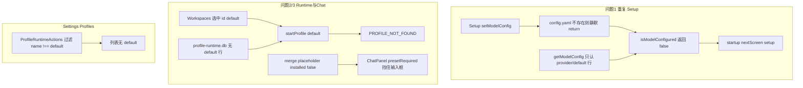

# v5.5.1_hotfix — Setup 持久化 + Default Profile 运行时

## 问题根因（已对照代码）



| 现象 | 根因文件 | 机制 |
|------|----------|------|
| 每次登录回到 Setup | [`setModelConfig`](src/main/config.ts) L277 | `if (!existsSync(configFile)) return` — Setup 点 Continue **不写盘** |
| 同上 | [`isModelConfigured`](src/main/enterprise/model-config-status.ts) | 企业安装写的 `default_provider` / `models:` 块与 `getModelConfig` 解析字段不一致 → 长期判为未配置 |
| Runtime `PROFILE_NOT_FOUND` | [`profile-runtime-manager`](src/main/profile-runtime-manager.ts) + [`hermes-local-adapter`](src/main/hermes-local-adapter.ts) | `getProfile(profileId)` 仅按 **DB UUID** 查；UI 传 `"default"` 或 `"default-8642"`，库中无记录 |
| Chat 无输入框 | [`ChatPanel`](src/renderer/src/screens/Workspaces/panels/ChatPanel.tsx) L50-69 | `profileInstalled === false` → `showPresetRequired` |
| Settings 无 default | [`ProfileRuntimeActions`](src/renderer/src/screens/SettingsDrawer/multi-profiles/ProfileRuntimeActions.tsx) L35 | `profiles.filter(p => p.name !== "default")` **刻意隐藏** |

v5.5 已在 Renderer 将 canonical id 对齐为 `"default"`（[`constants.ts`](src/renderer/src/screens/Workspaces/constants.ts)），但 **未写入 profile-runtime.db**，故 2/3 仍会失败。

---

## 修复策略（三轨并行）

### 轨 A — 问题 1：Setup 配置持久化与启动门控

**1. [`setModelConfig`](src/main/config.ts)**  
- 若 `config.yaml` 不存在：创建 `~/.hermes/config.yaml`（或 profile 对应 home）最小模板，包含 `provider` / `default`（model）/ `base_url` 与 `platforms.api_server`（port 8642 占位）。  
- 写入后 `invalidateCache`。

**2. [`getModelConfig`](src/main/config.ts)**  
- 兼容解析：`provider` 或 `default_provider`；`default`（model）或 `default_model`；`base_url`（根级或 `models:` 下）。  
- 与企业 bootstrap 模板（[`profile-runtime-bootstrapper.ts`](src/main/enterprise/profile-runtime-bootstrapper.ts)）对齐。

**3. [`isModelConfigured`](src/main/enterprise/model-config-status.ts)**  
- 在现有逻辑上增加：  
  - `getModelConfig()` 的 `provider` 为 local 族且 `baseUrl` 非空；或  
  - `model` 非空；或  
  - [`listModels()`](src/main/models.ts)（`models.json`）非空。  
- 避免「Hermes 里已有模型、门控仍进 Setup」。

**4.（建议）Setup 完成后同步 models.json** — [`Setup.tsx`](src/renderer/src/screens/Setup/Setup.tsx)  
- `handleContinue` 在 `setModelConfig` 成功后调用 `hermesAPI.addModel`（名称可用 model 或 provider+model），便于 Workspaces [`Models`](src/renderer/src/screens/Workspaces/pages/Models/Models.tsx) 与后续 Chat 扩展共用。

**5. 验证**：完成 Setup → 退出登录 → 再登录 → `resolveStartupDecision` 应 `nextScreen: "main"`（[`startup-decision.ts`](src/main/startup/startup-decision.ts) L138）。

---

### 轨 B — 问题 2/3：Default Profile 入库 + IPC 解析

**1. 新增 Main 模块** `src/main/profile-runtime-default.ts`（或并入 `profile-runtime-manager.ts`）  

`ensureDefaultControllerProfile()`，在 [`initializeProfileRuntime()`](src/main/profile-runtime-manager.ts) 内调用：

- `initProfileRuntimeDb()` 后检查 `getProfileByName("default")`  
- 不存在则 `insertProfile` + `insertRuntimeInstance`：  
  - `name: "default"`, `role: aios-controller`, `profile_home: HERMES_HOME`, `port: 8642`, `runtime_type: hermes-local`, `sort_order: 0`  
- 已存在但无 `runtime_instances` 行则补插 instance  

逻辑可复用 [`config-importer.ts`](src/main/config-importer.ts) L317-358 的 default 分支。

**2. IPC 统一解析 profile 参数** — [`profile-runtime-ipc.ts`](src/main/profile-runtime-ipc.ts)  

对 `startProfile` / `stopProfile` / `restartProfile` / `getProfile` / `getGatewayLogs` / `listAuditEvents` 等：

```ts
function resolveProfileId(idOrName: string): string {
  return getProfile(idOrName)?.id ?? getProfileByName(idOrName)?.id ?? idOrName;
}
```

避免 Renderer 传 `"default"` / 旧 `"default-8642"` 时找不到记录。

**3.（可选但推荐）Preset YAML** — [`hermes-expert-profiles.team_v1.4.yaml`](resources/profile-presets/hermes-expert-profiles.team_v1.4.yaml)  

在 `profiles:` 下增加 `default:`（port 8642、`role` 对应 aios-controller、displayName 智能助手），使「Install expert preset」路径也能导入 default；与 `ensureDefault` 双保险。

**4. Renderer 合并层** — [`mergeExpertProfiles.ts`](src/renderer/src/screens/Workspaces/api/mergeExpertProfiles.ts)  

- `default` 占位卡：若 `~/.hermes` 已存在（通过 DB `profile_home` 或 ensure 后 `fromDb`），`installed: true`  
- 无 DB 时仍显示卡片，但启停依赖轨 B 入库后才有 instance  

**5. Chat 放行 default** — [`ChatPanel.tsx`](src/renderer/src/screens/Workspaces/panels/ChatPanel.tsx)  

```ts
const isDefaultProfile =
  activeProfile?.name === "default" || activeProfileId === "default";
const profileInstalled = isDefaultProfile || activeProfile?.installed !== false;
```

default 不要求 expert preset，仅专家 profile 保持 `installed` 门禁。

**6. Legacy Gateway 桥接（保留 v5.5）** — [`useActiveProfile.ts`](src/renderer/src/screens/Workspaces/hooks/useActiveProfile.ts)  

仅用于**状态展示**；启停走 profileRuntime 前必须先有 DB 记录（轨 B）。

---

### 轨 C — Settings Profiles 显示 default

**[`ProfileRuntimeActions.tsx`](src/renderer/src/screens/SettingsDrawer/multi-profiles/ProfileRuntimeActions.tsx)**  

- 移除 `filter(p => p.name !== "default")`，或拆为两段：**Portal / default (8642)** + **Experts**  
- 列表排序：`default` 置顶（`sort_order` 或 name === "default"）  
- 初始 `selectedProfileId`：优先选 default（[`MultiProfilesPanel.tsx`](src/renderer/src/screens/SettingsDrawer/multi-profiles/MultiProfilesPanel.tsx) L28-30）

可选文案：i18n `runtimeSettings.defaultProfileLabel`（智能助手 / Portal Controller）。

---

## 影响文件清单

| 优先级 | 文件 | 变更 |
|--------|------|------|
| P0 | `src/main/config.ts` | 创建 config + 解析兼容 |
| P0 | `src/main/enterprise/model-config-status.ts` | 门控判定增强 |
| P0 | `src/main/profile-runtime-default.ts`（新） | ensure default |
| P0 | `src/main/profile-runtime-manager.ts` | 启动时 ensure |
| P0 | `src/main/profile-runtime-ipc.ts` | resolveProfileId |
| P1 | `resources/profile-presets/hermes-expert-profiles.team_v1.4.yaml` | default 段 |
| P1 | `src/renderer/.../ChatPanel.tsx` | default 免 preset |
| P1 | `src/renderer/.../mergeExpertProfiles.ts` | default installed |
| P1 | `src/renderer/.../ProfileRuntimeActions.tsx` | 显示 default |
| P1 | `src/renderer/.../MultiProfilesPanel.tsx` | 默认选中 default |
| P2 | `src/renderer/.../Setup.tsx` | addModel 同步 |
| P2 | i18n `runtimeSettings.*` | default 标签（可选） |

**不改** plan 文件；[`WorkspaceStatusCards.tsx`](src/renderer/src/screens/Workspaces/components/WorkspaceStatusCards.tsx) 保持只读 `profiles`（v5.5 已满足）。

---

## 验证清单（对应用户截图）

1. Setup 配置 Ollama URL + `gemma4:26b` → Continue → 重登 **不再**出现截图 1  
2. Workspaces 顶栏 default 卡 → 右侧 Runtime **Start/日志** 不报 `PROFILE_NOT_FOUND`（可用 legacy 或 DB gateway）  
3. Chat 侧栏 **出现输入框**，不再仅显示 “Install this expert preset…”  
4. Settings → Profiles：列表含 **default / 智能助手 :8642**，专家 writer 仍在  
5. `npm run typecheck:web` 通过（Workspaces 相关）；既有 `HermesRuntimeSettings.tsx` connection 类型错误可单独 hotfix 或本 PR 一并修

---

## 与 v5.5 关系

v5.5 Renderer 改动（`id: "default"`、`EXPERT_PROFILE_BY_ROUTE_KEY`、legacy `gatewayStatus` 桥接）**保留**；本 hotfix 补 Main 数据面与门控，使 UI 与 runtime DB 一致。
