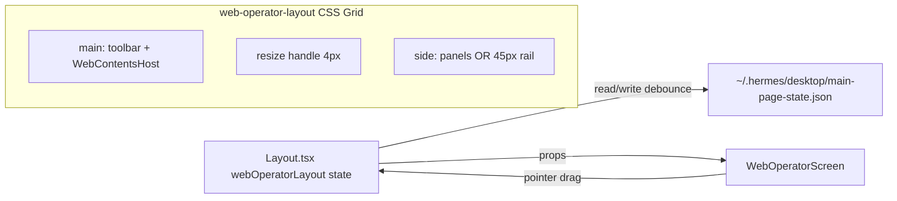

# v5.5 Web Operator 左右分栏与侧栏折叠

## 目标

在 [`WebOperatorScreen.tsx`](d:\git_ai\copilot-full\copilot-desktop\src\renderer\src\screens\WebOperator\WebOperatorScreen.tsx) 中实现：

1. **主区 : 侧栏默认 7:3**，中间 **可拖动** 调整宽度  
2. **侧栏一键折叠**：展开时显示三面板；折叠后 **固定 45px** 窄轨（展开按钮 + browser-state / screenshot / action-log 图标）  
3. **布局持久化**：侧栏宽度比例与折叠状态跨重启保留（写入 `main-page-state`）

## 现状

```141:150:d:\git_ai\copilot-full\copilot-desktop\src\renderer\src\screens\WebOperator\web-operator.css
.web-operator-layout__side {
  width: 320px;
  flex: 0 0 320px;
  ...
}
```

- 根布局为 `display: flex`，侧栏写死 320px，无拖动手柄、无折叠  
- [`WebContentsHost`](d:\git_ai\copilot-full\copilot-desktop\src\renderer\src\components\shell\WebContentsHost.tsx) 已有 `ResizeObserver`，主区宽度变化会自动 `setBounds`，**无需改 Main/Preload**  
- 全局 [`DesktopSidebar`](d:\git_ai\copilot-full\copilot-desktop\src\renderer\src\components\layout\DesktopSidebar.tsx) 在 [`MainPage.tsx`](d:\git_ai\copilot-full\copilot-desktop\src\renderer\src\screens\MainPage\MainPage.tsx) 中已注释，折叠轨上的三个面板图标是必要的导航入口（用户已确认）

## 架构



## 实现方案

### 1. 持久化契约（可选字段，兼容 V2）

在 [`main-page-state-contract.ts`](d:\git_ai\copilot-full\copilot-desktop\src\shared\shell\main-page-state-contract.ts) 增加：

```ts
export interface WebOperatorLayoutState {
  sideRatio: number;      // 0.3 = 7:3，clamp 后存储
  sideCollapsed: boolean;
}

// MainPagePersistedStateV2 内
webOperatorLayout?: WebOperatorLayoutState;
```

默认值：`{ sideRatio: 0.3, sideCollapsed: false }`。

### 2. Layout 状态与持久化（对齐 `workspaceSecondaryState` 模式）

[`Layout.tsx`](d:\git_ai\copilot-full\copilot-desktop\src\renderer\src\screens\Layout\Layout.tsx)：

- `useState<WebOperatorLayoutState>`，hydrate 时从 `window.mainPageState.read()` 读取 `webOperatorLayout`  
- 现有 300ms debounce `write` payload 中并入 `webOperatorLayout`  
- 经 [`WorkspaceOutlet`](d:\git_ai\copilot-full\copilot-desktop\src\renderer\src\components\layout\WorkspaceOutlet.tsx) → [`WorkspaceRenderer`](d:\git_ai\copilot-full\copilot-desktop\src\renderer\src\components\workspace\WorkspaceRenderer.tsx) 传入 `WebOperatorScreen`

新增 props（命名示例）：

- `webOperatorLayout?: WebOperatorLayoutState`
- `onWebOperatorLayoutChange?: (next: WebOperatorLayoutState) => void`

### 3. 布局 Hook（拖动手势 + 比例计算）

新建 [`hooks/useWebOperatorLayoutSplit.ts`](d:\git_ai\copilot-full\copilot-desktop\src\renderer\src\screens\WebOperator\hooks\useWebOperatorLayoutSplit.ts)：

| 常量 | 值 | 说明 |
|------|-----|------|
| `DEFAULT_SIDE_RATIO` | `0.3` | 7:3 |
| `SIDE_COLLAPSED_PX` | `45` | 折叠轨宽 |
| `HANDLE_PX` | `4` | 拖动手柄 |
| `MIN_SIDE_PX` | `200` | 侧栏最小宽 |
| `MAX_SIDE_RATIO` | `0.5` | 侧栏最大占比 |
| `MIN_MAIN_PX` | `360` | 主区最小宽 |

职责：

- `layoutRef` + `ResizeObserver` 测量容器宽度  
- 展开时：`sideWidthPx = clamp(containerW * sideRatio, MIN_SIDE, containerW - MIN_MAIN - HANDLE)`  
- `onPointerDown` 在手柄上：`setPointerCapture` → `pointermove` 按指针 X 反算 `sideRatio` → `onLayoutChange({ ...prev, sideRatio })` → `pointerup` 清理  
- 折叠时：隐藏手柄；`grid-template-columns: minmax(0,1fr) 45px`  
- 展开时：`minmax(0,1fr) 4px {sideWidthPx}px`  
- 拖动/折叠期间 `document.body` 加 `user-select: none` 与 `cursor: col-resize`

### 4. UI 组件

**[`WebOperatorSideRail.tsx`](d:\git_ai\copilot-full\copilot-desktop\src\renderer\src\screens\WebOperator\WebOperatorSideRail.tsx)**（折叠态，45px）

- 顶部：`PanelRightOpen` 展开按钮  
- 下方垂直排列：`Monitor` / `Camera` / `ScrollText`（复用 [`DesktopSidebar`](d:\git_ai\copilot-full\copilot-desktop\src\renderer\src\components\layout\DesktopSidebar.tsx) 同款 lucide 图标与 `SECONDARY_PANEL_LABEL_KEYS`）  
- 点击图标：`onFocusedPanelChange(panel)`；若需可先 `sideCollapsed: false` 再聚焦（可选，建议展开并 scrollIntoView）

**展开态侧栏顶栏**（可内联于 `WebOperatorScreen`）

- 右侧 `PanelRightClose` 折叠按钮  
- 下方保留现有三个 `web-operator-layout__panel`

### 5. 改造 `WebOperatorScreen.tsx`

结构示意：

```tsx
<div ref={layoutRef} className={cn("web-operator-layout", collapsed && "is-side-collapsed")} style={{ "--wo-side-width": `${sideWidthPx}px` }}>
  <div className="web-operator-layout__main">...</div>
  {!sideCollapsed && <div role="separator" className="web-operator-layout__handle" onPointerDown={...} />}
  <aside className="web-operator-layout__side">
    {sideCollapsed ? (
      <WebOperatorSideRail ... />
    ) : (
      <>
        <header className="web-operator-layout__side-header">...</header>
        {/* 现有三 panel */}
      </>
    )}
  </aside>
</div>
```

- 受控 props：`layout: WebOperatorLayoutState`、`onLayoutChange`  
- 折叠/拖动仅调用 `onLayoutChange`，由 Layout 统一持久化

### 6. CSS（[`web-operator.css`](d:\git_ai\copilot-full\copilot-desktop\src\renderer\src\screens\WebOperator\web-operator.css)）

- `.web-operator-layout` 改为 **CSS Grid**（替代 flex + 固定 320px）  
- `.web-operator-layout__handle`：`cursor: col-resize`、hover 高亮、`touch-action: none`  
- `.web-operator-layout.is-side-collapsed`：两列（无 handle）  
- `.web-operator-layout__side`：使用 `width` / `min-width` 由 grid 列控制，移除 `320px` 硬编码  
- `.web-operator-layout__side-header`、`.web-operator-side-rail`：对齐 Workspaces rail 间距（参考 [`.workspaces-right-rail`](d:\git_ai\copilot-full\copilot-desktop\src\renderer\src\screens\Workspaces\workspaces.css)）

### 7. i18n

在 [`en/navigation.ts`](d:\git_ai\copilot-full\copilot-desktop\src\shared\i18n\locales\en\navigation.ts) 与 [`zh-CN/navigation.ts`](d:\git_ai\copilot-full\copilot-desktop\src\shared\i18n\locales\zh-CN\navigation.ts) 增加：

- `webOperator.side.expand` / `webOperator.side.collapse`（按钮 `title`）

面板标签复用已有 `browserState` / `screenshot` / `actionLog`。

## 验收清单

- [ ] 首次进入 Web Operator：主区约 70%、侧栏约 30%  
- [ ] 拖动手柄可调整宽度，主区 `WebContentsView` 随 `ResizeObserver` 正确贴合  
- [ ] 点击折叠：侧栏变为 45px，显示展开 + 三图标；再展开恢复上次比例  
- [ ] 折叠轨点击图标可切换 `focusedPanel` 并滚动到对应 panel（展开后）  
- [ ] 重启应用后比例与折叠状态与上次一致  
- [ ] `pnpm run typecheck` 通过  

## 不在本次范围

- 恢复 MainPage 全局 `DesktopSidebar`（与本次屏幕内布局正交）  
- 侧栏内部三 panel 的 **垂直** 高度拖动（需求仅左右分栏）  
- IPC / 文档大改（仅可选字段扩展；若契约变更再按 rule 007 增量更新 `docs/API_CONTRACTS.md` 中 main-page-state 段落）

## 主要改动文件

| 文件 | 变更 |
|------|------|
| `src/shared/shell/main-page-state-contract.ts` | `WebOperatorLayoutState` + V2 可选字段 |
| `src/renderer/src/screens/Layout/Layout.tsx` | state + hydrate/persist + 下传 props |
| `src/renderer/src/components/layout/WorkspaceOutlet.tsx` | 透传 props |
| `src/renderer/src/components/workspace/WorkspaceRenderer.tsx` | 传给 `WebOperatorScreen` |
| `src/renderer/src/screens/WebOperator/WebOperatorScreen.tsx` | Grid 布局 + 手柄 + 折叠 |
| `src/renderer/src/screens/WebOperator/hooks/useWebOperatorLayoutSplit.ts` | 新建 |
| `src/renderer/src/screens/WebOperator/WebOperatorSideRail.tsx` | 新建 |
| `src/renderer/src/screens/WebOperator/web-operator.css` | Grid / handle / rail |
| `src/shared/i18n/locales/{en,zh-CN}/navigation.ts` | 折叠文案 |
