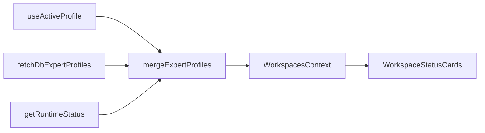

# Workspaces 增加 Default Profile 状态卡

## 现状分析

[`WorkspaceStatusCards.tsx`](src/renderer/src/screens/Workspaces/components/WorkspaceStatusCards.tsx) 是纯展示组件：从 `useWorkspaces()` 读取 `profiles`，`map` 渲染可点击卡片，无 profile 列表业务逻辑。



数据加载链：[`WorkspacesShell`](src/renderer/src/screens/Workspaces/panels/WorkspacesShell.tsx) → [`useActiveProfile`](src/renderer/src/screens/Workspaces/hooks/useActiveProfile.ts) → [`fetchDbExpertProfiles`](src/renderer/src/screens/Workspaces/api/mergeExpertProfiles.ts) + [`workspacesApi.getRuntimeStatus`](src/renderer/src/screens/Workspaces/api/workspacesApi.ts) → [`mergeExpertProfiles`](src/renderer/src/screens/Workspaces/api/mergeExpertProfiles.ts) → `setProfiles`。

你已在 [`constants.ts`](src/renderer/src/screens/Workspaces/constants.ts) 增加 default 条目（未提交 diff）：

```ts
{ id: "default-8642", routeKey: "default", displayName: "智能助手", gatewayPort: 8642 }
```

但 **Profile Runtime / PRD 约定** 中 default 的 canonical `name` 是 `"default"`（见 [`config-importer.ts`](src/main/config-importer.ts) 中 `name === "default"` → `~/.hermes/`、`aios-controller`），不是 `default-8642`。

### 三处断裂点

| 环节 | 当前行为 | 后果 |
|------|----------|------|
| [`fetchDbExpertProfiles`](src/renderer/src/screens/Workspaces/api/mergeExpertProfiles.ts) | `expertNames = Object.keys(EXPERT_PROFILE_BY_ID)` → `{"default-8642","writer-9601"}` | DB 中 `name: "default"` 被 **filter 掉** |
| [`mergeExpertProfiles`](src/renderer/src/screens/Workspaces/api/mergeExpertProfiles.ts) | `byName.get(entry.id)` 只查 `"default-8642"` | 无法合并 DB 里的 `default` |
| [`toAIOSProfile`](src/renderer/src/screens/Workspaces/api/workspacesApi.ts) | `EXPERT_PROFILE_BY_ID[summary.name]` | `summary.name === "default"` 时拿不到静态元数据（显示名/端口回退不准） |
| Runtime 控制 | 占位卡 `id: "default-8642"` | `startProfile` / `useProfileRuntime` 用错 profileId，启停失败 |

仅改 `WorkspaceStatusCards` **无法** 修复；必须在 **constants + merge/filter +（可选）legacy gateway 桥接** 层对齐。

---

## 推荐方案（Renderer 数据层，最小侵入）

### 1. 统一 default 的 canonical id

在 [`constants.ts`](src/renderer/src/screens/Workspaces/constants.ts)：

- 将 default 条目的 `id` 改为 **`"default"`**（与 `routeKey` 一致，符合 PRD / `profileHome`）
- 新增辅助索引（同文件导出）：

```ts
export const EXPERT_PROFILE_BY_ROUTE_KEY = Object.fromEntries(
  EXPERT_PROFILE_ENTRIES.map((e) => [e.routeKey, e]),
);
```

- 保留 `gatewayPort: 8642` 用于端口匹配与排序

`writer-9601` 等专家 profile 的 `id` 与 YAML preset key 一致，无需改动。

### 2. 修复合并与过滤逻辑

**[`mergeExpertProfiles.ts`](src/renderer/src/screens/Workspaces/api/mergeExpertProfiles.ts)**

- `byName` 查找改为：`byName.get(entry.id) ?? byName.get(entry.routeKey)`
- `fetchDbExpertProfiles` 过滤改为：profile 的 `name` 或 `id` 命中任一 `EXPERT_PROFILE_ENTRIES` 的 **`id` 或 `routeKey`**
- 更新文件头注释（当前仍写「6 个专家 preset」，与实际 2 条不符）
- `placeholderProfile`：`name` 使用 `entry.routeKey`（`default`），`id` 使用 `entry.id`

**[`workspacesApi.ts`](src/renderer/src/screens/Workspaces/api/workspacesApi.ts)** 中 `toAIOSProfile`：

- expert 元数据查找顺序：`BY_ID[id]` → `BY_ID[name]` → `BY_ROUTE_KEY[name]`

### 3.（建议）Legacy Gateway 状态桥接

当 default **不在** `profile-runtime.db` 的 `runtime_instances` 中，但 legacy 单 Gateway（[`hermes.ts`](src/main/hermes.ts) `:8642`）仍在运行时，卡片会长期显示 `not_deployed`。

在 [`useActiveProfile.ts`](src/renderer/src/screens/Workspaces/hooks/useActiveProfile.ts) `refetch` 末尾：

- 若合并结果中存在 `id === "default"` 且状态非 `running`
- 调用 `window.hermesAPI.gatewayStatus()`（已有 Preload API）
- 若为 true：将该条 profile 的 `status` / `healthy` / `gatewayPort` 更新为 running / true / 8642（**只读展示**，不伪造 `pid`）

这样未导入 preset 的环境也能在状态卡看到 default Gateway 健康状态；启停仍走 `profileRuntime`（需 DB 记录，见可选步骤 4）。

### 4. `WorkspaceStatusCards.tsx` 改动范围

**原则上无需改 JSX 结构**。可选小优化：

- 对 `profiles.length === 0` 显示简短 empty（当前 loading 在 Shell 层已处理）
- 确认 default 在 `EXPERT_PROFILE_ENTRIES` 中排第一（已满足）

[`ProfileSwitcher`](src/renderer/src/screens/Workspaces/components/ProfileSwitcher.tsx) 与状态卡共用 `profiles`，会一并受益。

### 5. 初始选中与路由

[`WorkspacesProvider`](src/renderer/src/screens/Workspaces/context/WorkspacesContext.tsx) 接收 `initialProfileId={profile}`（来自 Layout 路由，通常为 `"default"`）。

[`useActiveProfile`](src/renderer/src/screens/Workspaces/hooks/useActiveProfile.ts) 已有 `resolveId`（匹配 `id` 或 `name`）；id 对齐为 `"default"` 后，首次进入 Workspaces 会正确选中 default 卡。

### 6. i18n（可选）

在 [`src/shared/i18n/locales/en/workspaces.ts`](src/shared/i18n/locales/en/workspaces.ts) / [`zh-CN/workspaces.ts`](src/shared/i18n/locales/zh-CN/workspaces.ts) 为 default 显示名增加 key（如 `workspaces.profiles.default`），`constants` 或 merge 层用 `t()` 注入——非必须，当前中文 `displayName` 可继续写死在 constants。

---

## 可选增强（需 Main + preset，超出纯 UI）

若希望状态卡上的 **启停/重启** 对 default 完全走 `profileRuntime`（与 writer 一致）：

- 在 [`hermes-expert-profiles.team_v1.4.yaml`](resources/profile-presets/hermes-expert-profiles.team_v1.4.yaml) 增加 `default` profile 段（port 8642、`role: aios-controller`、`profile_home` 指向 `~/.hermes`）
- 用户通过 Settings 重新 import preset 后写入 `profile-runtime.db`

此步骤 **不阻塞** 状态卡展示；可与 Renderer 修复分阶段交付。

---

## 验证清单

1. 进入 Workspaces 顶栏：第一张卡为 **智能助手 / default**，端口 **8642**
2. 第二张卡为 **写作生文专家 / writer-9601**，端口 **9601**
3. 点击 default 卡：`activeProfileId === "default"`，右侧 Runtime 面板针对 default 刷新
4. 若本机仅有 legacy Gateway、无 DB instance：default 卡在 gateway 运行时显示 **running**（步骤 3 桥接后）
5. `npm run typecheck` 通过；`localStorage` 里旧的 `workspaces.activeProfileId = "default-8642"` 应被 `resolveId` 解析到 `default` 或回退到 `list[0]`

---

## 影响文件（按优先级）

| 文件 | 变更 |
|------|------|
| [`constants.ts`](src/renderer/src/screens/Workspaces/constants.ts) | default `id` → `"default"`，导出 `EXPERT_PROFILE_BY_ROUTE_KEY` |
| [`mergeExpertProfiles.ts`](src/renderer/src/screens/Workspaces/api/mergeExpertProfiles.ts) | routeKey 查找 + filter 修复 |
| [`workspacesApi.ts`](src/renderer/src/screens/Workspaces/api/workspacesApi.ts) | `toAIOSProfile` 元数据回退 |
| [`useActiveProfile.ts`](src/renderer/src/screens/Workspaces/hooks/useActiveProfile.ts) | legacy gateway 状态桥接（建议） |
| [`WorkspaceStatusCards.tsx`](src/renderer/src/screens/Workspaces/components/WorkspaceStatusCards.tsx) | 通常无改动 |

**不修改** Main IPC / Preload（除非做可选 YAML import）。
