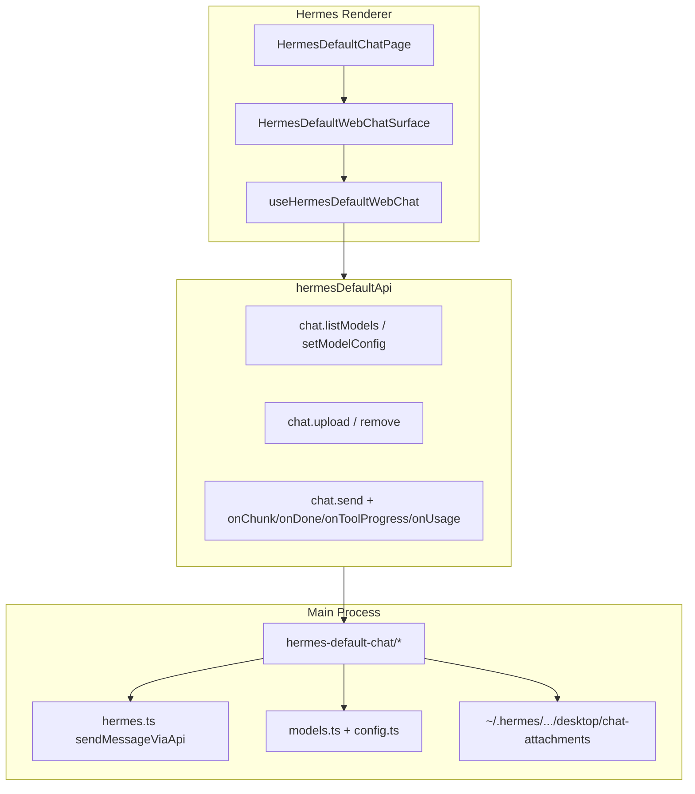

# v5.6.2 Local Hermes WebChat Surface 实施计划

**版本**：`v5.6.2_hotfix`  
**基线**：[v5.6.1](prd/v5.6.1_hermes-default-hotfix.md)（P0 config sync + 轻量 Chat）  
**参考实现**：[ChatPanel.tsx](src/renderer/src/screens/Workspaces/panels/ChatPanel.tsx) → [HermesWebChatSurface.tsx](src/renderer/src/screens/Workspaces/pages/Chat/HermesWebChatSurface.tsx)

## 目标与边界

| 要复刻 | 不要 |
|--------|------|
| `ModelSelector` + 保存默认模型 | `ProfileSelector` |
| `AttachmentTray` / `AttachmentMenu` / 拖拽上传 | `WorkspaceSelector` |
| 富 `ChatScrollArea`（流式区、tool、usage、markdown） | runtime 门控 UI（start/restart/waiting/unhealthy/presetRequired） |
| `MoreActionsMenu`（新对话/清空/跳转 Sessions） | `useWorkspaces` / `window.workspaceChat` |
| `useComposerState`（IME、canSend 含附件） | 修改 [HermesShell.tsx](src/renderer/src/screens/Hermes/panels/HermesShell.tsx) |



---

## Phase 1 — 共享契约（`src/shared/hermes-default-chat/`）

新建 [`hermes-default-chat-contract.ts`](src/shared/hermes-default-chat/hermes-default-chat-contract.ts)，**字段形状对齐** [workspace-chat-contract.ts](src/shared/workspace-chat/workspace-chat-contract.ts) 中模型/附件类型，便于复制 UI 组件时少改 props：

- `HermesChatModel`：`id`, `label`, `provider`, `base_url`, `is_current`
- `HermesChatModelListResponse`：`models[]`, `status?`
- `HermesChatModelConfig`：映射 `getModelConfig`（provider + model + baseUrl + label）
- `HermesChatAttachmentMeta`：`id`, `session_id`, `name`, `mime_type`, `size_bytes`, `workspace_relative_path`（Hermes 侧可简化为 `storage_path`）
- `HermesChatSendOptions`：`attachment_ids?`, `model_id?`（发消息时覆盖当前 config）

---

## Phase 2 — Main：独立 IPC 模块

新建 [`src/main/hermes-default-chat/`](src/main/hermes-default-chat/)，在 [index.ts](src/main/index.ts) 注册 `setupHermesDefaultChatIPC()`。

### 2.1 模型列表（对齐 Workspaces `useChatModels`）

| Channel | 实现 |
|---------|------|
| `hermes-chat:list-models` | `listModels()`（[models.ts](src/main/models.ts)）+ `getModelConfig(profile)` 标记 `is_current`；`label` 用 `SavedModel.name`，`id` 用 `SavedModel.id` |
| `hermes-chat:get-model-config` | 包装 `getModelConfig` + 当前 `models.json` 条目解析 `model_label` |
| `hermes-chat:set-model-config` | 包装 `setModelConfig(provider, model, baseUrl, profile)`（已有 sync + gateway restart 逻辑） |

不调用 copilot-serve；若 Gateway `/v1/models` 将来需要可 Phase 2.1 后追加合并，**首版以 `models.json` + `config.yaml` 为准**。

### 2.2 附件（对齐 Workspaces `useChatAttachments`）

| Channel | 实现要点 |
|---------|----------|
| `hermes-chat:upload-attachments` | Main 弹窗选文件（复用 workspace-chat 的 dialog 模式或 `dialog.showOpenDialog`）；落盘 `profileHome(profile)/desktop/chat-attachments/<sessionId>/<uuid>_<name>` |
| `hermes-chat:upload-attachment-buffers` | 拖拽/无路径时 buffer 写入同上目录 |
| `hermes-chat:remove-attachment` | 删文件 + 元数据 |

会话 id：与 Workspaces 一致，draft 用 `draft_default` 或 `session_${ts}`，持久化后沿用 `resumeSessionId`。

### 2.3 发消息扩展

扩展现有 [`send-message`](src/main/index.ts) IPC **或** 新增 `hermes-chat:send-message`（推荐后者，避免破坏旧签名）：

```ts
// 输入示意
{
  message: string;
  profile?: string;
  resumeSessionId?: string;
  history?: Array<{ role: string; content: string }>;
  attachmentIds?: string[];
  modelId?: string; // models.json id → 解析 provider/model/baseUrl 后 setModelConfig 或仅本次请求 override
}
```

Main 在 [hermes.ts](src/main/hermes.ts) `sendMessageViaApi` 构建 body 时：

1. 读取附件文件 → 按 Gateway 支持格式组装 `messages[].content`（文本 + `image_url` base64 / `file` 等；**实现前读 Gateway 多模态契约**，与 copilot-serve 附件注入方式对齐）
2. `model` 使用 `modelId` 解析结果或 `resolveApiServerModelName(profile)`
3. 保留现有 SSE：`chat-chunk` / `chat-done` / `chat-tool-progress` / `chat-error` / `chat-usage`

---

## Phase 3 — Preload + `hermesDefaultApi`

- [preload/index.ts](src/preload/index.ts) + [index.d.ts](src/preload/index.d.ts)：暴露 `hermesChat` 命名空间（或挂在 `hermesAPI` 下 `chat.*` 扩展，与现有 `onChatChunk` 一致）
- [hermesDefaultApi.ts](src/renderer/src/screens/Hermes/api/hermesDefaultApi.ts) 增加 `chat.listModels` / `getModelConfig` / `setModelConfig` / `uploadAttachments` / `uploadDroppedAttachments` / `removeAttachment` / `sendMessage({ ..., attachmentIds, modelId })`

**隔离**：Hermes 目录继续禁止 `workspaceChat` / `profileRuntime`（grep 验收）。

---

## Phase 4 — Renderer：复制到 `screens/Hermes/pages/Chat/`

策略：**复制 Workspaces Chat 文件到 Hermes**，再删减 props（用户已选 copy-into-hermes）。

### 4.1 入口

- [HermesDefaultChatPage.tsx](src/renderer/src/screens/Hermes/pages/Chat/HermesDefaultChatPage.tsx) 改为薄壳：`<HermesDefaultWebChatSurface />`（对标 `ChatPanel`）
- 新建 `HermesDefaultWebChatSurface.tsx`（从 [HermesWebChatSurface.tsx](src/renderer/src/screens/Workspaces/pages/Chat/HermesWebChatSurface.tsx) 复制后删减）

### 4.2 Hooks（`pages/Chat/hooks/`）

| Hook | 来源 | Hermes 适配 |
|------|------|-------------|
| `useHermesDefaultWebChat` | `useHermesWebChat` | 仅用 `useHermesDefault()`：`activeSessionId`, `setActiveSessionId`, `setActiveNavItem`, `sessions.refresh`；**无** `useProfileResolver` / `runtime` 门控 |
| `useHermesDefaultChatModels` | `useChatModels` | `hermesDefaultApi.chat.listModels` 等；`gatewayReady` 恒为 `true` 或 `hermesAPI.gatewayStatus()` |
| `useHermesDefaultChatAttachments` | `useChatAttachments` | `profileId` 固定 `default`；`workspaceId` 用 `default` 或省略字段 |
| `useHermesDefaultChatStream` | `useChatStream` + 现有 `useHermesDefaultChat` | 合并：streamingContent、activeTool、lastUsage、history 加载（`hermesDefaultApi.sessions.messages`）、`send(text, attachmentIds)` |
| `useHermesDefaultComposerState` | `useComposerState` | 原样复制 |

### 4.3 UI 组件（复制并瘦身 ComposerBar）

从 Workspaces 复制到 Hermes `pages/Chat/`：

- `ChatScrollArea.tsx`（替换当前简易版）
- `ComposerBar.tsx`（**删除** ProfileSelector、WorkspaceSelector、全部 `show*` runtime 区块；保留 ModelSelector、AttachmentTray、AttachmentMenu、MoreActionsMenu、拖拽、send/stop）
- `ModelSelector.tsx`, `AttachmentTray.tsx`, `AttachmentMenu.tsx`, `MoreActionsMenu.tsx`
- 按需：`ChatBubble`, `ActivityRow`, `ErrorCard`, `UsageRow`, `hooks/useAutoScroll.ts`

类型：Hermes 本地 [`types.ts`](src/renderer/src/screens/Hermes/types.ts) 扩展 `ChatRunState` / `HermesMessage` 对齐 Workspaces `AIOSMessage` 字段，或 import 共享类型别名。

### 4.4 Context 调整

- [HermesDefaultContext.tsx](src/renderer/src/screens/Hermes/context/HermesDefaultContext.tsx)：Chat 页改由 `useHermesDefaultWebChat` 自包含；可**移除**顶层 `useHermesDefaultChat` 若不再被其他页使用，或保留给 Sessions 切换时同步 `activeSessionId`（Surface 内 `onSessionDone` 仍更新 context）。

### 4.5 样式

- 将 Workspaces `workspaces-webchat-*` 相关规则**复制为** `hermes-webchat-*` 写入 [Hermes.css](src/renderer/src/screens/Hermes/Hermes.css)，Surface 根节点用 `hermes-webchat-root`（避免污染 Workspaces）

### 4.6 i18n

在 [workspaces.ts](src/shared/i18n/locales/en/workspaces.ts) / zh-CN 的 `hermes` 下补充：`chat.placeholder`, `chat.send`, `chat.stop`, `chat.attach`, `models.saveDefault` 等（ComposerBar 复制后替换 key 前缀）。

---

## Phase 5 — 文档与验收

- 新建 `prd/v5.6.2_hermes-webchat-surface.md`（手测：模型切换并保存、附件上传/拖拽/删除、发带附件消息、流式/tool/usage、新对话清空附件、Sessions 跳转、无 workspaceChat 请求）
- 增量更新 [AGENTS.md](AGENTS.md)、[docs/API_CONTRACTS.md](docs/API_CONTRACTS.md)（`hermes-chat:*` 表）

### 自动化

```bash
npm run typecheck
npm test -- tests/sync-gateway-model-section.test.ts  # 回归 v5.6.1
# 可选新增 tests/main/hermes-default-chat-attachments.test.ts（纯函数：路径 sandbox）
```

### 手测清单（精简）

| # | 场景 | 通过标准 |
|---|------|----------|
| 1 | 模型选择器 | 列表来自 models.json；选模型 + 保存默认后 config.yaml / 右侧 Runtime 显示更新 |
| 2 | 附件 | 按钮上传 + 拖拽；托盘显示；可删除 |
| 3 | 发送 | 纯文本 / 仅附件 / 文本+附件；流式输出；tool progress |
| 4 | 新对话 | 清空消息、附件、draft session |
| 5 | 隔离 | DevTools 无 copilot-serve；Hermes 源码无 workspaceChat |
| 6 | 回归 v5.6.1 | 扁平 config 仍自动补 `model:` 段，无 400 |

---

## 风险

1. **Gateway 多模态格式**：若本地 Gateway 暂不支持 image/file parts，附件 IPC 可先落盘 + UI 对齐，发消息时在 Main 将附件转为文本 preview 注入（降级路径需在 PRD 注明）。
2. **模型 id 语义**：Workspaces 用 Gateway 模型 id；Hermes 用 `models.json` uuid — UI 的 `saveAsDefault` 应调用 `setModelConfig` 而非仅本地 pending。
3. **重复 IPC**：确认 [preload](src/preload/index.ts) 不重复注册 `getCredentialPool` 等（v5.6.1 已踩坑）。

---

## 明确不改

- [HermesShell.tsx](src/renderer/src/screens/Hermes/panels/HermesShell.tsx)
- [HermesRightPanelRail.tsx](src/renderer/src/screens/Hermes/panels/HermesRightPanelRail.tsx)
- Workspaces 下现有 `HermesWebChatSurface`（仅作复制源，不 refactor 共享）
