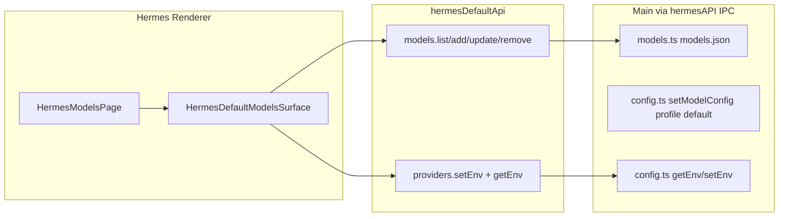

# v5.6.3 Local Hermes Models 页复刻计划

**版本**：`v5.6.3`  
**参考实现**：[Workspaces Models.tsx](src/renderer/src/screens/Workspaces/pages/Models/Models.tsx) + [detect-provider.ts](src/renderer/src/screens/Workspaces/pages/Models/detect-provider.ts)  
**替换目标**：[HermesModelsPage.tsx](src/renderer/src/screens/Hermes/pages/Models/HermesModelsPage.tsx)（当前为内联列表 + Set active，将删除）  
**策略**：与 v5.6.2 Chat 相同 — **copy-into-hermes**，不修改 Workspaces 源文件、不修改 [HermesShell.tsx](src/renderer/src/screens/Hermes/panels/HermesShell.tsx)。

## 目标与边界

| 要复刻 | 不要 |
|--------|------|
| 卡片网格 + BrandLogo + 搜索 | 旧版 `hermes-list` / 内联编辑 / **Set active**（已确认移除） |
| Add/Edit 弹窗（Provider 下拉、URL 自动识别、Model datalist 发现） | `window.workspaceChat` / `profileRuntime` / copilot-serve |
| 删除二次确认 | 新增 IPC（现有 `hermesAPI.listModels/addModel/...` 已够用） |
| `useDiscoveredModels` + `detectProviderFromUrl` | 从 Workspaces **import** 组件（须复制到 Hermes 目录） |



## 数据层映射（无新 IPC）

[`hermesDefaultApi.ts`](src/renderer/src/screens/Hermes/api/hermesDefaultApi.ts) 已封装 default profile：

| Workspaces 直接调用 | Hermes 替换为 |
|---------------------|---------------|
| `window.hermesAPI.listModels()` | `hermesDefaultApi.models.list()` |
| `addModel(...)` | `hermesDefaultApi.models.add(...)` |
| `updateModel(id, fields)` | `hermesDefaultApi.models.update(id, fields)` |
| `removeModel(id)` | `hermesDefaultApi.models.remove(id)` |
| `setEnv(key, value)`（custom API key） | `hermesDefaultApi.providers.setEnv(key, value)` |
| `useDiscoveredModels` 内 `getEnv(profile)` | `getEnv(HERMES_DEFAULT_PROFILE)` — 传 [`HERMES_DEFAULT_PROFILE`](src/renderer/src/screens/Hermes/constants.ts) |

**不调用** `models.setActive` / `setModelConfig`（活跃模型由 Chat [`ModelSelector`](src/renderer/src/screens/Hermes/pages/Chat/ModelSelector.tsx) + `hermesDefaultChat.setModelConfig` 管理，与 Workspaces 一致）。

Main 侧类型已对齐：`SavedModel` 含 `createdAt`（[`src/main/models.ts`](src/main/models.ts)），可直接复用 Workspaces 的 `SavedModel` 接口。

## 文件变更

### 1. 复制 UI 到 Hermes（核心）

| 文件 | 动作 |
|------|------|
| `src/renderer/src/screens/Hermes/pages/Models/HermesDefaultModelsSurface.tsx` | **新建**：从 Workspaces `Models.tsx` 复制，替换数据调用为 `hermesDefaultApi` |
| `src/renderer/src/screens/Hermes/pages/Models/detect-provider.ts` | **新建**：原样复制 Workspaces 同文件 |
| `src/renderer/src/screens/Hermes/pages/Models/HermesModelsPage.tsx` | **改写**：薄壳，渲染 Surface + 传入 `visible` |

**Shell 差异**（唯一结构性改动）：

```tsx
// Workspaces
<WorkspacesPageShell><div className="settings-container">...</div></WorkspacesPageShell>

// Hermes（HermesShell 已提供 center scroll）
<div className="hermes-page">
  <div className="settings-container">...</div>
</div>
```

**可见时刷新**（对齐 Workspaces `visible` effect）：

```tsx
// HermesModelsPage.tsx
const { activeNavItem } = useHermesDefault();
return <HermesDefaultModelsSurface visible={activeNavItem === "models"} />;
```

### 2. 共享资源（复用，不复制）

- **样式**：沿用全局 [`main.css`](src/renderer/src/assets/main.css) 中 `.models-*` / `.settings-container`（约 L4318+），**无需**整段复制到 `Hermes.css`，除非 center 区域 padding 不足再补 1 条 scoped 规则。
- **i18n**：沿用顶层 [`models.*`](src/shared/i18n/locales/en/models.ts) + `useI18n()`（与 Workspaces 相同），**不再**使用 `workspaces.hermes.models.*` 于本页。
- **组件**：`BrandLogo`、`PROVIDERS`、`useDiscoveredModels` 继续从 renderer 共享路径 import（与 Workspaces 相同相对深度）。

### 3. Context 与 Hook

- [`useHermesDefaultModels`](src/renderer/src/screens/Hermes/hooks/useHermesDefaultModels.ts)：**保留**（[`HermesDefaultContext`](src/renderer/src/screens/Hermes/context/HermesDefaultContext.tsx) 仍挂载；Models 页改为页面内 `loadModels` 自管状态，避免与 Context 双轨 UI）。
- Models 页**不再** `useHermesDefault().models`（避免重复逻辑）。

### 4. 文档（收尾）

- 新建 `prd/v5.6.3_hermes-models-page.md`（范围、验收、与 Workspaces 差异说明）。
- 按 [sync-project-docs skill](.agents/skills/sync-project-docs/SKILL.md) 增量更新 `AGENTS.md`、`docs/API_CONTRACTS.md`（注明 Models 页 UI 对齐 Workspaces、IPC 仍为既有 `hermesAPI` models 通道）。

## 实施步骤

1. **复制 `detect-provider.ts`** 到 `Hermes/pages/Models/`。
2. **创建 `HermesDefaultModelsSurface.tsx`**：
   - 复制 Workspaces JSX/状态机（loading、search、grid、modal、delete confirm、`resolveCustomEnvKey`）。
   - 将所有 `window.hermesAPI.*` 改为 `hermesDefaultApi.models.*` / `hermesDefaultApi.providers.setEnv`。
   - `useDiscoveredModels({ ..., profile: HERMES_DEFAULT_PROFILE })`。
   - 移除 `WorkspacesPageShell`；外层用 `hermes-page` + `settings-container`。
3. **改写 `HermesModelsPage.tsx`** 为默认 export 薄壳 + `visible` prop。
4. **删除**旧内联列表、`setActive`、`workspaces.hermes.models` 文案引用。
5. **验证**：`npm run typecheck`；手测增删改、搜索、custom provider API key、模型发现 datalist、切换 nav 再回 Models 列表刷新。

## 验收清单

- [ ] UI 与 Workspaces Models 一致：标题区、搜索、空态、卡片、弹窗、删除确认。
- [ ] 无 **Set active** 按钮；无 `workspaceChat` / copilot-serve 请求。
- [ ] 所有写操作经 `hermesDefaultApi` → `window.hermesAPI`（`models.json` + profile-scoped `.env`）。
- [ ] `activeNavItem === "models"` 时重新 `listModels`（与 Workspaces `visible` 行为一致）。
- [ ] 未修改 `HermesShell.tsx` / Workspaces `Models.tsx`。
- [ ] `npm run typecheck` 通过。

## 风险与注意

- **模型发现**：`useDiscoveredModels` 在 Renderer 内 `fetch(baseUrl/models)`，需 Gateway/网络可达；与 Workspaces 行为一致，非 regression。
- **Context 冗余加载**：`useHermesDefaultModels` 仍在 Provider 中 mount 会多一次 list；本期可接受，后续可单独收敛 Context（非 v5.6.3 范围）。
