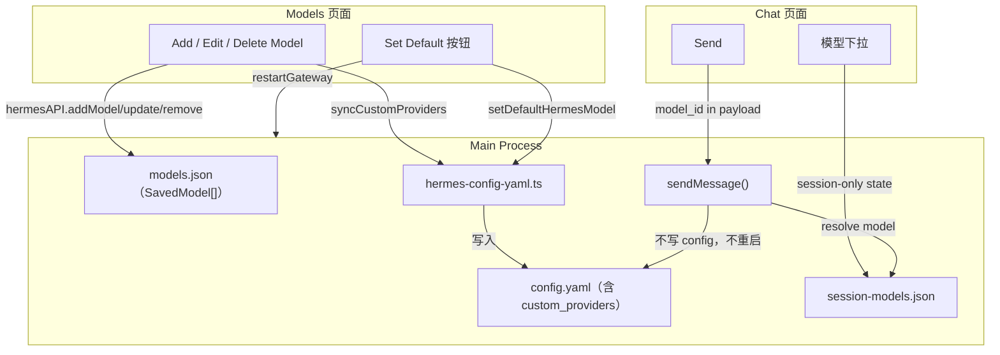

# V5.6.4 Hermes Chat Hotfix 实施计划

## 现状分析

当前代码问题：
- `config.ts` 的 `setModelConfig()` 只用正则替换 root 级 `provider/default/base_url`，不维护 `model:` 段与 `custom_providers`
- `hermes.ts` 的 `sendMessage()` 调用 `syncGatewayToSavedModel()` → `setModelConfig()` + `restartGateway()`，每次 Chat 切换模型都写 config.yaml 并重启 Gateway
- Chat 页面有 `saveAsDefault` 按钮和 `onSaveDefaultModel` prop（应移除）
- `SavedModel` 缺少 `apiKeyEnv` / `apiKeyLiteral` 字段
- session 模型绑定仅靠 Renderer `localStorage`，无 Main 侧持久化

## 架构数据流（目标态）

## 实施阶段

### 阶段 1：扩展 SavedModel 数据结构

**文件**：[`src/main/models.ts`](src/main/models.ts)

- `SavedModel` 增加 `apiKeyEnv?: string`、`apiKeyLiteral?: string`、`updatedAt?: number`
- `addModel()` 签名扩展，接收新字段
- `updateModel()` 的 `fields` 类型扩展包含新字段
- `seedDefaults()` 保持兼容（新字段可选）

### 阶段 2：新增 hermes-config-yaml 模块

**新建**：`src/main/hermes-config/hermes-config-yaml.ts`

导出：
- `readHermesConfig(profile?)` — 用 `js-yaml` 或手动解析读 config.yaml 为 `HermesConfigDocument`
- `writeHermesConfig(profile, doc)` — 序列化写回
- `buildCustomProviderEntry(model: SavedModel)` — 按 PRD 规则生成 `HermesCustomProvider`
- `syncCustomProvidersFromModels(profile?)` — 读 `models.json`，重建 `custom_providers` 段写入 config.yaml
- `setDefaultHermesModel(profile, modelId)` — 写 `root.provider`/`root.default` + `model.provider`/`model.default`/`model.base_url` + `custom_providers`

**关键决策**：config.yaml 解析使用 `js-yaml`（项目已有此依赖或用内置 YAML 处理）。需检查 `package.json` 是否已有 `js-yaml`，若无则使用正则/手动拼接保持与现有 `config.ts` 风格一致。

### 阶段 3：Models 页面 → 同步 custom_providers

**文件**：
- [`src/main/models.ts`](src/main/models.ts) — `addModel`/`updateModel`/`removeModel` 后调用 `syncCustomProvidersFromModels()`
- [`src/main/hermes-default-chat/hermes-default-chat-models.ts`](src/main/hermes-default-chat/hermes-default-chat-models.ts) — `setHermesChatModelConfig()` 改为调用 `setDefaultHermesModel()`
- [`src/main/hermes-default-chat/hermes-default-chat-ipc.ts`](src/main/hermes-default-chat/hermes-default-chat-ipc.ts) — `hermes-chat:set-model-config` handler 调用新 API

**Models 页面 UI**：
- [`HermesDefaultModelsSurface.tsx`](src/renderer/src/screens/Hermes/pages/Models/HermesDefaultModelsSurface.tsx)
  - 弹窗增加 `API Key Env` 和 `API Key Literal` 字段
  - 按 baseUrl 自动填充规则（deepseek → `DEEPSEEK_API_KEY`，ollama → literal `"ollama"` 等）
  - 卡片增加 `Set Default` 按钮
  - 保存模型后触发 `syncCustomProviders`

### 阶段 4：Session Model Store（Main 侧）

**新建**：`src/main/hermes-default-chat/hermes-session-model-store.ts`

- 存储文件：`~/.hermes/desktop/session-models.json`
- 导出：`getSessionModel(sessionId)`, `setSessionModel(sessionId, model)`, `removeSessionModel(sessionId)`
- 类型：`HermesSessionModelBinding`

**新增 IPC**：
- `hermes-chat:get-session-model` → 在 [`hermes-default-chat-ipc.ts`](src/main/hermes-default-chat/hermes-default-chat-ipc.ts) 注册
- `hermes-chat:set-session-model` → 同上

**Preload**：[`hermes-default-chat-api.ts`](src/preload/hermes-default-chat-api.ts) 增加 `getSessionModel()`、`setSessionModel()`

**index.d.ts**：[`src/preload/index.d.ts`](src/preload/index.d.ts) 增加类型声明

**Contract**：[`hermes-default-chat-contract.ts`](src/shared/hermes-default-chat/hermes-default-chat-contract.ts) 增加 `HermesSessionModelBinding` 类型、修改 `HermesChatModel` 增加 `model`/`api_key_env`/`api_key_literal` 字段、`SetHermesChatModelConfigPayload` 改为仅 `{ model_id: string }`

### 阶段 5：Chat 页面改造

**移除 Save as Default**：
- [`ComposerBar.tsx`](src/renderer/src/screens/Hermes/pages/Chat/ComposerBar.tsx) — 删除 `onSaveDefaultModel` prop
- [`ModelSelector.tsx`](src/renderer/src/screens/Hermes/pages/Chat/ModelSelector.tsx) — 删除 `onSaveDefault` prop（目前未在 UI 中渲染，仅作为 prop 传递）
- [`HermesDefaultWebChatSurface.tsx`](src/renderer/src/screens/Hermes/pages/Chat/HermesDefaultWebChatSurface.tsx) — 删除 `onSaveDefaultModel` 传入
- [`useHermesDefaultChatModels.ts`](src/renderer/src/screens/Hermes/pages/Chat/hooks/useHermesDefaultChatModels.ts) — 删除 `saveAsDefault` 方法和返回值

**Session 模型绑定重构**：
- `useHermesDefaultChatModels.ts` — `selectModel()` 调用 `hermesDefaultApi.sessionModels.set(sessionId, modelId)` 同步到 Main
- 切换 session 时从 Main 读取绑定 → 恢复 `pendingModel`
- 移除 localStorage 方案（`STORAGE_KEYS.chatPendingModelId` 可保留作辅助，但主数据从 Main 取）

**hermesDefaultApi.ts**：增加 `sessionModels` 子对象

### 阶段 6：sendMessage 链路净化

**文件**：[`src/main/hermes.ts`](src/main/hermes.ts)

- `sendMessage()` 中**移除** `syncGatewayToSavedModel()` 调用（当前在第 701-705 行）
- `sendMessageViaApi()` 继续使用 `buildGatewayChatCompletionsBody()` 构建请求体，`model`/`provider`/`base_url` 作为 request-level override 传给 Gateway
- `routingMeta` 中 `syncedConfig` 和 `restartedGateway` 恒为 `false`

**日志**：按 PRD 要求输出 `config_write=false` / `gateway_restart=false`

### 阶段 7：HermesChatModel 字段完善

**文件**：[`hermes-default-chat-contract.ts`](src/shared/hermes-default-chat/hermes-default-chat-contract.ts)

`HermesChatModel` 增加：
- `model: string`（LLM 标识）
- `api_key_env?: string | null`
- `api_key_literal?: string | null`

**文件**：[`hermes-default-chat-models.ts`](src/main/hermes-default-chat/hermes-default-chat-models.ts)

`listHermesChatModels()` 返回时填充新字段。

### 阶段 8 (scope 判定后决定)：Python Runner

PRD 第 10-11 节要求新增 `hermes-local-runner.ts` + `desktop_chat_runner.py`，将 Chat 运行路径从 HTTP Gateway 改为直接 spawn Python AIAgent。

**风险评估**：这是**架构级**变更——需要验证 hermes-agent 的 `AIAgent` 类是否支持 `model=` 参数做 per-request 路由。若 Gateway 的 `/v1/chat/completions` 已支持 `provider`/`base_url`/`model` 字段做 request-level override，则不需要 Python Runner。

**建议**：先完成阶段 1-7（config.yaml 修复 + Chat Save as Default 移除 + session 模型绑定 + sendMessage 净化），验证 Gateway 是否已支持 request-level model override。若支持则 Python Runner 可延后；若不支持再实施阶段 8。

### 阶段 9：验证与文档

- `npm run typecheck` 通过
- 按 PRD 第 15 节验收用例手工验证
- 按 `007-sync-project-docs` 规则同步 `AGENTS.md`、`docs/API_CONTRACTS.md`

## 文件变更清单

| 文件 | 变更类型 | 说明 |
|------|----------|------|
| `src/main/models.ts` | 修改 | SavedModel 扩展、add/update 签名扩展 |
| `src/main/hermes-config/hermes-config-yaml.ts` | **新建** | config.yaml 全文档读写、custom_providers 同步 |
| `src/main/hermes-default-chat/hermes-session-model-store.ts` | **新建** | session 模型绑定持久化 |
| `src/main/hermes-default-chat/hermes-default-chat-models.ts` | 修改 | listModels 增加字段、setModelConfig 走新模块 |
| `src/main/hermes-default-chat/hermes-default-chat-ipc.ts` | 修改 | 新增 session model IPC、set-model-config 用新 API |
| `src/main/hermes.ts` | 修改 | sendMessage 移除 syncGatewayToSavedModel |
| `src/main/hermes-default-chat/hermes-default-chat-request.ts` | 修改 | body 构建填充 api_key 相关字段 |
| `src/shared/hermes-default-chat/hermes-default-chat-contract.ts` | 修改 | 类型扩展 |
| `src/preload/hermes-default-chat-api.ts` | 修改 | 新增 session model 方法 |
| `src/preload/index.d.ts` | 修改 | 类型声明 |
| `src/renderer/src/screens/Hermes/api/hermesDefaultApi.ts` | 修改 | 增加 sessionModels 子对象 |
| `src/renderer/src/screens/Hermes/pages/Chat/ComposerBar.tsx` | 修改 | 移除 onSaveDefaultModel |
| `src/renderer/src/screens/Hermes/pages/Chat/ModelSelector.tsx` | 修改 | 移除 onSaveDefault |
| `src/renderer/src/screens/Hermes/pages/Chat/HermesDefaultWebChatSurface.tsx` | 修改 | 移除 saveAsDefault 传参 |
| `src/renderer/src/screens/Hermes/pages/Chat/hooks/useHermesDefaultChatModels.ts` | 修改 | 移除 saveAsDefault、session 绑定重构 |
| `src/renderer/src/screens/Hermes/pages/Models/HermesDefaultModelsSurface.tsx` | 修改 | 表单增加字段、卡片增加 Set Default |
| `docs/API_CONTRACTS.md` | 修改 | 新增 IPC 文档 |
| `AGENTS.md` | 修改 | 版本索引更新 |
