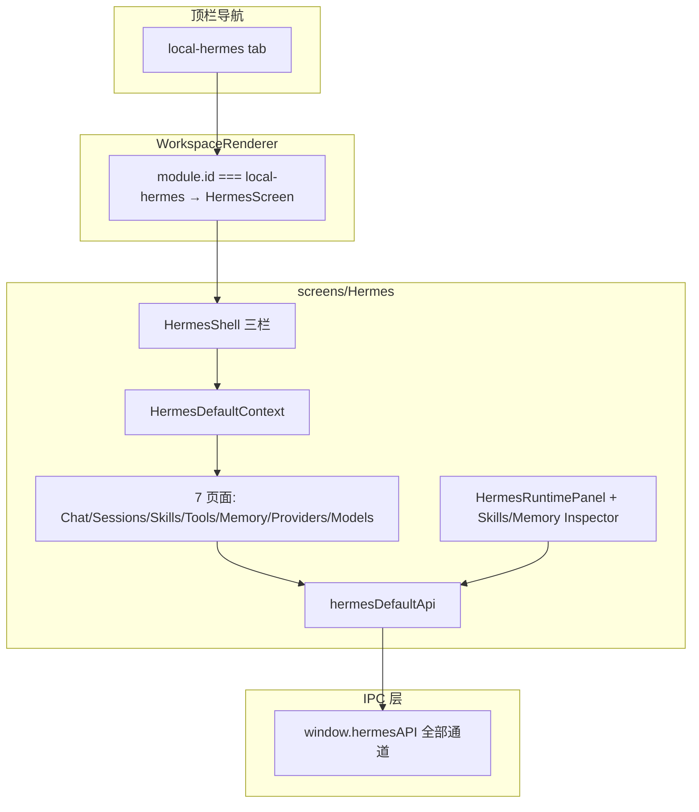

# v5.6 Local Hermes Default 操作模块

PRD 原文：[prd/v5.6_hermes-default.md](prd/v5.6_hermes-default.md)（1104 行，定义了 7 个 Step 与 35+ 文件）

## 现状

- 当前 `StaticWorkspaceId` 为 `portal | workspaces | task-workbench | web-operator | office`
- `WorkspaceRenderer` 按 `module.kind` 分发到各 Screen
- `Workspaces` 模块数据层依赖 `copilot-serve` + `profileRuntime` + `workspaceChat`
- `hermesAPI` preload 已暴露 Gateway/Chat/Sessions/Skills/Memory/Tools/Models/Providers 等全部 IPC

## 核心架构



**关键约束**：`screens/Hermes/**` 中禁止出现 `copilot-serve` / `workspaceChat` / `profileRuntime` / `window.workspaces`。

## Step 1 — 注册顶层页签

修改 6 个现有文件，新增 `"local-hermes"` 到类型系统与导航：

- [workspace-contract.ts](src/shared/workspace/workspace-contract.ts)
  - `StaticWorkspaceId` 新增 `| "local-hermes"`
  - `WorkspaceSource` 新增 `| "hermes"`
- [desktop-shell.ts](src/renderer/src/types/desktop-shell.ts)
  - `View` 新增 `| "local-hermes"`
  - `VIEW_TITLE_KEYS` 新增 `"local-hermes": "navigation.localHermes"`
- [workspace-registry.ts](src/renderer/src/workspace/workspace-registry.ts)
  - `STATIC_WORKSPACE_MODULES` 在 `workspaces` 后增加 `{ id: "local-hermes", kind: "react", source: "hermes", ... }`
- [workspace-secondary-nav.ts](src/shared/workspace/workspace-secondary-nav.ts)
  - `SECONDARY_NAV_BY_WORKSPACE` 新增 `"local-hermes": []`
- [Layout.tsx](src/renderer/src/screens/Layout/Layout.tsx) L41 `known` 数组加入 `"local-hermes"`
- i18n：en/zh-CN `navigation.ts` 各加 `localHermes: "Local Hermes"`

## Step 2 — 挂载 Renderer + 入口组件

- [WorkspaceRenderer.tsx](src/renderer/src/components/workspace/WorkspaceRenderer.tsx)
  - `case "react"` 内在 `office` / `task-workbench` 分支后、Workspaces fallback 前加：

```tsx
if (module.id === "local-hermes") {
  return (
    <ReactWorkspace active={workspaceId === "local-hermes"}>
      <WorkspaceShell>
        <HermesScreen
          activePanel={secondaryPanel}
          onPanelChange={onSecondaryPanelChange}
          onOpenRuntimeSettings={() => onOpenSettingsDrawer?.("runtime")}
        />
      </WorkspaceShell>
    </ReactWorkspace>
  );
}
```

- 新建 `src/renderer/src/screens/Hermes/index.tsx`（导出 `HermesScreen`）

## Step 3 — 数据层 `hermesDefaultApi.ts`

新建 `src/renderer/src/screens/Hermes/api/hermesDefaultApi.ts`

- 结构体对应 PRD 6.3，8 个命名空间（profile / runtime / chat / sessions / skills / memory / tools / models / providers）
- 所有 profile-aware 调用固定传 `HERMES_DEFAULT_PROFILE`（即 `"default"`）
- chat 命名空间封装 `sendMessage` + 4 个 event listener（返回 unsubscribe）
- 不引入任何 `copilot-serve` / `workspaceChat` / `profileRuntime`

## Step 4 — Context + Hooks

新建 `src/renderer/src/screens/Hermes/context/HermesDefaultContext.tsx`

- 状态字段对齐 PRD 8（activeSessionId / activeRightTab / leftPanelCollapsed / rightPanelCollapsed / activeNavItem / runtime / sessions）
- 使用独立 `hermesDefault.*` localStorage key
- `runtime` 由 `useHermesDefaultRuntime` 提供（`gatewayStatus/start/stop/restart`）
- `sessions` 由 `useHermesDefaultSessions` 提供（`listCachedSessions/syncSessionCache/searchSessions/updateSessionTitle`）

新建 hooks（各自单职责）：

| Hook | 用途 |
|------|------|
| `useHermesDefaultRuntime` | Gateway 状态轮询与操控 |
| `useHermesDefaultSessions` | sessions 列表、搜索、刷新 |
| `useHermesDefaultChat` | 消息发送/streaming/abort |
| `useHermesDefaultModels` | models CRUD + active |
| `useHermesDefaultMemory` | soul/memory/user 读写 |
| `useHermesDefaultSkills` | installed/bundled/install/uninstall |
| `useHermesDefaultTools` | toolsets 开关 |
| `useHermesDefaultProfile` | default profile 元信息 |

## Step 5 — 三栏 Shell + UI 组件

新建布局与公共组件（复用 `workspaces-*` CSS class，差异用 `hermes-*`）：

- `panels/HermesShell.tsx` — 顶部 StatusCards + 三栏 body（对齐 `WorkspacesShellInner` 结构）
- `components/HermesSidebar.tsx` — 左栏 nav（复用 `WorkspacesSidebar` 结构，数据源为 `HERMES_NAV_ITEMS`）
- `components/HermesStatusCards.tsx` — 顶部卡片：展示 default profile 状态/端口/模型
- `components/HermesStatusBadge.tsx` — Gateway 状态徽章
- `components/HermesPageErrorBoundary.tsx` — 页面错误边界
- `components/HermesPageSkeleton.tsx` — 加载占位
- `panels/HermesRightPanel.tsx` — 右栏 Inspector（tabs: runtime/skills/memory/workspace）
- `panels/HermesRightPanelRail.tsx` — 折叠态 48px 窄轨
- `panels/HermesRuntimePanel.tsx` — Gateway 状态/启停/日志/模型信息

## Step 6 — 7 个业务页面

新建 `registry/hermes-pages.tsx`（与 `WORKSPACE_PAGE_REGISTRY` 模式一致）

各页面文件与行为：

| 页面 | 文件路径 | 核心 IPC |
|------|----------|----------|
| Chat | `pages/Chat/HermesDefaultChatPage.tsx` + `ChatScrollArea` + `ComposerBar` + `StatusToast` | `sendMessage/onChatChunk/onChatDone/abortChat` |
| Sessions | `pages/Sessions/HermesSessionsPage.tsx` | `listCachedSessions/syncSessionCache/searchSessions/getSessionMessages` |
| Skills | `pages/Skills/HermesSkillsPage.tsx` | `listInstalledSkills/listBundledSkills/installSkill/uninstallSkill` |
| Tools | `pages/Tools/HermesToolsPage.tsx` | `getToolsets/setToolsetEnabled` |
| Memory | `pages/Memory/HermesMemoryPage.tsx` (4 tabs: SOUL/MEMORY/USER/Stats) | `readMemory/readSoul/writeSoul/addMemoryEntry/...` |
| Providers | `pages/Providers/HermesProvidersPage.tsx` | `getEnv/setEnv/getConfig/setConfig/getCredentialPool` |
| Models | `pages/Models/HermesModelsPage.tsx` | `listModels/addModel/updateModel/removeModel/getModelConfig/setModelConfig` |

**Chat 页面特殊行为**：
- 发送前检查 Gateway 状态；未运行时 Composer 显示 "Start Gateway"
- `onChatDone(sessionId)` 后写 `activeSessionId` + 刷新 sessions
- 附件上传入口隐藏

## Step 7 — CSS + 质量验证

- 新建 `Hermes.css`：仅 `hermes-screen` / `hermes-shell` / `hermes-status-card` / `hermes-runtime-panel` 差异样式，禁改 `Workspaces.css`
- `constants.ts` / `types.ts` 定义 PRD 5-6 的全部常量与类型

**验收**：
- `npm run typecheck` 通过
- `grep -R "copilot-serve|workspaceChat|profileRuntime|window.workspaces" src/renderer/src/screens/Hermes` 输出为空
- 其他 workspace（portal/workspaces/web-operator）不受影响

## 新增文件总览（~35 文件）

```
src/renderer/src/screens/Hermes/
  index.tsx, Hermes.css, constants.ts, types.ts
  api/hermesDefaultApi.ts
  context/HermesDefaultContext.tsx
  hooks/useHermesDefault{Profile,Runtime,Sessions,Chat,Models,Memory,Skills,Tools}.ts
  panels/HermesShell.tsx, HermesRuntimePanel.tsx, HermesRightPanel.tsx, HermesRightPanelRail.tsx
  components/HermesSidebar.tsx, HermesStatusCards.tsx, HermesStatusBadge.tsx,
            HermesPageErrorBoundary.tsx, HermesPageSkeleton.tsx
  registry/hermes-pages.tsx
  pages/Chat/{HermesDefaultChatPage,ChatScrollArea,ComposerBar,StatusToast}.tsx
  pages/Sessions/HermesSessionsPage.tsx
  pages/Skills/HermesSkillsPage.tsx
  pages/Tools/HermesToolsPage.tsx
  pages/Memory/HermesMemoryPage.tsx
  pages/Providers/HermesProvidersPage.tsx
  pages/Models/HermesModelsPage.tsx
```

## 修改文件总览（~8 文件）

```
src/shared/workspace/workspace-contract.ts
src/shared/workspace/workspace-secondary-nav.ts
src/shared/i18n/locales/en/navigation.ts
src/shared/i18n/locales/zh-CN/navigation.ts
src/renderer/src/types/desktop-shell.ts
src/renderer/src/workspace/workspace-registry.ts
src/renderer/src/screens/Layout/Layout.tsx
src/renderer/src/components/workspace/WorkspaceRenderer.tsx
```
