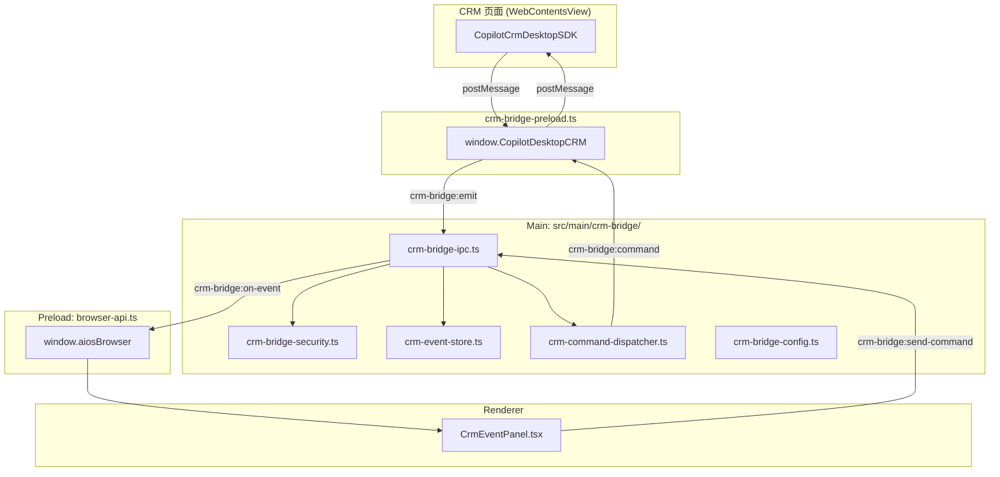

# V5.7.10 CRM-Lite Bridge Demo 实施计划

## 现状分析

现有 CRM Bridge 基础设施已完整覆盖三层进程：

**已存在的模块（无需新建）：**
- [src/preload/crm-bridge-preload.ts](src/preload/crm-bridge-preload.ts) -- CRM 专用 preload，已注入 web-operator view
- [src/main/crm-bridge/](src/main/crm-bridge/) -- 11 个文件，完整 IPC/安全/事件/命令分发
- [src/preload/browser-api.ts](src/preload/browser-api.ts) -- 已暴露 `sendCrmCommand`、`onCrmEvent`、`listCrmEvents`
- [src/main/shell/views/view-registry.ts](src/main/shell/views/view-registry.ts) -- web-operator 已配置加载 `crm-bridge-preload.js`
- [src/renderer/src/screens/WebOperator/CrmEventPanel.tsx](src/renderer/src/screens/WebOperator/CrmEventPanel.tsx) -- 已有调试面板

## 差距分析（PRD vs 现有代码）

| 维度 | 现有 | PRD 要求 | 改动 |
|------|------|----------|------|
| 事件类型 | `crm.context.submit` 等 6 种 | 新增 `crm.product.context.submit` | 扩展联合类型 + 白名单 |
| 命令类型 | `desktop.crm.showToast` 等 9 种 | 新增 `desktop.crm.product.fillForm`、`desktop.crm.product.create` | 扩展联合类型 |
| page.app | `"crm"` | 兼容 `"crm-lite"` | 改 contract + schema 校验 |
| entityType | 6 种（customer/contact/...） | 新增 `"product"` | 扩展联合类型 |
| 允许域名 | `localhost:9527` | 新增 `localhost:5178` | 改 config.json + DEFAULT_CONFIG |
| payload 类型 | `Record<string, unknown>` 通用 | 新增 `ProductPayload` / `SupplierSupplyPayload` | 新增接口（不破坏通用性） |
| CrmEventPanel | 通用 CRM 调试 | 商品上下文展示 + 商品测试按钮 | 改 UI + 增加商品区域 |

## 改动范围

### 1. 共享契约扩展

**文件：** [src/shared/crm-bridge/crm-bridge-contract.ts](src/shared/crm-bridge/crm-bridge-contract.ts)

- `CrmBridgeEventType` 联合类型新增 `"crm.product.context.submit"`
- `CrmDesktopCommandType` 联合类型新增 `"desktop.crm.product.fillForm"` | `"desktop.crm.product.create"`
- `CrmPageContext.app` 从 `"crm"` 改为 `"crm" | "crm-lite"`
- `CrmPageContext.entityType` 新增 `"product"`
- 新增 `SupplierSupplyPayload` 和 `ProductPayload` 接口（用于 UI 类型提示，payload 本身仍为 `Record<string, unknown>`）

### 2. Schema 校验适配

**文件：** [src/shared/crm-bridge/crm-bridge-schema.ts](src/shared/crm-bridge/crm-bridge-schema.ts)

- `ALLOWED_EVENT_TYPES` 集合新增 `"crm.product.context.submit"`
- `validateCrmBridgeEventSchema` 中 `page.app` 校验从 `=== "crm"` 改为 `=== "crm" || === "crm-lite"`

### 3. 配置文件白名单

**文件：** [resources/crm-bridge/crm-bridge.config.json](resources/crm-bridge/crm-bridge.config.json)

- `allowedOrigins` 新增 `"http://localhost:5178"` 和 `"http://127.0.0.1:5178"`
- `allowedEventTypes` 新增 `"crm.product.context.submit"`

**文件：** [src/main/crm-bridge/crm-bridge-config.ts](src/main/crm-bridge/crm-bridge-config.ts)

- `DEFAULT_CONFIG.allowedOrigins` 新增 `"http://localhost:5178"`、`"http://127.0.0.1:5178"`
- `DEFAULT_CONFIG.allowedEventTypes` 新增 `"crm.product.context.submit"`

### 4. 命令分发适配

**文件：** [src/main/crm-bridge/crm-command-dispatcher.ts](src/main/crm-bridge/crm-command-dispatcher.ts)

- `normalizeCommand` 已通过 `raw.type.startsWith("desktop.crm.")` 通配，新命令类型无需额外改动
- `shouldWaitForAck` 中为 `desktop.crm.product.create` 默认启用 ack 等待

### 5. CrmEventPanel 商品上下文展示 + 测试按钮

**文件：** [src/renderer/src/screens/WebOperator/CrmEventPanel.tsx](src/renderer/src/screens/WebOperator/CrmEventPanel.tsx)

在现有面板中新增：

- **商品上下文卡片**：当 `lastEvent.type === "crm.product.context.submit"` 时，展示 requestId / event type / 商品 ID / 商品名称 / SKU / 品牌 / 供应商数量 / 接收时间
- **商品测试按钮区**：
  - "填充表单到 CRM" 按钮 -- 发送 `desktop.crm.product.fillForm` 带测试商品数据
  - "写入商品到 CRM" 按钮 -- 发送 `desktop.crm.product.create` 带测试商品数据

### 6. Preload 类型声明

**文件：** [src/preload/index.d.ts](src/preload/index.d.ts)

- 确认 `CrmDesktopCommand` 类型定义已覆盖新增命令类型（通过联合类型扩展自动覆盖，无需额外声明）

## 不改动的模块

- `src/preload/crm-bridge-preload.ts` -- 通用桥接，无需改动
- `src/main/crm-bridge/crm-bridge-ipc.ts` -- 通用 IPC，无需改动
- `src/main/crm-bridge/crm-bridge-security.ts` -- 委托 config 和 schema，无需改动
- `src/preload/browser-api.ts` -- 已暴露所有需要的方法
- `src/main/shell/views/view-registry.ts` -- web-operator 已配置 preload
- `src/main/browser/shell-browser-view-adapter.ts` -- 无需改动

## 验收要求

1. WebOperator 打开 `http://localhost:5178` 不被 origin 拦截
2. 商品查看页点击「同步到 Electron」→ CrmEventPanel 展示商品上下文（ID/名称/SKU/品牌/供应商数量）
3. 点击「填充表单到 CRM」→ `desktop.crm.product.fillForm` 命令下发到 CRM 页面
4. 点击「写入商品到 CRM」→ `desktop.crm.product.create` 命令下发，CRM 页面写入 JSON
5. 非白名单 origin 的事件仍被拒绝
6. 现有 browser.open / screenshot / click / type 不受影响
7. TypeScript typecheck 通过
