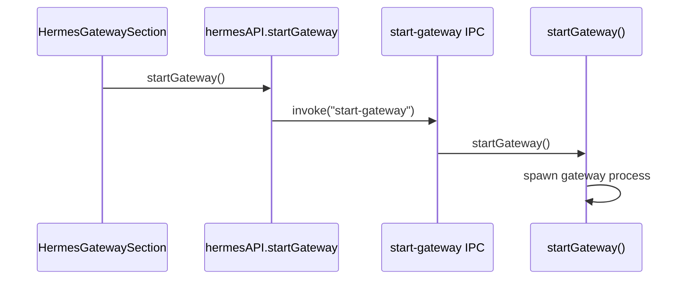

# v5.7.11 Hermes CLI 隐藏 CMD 窗口

## 问题与根因

**现象**：SettingsDrawer → Hermes Runtime → Gateway → Start 后，Windows 弹出 `runtime\hermes\venv\Scripts\hermes.exe` 的 CMD 黑窗口。

**调用链（无需改动）**：



- UI：[`HermesGatewaySection.tsx`](src/renderer/src/modules/hermes-runtime/sections/HermesGatewaySection.tsx) 第 26 行调用 `window.hermesAPI.startGateway()`
- IPC：[`index.ts`](src/main/index.ts) `start-gateway` → `startGateway()`（无 profile 参数，default）
- **根因**：[`hermes.ts`](src/main/hermes.ts) 第 898–903 行直接 `spawn(getHermesScript(), ["gateway"], { stdio: "ignore", detached: true })`，缺少 `windowsHide`，且 Windows 下 `getHermesScript()` 解析为 `hermes.exe` console shim

**已有正确参考**：同文件 `spawnHermesCli()`（第 555–572 行）已在 Windows 使用 `getHermesPython()` + `["-m", "hermes_cli.main", ...]` 并设置 `windowsHide: true`。

**不在本次范围**：[`hermes-local-adapter.ts`](src/main/hermes-local-adapter.ts) 虽有 `windowsHide`，但仍 spawn `hermesScript`；多 Profile 同类问题留后续版本。

---

## 实施方案（最小范围）

### 1. 新增 `spawnHermesGatewayProcess` helper

位置：[`src/main/hermes.ts`](src/main/hermes.ts)，放在 `spawnHermesCli()` 之前（CLI fallback 区域）。

```ts
function spawnHermesGatewayProcess(
  cliArgs: string[],
  env: Record<string, string>,
): ChildProcess {
  const commonOptions = {
    cwd: getHermesRepo(),
    env,
    stdio: "ignore" as const,
    detached: true,
    windowsHide: process.platform === "win32",
    shell: false,
  };

  if (process.platform === "win32") {
    return spawn(
      getHermesPython(),
      ["-m", "hermes_cli.main", ...cliArgs],
      commonOptions,
    );
  }

  return spawn(getHermesScript(), cliArgs, commonOptions);
}
```

**平台规则**：

| 平台 | command | args |
|------|---------|------|
| Windows | `getHermesPython()` | `["-m", "hermes_cli.main", "gateway"]` |
| 非 Windows | `getHermesScript()` | `["gateway"]` |

**禁止**：给 hermes 加 `--hidden`、用 `cmd /c start` 或 PowerShell `Start-Process -WindowStyle Hidden` 包一层。

### 2. 替换 `startGateway()` 内 spawn

将第 898–903 行：

```ts
gatewayProcess = spawn(getHermesScript(), ["gateway"], { ... });
```

替换为：

```ts
gatewayProcess = spawnHermesGatewayProcess(["gateway"], gatewayEnv);
```

**保持不变**：
- `gatewayProcess.unref()`
- `close` 事件清理（`gatewayProcess`、`gatewayStartedByApp`、`apiServerAvailable`、重启 health polling）
- `gatewayEnv` 构建、`ensureApiServerKey`、`syncGatewayModelSection`
- `restartGateway` / lazy-start（[`hermes-default-chat-ipc.ts`](src/main/hermes-default-chat/hermes-default-chat-ipc.ts) 第 143–145 行）均复用 `startGateway()`，自动受益

### 3. 更新注释

将 `spawnHermesCli()` 上方注释（第 551–553 行）扩展为 PRD 建议文案，说明 Desktop 托管进程统一用 `python -m hermes_cli.main` + `windowsHide`。

---

## 不改文件（PRD 明确）

- `src/renderer/src/modules/hermes-runtime/**`
- `src/preload/index.ts` / `index.d.ts`
- `src/main/index.ts`
- IPC 契约无变化 → **无需改** [`docs/API_CONTRACTS.md`](docs/API_CONTRACTS.md)

---

## 验证计划

### 自动化

```bash
npm run typecheck
npm test
```

（本变更无新增单测；PRD 以 Windows 手工验收为主。）

### Windows 手工验收

1. 关闭已有 hermes CMD 窗口
2. 打开 Desktop → SettingsDrawer → Hermes Runtime → Gateway
3. Stop → Start
4. **预期**：不出现 `hermes.exe` CMD 黑窗口；允许后台 `python.exe`
5. Status 刷新为 `running`
6. `http://127.0.0.1:8642/health` 返回 200
7. Local Hermes Chat / WebOperator Hermes 面板可正常发消息
8. Desktop 退出后 `stopGateway(true)` 可停止 default gateway

### 回归点

- `startGateway()` / `stopGateway(true)` / `restartGateway()`
- 首次 `hermes-chat:send-message` lazy-start gateway
- `gateway.pid` 读写与清理
- `API_SERVER_KEY` 自动 provision + `API_SERVER_ENABLED=true`

PowerShell 辅助检查：

```powershell
Get-Process python, hermes -ErrorAction SilentlyContinue | Select-Object Id,ProcessName,Path
netstat -ano | findstr :8642
```

---

## 文档同步（收尾）

按 [007-sync-project-docs](.cursor/rules/007-sync-project-docs.mdc) 增量更新：

- [`AGENTS.md`](AGENTS.md) — 版本特性索引增加 **V5.7.11** 一行（hide default gateway CMD on Windows）
- [`docs/INDEX.md`](docs/INDEX.md) — 对齐版本特性摘要

无需改 Renderer 文档或 IPC 契约。

---

## 提交

```
fix(hermes): hide default gateway console window on Windows
```

版本归档：`v5.7.11_hermes_cli`
