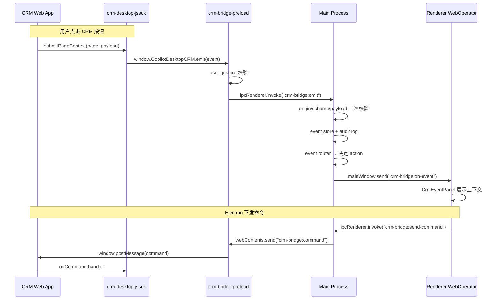

# V5.7.1：CRM Web 页面主动上报与 Electron 双向控制能力

## 架构总览



## 核心改动点分析

**注入 CRM preload 的关键路径**：[view-registry.ts](src/main/shell/views/view-registry.ts) 的 `web-operator` 条目当前 `defaultPreload: undefined`。`ManagedWebContentsView.create()` 已支持从 registry 或 options 读取 preload 路径。只需在 view-registry 中为 `web-operator` 设置 `defaultPreload` 指向编译后的 `crm-bridge-preload.js`。

**electron-vite 多入口 preload**：当前 [electron.vite.config.ts](electron.vite.config.ts) 的 `preload: {}` 默认只编译 `src/preload/index.ts`。需要增加 `crm-bridge-preload.ts` 作为第二入口。

**Renderer CRM 事件接收**：Main 通过 `mainWindow.webContents.send("crm-bridge:on-event", ...)` 推送到主窗口 Renderer；Renderer 通过 `browser-api.ts` 新增 CRM 方法（`onCrmEvent`、`listCrmEvents`、`sendCrmCommand`）消费。

---

## Phase 1：Shared CRM Bridge Contract

**新增文件**：
- [`src/shared/crm-bridge/crm-bridge-contract.ts`](src/shared/crm-bridge/crm-bridge-contract.ts) — 全部 DTO 类型（`CrmBridgeEventType`、`CrmBridgeEvent`、`CrmBridgeResult`、`CrmDesktopCommand` 等），直接采用 PRD §7 定义
- [`src/shared/crm-bridge/crm-bridge-errors.ts`](src/shared/crm-bridge/crm-bridge-errors.ts) — 错误码枚举 + 审计动作类型
- [`src/shared/crm-bridge/crm-bridge-schema.ts`](src/shared/crm-bridge/crm-bridge-schema.ts) — 轻量 schema 校验函数（`validateCrmBridgeEventSchema`），不引入 Zod（preload 侧也需引用）
- [`src/shared/crm-bridge/index.ts`](src/shared/crm-bridge/index.ts) — 统一 re-export

**要点**：
- `CrmBridgeEvent.source` 固定为 `"crm-web"`
- `CrmBridgeResult.errorCode` 使用 PRD §7.1 定义的联合类型
- `CrmBridgeAuditRecord` 用于审计日志（与现有 `BrowserAuditRecord` 并列）

---

## Phase 2：CRM Bridge Preload（WebOperator WebContentsView 专用）

**新增文件**：
- [`src/preload/crm-bridge-preload.ts`](src/preload/crm-bridge-preload.ts) — 采用 PRD §12 骨架

**关键实现**：
- `contextBridge.exposeInMainWorld("CopilotDesktopCRM", { version, isAvailable, emit })`
- `window.addEventListener("click", ...)` 捕获 `isTrusted` 点击事件，记录 `lastTrustedClickAt`
- `window.addEventListener("message", ...)` 监听 `source === "copilot-crm-jssdk"` 的 postMessage
- `emit()` 调用 `ipcRenderer.invoke("crm-bridge:emit", { event, location, receivedAt })`
- `ipcRenderer.on("crm-bridge:command", ...)` 接收 Main 下发命令，转为 `window.postMessage`
- 不暴露 `ipcRenderer`、不暴露 Node API

**修改文件**：
- [`electron.vite.config.ts`](electron.vite.config.ts) — preload 节增加多入口：

```ts
preload: {
  build: {
    rollupOptions: {
      input: {
        index: resolve(__dirname, 'src/preload/index.ts'),
        'crm-bridge-preload': resolve(__dirname, 'src/preload/crm-bridge-preload.ts'),
      },
    },
  },
},
```

---

## Phase 3：WebOperator View 加载 CRM Preload

**修改文件**：
- [`src/main/shell/views/view-registry.ts`](src/main/shell/views/view-registry.ts) — `web-operator` 条目增加 `defaultPreload`：

```ts
import { join } from "path";

this.register("web-operator", {
  kind: "web-operator",
  defaultLayer: "content",
  defaultPartition: WEB_OPERATOR_PARTITION,
  defaultSandbox: true,
  defaultContextIsolation: true,
  defaultPreload: join(__dirname, "../preload/crm-bridge-preload.js"),
});
```

注意：`__dirname` 在 electron-vite 编译后指向 `out/main/`，preload 编译产物在 `out/preload/`，因此路径为 `../preload/crm-bridge-preload.js`。需验证此路径在 dev 和 production build 中均正确。

**不改文件**：
- `shell-browser-view-adapter.ts` — 当前 `createView()` 不传 preload 选项，registry 默认值生效即可
- `managed-webcontents-view.ts` — 已支持从 registry/options 读取 preload，无需修改

---

## Phase 4：Main Process CRM Bridge 模块

**新增目录** `src/main/crm-bridge/`：

- [`crm-bridge-config.ts`](src/main/crm-bridge/crm-bridge-config.ts) — 读取 `resources/crm-bridge/crm-bridge.config.json`（打包后从 `process.resourcesPath` 读取），提供 `getAllowedOrigins()`、`getRoutes()`、`isEnabled()` 等
- [`crm-bridge-security.ts`](src/main/crm-bridge/crm-bridge-security.ts) — `validateCrmBridgeEvent()`：检查 origin allowlist、event type allowlist、payload size、requestId 去重、WebContents 归属 web-operator layer
- [`crm-event-router.ts`](src/main/crm-bridge/crm-event-router.ts) — `routeCrmBridgeEvent()`：根据配置 routes 表返回 action（`open-web-operator-panel`、`open-renderer-route`）
- [`crm-command-dispatcher.ts`](src/main/crm-bridge/crm-command-dispatcher.ts) — `dispatchCrmCommand()`：获取 web-operator WebContents，调用 `webContents.send("crm-bridge:command", command)`
- [`crm-event-store.ts`](src/main/crm-bridge/crm-event-store.ts) — 内存环形队列（最多 100 条），`insertCrmBridgeEvent()`、`listCrmBridgeEvents()`、`getLastEvent()`
- [`crm-bridge-ipc.ts`](src/main/crm-bridge/crm-bridge-ipc.ts) — 注册 IPC handlers：`crm-bridge:emit`、`crm-bridge:list-events`、`crm-bridge:send-command`
- [`index.ts`](src/main/crm-bridge/index.ts) — `setupCrmBridge(controller, mainWindow)` 初始化入口

**IPC 通道**：

| Channel | 方向 | 说明 |
|---------|------|------|
| `crm-bridge:emit` | CRM preload → Main | CRM 页面提交事件 |
| `crm-bridge:list-events` | Renderer → Main | 查询历史事件 |
| `crm-bridge:send-command` | Renderer → Main | 下发命令到 CRM |
| `crm-bridge:on-event` | Main → Renderer | 推送新 CRM 事件 |

**修改文件**：
- [`src/main/index.ts`](src/main/index.ts) — 在 Web Operator 初始化块（约 L1541–1579）之后调用 `setupCrmBridge(controller, mainWindow)`

**新增配置文件**：
- [`resources/crm-bridge/crm-bridge.config.json`](resources/crm-bridge/crm-bridge.config.json) — 采用 PRD §8 示例

---

## Phase 5：Renderer Preload CRM API 扩展

**修改文件**：
- [`src/preload/browser-api.ts`](src/preload/browser-api.ts) — `AiosBrowserAPI` 接口新增 3 个 CRM 方法：

```ts
listCrmEvents(limit?: number): Promise<CrmBridgeEvent[]>;
sendCrmCommand(command: CrmDesktopCommand): Promise<CrmBridgeResult>;
onCrmEvent(callback: (data: { event: CrmBridgeEvent; routeAction: unknown }) => void): () => void;
```

实现：
- `listCrmEvents` → `ipcRenderer.invoke("crm-bridge:list-events", limit)`
- `sendCrmCommand` → `ipcRenderer.invoke("crm-bridge:send-command", command)`
- `onCrmEvent` → `ipcRenderer.on("crm-bridge:on-event", ...)` + 返回 unsubscribe

- [`src/preload/index.d.ts`](src/preload/index.d.ts) — 补充类型声明

---

## Phase 6：Renderer UI — CRM Context 面板

**新增文件**：
- [`src/renderer/src/screens/WebOperator/hooks/use-crm-bridge-events.ts`](src/renderer/src/screens/WebOperator/hooks/use-crm-bridge-events.ts) — React hook：初始加载 `listCrmEvents()` + 订阅 `onCrmEvent` 实时推送
- [`src/renderer/src/screens/WebOperator/CrmEventPanel.tsx`](src/renderer/src/screens/WebOperator/CrmEventPanel.tsx) — 展示最近 CRM 事件（entityType/entityId/entityName/url/trigger/timestamp）；提供「刷新 Snapshot」「发送命令」「复制上下文」按钮

**修改文件**：
- [`src/shared/workspace/workspace-contract.ts`](src/shared/workspace/workspace-contract.ts) — `WorkspaceSecondaryPanel` 增加 `"crm-context"`
- [`src/shared/workspace/workspace-secondary-nav.ts`](src/shared/workspace/workspace-secondary-nav.ts) — `web-operator` 数组增加 `"crm-context"`；`SECONDARY_PANEL_LABEL_KEYS` 增加条目
- [`src/renderer/src/screens/WebOperator/WebOperatorScreen.tsx`](src/renderer/src/screens/WebOperator/WebOperatorScreen.tsx) — 增加 CrmEventPanel 面板区域
- [`src/renderer/src/screens/WebOperator/WebOperatorSideRail.tsx`](src/renderer/src/screens/WebOperator/WebOperatorSideRail.tsx) — `PANEL_ICONS` 增加 `"crm-context"` 图标（`Building2` from lucide-react）
- [`src/shared/i18n/locales/en/navigation.ts`](src/shared/i18n/locales/en/navigation.ts) — 增加 `crmContext: "CRM Context"`
- [`src/shared/i18n/locales/zh-CN/navigation.ts`](src/shared/i18n/locales/zh-CN/navigation.ts) — 增加 `crmContext: "CRM 上下文"`

---

## Phase 7：CRM JSSDK 独立包

**新增目录** `packages/crm-desktop-jssdk/`：
- `package.json` — name `@smc/crm-desktop-jssdk`，无 Electron/Node 依赖
- `tsconfig.json` — `target: "ES2020"`，`lib: ["ES2020", "DOM"]`
- `src/index.ts` — 采用 PRD §10 参考实现
- `src/types.ts` — SDK 端类型（与 shared contract 对齐但独立，不 import Electron 类型）
- `vite.config.ts` — 构建 IIFE (`crm-desktop-jssdk.iife.js`) + ESM (`crm-desktop-jssdk.esm.js`)
- `README.md` — CRM 接入说明 + 示例

**要点**：
- 不加入 pnpm workspace（独立交付给 CRM 团队）
- 在非 Electron 环境自动 no-op
- 检测 `window.CopilotDesktopCRM` 可用性，不可用时回退 `postMessage`

---

## Phase 8：测试 + 验收

**新增文件**：
- `tests/crm-bridge-schema.test.ts` — schema 校验正确/拒绝
- `tests/crm-bridge-security.test.ts` — origin/event type/payload size/requestId 去重
- `tests/crm-event-router.test.ts` — 路由映射
- `tests/crm-command-dispatcher.test.ts` — 命令分发
- `tests/fixtures/crm/customer-detail.html` — 本地 CRM fixture（安装 JSSDK 模拟）

**typecheck + build 验证**：
- `npm run typecheck`
- `npm run build`

---

## Phase 9：文档同步

- [`AGENTS.md`](AGENTS.md) — 版本索引增加 V5.7.1 条目；Preload 全局 API 表补充 `CopilotDesktopCRM`；深入阅读路径补充 CRM bridge
- [`docs/INDEX.md`](docs/INDEX.md) — 新增 `src/main/crm-bridge/` 和 `src/shared/crm-bridge/` 条目
- [`docs/API_CONTRACTS.md`](docs/API_CONTRACTS.md) — 新增 CRM Bridge IPC 通道表
- [`docs/ARCHITECTURE.md`](docs/ARCHITECTURE.md) — 补充 CRM bridge 数据流描述

---

## 文件改动汇总

| 操作 | 文件 |
|------|------|
| 新增 | `src/shared/crm-bridge/crm-bridge-contract.ts` |
| 新增 | `src/shared/crm-bridge/crm-bridge-errors.ts` |
| 新增 | `src/shared/crm-bridge/crm-bridge-schema.ts` |
| 新增 | `src/shared/crm-bridge/index.ts` |
| 新增 | `src/preload/crm-bridge-preload.ts` |
| 新增 | `src/main/crm-bridge/crm-bridge-config.ts` |
| 新增 | `src/main/crm-bridge/crm-bridge-security.ts` |
| 新增 | `src/main/crm-bridge/crm-event-router.ts` |
| 新增 | `src/main/crm-bridge/crm-command-dispatcher.ts` |
| 新增 | `src/main/crm-bridge/crm-event-store.ts` |
| 新增 | `src/main/crm-bridge/crm-bridge-ipc.ts` |
| 新增 | `src/main/crm-bridge/index.ts` |
| 新增 | `resources/crm-bridge/crm-bridge.config.json` |
| 新增 | `src/renderer/src/screens/WebOperator/CrmEventPanel.tsx` |
| 新增 | `src/renderer/src/screens/WebOperator/hooks/use-crm-bridge-events.ts` |
| 新增 | `packages/crm-desktop-jssdk/` (整个包) |
| 新增 | `tests/crm-bridge-schema.test.ts` |
| 新增 | `tests/crm-bridge-security.test.ts` |
| 新增 | `tests/crm-event-router.test.ts` |
| 新增 | `tests/fixtures/crm/customer-detail.html` |
| 修改 | `electron.vite.config.ts` — preload 多入口 |
| 修改 | `src/main/shell/views/view-registry.ts` — web-operator defaultPreload |
| 修改 | `src/main/index.ts` — setupCrmBridge 调用 |
| 修改 | `src/preload/browser-api.ts` — 新增 CRM 方法 |
| 修改 | `src/preload/index.d.ts` — 类型声明 |
| 修改 | `src/shared/workspace/workspace-contract.ts` — 新增 panel 类型 |
| 修改 | `src/shared/workspace/workspace-secondary-nav.ts` — 新增 panel 配置 |
| 修改 | `src/renderer/src/screens/WebOperator/WebOperatorScreen.tsx` — CRM 面板 |
| 修改 | `src/renderer/src/screens/WebOperator/WebOperatorSideRail.tsx` — CRM 图标 |
| 修改 | `src/shared/i18n/locales/en/navigation.ts` — i18n |
| 修改 | `src/shared/i18n/locales/zh-CN/navigation.ts` — i18n |
| 修改 | `AGENTS.md`、`docs/INDEX.md`、`docs/API_CONTRACTS.md`、`docs/ARCHITECTURE.md` |
