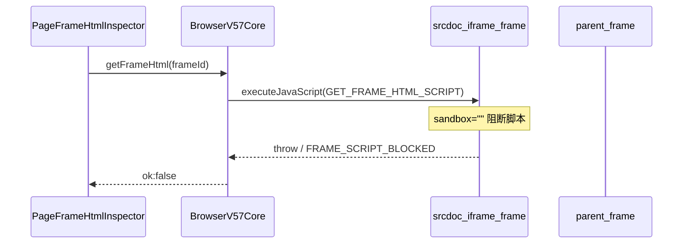
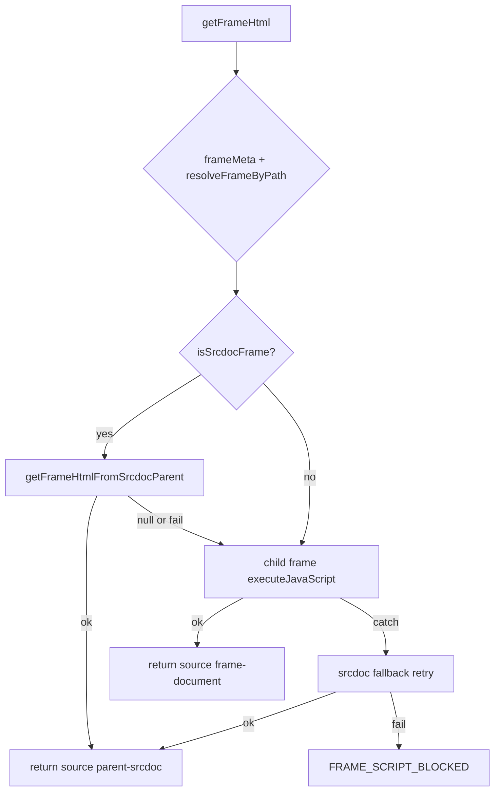

# v5.7.3 Get HTML iframe（srcdoc）修复计划

## 问题与根因



当前 [`getFrameHtml`](src/main/browser/browser-v57-core.ts)（约 L317–436）在 `resolveFrameByPath` 成功后**直接**对子 frame 执行 `GET_FRAME_HTML_SCRIPT`（L146–180）。`iframe sandbox="" srcdoc="..."`（如 `/zh/email` 邮箱区域）会阻断子 frame 内脚本，导致 `FRAME_SCRIPT_BLOCKED`。

已有能力可复用：

- [`BrowserFrameInspector`](src/main/browser/browser-frame-inspector.ts) 为每个 frame 提供 `path: number[]`（子 frame 在父文档中的索引）
- `resolveFrameByPath(wc, parentPath)` 可定位父 frame

修复策略（PRD §12）：**不改 sandbox、不加 allow-scripts、不在子 iframe 内强跑脚本**；改由**父 frame** 读取对应 `iframe` 元素的 `srcdoc` 属性，并用 `DOMParser` 做 selector 裁剪。

---

## 修改范围（3 个文件）

| 文件 | 变更 |
|------|------|
| [`src/shared/browser/browser-frame-contract.ts`](src/shared/browser/browser-frame-contract.ts) | `BrowserFrameHtmlResult` 增加可选 `source` |
| [`src/main/browser/browser-v57-core.ts`](src/main/browser/browser-v57-core.ts) | srcdoc 脚本 + 私有方法 + `getFrameHtml` 流程 |
| [`src/renderer/src/screens/WebOperator/panels/PageFrameHtmlInspector.tsx`](src/renderer/src/screens/WebOperator/panels/PageFrameHtmlInspector.tsx) | 修复 body 提取 bug + 展示 `source` |

**不修改**（PRD 明确）：`browser-ipc.ts`、`browser-controller.ts`、`preload/browser-api.ts`（`getFrameHtml` IPC 已存在，类型随 shared contract 自动继承）。

---

## Task 1 — Shared 契约

在 [`BrowserFrameHtmlResult`](src/shared/browser/browser-frame-contract.ts) 增加：

```ts
source?: "frame-document" | "parent-srcdoc";
```

失败响应也可带 `source: "parent-srcdoc"`（PRD 用例 3），便于 UI 区分错误来源。

---

## Task 2 — Main：`BrowserV57Core` srcdoc fallback

文件：[`src/main/browser/browser-v57-core.ts`](src/main/browser/browser-v57-core.ts)

### 2.1 新增 `GET_SRCDOC_HTML_FROM_PARENT_SCRIPT`

紧接 `GET_FRAME_HTML_SCRIPT`（L146 后）按 PRD §3 添加脚本工厂：

- 在**父 frame** 内：`querySelectorAll("iframe, frame")`，用 `path` 末位 `childIndex` 取目标 iframe
- 读 `getAttribute("srcdoc") || iframe.srcdoc`
- 无 selector：返回完整 srcdoc 字符串 + `doc.body.innerText`
- 有 selector：对 srcdoc 做 `DOMParser` + `querySelector`，支持 `outer` 开关
- 长度截断与 `GET_FRAME_HTML_SCRIPT` 一致（`maxLength` / text cap）

### 2.2 新增私有方法（PRD §4）

在 `BrowserV57Core` class 内：

- `isSrcdocFrame(frameMeta)` → `frameMeta.url === "about:srcdoc"`
- `getFrameHtmlFromSrcdocParent(wc, frameMeta, target)`：
  - 非 srcdoc / `path` 为空 → 返回 `null`（走原路径）
  - `parentPath = path.slice(0, -1)`，`childIndex = path[path.length - 1]`
  - 父 frame 上 `executeJavaScript(GET_SRCDOC_HTML_FROM_PARENT_SCRIPT(...))`
  - 成功/失败均设置 `source: "parent-srcdoc"`

### 2.3 调整 `getFrameHtml` 执行顺序（PRD §5–7）

在 **L317 `resolveFrameByPath` 成功之后**、**L339 `frame.executeJavaScript` 之前**：

```ts
const srcdocResult = await this.getFrameHtmlFromSrcdocParent(wc, frameMeta, target);
if (srcdocResult?.ok) {
  // log + return srcdocResult
}
```

在 **try 成功分支**（L387–397）为 result 增加 `source: "frame-document"`。

在 **catch 分支**（L412–435）替换为 PRD §7：

1. 再次 `getFrameHtmlFromSrcdocParent`（兜底非 srcdoc 预判场景）
2. 若 `srcdocResult?.ok` → 返回
3. 否则合并 `srcdocResult?.error?.message` 与原始 `err.message`，返回 `FRAME_SCRIPT_BLOCKED`（可附带 `source`）

这样 sandbox srcdoc iframe 在 catch 路径也能恢复成功；普通 frame 行为不变。

---

## Task 3 — Renderer：`PageFrameHtmlInspector`

文件：[`PageFrameHtmlInspector.tsx`](src/renderer/src/screens/WebOperator/panels/PageFrameHtmlInspector.tsx)

### 3.1 修复 `extractBodyInnerHtml`（PRD §8）

**当前 bug**（L20–22）：`return trimmed` 在条件判断之前，导致 `DOMParser` 永不执行，面板始终显示整页 HTML。

按 PRD 删除提前 return，保留：

- 无 `<body>` → 原样返回（selector 片段不受影响）
- 有 `<body>` → `DOMParser` → `doc.body.innerHTML`，失败时 regex fallback

`displayHtml` / Copy 继续基于修复后的 `extractBodyInnerHtml`。

### 3.2 展示 `source`（PRD §9）

结果头从：

```tsx
{result.ok ? "OK" : "ERROR"} · {result.capturedAt}
```

改为：

```tsx
{result.ok ? "OK" : "ERROR"} · {result.capturedAt}
{result.source ? ` · ${result.source}` : ""}
```

便于验收 `parent-srcdoc` vs `frame-document`。

---

## Task 4 — 验证

按 PRD §10–11：

| 用例 | 操作 | 预期 |
|------|------|------|
| 1 邮箱 srcdoc | `/zh/email` → Refresh Snapshot → 选 `about:srcdoc` → Get HTML | `ok:true`, `source:"parent-srcdoc"`, 有 HTML |
| 2 selector | selector=`body` / `table` | `source:"parent-srcdoc"`, 对应片段 |
| 3 无效 selector | `#not-exists` | `ok:false`, `ELEMENT_NOT_FOUND`, `source:"parent-srcdoc"` |
| 4 普通 frame | 非 srcdoc frame | `source:"frame-document"` |

命令：

```bash
npm run typecheck
npm run lint
npm run build
```

需**完整重启 Electron**（preload 无变更，但 main 逻辑变更需重启主进程）。

---

## 可选：文档同步

契约字段变更后，按 [`.agents/skills/sync-project-docs/SKILL.md`](.agents/skills/sync-project-docs/SKILL.md) 在 [`docs/API_CONTRACTS.md`](docs/API_CONTRACTS.md) Web Operator / `getFrameHtml` 段落补充 `source` 字段说明（增量一段即可）。

---

## 架构示意（修复后）



---

## 风险与约束（PRD §12）

- `querySelectorAll("iframe, frame")` 顺序须与 Electron `frame.frames` 索引一致；PRD 已按此假设设计，邮箱场景为首要验收。
- 不修改 iframe sandbox / CRM 页面 / 子 frame 强执行脚本。
- `outer` 默认值与现逻辑一致：`target.outer !== false`。
