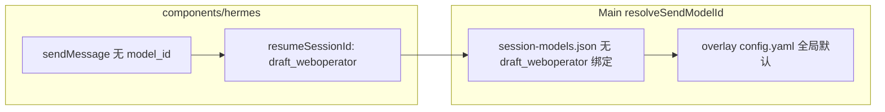
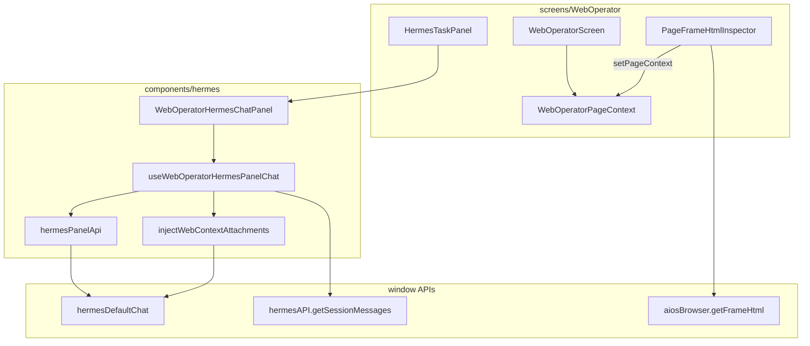

# v5.7.4 WebOperator SidePanel Hermes 实施计划

## 目标与范围

依据 [copilot-desktop/prd/v5.7.4_sidepanel_hermes.md](copilot-desktop/prd/v5.7.4_sidepanel_hermes.md)，本版交付：

| 能力 | 说明 |
|------|------|
| **信息发送** | Composer + preset 快捷指令；首轮注入 Web 上下文 |
| **过程查看** | `creating`/`streaming` 状态、tool progress 卡片、流式 token |
| **结果显示** | 消息列表 + `AgentMarkdown` 渲染 assistant 回复 |
| **模型策略** | **始终使用 hermes-agent 全局默认模型**（`config.yaml` / Models Set Default），**不使用 session model** |

**禁止**：Portal `/api/hermes/*`、`workspaceChat`、import `frontend/modules/hermes/**`、Renderer 读写 `config.yaml`。

**引用契约**：[copilot-desktop/docs/API_CONTRACTS.md](copilot-desktop/docs/API_CONTRACTS.md) § Hermes Default Chat (v5.6.4)。

---

## 关键设计：默认模型 vs Session Model

Main 侧 [`resolveSendModelId`](copilot-desktop/src/main/hermes-default-chat/hermes-default-chat-ipc.ts) 逻辑：

1. 有 `payload.model_id` → 解析并 **写入 session 绑定**
2. 无 `model_id` 但有 `getSessionModel(sessionKey)` → 用 **session 模型**
3. 否则 → `saved: null` → Gateway 使用 **全局 `model.default`（overlay）**

全页 Chat（[`useHermesDefaultChatStream`](copilot-desktop/src/renderer/src/screens/Hermes/pages/Chat/hooks/useHermesDefaultChatStream.ts)）会传 `model_id` 并维护 session 绑定；WebOperator Panel **必须与之隔离**。



**Panel 侧硬性规则（写入 hook 注释 + 代码审查）**：

- **禁止**调用 `hermesDefaultChat.getSessionModel` / `setSessionModel`
- **禁止**在 `sendMessage` 中传 `model_id`
- **禁止**使用 `HERMES_DRAFT_SESSION_ID`（`draft_default`，与全页 Chat 共用，可能已有 session 绑定）
- 占位 session 键使用常量 **`draft_weboperator`**（附件上传与首条发送前 `resumeSessionId`）
- `chat-done` 后仅用返回的 `sessionId` 做 **对话续聊与历史恢复**（`hermesAPI.getSessionMessages`），不触碰模型选择

可选 UI：启动时 `getModelConfig()` **只读**展示当前全局默认模型名（无下拉、不可改）。

---

## 架构总览



**UI 分区**（[`HermesTaskPanel.tsx`](copilot-desktop/src/renderer/src/screens/WebOperator/HermesTaskPanel.tsx) 改造后）：

```
┌─ HermesTaskPanel ─────────────────────┐
│ WebOperatorHermesChatPanel (flex-1)   │  ← 发送 / 过程 / 结果
│   header: context.summary + 清空      │
│   presets: 页面摘要 / 提取 / 建议     │
│   tool cards + message list           │
│   composer                            │
├───────────────────────────────────────┤
│ Pending Actions (max-h-40, 现有逻辑)   │
└───────────────────────────────────────┘
```

---

## 目录与模块（按 PRD §5.2）

新建 [`src/renderer/src/components/hermes/`](copilot-desktop/src/renderer/src/components/hermes/)：

| 路径 | 职责 |
|------|------|
| `index.ts` | 导出 `WebOperatorHermesChatPanel`、`HermesPanelPageContext` 类型等 |
| `types.ts` | `HermesPanelMessage`、`HermesPanelToolCall`、`HermesPanelPageContext` |
| `api/hermesPanelApi.ts` | 薄封装 `window.hermesDefaultChat`（profile 固定 `default`）；**不含** session model API |
| `hooks/useWebOperatorHermesPanelChat.ts` | 流式 send/cancel/clear/restore；默认模型策略 |
| `lib/build-web-context-prefix.ts` | 首条 message 前缀（≤12k，对齐 frontend `buildContextPrefix`） |
| `lib/inject-web-context-attachments.ts` | `uploadAttachmentBuffers` → `web-context/body.html` + `meta.json` |
| `lib/web-operator-hermes-session-binding.ts` | localStorage：`weboperator:${scopeKey}` → `sessionId` |
| `lib/preset-actions.ts` | 默认 preset 文案 |
| `panel/WebOperatorHermesChatPanel.tsx` | 组装 Panel |
| `panel/WebOperatorHermesPanelComposer.tsx` | Enter 发送 / 停止（参考 [HermesPanelComposer](frontend/modules/hermes/components/panel/HermesPanelComposer.tsx)） |
| `panel/WebOperatorHermesPanelMessageList.tsx` | 气泡 + [AgentMarkdown](copilot-desktop/src/renderer/src/components/AgentMarkdown.tsx) |
| `panel/WebOperatorHermesPanelToolCard.tsx` | tool 名 + running 态 |
| `panel/web-operator-hermes-panel.css` | 侧栏深色样式，对齐 `web-operator-panels.css` |

WebOperator 屏内保留：

- [`screens/WebOperator/context/WebOperatorPageContext.tsx`](copilot-desktop/src/renderer/src/screens/WebOperator/context/WebOperatorPageContext.tsx)（新建）
- [`screens/WebOperator/context/use-web-operator-page-context.ts`](copilot-desktop/src/renderer/src/screens/WebOperator/context/use-web-operator-page-context.ts)

**导入路径**：项目若无 `@/` alias，使用相对路径，例如 `import { WebOperatorHermesChatPanel } from "../../components/hermes"`（以实际 tsconfig 为准）。

---

## 核心 Hook 行为（对齐 PRD §4.3 + 默认模型）

参考 [`useHermesDefaultChatStream`](copilot-desktop/src/renderer/src/screens/Hermes/pages/Chat/hooks/useHermesDefaultChatStream.ts) 的事件订阅模式：

| 事件 | UI 表现 |
|------|---------|
| `chat-chunk` | 追加 assistant 流式内容（过程查看） |
| `chat-tool-progress` | `toolCalls` 列表（过程查看） |
| `chat-done` | 固化 assistant 消息；保存 `sessionId` + localStorage binding |
| `chat-error` | 顶部错误条 |
| `abort` | 停止按钮 → `hermesDefaultChat.abort()` |

**send 流程**：

1. 无 `pageContext` 时仍允许纯文本对话；有 context 时 preset/发送需 context（与 frontend `!context` disabled 一致）
2. 首条且未注入：`injectWebContextAttachments(draft_weboperator, context)` → `attachment_ids`
3. 构造 `message`：首条 = `presetSystemPrompt` + `buildWebContextPrefix` + `[用户]\n{text}`
4. `hermesPanelApi.sendMessage({ message, resumeSessionId, history, attachment_ids })` — **无 `model_id`**
5. `history` 来自内存 messages（user/assistant），与全页 Chat 相同

**历史恢复**：`persistenceKey` 命中 → `hermesAPI.getSessionMessages(sessionId)` → 填入 MessageList（只读历史，不改模型）。

---

## WebOperator 集成改动

| 文件 | 改动 |
|------|------|
| [`WebOperatorScreen.tsx`](copilot-desktop/src/renderer/src/screens/WebOperator/WebOperatorScreen.tsx) | 包裹 `WebOperatorPageContextProvider` |
| [`PageFrameHtmlInspector.tsx`](copilot-desktop/src/renderer/src/screens/WebOperator/panels/PageFrameHtmlInspector.tsx) | `getFrameHtml` 成功后 `setPageContext({ scopeKey, summary, payload })` |
| [`HermesTaskPanel.tsx`](copilot-desktop/src/renderer/src/screens/WebOperator/HermesTaskPanel.tsx) | 移除占位 textarea；上部 `WebOperatorHermesChatPanel`；下部保留 Pending Actions |
| [`WebOperatorPanels.tsx`](copilot-desktop/src/renderer/src/screens/WebOperator/panels/WebOperatorPanels.tsx) | 无 panel id 变更 |

**`WebOperatorPageContext` 字段**（PRD §4.2）：`scopeKey` = `origin + pathname + frameId`；`summary` = title/url 简述；`payload` 含 `htmlExcerpt`、`truncated`、`capturedAt` 等。

---

## 实施阶段

### Phase A — 基础设施（types + api + lib）

- 创建 `components/hermes` 目录骨架与 `types.ts`
- 实现 `hermesPanelApi.ts`（send/abort/events/upload buffers；**排除** session model 方法）
- 实现 `build-web-context-prefix`、`inject-web-context-attachments`、`web-operator-hermes-session-binding`、`preset-actions`

### Phase B — Chat Hook

- 实现 `useWebOperatorHermesPanelChat`（流式状态机：`idle` | `creating` | `streaming` | `error`）
- 单元测试（推荐）：prefix 截断、draft 键常量、binding 读写

### Phase C — Panel UI（发送 / 过程 / 结果）

- `WebOperatorHermesPanelComposer`：busy 时显示停止
- `WebOperatorHermesPanelMessageList`：user 纯文本 + assistant Markdown + 流式光标
- `WebOperatorHermesPanelToolCard`：工具名列表
- `WebOperatorHermesChatPanel`：header、preset、error、三块组合
- `web-operator-hermes-panel.css` + `index.ts` 导出

### Phase D — WebOperator 接线

- `WebOperatorPageContext` Provider + hook
- 改造 `HermesTaskPanel`、`WebOperatorScreen`、`PageFrameHtmlInspector`

### Phase E — 验证与文档

- `pnpm typecheck` / build（copilot-desktop）
- 手工：Get HTML → hermes-task → preset「页面摘要」→ 流式输出 → 追问
- DevTools：无 `/api/hermes`；Network 仅 IPC
- 更新 PRD 状态 + [`API_CONTRACTS.md`](copilot-desktop/docs/API_CONTRACTS.md) 增加「WebOperator 消费 hermes-chat:*、固定全局默认模型」交叉说明

---

## 验收标准

1. **发送**：Composer + preset 可发出消息；Gateway 未启动时有可读错误提示
2. **过程**：流式 token、`chat-tool-progress` 卡片、`creating/streaming` 禁用重复发送
3. **结果**：assistant 回复以 Markdown 展示；可复制（可选，与 frontend 一致）
4. **上下文**：PageStructure Get HTML 后，Hermes 回复与页面内容相关
5. **默认模型**：`sendMessage` payload 无 `model_id`；未调用 session model API；使用 `draft_weboperator` 不与全页 `draft_default` 混用
6. **约束**：无 `workspaceChat`、无 Portal HTTP
7. **Pending Actions**：底部审批区行为不变

---

## 与 PRD 的差异（本实施显式采纳）

| PRD | 本版用户要求 |
|-----|----------------|
| 可选 session 续聊 + `draft_weboperator` | 保留 session **对话**续聊；**模型**固定全局默认，禁止 session model API |
| `hermesPanelApi` 可对齐 `hermesDefaultApi` | 刻意 **裁剪** session model 相关方法 |

---

## 风险

| 风险 | 缓解 |
|------|------|
| 真实 `sessionId` 曾被全页 Chat 写入 model 绑定 | WebOperator 使用独立 `draft_weboperator`；新会话 clear 后不传旧 binding |
| HTML 过大 | `maxLength` 100k + inject 前截断 |
| 跨域 iframe 无 HTML | prefix 仍带 snapshot 元数据；UI 提示先 Get HTML |
