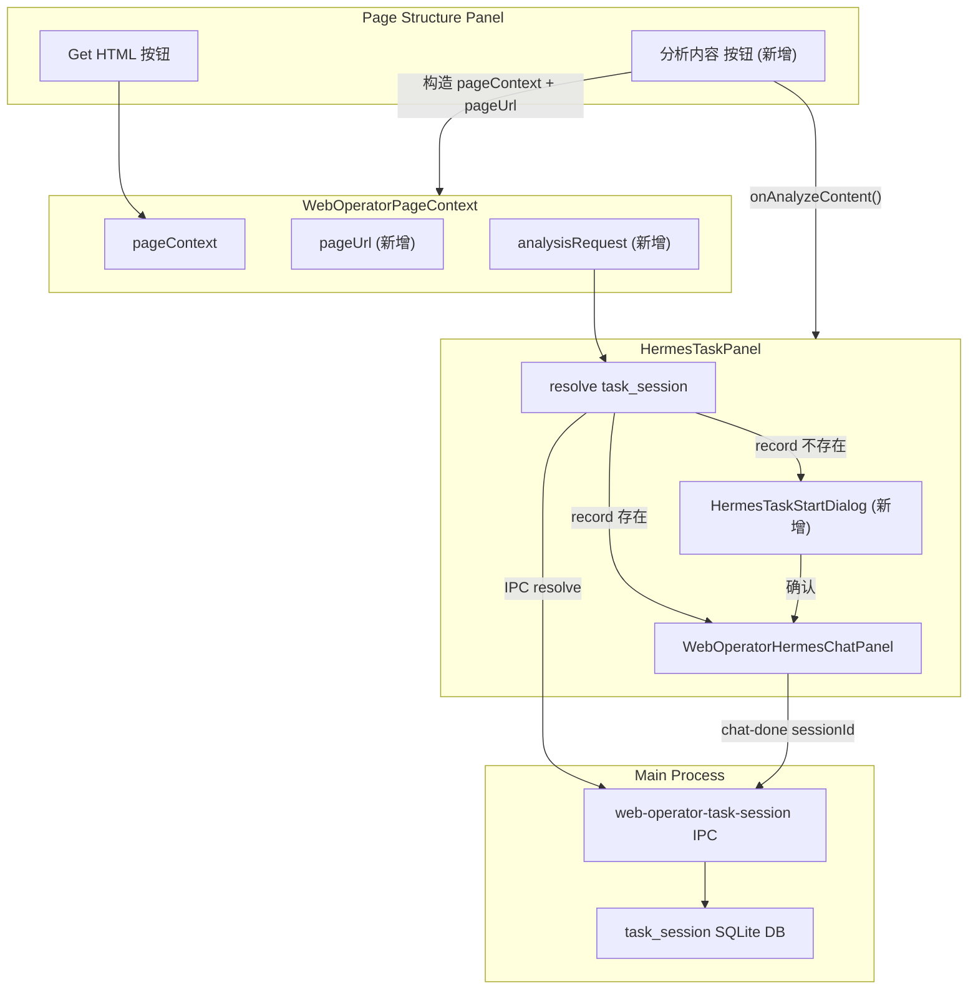

# v5.7.5 Hermes Integration 实施计划

## 当前代码结构总结

- `WebOperatorScreen.tsx` 已有 `onFocusedPanelChange` prop，但未传入 `WebOperatorPanels`
- `WebOperatorPanels.tsx` 只接收 `focusedPanel` / `externalRefreshTrigger` / `onRefreshSnapshot`
- `PageStructurePanel.tsx` 将 props 直接传入 `PageFrameHtmlInspector`
- `PageFrameHtmlInspector.tsx` 有 `[Get HTML]` 按钮，成功后构造 `pageContext` 写入 context
- `WebOperatorPageContext.tsx` 仅有 `pageContext` + `setPageContext` 两个状态
- `HermesTaskPanel.tsx` 只读取 `pageContext` 传给 `WebOperatorHermesChatPanel`
- `WebOperatorHermesChatPanel.tsx` 接收 `pageContext`，调用 `useWebOperatorHermesPanelChat`
- `useWebOperatorHermesPanelChat.ts` 使用 localStorage (`web-operator-hermes-session-binding.ts`) 作为会话绑定

## 数据流



---

## Phase 1: Shared Contract

新建 `src/shared/web-operator/web-operator-task-session-contract.ts`

- 定义 `WebOperatorTaskSessionRecord`、`LookupResult`、`ResolveInput`、`UpsertInput`、`WebOperatorTaskSessionAPI`
- 注意：`pageContext` 字段类型使用 `HermesPanelPageContext` 的 JSON-safe 子集（避免从 renderer 模块 import），实际在 shared 中重新声明或使用 `unknown` + 运行时断言

---

## Phase 2: Main Process SQLite Store + IPC

### 2.1 新建 `src/main/web-operator-task-session-store.ts`

- `getDb()`: 打开/创建 `~/.hermes/desktop/web-operator-task-session.db`（WAL 模式）
- `buildTaskId(pageUrl)`: `wot_` + SHA-256 前 32 字符
- `resolveTaskSession(pageUrl)`: 计算 taskId → 查 record
- `upsertTaskSession(input)`: INSERT OR REPLACE
- `removeTaskSession(taskId)`: DELETE

依赖：`better-sqlite3`（已在项目中）、`crypto`、`fs`、`path`、`profileHome()` 从 `./utils`

### 2.2 新建 `src/main/web-operator-task-session-ipc.ts`

- `registerWebOperatorTaskSessionIpc()`: 注册 3 个 `ipcMain.handle`

### 2.3 修改 `src/main/index.ts`

在 `setupIPC()` 中（紧跟 `registerHermesDefaultChatIpc` 所在的 try 块之后）注册：
```ts
try {
  registerWebOperatorTaskSessionIpc();
} catch (err) {
  console.error("[WEB-OPERATOR-TASK-SESSION] Failed to register IPC:", err);
}
```

---

## Phase 3: Preload API

### 3.1 新建 `src/preload/web-operator-task-session-api.ts`

封装 3 个 `ipcRenderer.invoke`

### 3.2 修改 `src/preload/index.ts`

- import `webOperatorTaskSessionApi`
- `contextBridge.exposeInMainWorld("webOperatorTaskSession", webOperatorTaskSessionApi)`

### 3.3 修改 `src/preload/index.d.ts`

- 添加 `WebOperatorTaskSessionAPI` type alias
- 在 `Window` interface 中添加 `webOperatorTaskSession`

---

## Phase 4: 扩展 WebOperatorPageContext

修改 `src/renderer/src/screens/WebOperator/context/WebOperatorPageContext.tsx`：

- 新增 `pageUrl`、`analysisRequest` 状态
- 新增 `requestHermesAnalysis(input)` 方法（生成 requestId）
- 扩展 `WebOperatorPageContextValue` type

修改 `src/renderer/src/screens/WebOperator/context/use-web-operator-page-context.ts`：无变化（已正确 re-export context）

---

## Phase 5: Page Structure 增加分析入口

### 5.1 `WebOperatorScreen.tsx`

将 `onFocusedPanelChange` 传入 `WebOperatorPanels`:
```tsx
<WebOperatorPanels
  ...
  onFocusedPanelChange={onFocusedPanelChange}
/>
```

### 5.2 `WebOperatorPanels.tsx`

- 新增 prop `onFocusedPanelChange?: (panel: string) => void`
- 传给 `PageStructurePanel` 一个 `onAnalyzeContent` 回调

### 5.3 `PageStructurePanel.tsx`

- 新增 prop `onAnalyzeContent?: () => void`
- 传给 `PageFrameHtmlInspector`

### 5.4 `PageFrameHtmlInspector.tsx`

- 新增 `[分析内容]` 按钮（在 `[Get HTML]` 旁边）
- 点击逻辑：先确保有 result → 构造 pageContext → 计算 pageUrl → 写入 context（`requestHermesAnalysis`）→ 调用 `onAnalyzeContent()`

---

## Phase 6: iframe pageUrl 修正

### 新建 `src/renderer/src/screens/WebOperator/utils/derive-page-url.ts`

- 正常 http/https URL：直接用
- `about:srcdoc` / `about:blank`：查找父 frame → `parent.url#framePath=...&frameTitle=...`
- 无父 frame fallback：`result.url || frame.url || "unknown://web-operator-frame/<frameId>"`

---

## Phase 7: HermesTaskPanel 任务流

### 7.1 修改 `HermesTaskPanel.tsx`

- 监听 `analysisRequest.requestId` 变化
- 调用 `window.webOperatorTaskSession.resolve({ pageUrl })`
- record 存在 → action='loading' → 加载历史
- record 不存在 → 显示 `HermesTaskStartDialog`
- 管理 `currentTask` 状态 (`HermesTaskPayload`)
- 将 `task` prop 传入 `WebOperatorHermesChatPanel`
- 收到 `onTaskSessionReady` → 调用 `window.webOperatorTaskSession.upsert(...)`

### 7.2 新建 `HermesTaskStartDialog.tsx`

- 只读页面摘要（max 100 字）
- 可选 `userPrompt` textarea
- `skills` select（`window.hermesAPI.listInstalledSkills("default")` + default fallback）
- 确认 → action='running'
- 取消 → action='pending'

### 7.3 新建 `utils/page-context-summary.ts`

- 从 `HermesPanelPageContext` 提取标题+URL 摘要（max 100 字）

---

## Phase 8: Hermes 组件接收 task

### 8.1 `types.ts` 新增

- `HermesPanelTaskAction = "loading" | "running" | "pending"`
- `HermesPanelTaskInput` type

### 8.2 `WebOperatorHermesChatPanel.tsx`

- 新增 props: `task?: HermesPanelTaskInput | null`、`onTaskSessionReady?`
- 传入 hook

### 8.3 `useWebOperatorHermesPanelChat.ts`

主要改造：
- 新增 `task` 参数
- action='loading' → 调用 `loadSessionHistory(task.sessionId)`
- action='pending' → 只显示 context，不发送
- action='running' → 自动发送首条消息（使用 `autoRunKeyRef` 防重复）
- `chat-done` 后回调 `onTaskSessionReady`
- 保留 localStorage 兜底（当无 task 时走旧逻辑，向后兼容）

### 8.4 `index.ts`

新增 export: `HermesPanelTaskAction`, `HermesPanelTaskInput`

---

## 约束汇总

- 禁止修改已有 layout / UI / CSS（仅允许新按钮、对话框等小范围新增）
- Renderer 禁止直接访问 SQLite
- task_session 使用独立 DB，不碰 Hermes `state.db`
- sessionId 仅在首次 `chat-done` 后获取
- skills 仅作为 prompt 元信息注入，不改 Gateway 协议
- 同一 taskId 只自动发送一次（`autoRunKeyRef`）
