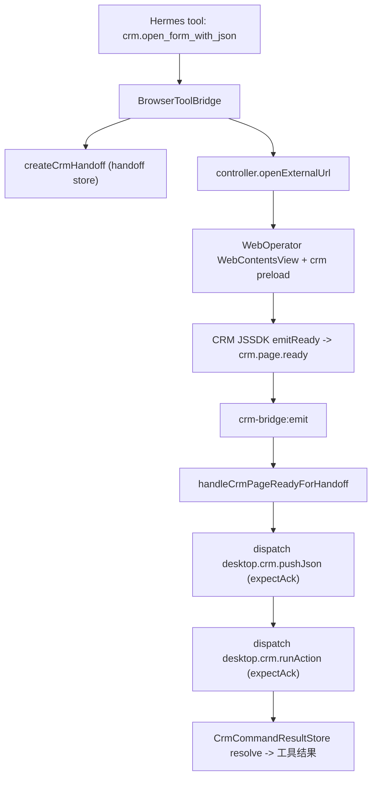

# v5.7.6 CRM Host Bridge 优化

实现 Hermes → Desktop Host Bridge → CRM 的双向命令链路:Hermes 跳转 CRM、保存 JSON handoff、CRM `crm.page.ready` 后自动 `pushJson` + `runAction` 填表,并支持命令 ack 同步返回工具结果。分析链路(`[分析内容]` → HermesTaskPanel → task_session)完全不改。

## 现状勘查结论(与 PRD 的差异)

PRD 基本准确,但有 6 处需修正/简化,均已并入下方 Phase:

- **C1 crm.page.ready 安全**(已确认走专用通道):页面 ready 自动触发,但现有三道手势校验会拦截 —— preload `emit()` 强制 `assertTrustedGesture()`、schema 强制 `trigger.type==="user-click"` 且硬编码白名单 Set、config `allowedEventTypes` 不含 ready。需新增不校验手势的 ready 路径并放宽 schema。
- **C2 BrowserToolBridge 缺 viewManager**:PRD 第 14 节漏了。新 crm.* 工具要派发命令/查 handoff,构造函数必须注入 `viewManager`,并在 [src/main/index.ts](src/main/index.ts) L1576 改为 `new BrowserToolBridge(controller, viewManager)`。
- **C3 open 方法名**:实际是 `controller.openExternalUrl({ url, source: "hermes" })`,PRD 写的 `open({source:"agent"})` 不存在,统一用现有方法。
- **C4 Phase 7 已完成**:[src/main/shell/views/view-registry.ts](src/main/shell/views/view-registry.ts) L53 已为 `web-operator` 设 `defaultPreload: crmBridgePreloadPath()`,CRM preload 已挂载(且覆盖 `ensureWebOperatorView` 懒创建路径)。**无需**改 `ShellBrowserViewAdapter` 构造函数与 index.ts,仅做验收。
- **C5 SDK 为新建文件**:`resources/crm-bridge/hermes-crm-bridge-sdk.js` 当前不存在(仅 `crm-bridge.config.json`),需新建独立浏览器可加载 JS。
- **C6 schema Set 同步**:[src/shared/crm-bridge/crm-bridge-schema.ts](src/shared/crm-bridge/crm-bridge-schema.ts) 的硬编码 `ALLOWED_EVENT_TYPES` Set 也要加 `crm.page.ready`。

## 链路图

## 实施阶段

### Phase 1 — 扩展 shared contract
文件:[src/shared/crm-bridge/crm-bridge-contract.ts](src/shared/crm-bridge/crm-bridge-contract.ts)
- `CrmBridgeEventType` 加 `"crm.page.ready"`。
- `CrmDesktopCommandType` 加 `clickButton` / `runAction` / `pushJson`。
- `CrmDesktopCommand` 加 `target.actionKey?`、`expectAck?`、`timeoutMs?`。
- 新增 `CrmDesktopCommandAck` 接口。
- `CrmBridgeEvents` 加 `COMMAND_RESULT: "crm-bridge:command-result"`。
- 同步 [src/shared/crm-bridge/crm-bridge-errors.ts](src/shared/crm-bridge/crm-bridge-errors.ts):`CrmBridgeErrorCode` 加 `COMMAND_ACK_TIMEOUT` / `COMMAND_ACK_INVALID`;`CrmBridgeAuditAction` 加 `crm.command.completed` / `crm.handoff.*`。
- 确认 [src/shared/crm-bridge/index.ts](src/shared/crm-bridge/index.ts) 导出新类型。

### Phase 1b — schema + config 放行 ready(C1/C6)
- [src/shared/crm-bridge/crm-bridge-schema.ts](src/shared/crm-bridge/crm-bridge-schema.ts):`ALLOWED_EVENT_TYPES` Set 加 `crm.page.ready`;对 `crm.page.ready` 放宽 `trigger.type==="user-click"` 校验(允许无 trigger 或合成 `system` trigger),其余事件仍强制 user-click。
- [resources/crm-bridge/crm-bridge.config.json](resources/crm-bridge/crm-bridge.config.json):`allowedEventTypes` 加 `crm.page.ready`;`routes` 加良性路由(`crm.page.ready` → `open-web-operator-panel`,`refreshSnapshot:false`),消除 router rejected 噪音,不改 router 代码。

### Phase 2 — Command Ack Store(新建)
文件:`src/main/crm-bridge/crm-command-result-store.ts`
- `waitForCrmCommandResult(commandId, type, timeoutMs)` / `resolveCrmCommandResult(ack)` / `rejectCrmCommandResult(commandId, message)`。
- Map 保存 pending,超时返回 `{ ok:false, errorCode:"COMMAND_ACK_TIMEOUT" }`,resolve/timeout 清理 timer。

### Phase 3 — Handoff Store(新建)
文件:`src/main/crm-bridge/crm-handoff-store.ts`
- `createCrmHandoff` / `findPendingCrmHandoffByUrl` / `markCrmHandoffStatus` / `removeCrmHandoff` / `normalizeCrmUrl`。
- `Map<handoffId, PendingCrmHandoff>` + `Map<normalizedUrl, Set<handoffId>>` 索引;TTL 默认 60s;match 前清 expired。
- `normalizeCrmUrl`:trim → `new URL` → origin+pathname+search、去尾部 `/`、忽略 hash,解析失败回退 trim。

### Phase 4 — Handoff Orchestrator(新建)
文件:`src/main/crm-bridge/crm-handoff-orchestrator.ts`
- `handleCrmPageReadyForHandoff({ readyEvent, viewManager })`:归一化 URL → 匹配 handoff(未命中返回 `crm.handoff.none`)→ mark `delivering` → 派发 `desktop.crm.pushJson`(expectAck,8000ms)→ 成功后派发 `desktop.crm.runAction`(expectAck,12000ms)→ mark `delivered`/`failed`。命令通过 `dispatchCrmCommand` 走统一派发。

### Phase 5 — 改造 Command Dispatcher
文件:[src/main/crm-bridge/crm-command-dispatcher.ts](src/main/crm-bridge/crm-command-dispatcher.ts)
- `normalizeCommand` 保留 `expectAck` / `timeoutMs` / `target.actionKey`。
- `dispatchCrmCommand` 改 `async`,`wc.send` 后:`shouldWaitForAck`(clickButton/runAction/pushJson 默认 true,显式 `expectAck` 优先)为 false 直接返回 `crm.command.sent`;为 true 则 `await waitForCrmCommandResult`。
- 注意 [tests/crm-command-dispatcher.test.ts](tests/crm-command-dispatcher.test.ts) 需同步(dispatch 变 async + ack 行为)。

### Phase 6 — 改造 CrmBridgeIPC
文件:[src/main/crm-bridge/crm-bridge-ipc.ts](src/main/crm-bridge/crm-bridge-ipc.ts)
- `crm-bridge:send-command` 改 `await dispatchCrmCommand`,审计 `crm.command.completed/failed`。
- 新增 `crm-bridge:command-result`:校验 `event.sender.id === active web-operator wc.id`,否则返回 `ORIGIN_NOT_ALLOWED`;通过则 `resolveCrmCommandResult(ack)`。
- `crm-bridge:emit` 存储成功后:若 `bridgeEvent.type === "crm.page.ready"`,`void handleCrmPageReadyForHandoff(...)` 并审计,不改 `routeCrmBridgeEvent` 原逻辑。
- `unregister` 加 `crm-bridge:command-result`。

### Phase 7 — CRM preload 挂载(仅验收,C4)
- [src/main/shell/views/view-registry.ts](src/main/shell/views/view-registry.ts) 已设 `defaultPreload: crmBridgePreloadPath()`,**不改代码**。验收 `window.CopilotDesktopCRM?.isAvailable?.()===true`。

### Phase 8 — 改造 preload(C1)
文件:[src/preload/crm-bridge-preload.ts](src/preload/crm-bridge-preload.ts)
- 加常量 `DESKTOP_SOURCE` / `COMMAND_RESULT_CHANNEL` / `READY_CHANNEL`。
- 新增 `emitReady`(不调用 `assertTrustedGesture`,直接 invoke `crm-bridge:emit`),挂到 `CopilotDesktopCRM`;并监听 SDK 的 ready postMessage 转发。
- `ipcRenderer.on(CrmBridgeEvents.COMMAND)` 转 `window.postMessage`(带 `replyRequired`)。
- 监听 `message`:source=SDK、channel=COMMAND_RESULT 时 `ipcRenderer.invoke("crm-bridge:command-result", result)`。
- 页面就绪后向页面 postMessage `READY_CHANNEL`。

### Phase 9 — 扩展 BrowserToolBridge(C2/C3)
文件:[src/main/browser/browser-tool-bridge.ts](src/main/browser/browser-tool-bridge.ts) + [src/shared/browser/browser-tool-schema.ts](src/shared/browser/browser-tool-schema.ts)
- 构造函数加 `viewManager: BrowserViewPort`;[src/main/index.ts](src/main/index.ts) L1576 改 `new BrowserToolBridge(controller, viewManager)`。
- 新工具:`crm.get_context`(`getLastCrmBridgeEvent`)、`crm.click_button`、`crm.run_action`、`crm.push_json`(均 `dispatchCrmCommand(..., viewManager)`,expectAck)、`crm.open_form_with_json`(`createCrmHandoff` + `controller.openExternalUrl({url, source:"hermes"})`,返回 `crm.handoff.created`)。
- schema 同步 5 个工具入参定义。

### Phase 10 — CRM JSSDK(新建,C5)
文件:`resources/crm-bridge/hermes-crm-bridge-sdk.js`(新建,独立浏览器 JS,全局 `window.CopilotCrm`)
- `init` / `emitReady` / `registerButton` / `registerAction` / `onJson` / `getHandoffJson` / 内部 `handoffStore`。
- `message` 监听 desktop command(同 origin),`executeCommand` 支持 9 种命令,结果 `postCommandResult`(channel=COMMAND_RESULT)。
- `emitReady` 通过 `window.CopilotDesktopCRM.emitReady` 上报 `crm.page.ready`。

### Phase 11 — CrmEventPanel 调试增强
文件:[src/renderer/src/screens/WebOperator/CrmEventPanel.tsx](src/renderer/src/screens/WebOperator/CrmEventPanel.tsx)
- 加输入:actionKey / selector / jsonSchema / jsonPayload / targetUrl;按钮:测试点击 / 运行动作 / 推送 JSON(`window.aiosBrowser.sendCrmCommand`,显示 ack result);测试跳转仅展示 payload 供复制。保持组件 <250 行,数据加载与表现分离。

### Phase 12 — Hermes system prompt
文件:[src/renderer/src/components/hermes/constants.ts](src/renderer/src/components/hermes/constants.ts)
- `DEFAULT_PANEL_SYSTEM_PROMPT` 追加 crm.* 工具使用规则(跳转开表单必须用 `crm.open_form_with_json`,不输出控制台脚本)。

### Phase 13 — 验证 + 文档同步
- `npm run typecheck` / `npm run build` / 相关 `npm test`(crm-command-dispatcher 等)。
- 验收 20.1–20.6:分析弹窗逻辑不变、preload available、ready 被接收、pushJson/runAction、open_form_with_json 全流程。
- 按 [.cursor/rules/007-sync-project-docs.mdc](.cursor/rules/007-sync-project-docs.mdc) 增量更新 `docs/API_CONTRACTS.md`(新 IPC channel)、`AGENTS.md` / `docs/INDEX.md` 版本行与 CRM Bridge 段、`docs/renderer/screens/web-operator/CRM_BRIDGE_UI.md`。

## 安全红线(贯穿)
不执行任意页面 JS;Desktop 不直写 CRM 业务数据(由 CRM JS/API 落库);JSSDK 只收同 origin postMessage;command-result 只认 active web-operator wc;handoff 60s 过期;payload 受 `payloadMaxBytes` 限制;selector 仅兜底;actionKey 须注册或 `data-ai-action` 暴露。

## 不纳入
CRM 后端草稿接口、跨窗口 Form 同步、Hermes 任意 JS、改 HermesTaskPanel / WebOperatorPageContext / task_session、handoff 落 SQLite。