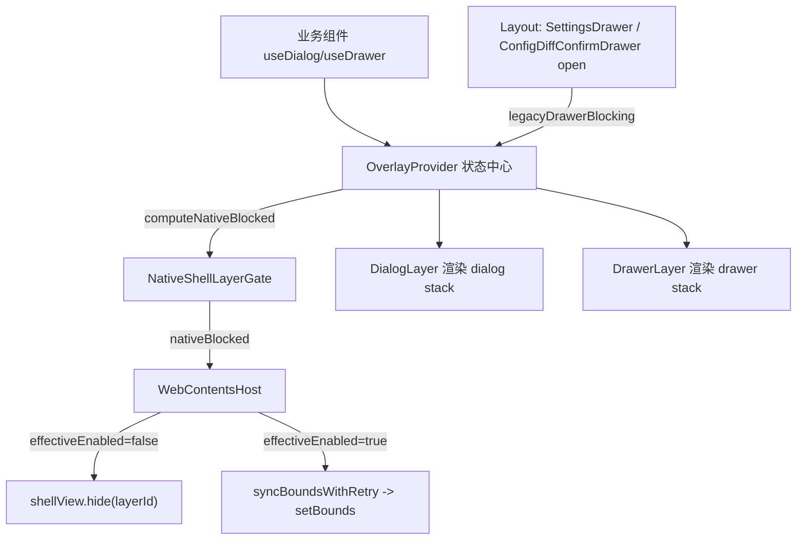

## v5.7.8 MainLayout 全局 Overlay 与 Native Layer Gate

纯 Renderer 层改造，**不改 Main 进程 / ShellViewManager，不新增 IPC，不 destroy/reload WebContentsView**。复用现有 `window.shellView.hide(layerId)` 与 `setBounds(layerId, bounds)`（见 [src/preload/shell-view-api.ts](src/preload/shell-view-api.ts)）。

### 架构与数据流

核心计算（[overlay-types.ts](src/renderer/src/components/overlay/overlay-types.ts)）：
`nativeBlocked = legacyDrawerBlocking || dialogs.some(d => d.nativeBlocking !== false) || drawers.some(d => d.nativeBlocking !== false)`

### 新增文件：`src/renderer/src/components/overlay/`

- `overlay-types.ts` — `DialogType` / `DrawerType` / `DialogDescriptor` / `DrawerDescriptor` / `OverlayState` / `DialogApi` / `DrawerApi`（默认值 `nativeBlocking=true`、`closeOnEsc=true`、`closeOnBackdrop=false`；无 `any`）。
- `OverlayProvider.tsx` — `dialogs` / `drawers` state + `legacyDrawerBlocking` prop；`open/close/dismiss` dialog（基于 promise 的 `resolve/reject`）、`open/close` drawer；计算并通过 context 暴露 `nativeBlocked`。
- `useOverlayState.ts` — 内部读取 context（缺 Provider 抛明确错误），不允许业务直接改状态。
- `useDialog.ts` — `open()` 返回 `Promise<TResult>`，`close/dismiss/closeAll`。
- `useDrawer.ts` — `open()` 返回 id，`close/closeAll`。
- `DialogLayer.tsx` — 渲染 dialog stack；首版支持 `confirm` / `danger-confirm`，其余 type 显示 unsupported fallback；ESC 关闭、backdrop 按 `closeOnBackdrop`、resolve/reject promise；z-index 60。
- `DrawerLayer.tsx` — 渲染 drawer stack（首版 `custom` 占位，保留 drawer root；暂不迁移 SettingsDrawer）；z-index 50。
- `NativeShellLayerGate.tsx` — `NativeShellLayerGateProvider` + `useNativeShellLayerGate()`，从 OverlayProvider 读取并转发 `nativeBlocked`。

### 修改 [src/renderer/src/components/shell/WebContentsHost.tsx](src/renderer/src/components/shell/WebContentsHost.tsx)

- 引入 `useNativeShellLayerGate()`，计算 `const effectiveEnabled = enabled && !nativeBlocked`。
- `syncBounds()` 的 `if (!enabled)` → `if (!effectiveEnabled)`。
- `useLayoutEffect` 的 `if (!enabled)` 守卫与依赖数组改用 `effectiveEnabled`。
- 保留 `ResizeObserver` / `IntersectionObserver` / `syncBoundsWithRetry` / `hideLayer` / error retry 不动。

### 修改 [src/renderer/src/screens/Layout/Layout.tsx](src/renderer/src/screens/Layout/Layout.tsx)

- 计算 `hasLegacyBlockingDrawer = settingsDrawerOpen || Boolean(pendingBootstrapDiff?.diff?.length)`。
- 在 `MainPage` 外层包裹 `<OverlayProvider legacyDrawerBlocking={hasLegacyBlockingDrawer}><NativeShellLayerGateProvider>...</NativeShellLayerGateProvider></OverlayProvider>`（确保 outlet 内的 `WebContentsHost` 与 Dialog/Drawer 层共享同一 Provider）。
- 新增首帧兜底 `useLayoutEffect`：当 `hasLegacyBlockingDrawer`（或 nativeBlocked）为 true 时，`resolveActiveShellLayerId(navigation.view)` 后主动 `void window.shellView.hide(layerId).catch(()=>{})`，避免打开瞬间闪挡。
- `modalLayer={<ModalLayer />}` 保持（内部已转发 DialogLayer），`drawerLayer` 继续含 `<DrawerLayer />` + 现有 `SettingsDrawer` + `ConfigDiffConfirmDrawer`（本版本仍 legacy 挂载，通过 `legacyDrawerBlocking` 接入）。

### 兼容旧占位

- [src/renderer/src/components/layout/ModalLayer.tsx](src/renderer/src/components/layout/ModalLayer.tsx) → 渲染 `overlay/DialogLayer`（保留 `ModalLayer` 导出名，不改 `MainPage` props）。
- [src/renderer/src/components/layout/DrawerLayer.tsx](src/renderer/src/components/layout/DrawerLayer.tsx) → 转发 `overlay/DrawerLayer`。

### WebOperator（方案 A，保留）

[src/renderer/src/screens/WebOperator/WebOperatorScreen.tsx](src/renderer/src/screens/WebOperator/WebOperatorScreen.tsx) 的 `enabled={enabled && !isTaskStartDialogOpen}` **不删除**；`WebContentsHost` 接入全局 gate 后两者叠加生效，HermesTaskStartDialog 行为不回退。

### 分层与规则

z-index：Drawer 50 < Dialog 60 < Toast 70（Toast 不阻塞 native，`nativeBlocking=false`）；Tooltip/Popover 不进入 OverlayProvider。`NativeShellLayerGate` 仅隐藏 shell layer（`web-operator` / `portal` / `external-browser:<id>`），非 shell React 页面（local-hermes / workspaces / task-workbench）不触发。

### 验收

- 类型检查：`npm run typecheck`（strict 通过、无新增 `any`）。
- 手工验收 PRD §12 Case 1-7：WebOperator/external-browser 打开 CRM/网页后，点击 Settings / User Profile / Runtime Setting / 触发 ConfigDiffConfirmDrawer，Drawer 完整可交互不被遮挡；关闭后原页面无刷新恢复；非 shell 页面打开 Drawer 控制台无异常；resize 后 bounds 正确。
- 回归 PRD §13：browser open/reload/back/forward/screenshot/snapshot、side rail、layout split、SettingsDrawer/ConfigDiffConfirmDrawer 原功能、main page state 持久化均正常。

### 完成后文档同步（按 .cursor/rules/007）

新增 overlay 组件族 + 修改 WebContentsHost/Layout 属于 Renderer 结构变更，需增量更新 `docs/renderer/components/INDEX.md`、`docs/renderer/MAIN_LAYOUT.md`，并在 `AGENTS.md` / `docs/INDEX.md` 补 v5.7.8 版本特性行（不改 IPC 故 API_CONTRACTS 无需变更）。